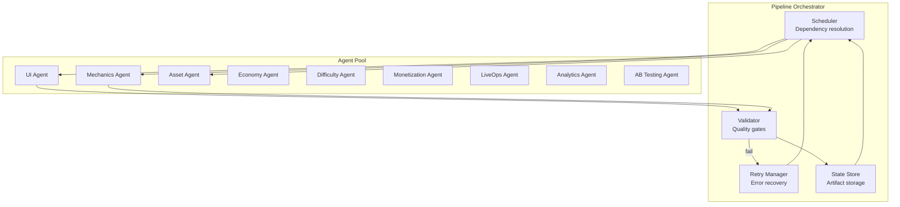
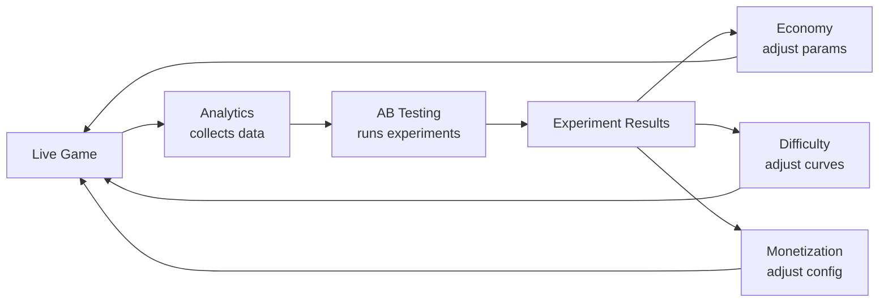

# Agent Orchestration

How the 9 agents are sequenced, parallelized, and coordinated by the pipeline orchestrator.

## Orchestration Model

The pipeline uses a **DAG-based orchestrator**. Each agent is a node in a directed acyclic graph. The orchestrator:

1. Parses the dependency graph from [ModuleRelationships.md](ModuleRelationships.md)
2. Identifies which agents can run in parallel (no shared dependencies)
3. Launches parallel agents simultaneously
4. Waits for all dependencies before launching downstream agents
5. Validates output at each quality gate
6. Handles failures with retry/fallback/escalation

## Execution Timeline

```mermaid
gantt
    title Agent Pipeline Execution
    dateFormat HH:mm
    axisFormat %H:%M

    section Layer 1 - Foundation
    Parse GameSpec           :gs, 00:00, 5m
    UI Agent                 :ui, after gs, 20m
    Mechanics Agent          :mech, after gs, 25m
    Asset Agent              :asset, after gs, 30m

    section Quality Gate 1
    Foundation Gate          :gate1, after ui mech, 5m

    section Layer 2 - Balance
    Economy Agent            :econ, after gate1, 20m
    Difficulty Agent         :diff, after gate1, 15m
    Difficulty→Economy sync  :sync, after diff, 5m

    section Quality Gate 2
    Balance Gate             :gate2, after econ sync, 5m

    section Layer 3 - Revenue + Content
    Monetization Agent       :mon, after gate2, 15m
    LiveOps Agent            :live, after gate2, 20m

    section Quality Gate 3
    Revenue Gate             :gate3, after mon live, 5m

    section Layer 4 - Optimization
    Analytics Agent          :ana, after gate3, 15m
    AB Testing Agent         :ab, after ana, 15m

    section Quality Gate 4
    Final Gate               :gate4, after ab, 5m

    section Assembly
    Build Assembly           :build, after gate4 asset, 10m
```



**Estimated total pipeline time:** ~2-3 hours (with AI agent processing time)

## Parallelism Rules

| Rule | Details |
|------|---------|
| **Layer 1 agents run in parallel** | UI, Mechanics, and Assets have no inter-dependencies (only GameSpec) |
| **Layer 2 agents start in parallel, then sync** | Economy and Difficulty start together. Difficulty finishes first and feeds reward tier mapping to Economy for final adjustment |
| **Layer 3 agents run in parallel** | Monetization and LiveOps both depend on Economy but not on each other |
| **Layer 4 agents run sequentially** | AB Testing depends on Analytics output (EventTaxonomy) |
| **Asset Agent spans layers** | Assets start in Layer 1 but may deliver assets throughout (seasonal assets for LiveOps in Layer 3) |

## Orchestrator Responsibilities



### Scheduler
- Maintains the dependency DAG
- Tracks which agents have completed
- Launches agents whose dependencies are all met
- Enforces timeout limits per agent

### Validator
- Runs quality gate checks on each agent's output
- Schema validation (does output match the data contract?)
- Domain validation (does the economy balance? does the difficulty curve have no spikes?)
- Cross-vertical consistency (do interfaces align with SharedInterfaces?)

### Retry Manager
- On failure: feeds error message back to the agent as context
- On timeout: restarts the agent with simplified parameters
- On max retries: escalates to fallback values or human review
- Tracks retry count per agent

### State Store
- Stores all produced artifacts (keyed by pipeline run ID + agent name)
- Provides artifacts to downstream agents on request
- Immutable — once an artifact passes validation, it's locked
- Versioned — re-runs produce new versions, old versions preserved

## Agent Configuration

Each agent receives a standardized execution context:

```typescript
interface AgentContext {
  pipelineRunId: string;
  agentId: string;
  vertical: string;

  // Inputs
  gameSpec: GameSpec;
  upstreamArtifacts: Record<string, unknown>;  // Keyed by artifact name
  sharedInterfaces: SharedInterfaces;

  // Constraints
  timeoutMinutes: number;
  maxRetries: number;
  qualityGateConfig: QualityGateConfig;

  // State
  attemptNumber: number;         // 1 on first try, increments on retry
  previousErrors?: string[];     // Error messages from failed attempts
}
```

## Conflict Resolution

When agents produce conflicting outputs:

| Conflict | Example | Resolution |
|----------|---------|-----------|
| **Economy vs Difficulty** | Difficulty says level 15 = extreme, Economy says max reward tier is "hard" | SharedInterfaces `DIFFICULTY_REWARD_MAP` is authoritative |
| **Monetization vs Economy** | Monetization wants ad reward of 100 coins, Economy says max faucet is 50 | Economy's faucet limits take precedence (monetization adjusts) |
| **LiveOps vs Economy** | LiveOps event rewards exceed reward budget | Economy's budget is a hard cap; LiveOps reduces rewards |
| **UI vs Mechanics** | Mechanic wants to render outside slot area | Slot boundaries are hard constraints; Mechanic adjusts |
| **AB Testing vs any** | Experiment variant exceeds parameter range | Parameter ranges from BalanceLevers are hard limits |

**General rule:** SharedInterfaces and BalanceLevers define the boundaries. Upstream agents (closer to the foundation) have priority over downstream agents.

## Monitoring

The orchestrator tracks:

| Metric | Purpose |
|--------|---------|
| Agent duration | Detect slow agents, optimize pipeline |
| Retry rate per agent | Identify unreliable agents |
| Quality gate pass rate | Measure agent output quality |
| Pipeline end-to-end time | Track overall efficiency |
| Artifact size | Detect anomalies (empty outputs, oversized configs) |

## Post-Pipeline: Feedback Loop Orchestration

After the initial pipeline completes, the orchestrator manages the continuous optimization loop:



This loop runs continuously post-launch:
- **Analytics** processes data daily
- **AB Testing** concludes experiments when statistically significant (days to weeks)
- **Winning variants** are applied to the live game via server-side config
- **New hypotheses** are generated from updated data
- **No full pipeline re-run needed** — only parameter updates

## Related Documents

- [Module Relationships](ModuleRelationships.md) — Dependency graph
- [Data Flow](DataFlow.md) — Artifact flow sequence
- [Quality Gates](../Pipeline/QualityGates.md) — Gate definitions
- [Error Recovery](../Pipeline/ErrorRecovery.md) — Failure handling
- [Concepts: Agent](../SemanticDictionary/Concepts_Agent.md) — Agent lifecycle
