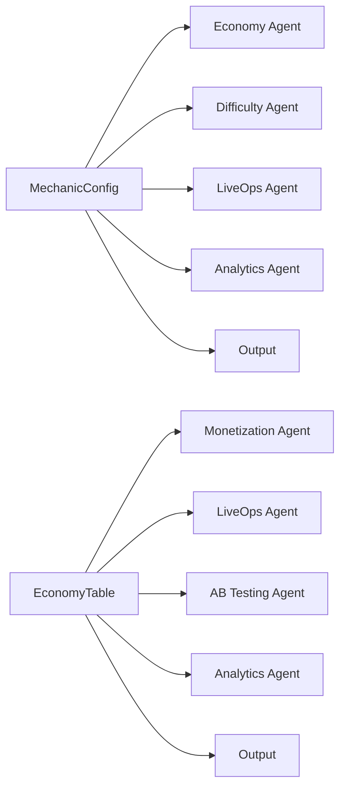
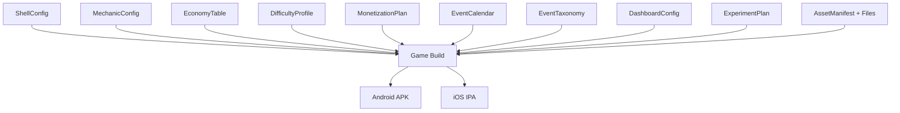

# Data Flow

Detailed sequence showing how data artifacts flow through the pipeline from GameSpec to complete game.

## Full Pipeline Sequence

```mermaid
sequenceDiagram
    participant GS as GameSpec
    participant UI as UI Agent
    participant MECH as Mechanics Agent
    participant ASSET as Asset Agent
    participant ECON as Economy Agent
    participant DIFF as Difficulty Agent
    participant MON as Monetization Agent
    participant LIVE as LiveOps Agent
    participant ANA as Analytics Agent
    participant AB as AB Testing Agent
    participant OUT as Game Build

    Note over GS,OUT: Layer 1 — Foundation (parallel)
    GS->>UI: GameSpec (theme, audience)
    GS->>MECH: GameSpec (genre, mechanicType)
    GS->>ASSET: GameSpec (artStyle, budget)

    par Foundation agents
        UI->>UI: Generate ShellConfig
        MECH->>MECH: Generate MechanicConfig
        ASSET->>ASSET: Source/generate assets
    end

    ASSET-->>UI: AssetManifest (theme assets)
    ASSET-->>MECH: AssetManifest (gameplay assets)

    Note over ECON,DIFF: Layer 2 — Balance (parallel with feedback)
    UI->>ECON: ShellConfig (shop slots, currency bar)
    MECH->>ECON: MechanicConfig (reward events, scoring)
    MECH->>DIFF: MechanicConfig (adjustable params)

    par Balance agents
        ECON->>ECON: Generate EconomyTable
        DIFF->>DIFF: Generate DifficultyProfile
    end

    DIFF-->>ECON: DifficultyProfile (reward tier mapping)
    ECON->>ECON: Adjust rewards to match tiers

    Note over MON,LIVE: Layer 3 — Revenue + Content (parallel)
    ECON->>MON: EconomyTable (pricing, conversion)
    UI->>MON: ShellConfig (ad slots, shop config)
    ECON->>LIVE: EconomyTable (reward budgets)
    MECH->>LIVE: MechanicConfig (mini-game slot)
    ASSET-->>LIVE: AssetManifest (seasonal assets)

    par Revenue + Content agents
        MON->>MON: Generate MonetizationPlan
        LIVE->>LIVE: Generate EventCalendar
    end

    Note over ANA,AB: Layer 4 — Optimization (sequential)
    UI->>ANA: Instrumentation points
    MECH->>ANA: Gameplay events
    ECON->>ANA: Economy events
    MON->>ANA: Ad/purchase events
    DIFF->>ANA: Level events
    LIVE->>ANA: LiveOps events

    ANA->>ANA: Generate EventTaxonomy + Dashboards

    ANA->>AB: EventTaxonomy (measurable metrics)
    ECON->>AB: BalanceLevers (tunable params)
    DIFF->>AB: CurveTemplates (adjustable curves)
    MON->>AB: MonetizationPlan (tunable config)

    AB->>AB: Generate ExperimentPlan

    Note over OUT: Assembly
    UI->>OUT: ShellConfig
    MECH->>OUT: MechanicConfig
    ECON->>OUT: EconomyTable
    DIFF->>OUT: DifficultyProfile
    MON->>OUT: MonetizationPlan
    LIVE->>OUT: EventCalendar
    ANA->>OUT: EventTaxonomy + DashboardConfig
    AB->>OUT: ExperimentPlan
    ASSET->>OUT: AssetManifest
```



## Artifact Summary

Every artifact in the pipeline, in production order:

| # | Artifact | Producer | Consumers | Format |
|---|----------|----------|-----------|--------|
| 1 | GameSpec | Human / Template | All Layer 1 agents | JSON |
| 2 | AssetManifest | Asset Agent | UI, Mechanics, LiveOps, Output | JSON + files |
| 3 | ShellConfig | UI Agent | Economy, Monetization, Analytics, Output | JSON |
| 4 | MechanicConfig | Mechanics Agent | Economy, Difficulty, LiveOps, Analytics, Output | JSON |
| 5 | DifficultyProfile | Difficulty Agent | Economy, AB Testing, Analytics, Output | JSON |
| 6 | EconomyTable | Economy Agent | Monetization, LiveOps, AB Testing, Analytics, Output | JSON |
| 7 | MonetizationPlan | Monetization Agent | AB Testing, Analytics, Output | JSON |
| 8 | EventCalendar | LiveOps Agent | Analytics, Output | JSON |
| 9 | EventTaxonomy | Analytics Agent | AB Testing, Output | JSON |
| 10 | DashboardConfig | Analytics Agent | Output | JSON |
| 11 | ExperimentPlan | AB Testing Agent | Output | JSON |

## Fan-Out Points

Some artifacts feed multiple downstream consumers:



**MechanicConfig** has the most consumers (5) — it defines the gameplay that every other vertical needs to know about.

**EconomyTable** has the second most (5) — it defines the pricing and rewards that monetization, LiveOps, and testing all reference.

## Fan-In: Game Build Assembly

The final game build combines all 9 artifacts:



## Data Transformation Chain

Showing how a single piece of data transforms through the pipeline:

**Example: "How hard is level 15?"**

```
GameSpec.mechanicType = "runner"
    ↓ (Mechanics Agent)
MechanicConfig.adjustableParams = [speed, obstacleRate, laneCount]
    ↓ (Difficulty Agent)
DifficultyProfile.levels[14].difficulty = 6
DifficultyProfile.levels[14].params = { speed: 12, obstacleRate: 0.7, laneCount: 3 }
    ↓ (Economy Agent, via DIFFICULTY_REWARD_MAP)
EconomyTable.rewardTable[14].tier = "hard"
EconomyTable.rewardTable[14].basicCurrency = 60  (base 30 × 2.0x multiplier)
    ↓ (Monetization Agent)
MonetizationPlan.adPlacements.postLevel15 = { format: "rewarded", reward: 60 }
    ↓ (Analytics Agent)
EventTaxonomy.level_complete.properties = { level_id: "15", difficulty: 6, reward: 60 }
    ↓ (AB Testing Agent)
ExperimentPlan.experiments[0] = {
  hypothesis: "Reducing level 15 difficulty from 6 to 4 improves D7 retention",
  parameter: "levels[14].difficulty",
  variants: [{ value: 4 }, { value: 6 }]
}
```

## Artifact Size Estimates

| Artifact | Typical Size | Notes |
|----------|-------------|-------|
| GameSpec | 1-2 KB | Small input document |
| ShellConfig | 10-20 KB | Screen definitions, nav graph, theme |
| MechanicConfig | 5-15 KB | Depends on mechanic complexity |
| AssetManifest | 5-10 KB (metadata) | Asset files are separate (MBs) |
| EconomyTable | 15-30 KB | Many faucets/sinks/segments |
| DifficultyProfile | 10-50 KB | Scales with level count |
| MonetizationPlan | 10-20 KB | Ad placements, IAP catalog |
| EventCalendar | 20-40 KB | Multiple events with configs |
| EventTaxonomy | 10-15 KB | Event catalog |
| DashboardConfig | 5-10 KB | Panel definitions |
| ExperimentPlan | 5-15 KB | Active experiments |
| **Total config** | **~100-230 KB** | All pipeline output combined |

## Related Documents

- [Module Relationships](ModuleRelationships.md) — Dependency graph
- [Agent Orchestration](AgentOrchestration.md) — Timing and parallelism
- [Data Contracts](../Pipeline/DataContracts.md) — JSON schemas for each artifact
- [System Overview](SystemOverview.md) — High-level architecture
