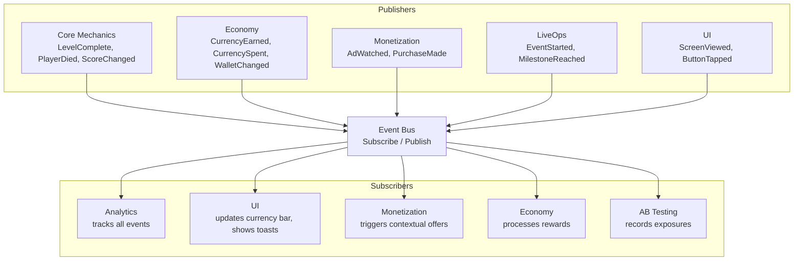
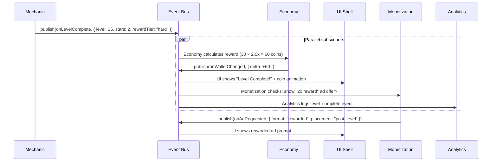
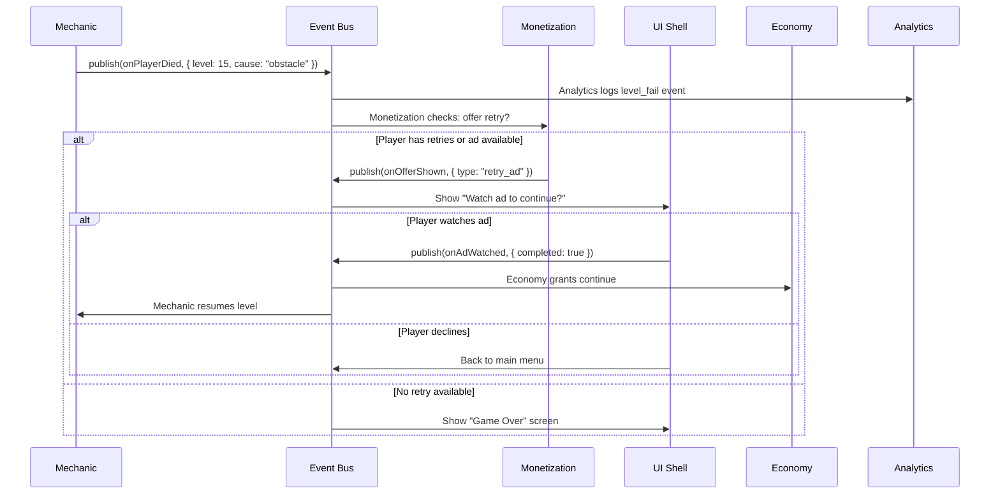

# Event Model

How modules communicate at runtime through events. Events are the primary mechanism for loose coupling between verticals — no module calls another module directly.

## Why Events

Direct method calls between modules create tight coupling. If the Economy module calls `Monetization.showOffer()` directly, changing either module requires updating the other. Events decouple them:

- **Publisher** emits an event ("wallet reached 500 coins")
- **Subscriber** reacts to it (Monetization shows a "spend your coins" offer)
- Neither knows the other exists

This pattern is critical for the AI Game Engine because:
1. Mechanics are swappable — a runner and a merge game emit the same events
2. Verticals are developed independently by separate agents
3. New verticals (or features) can subscribe to existing events without modifying publishers

## Event Bus Architecture



## Event Contract

All events follow the `GameEvent<T>` interface from [SharedInterfaces](../Verticals/00_SharedInterfaces.md):

```typescript
interface GameEvent<T> {
  subscribe(handler: (payload: T) => void): Unsubscribe;
  publish(payload: T): void;
}
```

Every event instance is typed — `GameEvent<LevelCompletePayload>` only accepts handlers that match `LevelCompletePayload`.

## Standard Events

### Mechanics Events (published by core gameplay)

| Event | Payload | When Fired |
|-------|---------|-----------|
| `onLevelStart` | `{ levelId, difficulty }` | Player enters a level |
| `onLevelComplete` | `{ levelId, score, stars, timeSeconds, difficulty, rewardTier }` | Player completes a level |
| `onPlayerDied` | `{ levelId, cause }` | Player fails (dies, times out) |
| `onScoreChanged` | `{ score, delta }` | Score updates during gameplay |
| `onCurrencyEarned` | `{ type, amount }` | In-level currency collected |
| `onPauseRequested` | `void` | Player pauses game |

### Economy Events (published by economy system)

| Event | Payload | When Fired |
|-------|---------|-----------|
| `onWalletChanged` | `{ type, newBalance, delta, source }` | Any currency balance change |
| `onRewardClaimed` | `{ rewardBundle, source }` | Reward distributed to player |
| `onEnergyChanged` | `{ current, max, regenAt }` | Energy consumed or regenerated |
| `onPassLevelUp` | `{ passId, newLevel, reward }` | Battle/season pass level gained |

### Monetization Events (published by monetization system)

| Event | Payload | When Fired |
|-------|---------|-----------|
| `onAdRequested` | `{ format, placement }` | Ad load requested |
| `onAdWatched` | `{ format, placement, completed, reward }` | Ad impression completed |
| `onAdFailed` | `{ format, reason }` | Ad failed to load/display |
| `onPurchaseInitiated` | `{ productId, price }` | Player taps "buy" |
| `onPurchaseCompleted` | `{ productId, price, receipt }` | Purchase confirmed |
| `onPurchaseFailed` | `{ productId, reason }` | Purchase failed or cancelled |
| `onOfferShown` | `{ offerId, type, price }` | Contextual offer displayed |

### LiveOps Events (published by LiveOps system)

| Event | Payload | When Fired |
|-------|---------|-----------|
| `onEventStarted` | `{ eventId, eventType }` | LiveOps event becomes active |
| `onEventEnded` | `{ eventId }` | LiveOps event expires |
| `onMilestoneReached` | `{ eventId, milestoneId, reward }` | Player hits event milestone |
| `onEventCompleted` | `{ eventId, totalProgress }` | Player finishes all event objectives |

### UI Events (published by shell)

| Event | Payload | When Fired |
|-------|---------|-----------|
| `onScreenViewed` | `{ screenName }` | Player navigates to a screen |
| `onButtonTapped` | `{ buttonId, screenName }` | Player taps a UI button |
| `onFTUEStepCompleted` | `{ stepId, skipped }` | FTUE step done or skipped |

### AB Testing Events (published by experimentation system)

| Event | Payload | When Fired |
|-------|---------|-----------|
| `onExperimentAssigned` | `{ experimentId, variantId }` | Player assigned to variant |
| `onExperimentExposed` | `{ experimentId, variantId }` | Player actually sees the variant |

## Event Flow Examples

### Level Complete → Multiple Reactions



### Player Dies → Retry Flow



## Event Ordering

Events are processed synchronously within a frame — all subscribers handle the event before the next frame renders. This prevents visual glitches (e.g., currency bar not updating before the reward animation plays).

**Priority order** when multiple subscribers handle the same event:
1. **Economy** (process rewards first)
2. **UI** (update display)
3. **Monetization** (show contextual offers)
4. **Analytics** (log event)
5. **AB Testing** (record exposure)

## Rules

1. **No circular event chains.** Event A must not trigger a chain that re-publishes Event A.
2. **Events are fire-and-forget.** Publishers don't wait for subscriber responses.
3. **Events are synchronous within a frame** but handlers must be fast (< 1ms).
4. **Heavy work triggered by events** (ad loading, network calls) must be deferred to the next frame.
5. **Events carry data, not commands.** `onLevelComplete` says "this happened." It does not say "show the reward screen" — that's the subscriber's decision.
6. **All events are logged by Analytics.** The Analytics subscriber listens to everything.

## Related Documents

- [SharedInterfaces](../Verticals/00_SharedInterfaces.md) — GameEvent<T> definition, StandardEvents
- [Analytics Spec](../Verticals/08_Analytics/Spec.md) — Event taxonomy
- [System Overview](SystemOverview.md) — Where events fit in the architecture
- [Concepts: Slot](../SemanticDictionary/Concepts_Slot.md) — Events cross slot boundaries
