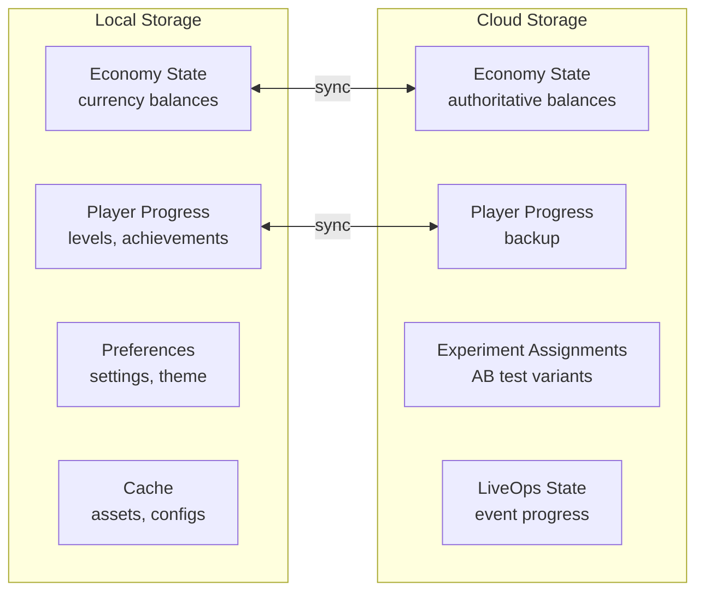

# Game State Management

How the game persists, synchronizes, and recovers player state.

## Principles

1. **Local-first.** All game state is stored locally. Cloud sync is an optimization, not a requirement.
2. **Offline-capable.** Core gameplay works without network. Transactions queue for sync.
3. **Crash-resilient.** State is saved after every significant action (level complete, purchase, reward claim).
4. **Conflict-resolved.** When local and cloud diverge, use last-write-wins for most data, server-authoritative for currency.

## State Categories



### Critical State (loss = player churn)
- Currency balances (basic + premium)
- IAP purchase history and receipts
- Player level / progression
- Unlocked content

**Storage:** Local + cloud, cloud-authoritative for currency. Saved after every mutation.

### Important State (loss = frustration)
- Level progress within a session
- Inventory / equipped items
- Achievement progress
- Event progress

**Storage:** Local + cloud backup. Saved every 30 seconds and on significant events.

### Recoverable State (loss = minor inconvenience)
- Settings / preferences
- Tutorial completion flags
- UI state (last visited screen)
- Ad watch history

**Storage:** Local primary, cloud backup on session end.

### Ephemeral State (loss = none)
- Current animation state
- Particle effects
- Audio playback position
- Cached ad creatives

**Storage:** Memory only. Not persisted.

## Save Format

```typescript
interface SaveData {
  version: number;                    // Schema version for migration
  playerId: string;                   // Unique identifier
  createdAt: ISO8601;                 // First install timestamp
  lastSavedAt: ISO8601;              // Last save timestamp

  progress: {
    currentLevel: number;
    completedLevels: string[];        // Level IDs
    totalScore: number;
    achievements: Record<string, AchievementState>;
  };

  economy: {
    basicCurrency: number;
    premiumCurrency: number;
    energy: { current: number; max: number; lastRegenAt: ISO8601 };
    purchaseHistory: PurchaseRecord[];
    pendingTransactions: Transaction[]; // Queued for sync
  };

  preferences: {
    musicVolume: number;              // 0-1
    sfxVolume: number;                // 0-1
    notifications: boolean;
    language: string;
  };

  experiments: Record<string, string>; // experimentId → variantId
  liveOps: Record<string, EventProgress>;
  ftue: { completedSteps: string[]; skippedAt?: ISO8601 };

  meta: {
    sessionCount: number;
    totalPlaytime: number;            // seconds
    lastSessionAt: ISO8601;
    deviceId: string;
    platform: 'ios' | 'android';
    appVersion: string;
  };
}
```

## Sync Protocol

### On App Start
1. Load local save
2. If online: fetch cloud save
3. Merge: cloud-authoritative for `economy`, last-write-wins for `progress`, local-wins for `preferences`
4. Apply experiment assignments from cloud
5. Resolve conflicts, save merged state locally

### During Gameplay
1. Save locally after every significant action
2. Queue economy mutations as pending transactions
3. Every 60 seconds (if online): push pending transactions to cloud
4. On cloud response: reconcile balances

### On App Background/Close
1. Save all state locally immediately
2. If online: push final sync
3. If offline: transactions remain queued

### Conflict Resolution

| Data Type | Strategy | Rationale |
|-----------|----------|-----------|
| Currency balances | Server-authoritative | Prevents client-side currency manipulation |
| Purchase history | Union merge | Never lose a purchase record |
| Level progress | Last-write-wins (timestamp) | Player expects most recent progress |
| Achievements | Union merge | Never un-achieve something |
| Preferences | Local-wins | Player set these on this device |
| Experiment assignments | Server-authoritative | AB testing requires consistent assignment |

## Schema Migration

Save data includes a `version` field. When the schema changes:

1. Define a migration function: `migrate(oldData: SaveV1): SaveV2`
2. Chain migrations: V1 → V2 → V3 (never skip versions)
3. Run migrations on load, before any game logic
4. Back up old save before migrating

**Rule:** Migrations must be backward-compatible. A V2 game must read V1 saves. A V1 game encountering V2 data should fail gracefully (not crash).

## Offline Queue

When offline, the game queues transactions:

```typescript
interface Transaction {
  id: string;
  type: 'currency_earn' | 'currency_spend' | 'level_complete' | 'purchase';
  payload: Record<string, unknown>;
  timestamp: ISO8601;
  retryCount: number;
}
```

On reconnection:
1. Submit queued transactions in order
2. Server validates each transaction
3. If server rejects (e.g., insufficient balance server-side): revert local state, notify player
4. Clear queue after successful sync

## Security Considerations

- **Never trust client currency values.** Server validates all economy mutations.
- **Receipt validation** for all IAP — server-side verification via app store APIs.
- **Anti-tampering:** Save data can be checksummed (not encrypted — not worth the performance cost on mobile).
- **Rate limiting:** Sync requests capped at 1 per 30 seconds to prevent abuse.

## Related Documents

- [Economy Spec](../Verticals/04_Economy/Spec.md) — Currency handling details
- [Analytics Spec](../Verticals/08_Analytics/Spec.md) — Event batching and offline queuing
- [Performance Budgets](PerformanceBudgets.md) — Network and storage budgets
- [System Overview](SystemOverview.md) — Where state management fits
