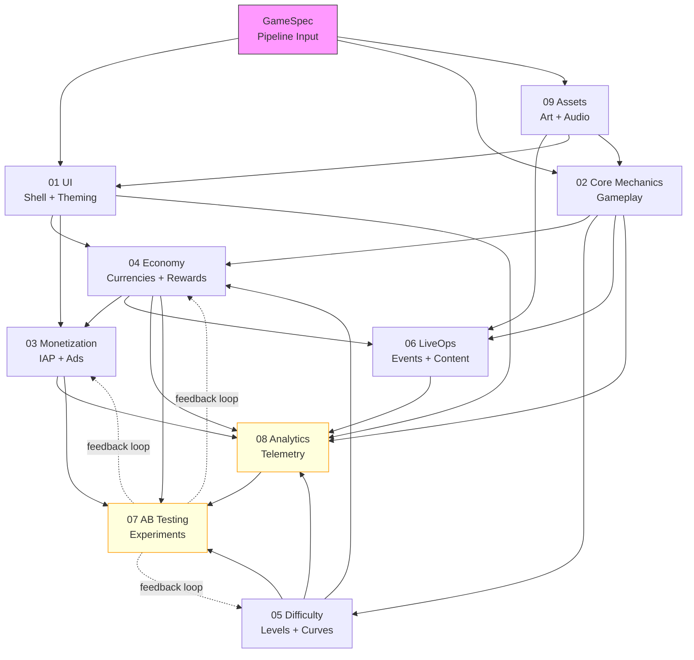

# Module Relationships

How the 9 verticals depend on each other. This graph determines agent sequencing — an agent cannot start until its upstream dependencies have produced their outputs.

## Dependency Graph



## Dependency Layers

The graph forms 5 layers. Agents within the same layer can run in parallel.

| Layer | Verticals | Dependencies | Can Parallelize |
|-------|-----------|-------------|-----------------|
| **0 — Input** | GameSpec | None | N/A |
| **1 — Foundation** | UI, Core Mechanics, Assets | GameSpec only | Yes — all 3 in parallel |
| **2 — Balance** | Economy, Difficulty | UI, Mechanics, Assets | Yes — Economy + Difficulty in parallel (but Difficulty feeds back to Economy) |
| **3 — Revenue + Content** | Monetization, LiveOps | Economy, UI, Mechanics, Assets | Yes — Monetization + LiveOps in parallel |
| **4 — Optimization** | Analytics, AB Testing | All above | Partially — Analytics first, then AB Testing |

### Layer Execution Timeline

```
Layer 0: ████ GameSpec parsed
Layer 1: ████████████ UI + Mechanics + Assets (parallel)
Layer 2: ████████ Economy + Difficulty (parallel, with Diff→Econ feedback)
Layer 3: ██████ Monetization + LiveOps (parallel)
Layer 4: ████████ Analytics → AB Testing (sequential)
```

## Edge Details

Each edge represents a data artifact flowing from producer to consumer.

### Layer 0 → Layer 1

| From | To | Artifact | Key Fields |
|------|----|----------|------------|
| GameSpec | UI | GameSpec | theme, audience, genre |
| GameSpec | Mechanics | GameSpec | genre, mechanicType, referenceGames |
| GameSpec | Assets | GameSpec | artStyle, theme, assetBudget |

### Layer 1 → Layer 2

| From | To | Artifact | Key Fields |
|------|----|----------|------------|
| UI | Economy | ShellConfig | screenList, shopSlots, currencyBarConfig |
| Mechanics | Economy | MechanicConfig | rewardEvents, scoringFormula, levelFlow |
| Mechanics | Difficulty | MechanicConfig | adjustableParams, inputModel |
| Assets | UI | AssetManifest | themeAssets, uiSprites, icons |
| Assets | Mechanics | AssetManifest | gameplayAssets, characterModels, effects |

### Layer 2 → Layer 3

| From | To | Artifact | Key Fields |
|------|----|----------|------------|
| Economy | Monetization | EconomyTable | pricing, currencyConversion, sinkCosts |
| UI | Monetization | ShellConfig | adSlotPositions, shopScreenConfig |
| Difficulty | Economy | DifficultyProfile | rewardTierMapping, levelCount |
| Economy | LiveOps | EconomyTable | rewardBudgets, currencyLimits |
| Mechanics | LiveOps | MechanicConfig | miniGameSlotInterface |
| Assets | LiveOps | AssetManifest | seasonalAssets, eventThemes |

### Layer 3 → Layer 4

| From | To | Artifact | Key Fields |
|------|----|----------|------------|
| All verticals | Analytics | Various | instrumentationPoints, eventPayloads |
| Analytics | AB Testing | EventTaxonomy | measurableEvents, funnelDefinitions |
| Economy | AB Testing | BalanceLevers | tunableParameters, ranges |
| Difficulty | AB Testing | CurveTemplates | adjustableParams, ranges |
| Monetization | AB Testing | MonetizationPlan | tunableAdConfig, tunablePricing |

### Feedback Loops (Layer 4 → Layer 2-3)

| From | To | Artifact | Trigger |
|------|----|----------|---------|
| AB Testing | Economy | ExperimentResults | Winning variant changes earn/spend rates |
| AB Testing | Difficulty | ExperimentResults | Winning variant changes curve shape |
| AB Testing | Monetization | ExperimentResults | Winning variant changes ad frequency/pricing |

Feedback loops are **asynchronous** — they don't block the initial pipeline. They fire after experiments conclude (days/weeks post-launch).

## Critical Path

The longest dependency chain determines minimum pipeline duration:

```
GameSpec → Mechanics → Difficulty → Economy → Monetization → Analytics → AB Testing
```

This is the critical path. Optimizations:
- Assets can start immediately (Layer 1, parallel with UI+Mechanics)
- Economy and Difficulty can start as soon as Mechanics completes (don't need to wait for UI)
- LiveOps can start as soon as Economy completes (parallel with Monetization)

## Optional Dependencies

Some edges are optional — the consumer can use defaults if the producer hasn't completed:

| Edge | Default If Missing | Impact |
|------|-------------------|--------|
| Assets → UI | Placeholder theme (gray + system fonts) | Visual quality reduced, functional |
| Assets → LiveOps | No seasonal theming | Events work but aren't themed |
| Difficulty → Economy | Flat reward tiers (1x for all levels) | Economy less nuanced but functional |
| Analytics → AB Testing | No experiments (ship with defaults) | No optimization, but game works |

## Circular Dependencies

There is one near-circular dependency: **Economy ↔ Difficulty**.

- Economy needs Difficulty's reward tier mapping (which levels give which rewards)
- Difficulty needs Economy's reward tiers (what reward multipliers exist)

**Resolution:** SharedInterfaces defines `DIFFICULTY_REWARD_MAP` before either agent runs. Both agents reference this shared contract rather than each other's output directly.

## Related Documents

- [System Overview](SystemOverview.md) — High-level architecture
- [Agent Orchestration](AgentOrchestration.md) — How agents coordinate
- [Data Flow](DataFlow.md) — Sequence diagram of artifact flow
- [SharedInterfaces](../Verticals/00_SharedInterfaces.md) — Contracts that break circular deps
- [Pipeline](../Pipeline/GameCreationPipeline.md) — End-to-end execution
