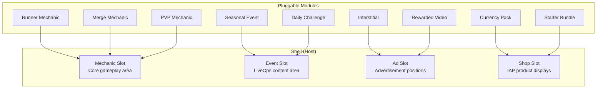
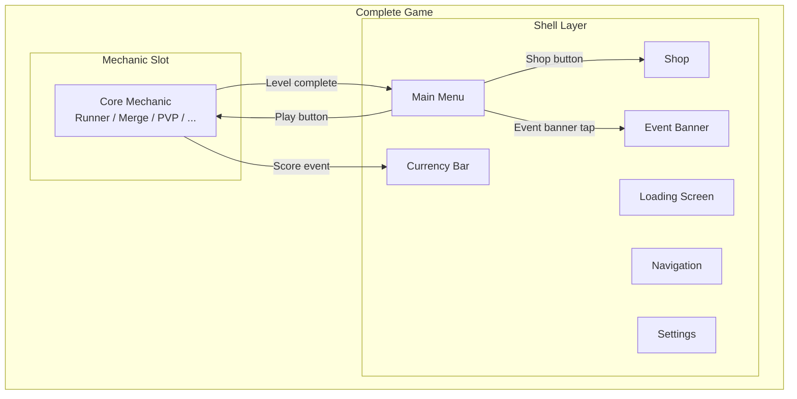

# Slot Architecture

The slot is the core composition mechanism of the AI Game Engine. It defines how independent modules connect without knowing each other's internals.

## The Concept

A **slot** is an interface boundary. One side (the host) defines what it expects. The other side (the module) provides it. The host doesn't know which module is plugged in — only that the interface contract is satisfied.

**Physical analogy:** A cartridge slot in a game console. The console (host) defines the pin layout and protocol. Any cartridge (module) that matches the pins works.

## Types of Slots



### 1. Mechanic Slot
**Host:** The shell's main gameplay area (center screen).
**Module:** A core mechanic (runner, merge, PVP, puzzle, etc.).
**Contract:** The mechanic must implement `IMechanic` — init, update, pause, resume, score reporting, difficulty parameter acceptance.
**Cardinality:** Exactly one mechanic per game.

### 2. Event Slot
**Host:** Designated areas in the shell for LiveOps content (event banner on main menu, event tab, event gameplay area).
**Module:** A LiveOps event (seasonal challenge, mini-game, limited offer).
**Contract:** The event must implement `IEvent` — start, end, reward distribution, progress tracking.
**Cardinality:** 0-3 concurrent events.

### 3. Ad Slot
**Host:** Positions in the UI flow where ads can appear (between levels, on death screen, in reward multiplier prompt).
**Module:** An ad unit (interstitial, rewarded video, banner).
**Contract:** The ad must implement `IAdUnit` — load, show, on-complete callback, on-skip callback.
**Cardinality:** Multiple ad slots, each with frequency and cooldown rules.

### 4. Shop Slot
**Host:** The shop screen's product display areas (featured, bundles, currency packs, daily deals).
**Module:** An IAP product or virtual item.
**Contract:** The product must implement `IShopItem` — display info, price, purchase handler, receipt validation.
**Cardinality:** Dynamic — products are configured by the Monetization Agent.

## Composition: Shell + Mechanic



**How it works:**
1. The shell renders all persistent UI: currency bar, navigation, menu
2. The "Play" button transitions to the mechanic slot
3. The mechanic runs independently, communicating only through events (`LevelComplete`, `ScoreEarned`, `PlayerDied`)
4. The shell listens to these events and updates currency, shows ads, triggers offers
5. When the mechanic signals completion, control returns to the shell

## Slot Interface Contract (Pseudocode)

```typescript
interface IMechanic {
  // Lifecycle
  init(config: MechanicConfig): void;
  start(): void;
  pause(): void;
  resume(): void;
  dispose(): void;

  // Difficulty
  setDifficultyParams(params: DifficultyParams): void;

  // Communication (events published)
  onLevelStart: Event<{ levelId: string; difficulty: number }>;
  onLevelComplete: Event<{ levelId: string; score: number; stars: number }>;
  onPlayerDied: Event<{ levelId: string; cause: string }>;
  onScoreChanged: Event<{ score: number; delta: number }>;
  onCurrencyEarned: Event<{ amount: number; source: string }>;

  // State
  getCurrentState(): MechanicState;
  getAdjustableParams(): DifficultyParamDef[];
}

interface IEvent {
  init(config: EventConfig): void;
  start(): void;
  end(): void;
  getProgress(): EventProgress;
  claimReward(milestone: string): RewardBundle;

  onMilestoneReached: Event<{ milestone: string; reward: RewardBundle }>;
  onEventComplete: Event<{ totalProgress: number }>;
}

interface IAdUnit {
  load(): Promise<boolean>;
  isReady(): boolean;
  show(): Promise<AdResult>;

  onAdComplete: Event<{ watched: boolean; reward?: RewardBundle }>;
  onAdFailed: Event<{ reason: string }>;
}

interface IShopItem {
  getDisplayInfo(): ShopItemDisplay;
  getPrice(): Price;
  purchase(): Promise<PurchaseResult>;
  validateReceipt(receipt: string): Promise<boolean>;
}
```

## What a Slot is NOT

- **Not inheritance.** A runner mechanic does not extend a base game class. It implements an interface.
- **Not a plugin system.** Slots are statically composed at build time, not dynamically loaded at runtime (for mobile performance).
- **Not a microservice.** Modules run in the same process. Slots are compile-time boundaries, not network boundaries.
- **Not optional.** Every game must fill the mechanic slot. Other slots (event, ad, shop) can be empty but the positions exist.

## Theming Across Slots

The shell applies a **theme** (colors, fonts, icons, animations) that all modules must respect:

```typescript
interface Theme {
  palette: {
    primary: Color;
    secondary: Color;
    accent: Color;
    background: Color;
    surface: Color;
    text: Color;
    textSecondary: Color;
  };
  typography: {
    heading: FontConfig;
    body: FontConfig;
    caption: FontConfig;
    number: FontConfig;
  };
  icons: {
    basicCurrency: Sprite;
    premiumCurrency: Sprite;
    energy: Sprite;
    settings: Sprite;
    back: Sprite;
  };
  animations: {
    screenTransition: AnimationConfig;
    currencyEarn: AnimationConfig;
    buttonPress: AnimationConfig;
  };
}
```

The mechanic receives the theme in its `MechanicConfig` and uses it for any UI it renders (score display, in-level HUD). The shell owns the theme; modules consume it.

## Related Documents

- [System Overview](SystemOverview.md) — Where slots fit in the big picture
- [Core Mechanics Spec](../Verticals/02_CoreMechanics/Spec.md) — Mechanic slot details
- [LiveOps Spec](../Verticals/06_LiveOps/Spec.md) — Event slot details
- [Monetization Spec](../Verticals/03_Monetization/Spec.md) — Ad and shop slot details
- [Concepts: Slot](../SemanticDictionary/Concepts_Slot.md) — Semantic deep dive
- [Concepts: Shell](../SemanticDictionary/Concepts_Shell.md) — Shell deep dive
