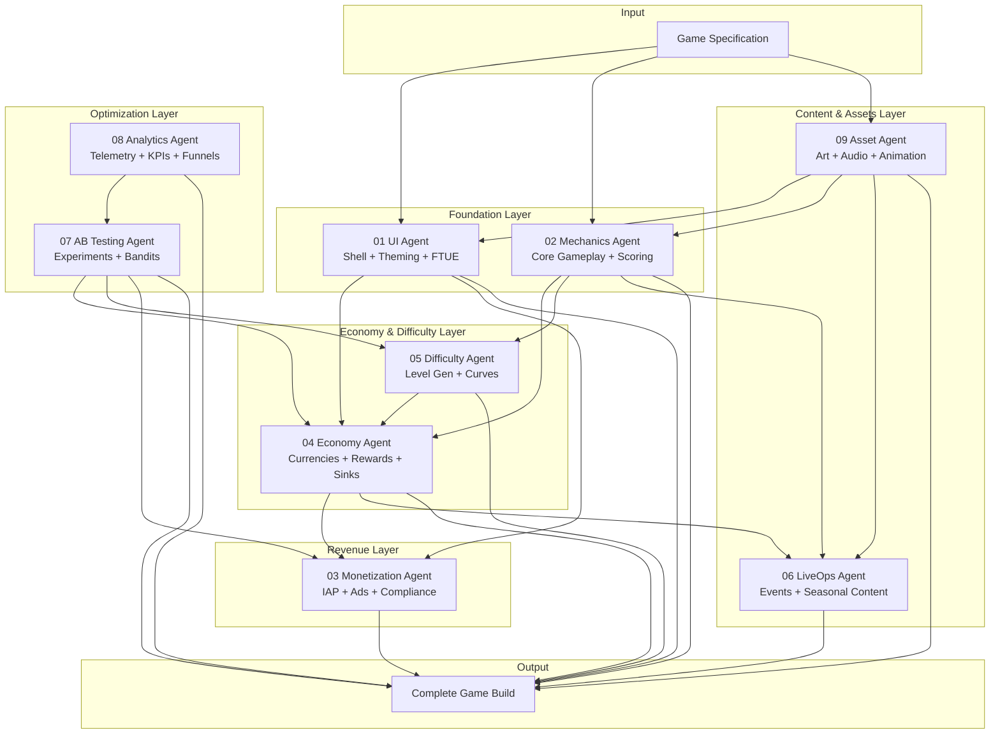
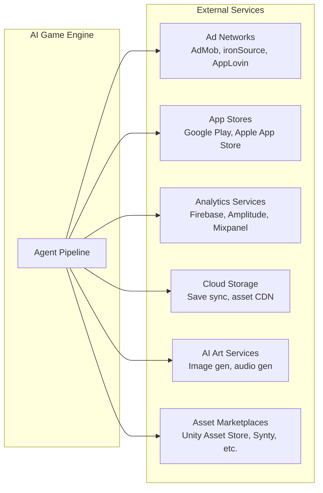

# System Overview

The AI Game Engine is a pipeline that transforms a game specification into a complete, shippable mobile game. Nine specialized AI agents process the specification in a coordinated sequence, each owning one vertical.

## High-Level Architecture



## Three Processing Tiers

### Tier 1: Foundation (UI + Mechanics)
These agents run first. They produce the game's structure.

- **UI Agent** reads the game spec's theme, audience, and genre → generates the shell (screens, navigation, currency bar, shop, settings, FTUE flow)
- **Mechanics Agent** reads the game spec's genre and mechanic type → generates the core gameplay module that slots into the shell

### Tier 2: Economy, Difficulty, Monetization
These agents run after the foundation exists. They need to know what screens exist (UI) and what gameplay parameters exist (Mechanics).

- **Economy Agent** receives the mechanic's reward events and the shell's shop structure → generates currency tables, earn rates, costs, time-gates, sinks
- **Difficulty Agent** receives the mechanic's adjustable parameters → generates levels with difficulty curves that map to the economy's reward tiers
- **Monetization Agent** receives the shell's ad slot positions and the economy's pricing → places IAP items, ad triggers, and rewarded video hooks

### Tier 3: Content, Assets, Optimization
These agents run last or continuously. They require the full game structure.

- **LiveOps Agent** receives the full game structure → generates event calendar, seasonal content, and mini-games that drop into predefined slots
- **Asset Agent** receives asset requirements from all other agents → sources art, audio, and animation via AI generation, purchase, or artist commission
- **Analytics Agent** instruments the entire game with event tracking, funnel definitions, and dashboard configurations
- **AB Testing Agent** receives the analytics events and all tunable parameters → generates initial experiments and manages the test-analyze-allocate-iterate loop

## External Dependencies



## Data Flow Summary

| From | To | Artifact |
|------|----|----------|
| Game Spec | UI Agent | `GameSpec` — genre, theme, audience, monetization tier |
| Game Spec | Mechanics Agent | `GameSpec` — genre, mechanic type, reference games |
| Game Spec | Asset Agent | `GameSpec` — art style, theme, asset budget |
| UI Agent | Economy Agent | `ShellConfig` — screen list, shop slots, currency bar config |
| Mechanics Agent | Economy Agent | `MechanicConfig` — reward events, scoring formula |
| Mechanics Agent | Difficulty Agent | `MechanicConfig` — adjustable parameters, input model |
| Economy Agent | Monetization Agent | `EconomyTable` — pricing, currency conversion rates |
| UI Agent | Monetization Agent | `ShellConfig` — ad slot positions, IAP screen hooks |
| Difficulty Agent | Economy Agent | `DifficultyProfile` — reward tiers per difficulty level |
| Economy Agent | LiveOps Agent | `EconomyTable` — reward budget for events |
| Mechanics Agent | LiveOps Agent | `MechanicConfig` — mini-game slot interface |
| All Agents | Analytics Agent | Various — instrumentation points |
| Analytics Agent | AB Testing Agent | `EventTaxonomy` — what can be measured |
| AB Testing Agent | Economy/Difficulty/Monetization | `ExperimentResults` — parameter adjustments |
| Asset Agent | UI/Mechanics/LiveOps | `AssetManifest` — delivered assets with metadata |

## Agent Communication Model

Agents communicate through **shared data artifacts**, not direct messages. Each agent:

1. **Reads** its input artifacts from upstream agents
2. **Processes** according to its domain logic
3. **Writes** its output artifacts for downstream agents
4. **Publishes events** for cross-cutting concerns (analytics instrumentation)

No agent calls another agent directly. The pipeline orchestrator manages sequencing and passes artifacts between stages.

## Feedback Loops

The system has two feedback loops:

### Loop 1: AB Testing → Parameters (Continuous)
```
AB Testing Agent → analyzes experiment results
  → adjusts Economy parameters (earn rates, costs)
  → adjusts Difficulty parameters (curve shape, level params)
  → adjusts Monetization parameters (ad frequency, pricing)
  → new experiments generated → cycle repeats
```

### Loop 2: Analytics → LiveOps (Periodic)
```
Analytics Agent → identifies engagement patterns
  → LiveOps Agent adjusts event calendar
  → new events targeting weak retention points
  → Analytics measures impact → cycle repeats
```

## Related Documents

- [Slot Architecture](SlotArchitecture.md) — How Shell + Mechanic compose
- [Module Relationships](ModuleRelationships.md) — Dependency graph between verticals
- [Data Flow](DataFlow.md) — Detailed sequence diagram
- [Agent Orchestration](AgentOrchestration.md) — Coordination patterns
- [Vision](../01_Vision.md) — Project goals and constraints
