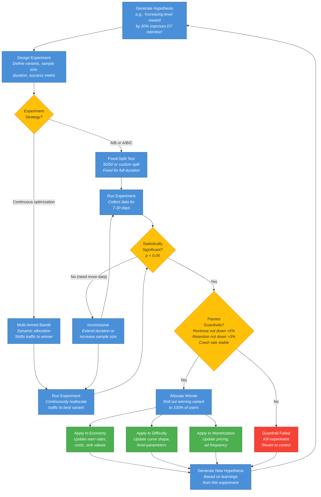
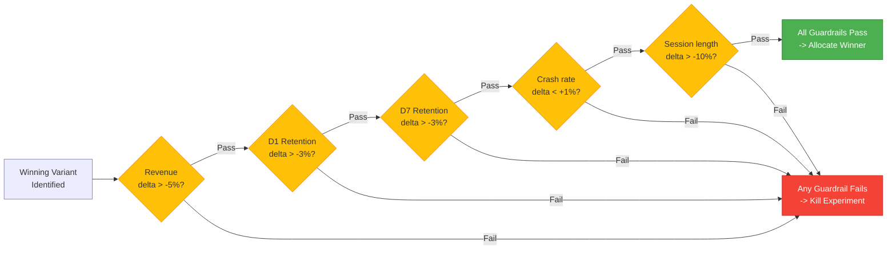

# AB Testing Flow Graph

The hypothesis-to-optimization cycle that the AB Testing Agent runs continuously after the initial game build. This is a closed loop: every experiment either produces a winner that gets applied or generates a new hypothesis.

See [System Overview](../Architecture/SystemOverview.md) for how AB Testing fits into the optimization layer and [Shared Interfaces](../Verticals/00_SharedInterfaces.md) for the `AnalyticsEvent` and `PlayerContext` schemas.

## The Core Cycle

## Fixed-Split vs Multi-Armed Bandit

| Property | Fixed-Split A/B | Multi-Armed Bandit |
|----------|----------------|-------------------|
| Traffic allocation | Even split, locked for duration | Dynamic, shifts toward winner |
| Best for | Clear hypothesis, need statistical rigor | Continuous optimization, minimize regret |
| Duration | 7-30 days (fixed) | Ongoing (converges over time) |
| Statistical method | Frequentist (p-value) | Bayesian (Thompson sampling) |
| Risk | 50% of users on losing variant | Small % stay on losing variant |
| Use cases | Pricing changes, major UX changes | Ad frequency, reward amounts, difficulty tuning |

## Guardrail Checks

Every experiment must pass guardrails before the winner is applied:

## Feedback Targets

The AB Testing Agent sends `ExperimentResults` to three downstream agents:

| Target Agent | What Gets Tuned | Example |
|-------------|----------------|---------|
| **Economy** | Earn rates, sink costs, currency conversion | "Level reward +20% for D0-D3 players" |
| **Difficulty** | Curve shape, level parameters, time limits | "Reduce enemy count by 15% in levels 5-10" |
| **Monetization** | Ad frequency, IAP pricing, offer timing | "Show rewarded ad prompt after 2nd fail, not 1st" |

## Typical Experiment Lifecycle

```mermaid
graph LR
    D0["Day 0<br/>Hypothesis formed"] --> D1["Day 1<br/>Experiment configured"]
    D1 --> D2["Day 2<br/>Traffic split begins"]
    D2 --> D9["Day 9<br/>First significance check"]
    D9 --> D14["Day 14<br/>Guardrail check"]
    D14 --> D15["Day 15<br/>Winner allocated"]
    D15 --> D16["Day 16<br/>Parameters applied"]
    D16 --> D17["Day 17<br/>New hypothesis generated"]

    style D0 fill:#E8E8E8,stroke:#999
    style D15 fill:#4CAF50,stroke:#2E7D32,color:#fff
    style D17 fill:#4A90D9,stroke:#2C5F8A,color:#fff
```

The cycle repeats continuously. A mature game may run 5-15 concurrent experiments across different parameters and player segments.
