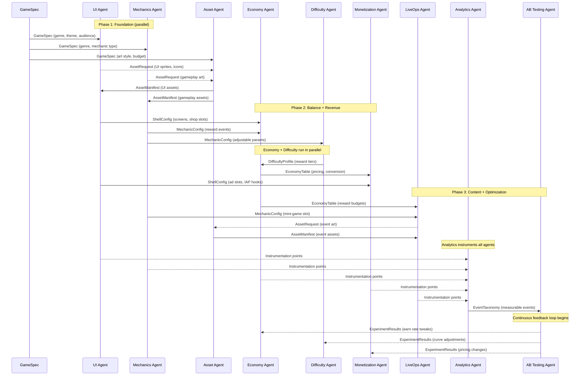

# Agent Orchestration Graph

Timeline view of how the 9 agents execute across three phases. Agents within the same phase can run in parallel when they have no data dependencies on each other.

See [System Overview](../Architecture/SystemOverview.md) for the tier definitions and [Shared Interfaces](../Verticals/00_SharedInterfaces.md) for the handoff contracts.

## Three Execution Phases

| Phase | Agents | Duration | Parallelism |
|-------|--------|----------|-------------|
| **Foundation** | UI, Mechanics, Assets (initial) | First | UI and Mechanics run in parallel; Assets begins on GameSpec-derived requests |
| **Balance + Revenue** | Economy, Difficulty, Monetization | Second | Economy and Difficulty run in parallel; Monetization waits for both |
| **Content + Optimization** | LiveOps, Analytics, AB Testing, Assets (final) | Third | LiveOps and Analytics run in parallel; AB Testing waits for Analytics |

## Gantt-Style Timeline

```mermaid
gantt
    title Agent Orchestration Timeline
    dateFormat X
    axisFormat %s

    section Phase 1: Foundation
    UI Agent (Shell + FTUE)              :ui, 0, 20
    Mechanics Agent (Core Gameplay)      :mech, 0, 20
    Asset Agent (Initial Art Pass)       :asset1, 0, 25

    section Phase 2: Balance + Revenue
    Economy Agent (Currencies + Sinks)   :econ, 20, 40
    Difficulty Agent (Levels + Curves)   :diff, 20, 38
    Monetization Agent (IAP + Ads)       :mon, 40, 55

    section Phase 3: Content + Optimization
    LiveOps Agent (Events + Seasons)     :live, 40, 60
    Asset Agent (Final Art Pass)         :asset2, 40, 65
    Analytics Agent (Telemetry + KPIs)   :ana, 55, 70
    AB Testing Agent (Experiments)       :ab, 70, 85
```



## Handoff Sequence Diagram



## Parallel Execution Rules

The orchestrator enforces these constraints:

1. **No agent starts before its inputs are ready.** If Economy needs both `ShellConfig` and `MechanicConfig`, it waits for both UI and Mechanics to complete.
2. **Independent agents within a phase run concurrently.** UI and Mechanics share no inputs beyond GameSpec, so they execute simultaneously.
3. **Asset Agent spans all phases.** It starts in Phase 1 (GameSpec-derived assets), receives additional requests in Phase 2 and 3, and delivers assets as they become available.
4. **AB Testing is always last in the initial build.** It requires the full EventTaxonomy from Analytics, which itself requires all other agents to have registered their instrumentation points.

## Critical Path

The longest dependency chain determines minimum build time:

```
GameSpec -> Mechanics -> Economy -> Monetization -> Analytics -> AB Testing
```

Any delay in this chain delays the entire build. UI, Difficulty, LiveOps, and Assets run on shorter parallel paths.
