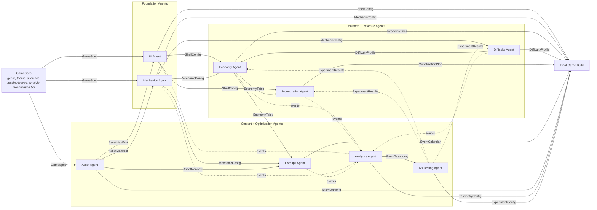
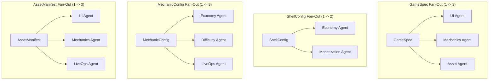
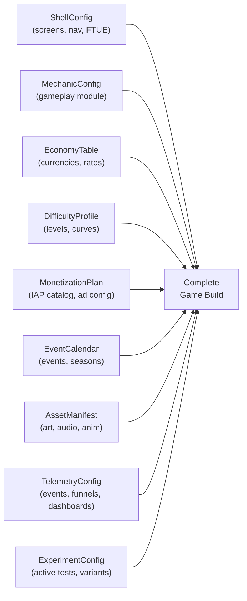

# Data Flow Graph

Traces every data artifact from the initial GameSpec through each agent to the final game build. Shows fan-out (one artifact feeding multiple agents) and fan-in (all artifacts combining into the output).

See [System Overview](../Architecture/SystemOverview.md) for the artifact table and [Shared Interfaces](../Verticals/00_SharedInterfaces.md) for each artifact's schema.

## Artifact Inventory

| Artifact | Produced By | Consumed By |
|----------|-------------|-------------|
| `GameSpec` | Designer / Product | UI, Mechanics, Assets |
| `ShellConfig` | UI Agent | Economy, Monetization |
| `MechanicConfig` | Mechanics Agent | Economy, Difficulty, LiveOps |
| `EconomyTable` | Economy Agent | Monetization, LiveOps |
| `DifficultyProfile` | Difficulty Agent | Economy |
| `MonetizationPlan` | Monetization Agent | (final build) |
| `EventCalendar` | LiveOps Agent | (final build) |
| `AssetManifest` | Asset Agent | UI, Mechanics, LiveOps |
| `EventTaxonomy` | Analytics Agent | AB Testing |
| `TelemetryConfig` | Analytics Agent | (final build) |
| `ExperimentResults` | AB Testing Agent | Economy, Difficulty, Monetization |

## Full Data Flow

## Fan-Out Points

These artifacts feed multiple downstream consumers:

## Fan-In: Final Game Build

All 9 agents contribute artifacts to the final build:

## Artifact Lifecycle

Each artifact goes through these states:

1. **Requested** -- A downstream agent declares it needs this artifact.
2. **Generating** -- The owning agent is building the artifact.
3. **Published** -- The artifact is written to the shared artifact store.
4. **Consumed** -- Downstream agents have read and validated the artifact.
5. **Updated** -- AB Testing feedback triggers a new version (runtime only).

The orchestrator tracks artifact states and only advances an agent to "Generating" when all its input artifacts are in "Published" state.
