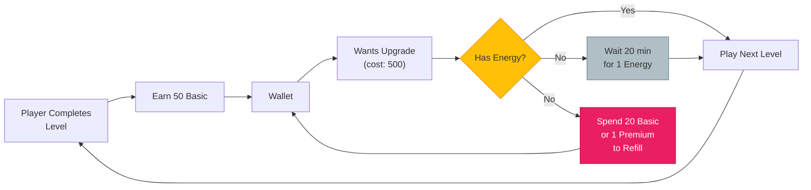

# Economy Flow Graph

Visualizes the full currency lifecycle: how currency enters the player's wallet (faucets), how it leaves (sinks), how two currency types interact, and how time-gates regulate flow.

See [Faucet & Sink Concepts](../SemanticDictionary/Concepts_Faucet_Sink.md) for detailed faucet/sink tables and balance equations. See [Shared Interfaces](../Verticals/00_SharedInterfaces.md) for the `CurrencyAmount`, `Price`, and `RewardBundle` type definitions.

## Dual-Currency Model

The engine uses two currency types with asymmetric conversion:

| Currency | Examples | Primary Source | Conversion |
|----------|----------|---------------|------------|
| **Basic** | Coins, Gold, Bucks | Gameplay faucets (free) | Cannot convert to Premium |
| **Premium** | Gems, Diamonds, Crystals | IAP purchases (paid) | Can convert to Basic at favorable rate |

This asymmetry is the core monetization lever: players who want Premium currency must pay real money.

## Full Currency Flow

```mermaid
graph TD
    subgraph FreeFaucets["Free Faucets"]
        F_LEVEL["Level Rewards<br/>10-100 basic/level"]
        F_DAILY["Daily Login<br/>25-200 basic/day"]
        F_ACHIEVE["Achievements<br/>50-500 basic (one-time)"]
        F_GIFT["Free Daily Gift<br/>10-50 basic/day"]
    end

    subgraph EffortFaucets["Effort Faucets"]
        F_AD["Rewarded Ads<br/>20-50 basic/ad"]
        F_EVENT["Event Prizes<br/>100-1000 basic/event"]
        F_CHALLENGE["Daily Challenge<br/>50-200 basic/day"]
    end

    subgraph PaidFaucets["Paid Faucets (Real Money)"]
        F_IAP["Currency Pack IAP<br/>500-50000 basic<br/>or 10-1000 premium"]
        F_PASS["Battle Pass<br/>Spread over 30 days"]
        F_STARTER["Starter Bundle<br/>Large one-time bundle"]
    end

    BASIC_WALLET["Basic Currency Wallet<br/>Median balance: ~1,240"]
    PREMIUM_WALLET["Premium Currency Wallet<br/>Median balance: ~15"]

    subgraph ProgressionSinks["Progression Sinks"]
        S_UPGRADE["Upgrades<br/>Exponential cost curve"]
        S_UNLOCK["Content Unlocks<br/>100/500/2000/..."]
        S_RETRY["Level Retry<br/>10-50 basic or 1-5 premium"]
    end

    subgraph CosmeticSinks["Cosmetic Sinks"]
        S_SKIN["Skins<br/>200-2000 basic<br/>or 50-500 premium"]
        S_EFFECT["Visual Effects<br/>100-500 basic"]
        S_THEME["Themes<br/>500-5000 basic"]
    end

    subgraph ConvenienceSinks["Convenience Sinks"]
        S_ENERGY["Energy Refill<br/>20-100 basic or 1-5 premium"]
        S_SPEED["Speed-Up<br/>10-50 basic"]
        S_SKIP["Skip Level<br/>50-200 basic or 5-20 premium"]
    end

    %% Free faucets -> Basic
    F_LEVEL --> BASIC_WALLET
    F_DAILY --> BASIC_WALLET
    F_ACHIEVE --> BASIC_WALLET
    F_GIFT --> BASIC_WALLET

    %% Effort faucets -> Basic
    F_AD --> BASIC_WALLET
    F_EVENT --> BASIC_WALLET
    F_CHALLENGE --> BASIC_WALLET

    %% Paid faucets -> Both wallets
    F_IAP --> BASIC_WALLET
    F_IAP --> PREMIUM_WALLET
    F_PASS --> BASIC_WALLET
    F_PASS --> PREMIUM_WALLET
    F_STARTER --> BASIC_WALLET
    F_STARTER --> PREMIUM_WALLET

    %% Premium -> Basic conversion (one-way)
    PREMIUM_WALLET -- "Convert at 1:10 rate<br/>(one-way only)" --> BASIC_WALLET

    %% Basic wallet -> Sinks
    BASIC_WALLET --> S_UPGRADE
    BASIC_WALLET --> S_UNLOCK
    BASIC_WALLET --> S_RETRY
    BASIC_WALLET --> S_SKIN
    BASIC_WALLET --> S_EFFECT
    BASIC_WALLET --> S_THEME
    BASIC_WALLET --> S_ENERGY
    BASIC_WALLET --> S_SPEED
    BASIC_WALLET --> S_SKIP

    %% Premium wallet -> Premium sinks
    PREMIUM_WALLET --> S_RETRY
    PREMIUM_WALLET --> S_SKIN
    PREMIUM_WALLET --> S_ENERGY
    PREMIUM_WALLET --> S_SKIP

    %% Styles
    classDef freeF fill:#4CAF50,stroke:#2E7D32,color:#fff
    classDef effortF fill:#FF9800,stroke:#E65100,color:#fff
    classDef paidF fill:#E91E63,stroke:#AD1457,color:#fff
    classDef wallet fill:#2196F3,stroke:#1565C0,color:#fff
    classDef sink fill:#9C27B0,stroke:#6A1B9A,color:#fff

    class F_LEVEL,F_DAILY,F_ACHIEVE,F_GIFT freeF
    class F_AD,F_EVENT,F_CHALLENGE effortF
    class F_IAP,F_PASS,F_STARTER paidF
    class BASIC_WALLET,PREMIUM_WALLET wallet
    class S_UPGRADE,S_UNLOCK,S_RETRY,S_SKIN,S_EFFECT,S_THEME,S_ENERGY,S_SPEED,S_SKIP sink
```

## Time-Gates and Energy as Flow Regulators

Time-gates slow down the faucet-to-sink cycle, preventing players from burning through content too fast:

**Energy system summary:**
- Energy regenerates at 1 unit per 20 minutes (configurable).
- Each level costs 1 energy.
- Maximum energy pool: 5 (new player) to 10 (upgraded).
- Refill options: wait, spend basic currency, spend premium currency, or watch a rewarded ad.

## Balance Targets

The Economy Agent targets these ratios (from [Faucet & Sink Concepts](../SemanticDictionary/Concepts_Faucet_Sink.md)):

| Metric | Healthy Range |
|--------|--------------|
| Total faucet / total sink | 1.05 - 1.15x (slight surplus) |
| Median wallet balance trend | Slowly rising |
| Sink coverage ratio | 0.85 - 0.95 |
| Time-to-next-purchase | 1-3 sessions |

## Per-Segment Flow Differences

```mermaid
graph TD
    subgraph NewPlayer["New Player (D0-D3)"]
        NF["High free faucets"] --> NW["Wallet grows fast"]
        NW --> NS["Low sink pressure"]
        NS --> NR["Result: Feels generous,<br/>builds habit"]
    end

    subgraph Casual["Casual (D7+, non-payer)"]
        CF["Effort faucets<br/>(ads)"] --> CW["Wallet grows<br/>with effort"]
        CW --> CS["Medium sinks"]
        CS --> CR["Result: Monetized<br/>via attention"]
    end

    subgraph Whale["Whale (high spender)"]
        WF["Paid faucets<br/>(IAP)"] --> WW["Large wallet"]
        WW --> WS["High-value<br/>cosmetic sinks"]
        WS --> WR["Result: Exclusive<br/>status items"]
    end
```

These segments are defined by the `PlayerContext.segments` type in [Shared Interfaces](../Verticals/00_SharedInterfaces.md).
