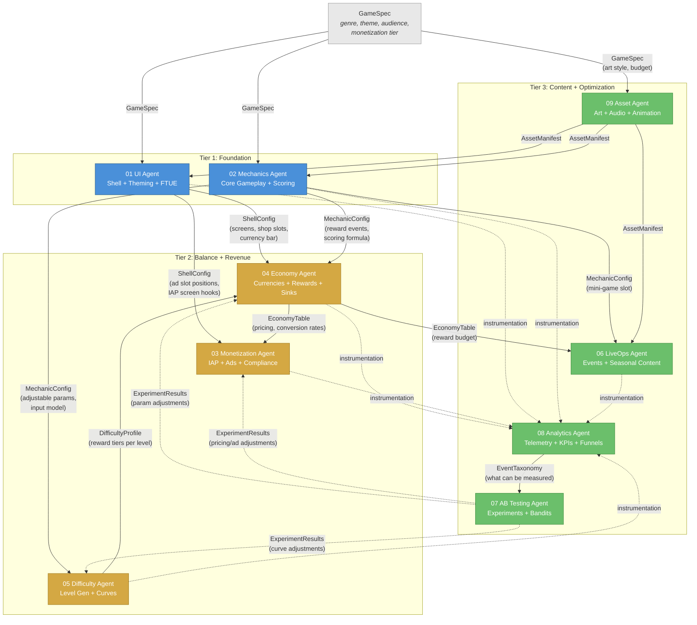

# Module Dependency Graph

How the 9 verticals depend on each other. Edges represent data artifacts flowing between agents. No agent calls another directly; the pipeline orchestrator passes shared artifacts between stages.

See [System Overview](../Architecture/SystemOverview.md) for the full 3-tier architecture and [Shared Interfaces](../Verticals/00_SharedInterfaces.md) for the contracts at each boundary.

## Dependency Layers

The graph forms a directed acyclic graph (DAG) with three tiers:

1. **Foundation** -- UI and Mechanics read only the GameSpec. They have zero inter-agent dependencies and can run in parallel.
2. **Balance + Revenue** -- Economy, Difficulty, and Monetization depend on Foundation outputs. Economy and Difficulty have a bidirectional data relationship (Difficulty feeds reward tiers back to Economy).
3. **Content + Optimization** -- LiveOps, Assets, Analytics, and AB Testing sit at the leaves. AB Testing depends on Analytics and feeds results back into Tier 2 parameters.

## Full Dependency DAG

## Reading the Graph

- **Solid arrows** represent build-time data flow: an upstream agent produces an artifact that a downstream agent consumes during generation.
- **Dashed arrows** represent runtime/continuous data flow: instrumentation telemetry and experiment results that flow after the initial build.
- **Edge labels** name the shared artifact. Each artifact's schema is defined in [Shared Interfaces](../Verticals/00_SharedInterfaces.md).

## Key Observations

| Property | Detail |
|----------|--------|
| Root nodes | UI Agent, Mechanics Agent (depend only on GameSpec) |
| Most depended-on | Economy Agent (receives from UI, Mechanics, Difficulty; feeds Monetization, LiveOps) |
| Leaf nodes | AB Testing Agent, Analytics Agent (consume from most others, produce feedback) |
| Bidirectional pair | Economy and Difficulty (Difficulty sends reward tiers; Economy sends reward budgets) |
| Cross-cutting | Asset Agent serves UI, Mechanics, and LiveOps; Analytics instruments all agents |

## Parallelism Implications

Because the DAG has clear layers, the orchestrator can parallelize within each tier:

1. **Parallel:** UI + Mechanics (+ Asset Agent can start on GameSpec assets)
2. **Parallel:** Economy + Difficulty (after Foundation completes)
3. **Sequential:** Monetization (after Economy + UI)
4. **Parallel:** LiveOps + Analytics (after Tier 2)
5. **Last:** AB Testing (after Analytics)
