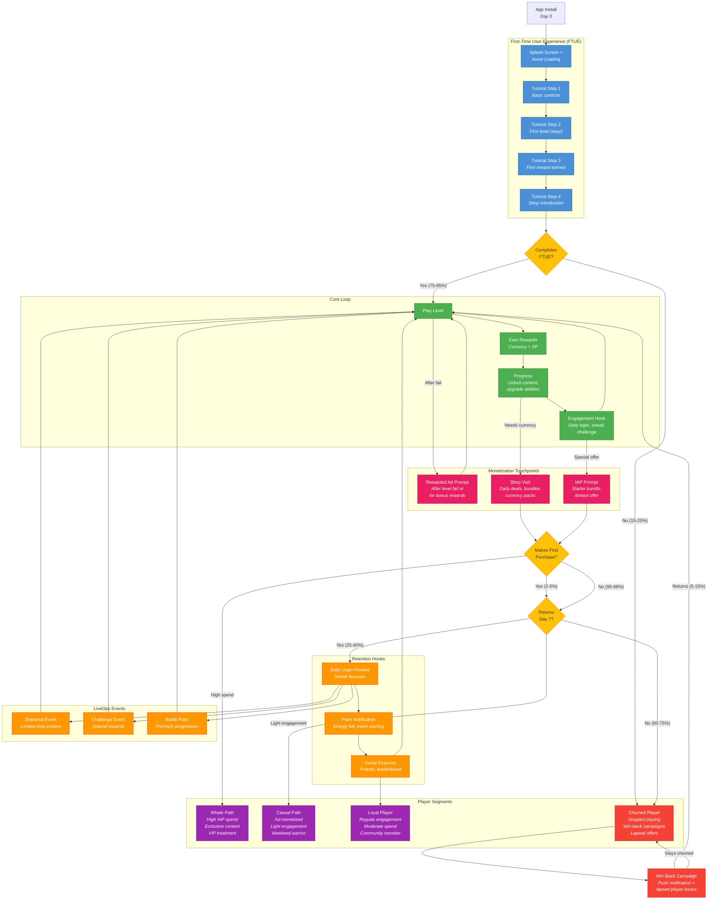
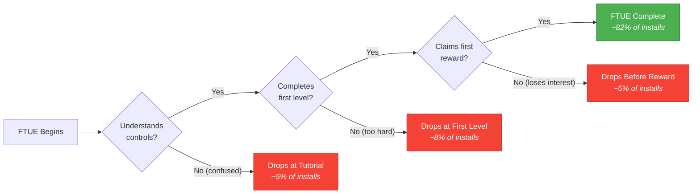
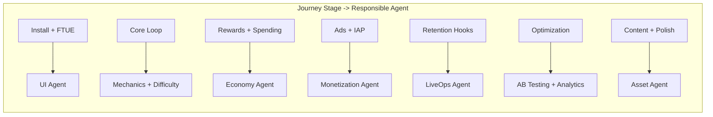

# Player Journey Graph

The master player flow from install to loyal user or churn. Maps every major touchpoint, decision point, and branching path across the player lifecycle. Each stage connects to the agent responsible for that experience.

See [System Overview](../Architecture/SystemOverview.md) for the agent responsibilities and [Shared Interfaces](../Verticals/00_SharedInterfaces.md) for the `PlayerContext.segments` definitions.

## Full Player Journey

## Key Metrics at Each Stage

| Stage | Key Metric | Healthy Benchmark | Owning Agent |
|-------|-----------|-------------------|-------------|
| Install | Install-to-open rate | > 90% | UI (splash optimization) |
| FTUE Start | Tutorial start rate | > 95% | UI (FTUE flow) |
| FTUE Complete | Tutorial completion rate | 75-85% | UI + Mechanics |
| First Session | Session length | > 5 min | Mechanics (engagement) |
| Core Loop | Levels per session | 3-8 | Mechanics + Difficulty |
| First Ad | Rewarded ad opt-in rate | 30-50% | Monetization |
| First Purchase | Conversion rate (D0-D7) | 2-5% | Monetization |
| D1 Retention | % returning Day 1 | 40-50% | All (core loop quality) |
| D7 Retention | % returning Day 7 | 25-40% | Economy + LiveOps |
| D30 Retention | % returning Day 30 | 10-20% | LiveOps + AB Testing |
| ARPDAU | Avg revenue per daily active user | $0.05-0.15 | Monetization + Economy |
| LTV | Lifetime value per install | $0.50-5.00 | All agents |

## Decision Points Detail

### Decision 1: Does the player complete FTUE?

### Decision 2: Does the player make a first purchase?

The "payer conversion" funnel determines which monetization path a player takes:

- **Whale (0.5-2%)**: Spends > $100 lifetime. Receives VIP treatment, exclusive offers, premium cosmetics.
- **Dolphin (3-8%)**: Spends $10-100 lifetime. Regular purchaser of battle passes and bundles.
- **Minnow (5-10%)**: Spends $1-10 lifetime. Occasional impulse purchases.
- **Free (80-90%)**: Never spends. Monetized through ads and engagement (contributes to social features, leaderboards).

### Decision 3: Does the player return on Day 7?

D7 retention is the strongest early predictor of long-term engagement. Players who return on D7 are 3-5x more likely to become D30 retained.

The Economy Agent and LiveOps Agent are the primary levers:
- Economy ensures the player has meaningful goals to return for (upgrade they are saving toward, daily reward streak).
- LiveOps ensures there is fresh content (new event starting, limited-time challenge).
- Push notifications from the Monetization Agent remind players of these reasons to return.

## Agent Responsibility Map

Every stage is measurable via the Analytics Agent's `StandardEvents` taxonomy (see [Shared Interfaces](../Verticals/00_SharedInterfaces.md)). The AB Testing Agent continuously runs experiments to optimize conversion at each decision point.
