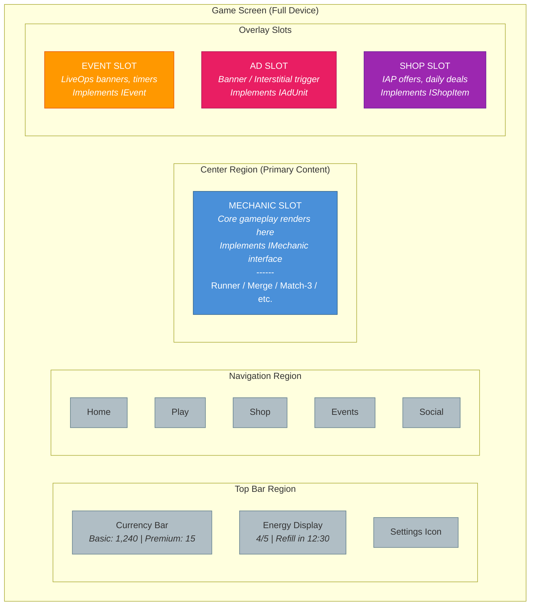
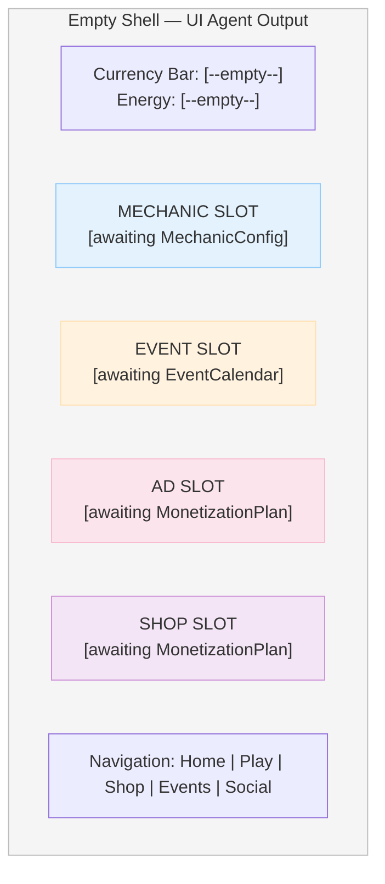
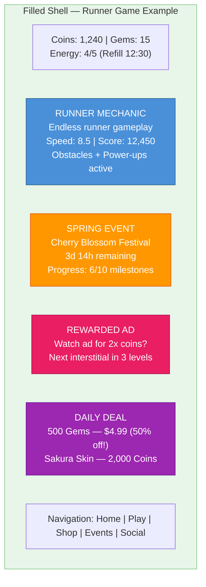
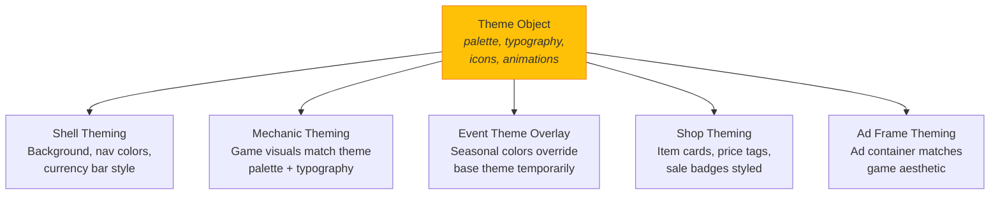
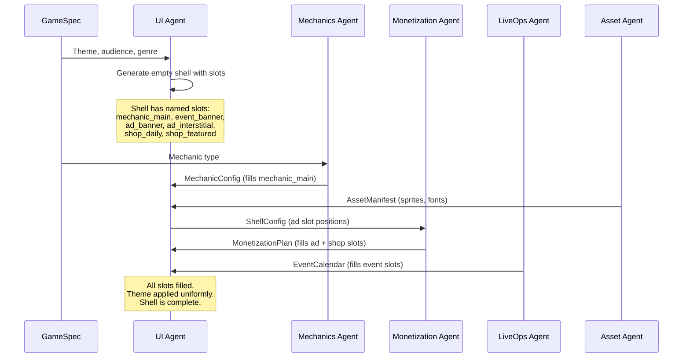

# Slot Composition Graph

Visual decomposition of how the UI Shell provides slots that other agents fill. The Shell is an empty frame; the Mechanics Agent, LiveOps Agent, Monetization Agent, and Asset Agent each fill their designated regions.

See [System Overview](../Architecture/SystemOverview.md) for the slot architecture overview and [Shared Interfaces](../Verticals/00_SharedInterfaces.md) for the `IMechanic`, `IEvent`, `IAdUnit`, and `IShopItem` contracts.

## Screen Region Map

## Before and After: Empty Shell vs Filled Shell

### Empty Shell (UI Agent output only)

### Filled Shell (All agents have contributed)

## How Theming Wraps Everything

The UI Agent generates a `Theme` object (see [Shared Interfaces](../Verticals/00_SharedInterfaces.md)) that applies consistently across all slots:

## Slot Interface Summary

Each slot type has a contract that the filling agent must implement:

| Slot | Interface | Filling Agent | Key Methods |
|------|-----------|--------------|-------------|
| Mechanic Slot | `IMechanic` | Mechanics Agent | `init()`, `start()`, `pause()`, events |
| Event Slot | `IEvent` | LiveOps Agent | `init()`, `start()`, `getProgress()`, `claimReward()` |
| Ad Slot | `IAdUnit` | Monetization Agent | `load()`, `isReady()`, `show()` |
| Shop Slot | `IShopItem` | Monetization Agent | `getDisplayInfo()`, `getPrice()`, `purchase()` |

## Composition Flow

The shell never knows *what* mechanic is running inside it. It only knows the `IMechanic` interface. This decoupling means the same shell can host a runner, a merge game, a match-3, or any other mechanic without changes.
