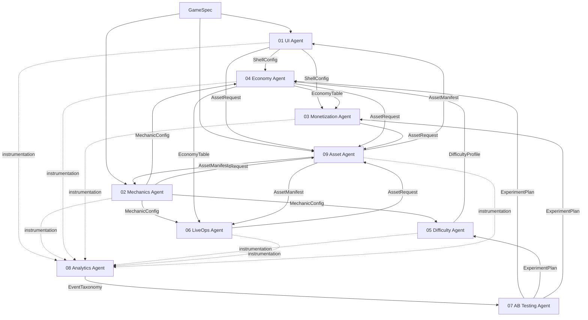

# Agent Handoffs

Every connection between agents in the pipeline is a **handoff** -- a structured artifact that one agent produces and another consumes. This document catalogs every handoff, identifies the critical path, and defines validation rules.

---

## Handoff Connection Map



---

## Complete Handoff Table

Every agent-to-agent connection, the artifact exchanged, and the key fields that the downstream agent consumes.

| # | From Agent | To Agent | Artifact | Key Fields | Phase Boundary |
|---|-----------|----------|----------|------------|---------------|
| 1 | Input | UI Agent (01) | `GameSpec` | `genre`, `theme`, `audience`, `monetizationTier` | Entry -> Phase 1 |
| 2 | Input | Mechanics Agent (02) | `GameSpec` | `genre`, `mechanicType`, `referenceGames` | Entry -> Phase 1 |
| 3 | Input | Asset Agent (09) | `GameSpec` | `artStyle`, `theme`, `assetBudget` | Entry -> Phase 4 |
| 4 | UI Agent (01) | Economy Agent (04) | `ShellConfig` | `screens`, `shopSlots`, `currencyBarConfig` | Phase 1 -> 2 |
| 5 | UI Agent (01) | Monetization Agent (03) | `ShellConfig` | `adSlotPositions`, `iapScreenHooks` | Phase 1 -> 3 |
| 6 | Mechanics Agent (02) | Economy Agent (04) | `MechanicConfig` | `rewardEvents`, `scoringFormula` | Phase 1 -> 2 |
| 7 | Mechanics Agent (02) | Difficulty Agent (05) | `MechanicConfig` | `adjustableParams`, `inputModel` | Phase 1 -> 2 |
| 8 | Mechanics Agent (02) | LiveOps Agent (06) | `MechanicConfig` | `miniGameSlotInterface`, `mechanicType` | Phase 1 -> 4 |
| 9 | Difficulty Agent (05) | Economy Agent (04) | `DifficultyProfile` | `rewardTierMapping`, `levelDifficultyMap` | Within Phase 2 |
| 10 | Economy Agent (04) | Monetization Agent (03) | `EconomyTable` | `pricing`, `currencyConversionRates`, `premiumCurrencyValue` | Phase 2 -> 3 |
| 11 | Economy Agent (04) | LiveOps Agent (06) | `EconomyTable` | `rewardBudget`, `currencyDefinitions`, `earnRates` | Phase 2 -> 4 |
| 12 | All agents | Analytics Agent (08) | `InstrumentationPoints` | Event names, properties, trigger conditions | Phase * -> 5 |
| 13 | Analytics Agent (08) | AB Testing Agent (07) | `EventTaxonomy` | `events`, `funnels`, `kpis`, `segments` | Within Phase 5 |
| 14 | AB Testing Agent (07) | Economy Agent (04) | `ExperimentPlan` | `economyExperiments` (earn rate variants, pricing variants) | Phase 5 -> Loop |
| 15 | AB Testing Agent (07) | Difficulty Agent (05) | `ExperimentPlan` | `difficultyExperiments` (curve shape variants) | Phase 5 -> Loop |
| 16 | AB Testing Agent (07) | Monetization Agent (03) | `ExperimentPlan` | `monetizationExperiments` (ad frequency variants, price variants) | Phase 5 -> Loop |
| 17 | All agents | Asset Agent (09) | `AssetRequest[]` | `type`, `description`, `constraints`, `priority` | Phase * -> 4 |
| 18 | Asset Agent (09) | UI Agent (01) | `AssetManifest` | Theme assets, icons, fonts | Phase 4 -> Assembly |
| 19 | Asset Agent (09) | Mechanics Agent (02) | `AssetManifest` | Character sprites, obstacle art, animations | Phase 4 -> Assembly |
| 20 | Asset Agent (09) | LiveOps Agent (06) | `AssetManifest` | Event-themed assets, seasonal art | Phase 4 -> Assembly |

---

## Critical Path

The **critical path** is the longest chain of sequential handoffs that determines minimum pipeline duration. Any delay on the critical path delays the entire pipeline.

```mermaid
graph LR
    GS[GameSpec] --> MECH[Mechanics Agent]
    MECH --> DIFF[Difficulty Agent]
    DIFF --> ECON[Economy Agent]
    ECON --> MON[Monetization Agent]
    MON --> ANA[Analytics Agent]
    ANA --> AB[AB Testing Agent]
    AB --> ASM[Assembly]

    style GS fill:#e8f5e9
    style MECH fill:#fff9c4
    style DIFF fill:#fff9c4
    style ECON fill:#fff9c4
    style MON fill:#fff9c4
    style ANA fill:#fff9c4
    style AB fill:#fff9c4
    style ASM fill:#e8f5e9
```



**Critical path handoffs (in order):**

| Step | Handoff | Why It Blocks |
|------|---------|--------------|
| 1 | `GameSpec` -> Mechanics Agent | Foundation must start before anything else |
| 2 | `MechanicConfig` -> Difficulty Agent | Difficulty needs mechanic parameters to generate curves |
| 3 | `DifficultyProfile` -> Economy Agent | Economy needs reward tier mapping to set earn rates |
| 4 | `EconomyTable` -> Monetization Agent | Monetization needs pricing and currency rates |
| 5 | All outputs -> Analytics Agent | Analytics must see the full game to instrument it |
| 6 | `EventTaxonomy` -> AB Testing Agent | AB Testing needs to know what can be measured |

**Critical path duration estimate:** ~185-370 seconds (sum of all sequential agent times).

---

## Optional Handoffs (Default-Safe)

These handoffs can use sensible defaults if the upstream agent fails or is skipped. The downstream agent will produce a functional (but less optimized) output.

| Handoff | Default If Missing | Quality Impact |
|---------|--------------------|---------------|
| `DifficultyProfile` -> Economy Agent | Flat reward tiers (all levels pay "medium") | Rewards don't scale with challenge. Functional but less engaging. |
| `EconomyTable` -> LiveOps Agent | Generic event rewards (fixed 100 coins per milestone) | Events feel disconnected from economy. Low impact on core game. |
| `MechanicConfig` -> LiveOps Agent | No mini-game events, only challenge and offer events | Reduced event variety. LiveOps still functional. |
| Asset Agent -> Any consumer | Placeholder/fallback assets (colored rectangles, sine tones) | Game is ugly but mechanically complete. |
| AB Testing Agent -> Economy/Difficulty/Monetization | No experiments; ship with initial values | No optimization, but game works at baseline. |
| Analytics Agent -> AB Testing Agent | No event taxonomy; AB Testing agent generates minimal experiment set | Experiments measure only basic retention and revenue. |

---

## Mandatory Handoffs (Pipeline Breaks Without Them)

| Handoff | Why It's Mandatory |
|---------|--------------------|
| `GameSpec` -> UI Agent | Cannot build shell without genre, theme, audience |
| `GameSpec` -> Mechanics Agent | Cannot build gameplay without mechanic type |
| `ShellConfig` -> Economy Agent | Economy needs shop structure to define what's purchasable |
| `MechanicConfig` -> Economy Agent | Economy needs reward events to define earn rates |
| `MechanicConfig` -> Difficulty Agent | Difficulty needs adjustable parameters to generate curves |
| `ShellConfig` -> Monetization Agent | Monetization needs ad slot positions |
| `EconomyTable` -> Monetization Agent | Monetization needs pricing to set IAP values |

---

## Handoff Validation Rules

Every handoff is validated by the pipeline orchestrator before the downstream agent begins processing. Validation failures trigger the error recovery process (see [ErrorRecovery.md](./ErrorRecovery.md)).

### Schema Validation

```typescript
interface HandoffValidation {
  source: AgentId;
  target: AgentId;
  artifact: string;
  checks: ValidationCheck[];
}

interface ValidationCheck {
  field: string;
  rule: 'required' | 'type_match' | 'range' | 'reference_exists' | 'unique';
  expected: unknown;
  errorLevel: 'fatal' | 'warning';
}
```

### Per-Handoff Validation

| Handoff | Validation Checks |
|---------|-------------------|
| `ShellConfig` -> Economy | `screens` array is non-empty; `shopSlots` has at least 1 entry; `currencyBarConfig` has `basic` and `premium` types |
| `MechanicConfig` -> Difficulty | `adjustableParams` has at least 1 `ParamDefinition`; each param has valid `min` < `max` range |
| `MechanicConfig` -> Economy | `rewardEvents` array is non-empty; each event matches `StandardEvents` schema |
| `DifficultyProfile` -> Economy | `rewardTierMapping` covers all 10 difficulty scores; no gaps in the mapping |
| `EconomyTable` -> Monetization | `currencyConversionRates` has both `basic` and `premium` entries; all prices are positive integers |
| `EconomyTable` -> LiveOps | `rewardBudget` is defined and positive; `currencyDefinitions` match `SharedInterfaces.CurrencyType` |
| `EventTaxonomy` -> AB Testing | `events` array has at least 10 entries; `funnels` has at least 1 funnel definition; `kpis` includes retention and revenue metrics |
| `AssetManifest` -> Any consumer | Every `AssetRef` has a valid `path`; `fallback` references resolve; no duplicate `assetId` values |

### Cross-Handoff Consistency Checks

These checks run during assembly and compare artifacts from different agents:

| Check | Compares | Fails If |
|-------|----------|----------|
| Screen reference consistency | `MonetizationPlan.adSlots[].screen` vs `ShellConfig.screens[].id` | Ad slot references a screen that doesn't exist |
| Currency type consistency | All agents' currency references vs `SharedInterfaces.CurrencyType` | Any agent uses an undefined currency type |
| Event name consistency | `ExperimentPlan.metrics[].eventName` vs `EventTaxonomy.events[].name` | Experiment measures an event that doesn't exist |
| Asset reference consistency | All `AssetRef` values vs `AssetManifest.assets[].assetId` | Any config references an asset not in the manifest |
| Reward tier consistency | `DifficultyProfile.rewardTierMapping` vs `EconomyTable.rewardTiers` | Difficulty maps to a tier that economy doesn't define |

---

## Handoff Failure Scenarios

| Scenario | Impact | Recovery |
|----------|--------|----------|
| UI Agent fails | Blocks Economy, Monetization, all downstream | Retry UI Agent; if max retries exceeded, pipeline fails |
| Mechanics Agent fails | Blocks Difficulty, Economy, LiveOps | Retry Mechanics Agent; critical failure |
| Difficulty Agent fails | Economy uses flat reward tiers (degraded) | Retry Difficulty; fall back to defaults if persistent |
| Economy Agent fails | Blocks Monetization and LiveOps | Retry Economy; critical failure |
| Asset Agent slow | Assembly delayed but all logic complete | Extend timeout; use placeholders for non-critical assets |
| Analytics Agent fails | AB Testing uses minimal taxonomy | Retry Analytics; degrade to basic instrumentation |
| AB Testing Agent fails | No experiments; ship baseline values | Non-critical; game works without experiments |

See [ErrorRecovery.md](./ErrorRecovery.md) for full recovery strategies.

---

## Related Documents

- [Game Creation Pipeline](./GameCreationPipeline.md) -- End-to-end pipeline phases
- [Data Contracts](./DataContracts.md) -- Full schema definitions for every artifact
- [Quality Gates](./QualityGates.md) -- Validation between phases
- [Error Recovery](./ErrorRecovery.md) -- Failure handling
- [System Overview](../Architecture/SystemOverview.md) -- Architecture context
- [Shared Interfaces](../Verticals/00_SharedInterfaces.md) -- Cross-vertical contracts
