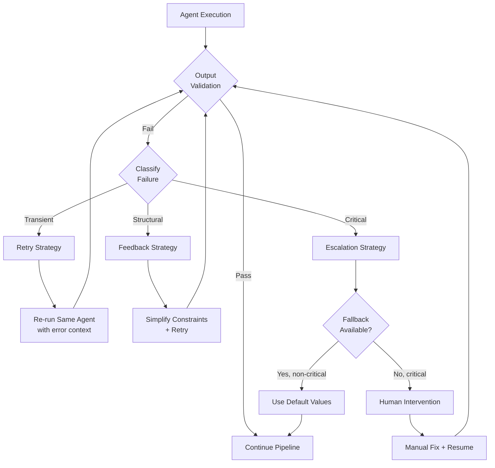
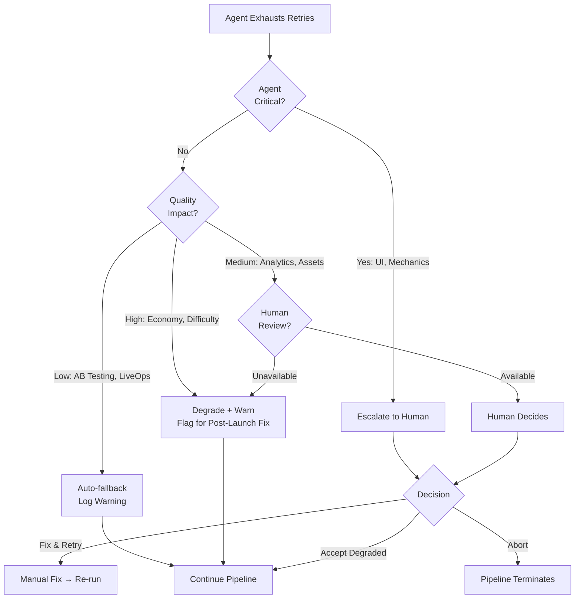
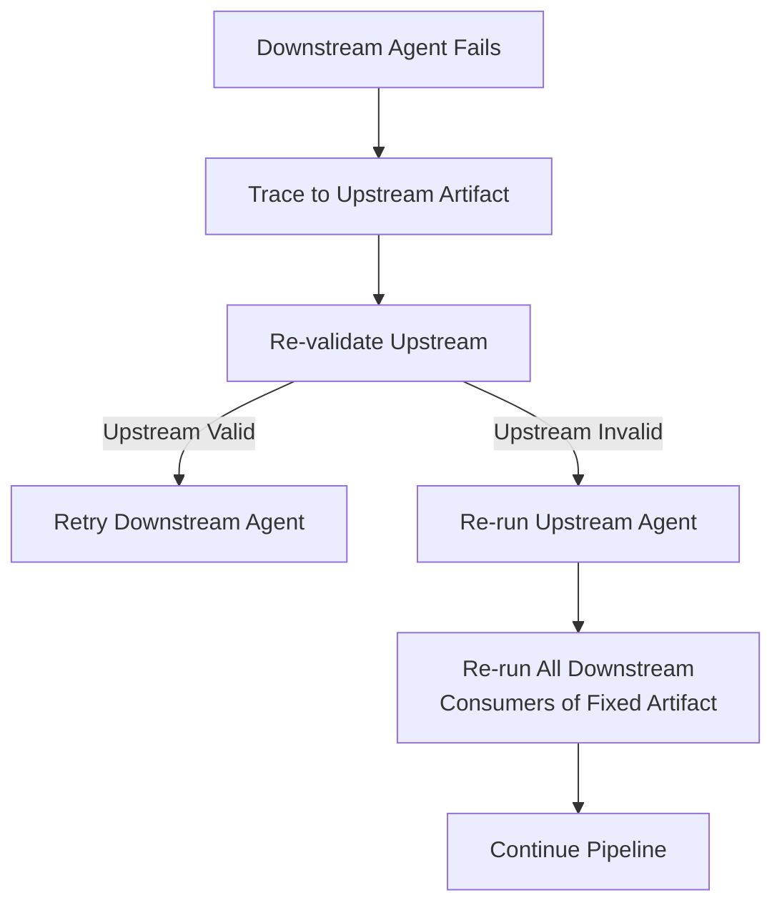

# Error Recovery

How the pipeline handles agent failures, timeouts, and corrupted outputs. Every failure mode has a defined recovery path — retry, fallback, degrade, or escalate.

---

## Recovery Architecture



---

## Failure Classification

Every failure is classified into one of three categories, which determines the recovery path.

| Category | Description | Examples | Recovery |
|----------|-------------|----------|----------|
| **Transient** | Random or environmental failure; same input likely succeeds on retry | API timeout, rate limit, LLM refusal on edge-case prompt, network blip | Retry with identical input (up to max retries) |
| **Structural** | Agent misunderstood the task or produced malformed output; same input will fail again | Schema violation, missing required fields, invalid references, out-of-range values | Retry with error feedback injected into prompt |
| **Critical** | Fundamental inability to produce valid output; retries won't help | Ethics violation, impossible constraints (100 levels with 50KB budget), corrupted upstream artifact | Fallback to defaults or escalate to human |

### Classification Logic

```typescript
function classifyFailure(error: ValidationError, attempt: number): FailureCategory {
  // Transient: network, timeout, rate limit
  if (error.type === 'timeout' || error.type === 'network' || error.type === 'rate_limit') {
    return 'transient';
  }

  // Structural: schema violations, range errors, reference errors
  if (error.type === 'schema' || error.type === 'range' || error.type === 'reference') {
    return 'structural';
  }

  // Critical: ethics, impossible constraints, upstream corruption
  if (error.type === 'ethics' || error.type === 'impossible' || error.type === 'corruption') {
    return 'critical';
  }

  // After max retries, any remaining failure becomes critical
  if (attempt >= MAX_RETRIES) {
    return 'critical';
  }

  return 'structural'; // Default: assume fixable with feedback
}
```

---

## Retry Strategy

### Retry with Error Feedback

The most common recovery. The agent is re-invoked with its original input plus the error message, so it can self-correct.

```typescript
interface RetryContext {
  originalInput: AgentContext;
  attemptNumber: number;         // 1-indexed, increments each retry
  previousErrors: string[];      // All errors from all prior attempts
  simplifiedConstraints?: Partial<AgentConstraints>; // Relaxed on later attempts
}
```

**How error feedback works:**

```
Attempt 1: Agent produces EconomyTable with minEarnTimeMinutes = 2
  → Gate fails: "minEarnTimeMinutes must be >= 5, got 2"

Attempt 2: Agent receives original context + error:
  "Previous attempt failed validation: minEarnTimeMinutes must be >= 5, got 2.
   Please adjust the economy to ensure minimum earn time is at least 5 minutes."
  → Agent produces EconomyTable with minEarnTimeMinutes = 8
  → Gate passes
```

### Retry Limits

| Agent | Max Retries | Timeout Per Attempt | Total Timeout |
|-------|-------------|-------------------|---------------|
| UI Agent | 3 | 60s | 240s |
| Mechanics Agent | 3 | 60s | 240s |
| Economy Agent | 4 | 90s | 450s |
| Difficulty Agent | 3 | 45s | 180s |
| Monetization Agent | 3 | 45s | 180s |
| LiveOps Agent | 3 | 60s | 240s |
| AB Testing Agent | 2 | 45s | 135s |
| Analytics Agent | 2 | 45s | 135s |
| Asset Agent | 5 | 120s | 720s |

**Why Asset Agent gets more retries:** Asset generation (AI image/audio) is the most failure-prone due to external API dependencies. Extra retries absorb transient failures without escalation.

### Progressive Simplification

If an agent fails repeatedly, constraints are relaxed on subsequent attempts.

| Attempt | Strategy |
|---------|----------|
| 1 | Full constraints |
| 2 | Error feedback added to prompt |
| 3 | Non-critical constraints relaxed (e.g., aesthetic preferences softened) |
| 4+ | Minimal constraints only (schema compliance + hard limits) |

```typescript
function simplifyConstraints(attempt: number, original: AgentConstraints): AgentConstraints {
  if (attempt <= 2) return original;

  if (attempt === 3) {
    return {
      ...original,
      // Relax aesthetic preferences
      themeStrictness: 'loose',
      // Widen acceptable ranges
      parameterRanges: widenRanges(original.parameterRanges, 1.5),
    };
  }

  // Attempt 4+: bare minimum
  return {
    schemaCompliance: 'strict',  // Never relaxed
    ethicsCompliance: 'strict',  // Never relaxed
    // Everything else uses defaults
  };
}
```

---

## Fallback Strategy

When retries are exhausted and the failure is non-critical, the pipeline can substitute default values and continue.

### Fallback Defaults per Agent

| Agent | Fallback Available? | Default Output | Quality Impact |
|-------|-------------------|----------------|----------------|
| UI Agent | No | -- | Critical: no shell, no game |
| Mechanics Agent | No | -- | Critical: no gameplay |
| Economy Agent | Partial | Flat economy: fixed earn rate, single currency, no pass system | Functional but boring |
| Difficulty Agent | Yes | Flat difficulty: all levels at difficulty 5, no curve | Playable but monotonous |
| Monetization Agent | Yes | No monetization: no ads, no IAP, free game | Revenue = $0 |
| LiveOps Agent | Yes | Empty calendar: no events, no seasonal content | Functional but stale |
| AB Testing Agent | Yes | No experiments: ship with default parameters | No optimization |
| Analytics Agent | Partial | Standard events only (from SharedInterfaces), no custom taxonomy | Limited visibility |
| Asset Agent | Partial | Placeholder assets: colored rectangles, silence, system fonts | Ugly but functional |

### Fallback Decision Matrix



---

## Escalation Strategy

For critical failures that cannot be auto-resolved.

### Escalation Levels

| Level | Trigger | Action | SLA |
|-------|---------|--------|-----|
| **L0: Auto-resolve** | Transient failure, retry succeeds | No human involvement | Immediate |
| **L1: Auto-fallback** | Non-critical agent fails after retries | Use defaults, log warning | Immediate |
| **L2: Human review** | Critical agent fails, or ethics gate failure | Pause pipeline, notify operator | < 1 hour |
| **L3: Pipeline abort** | Unrecoverable corruption, human rejects output | Full pipeline restart | Hours |

### Escalation Notification

```typescript
interface EscalationNotification {
  pipelineRunId: string;
  level: 'L0' | 'L1' | 'L2' | 'L3';
  agent: string;
  phase: number;
  failureCategory: 'transient' | 'structural' | 'critical';
  errorSummary: string;
  attemptsMade: number;
  artifactsProduced: string[];    // What's been built so far
  suggestedAction: string;        // "Retry with relaxed constraints" | "Review economy balance" | etc.
  timestamp: string;              // ISO 8601
}
```

---

## Per-Agent Recovery Playbook

### UI Agent Failures

| Failure | Classification | Recovery |
|---------|---------------|----------|
| Missing required screen | Structural | Retry with explicit screen list in prompt |
| Invalid navigation graph (orphan screens) | Structural | Retry with graph validation error |
| Theme palette incomplete | Structural | Retry with missing color list |
| Timeout (complex theme generation) | Transient | Retry with simplified theme brief |
| Cannot produce valid FTUE flow | Structural | Retry with reference FTUE template |

### Mechanics Agent Failures

| Failure | Classification | Recovery |
|---------|---------------|----------|
| Missing adjustable parameters | Structural | Retry with parameter requirements list |
| Invalid input model for platform | Structural | Retry with platform constraints |
| Scoring formula produces negative scores | Structural | Retry with scoring constraint |
| Mechanic type not recognized | Critical | Escalate — GameSpec may be invalid |
| IMechanic interface not implemented | Structural | Retry with interface contract in prompt |

### Economy Agent Failures

| Failure | Classification | Recovery |
|---------|---------------|----------|
| Economy balance out of range | Structural | Retry with specific ranges in error |
| Missing currency type | Structural | Retry with SharedInterfaces currency list |
| Circular dependency with Difficulty | Structural | Use DIFFICULTY_REWARD_MAP defaults, retry |
| Earn rate = 0 (broken economy) | Structural | Retry with minimum earn rate constraint |
| Exceeds max retries | Critical | Fallback: flat economy defaults |

### Difficulty Agent Failures

| Failure | Classification | Recovery |
|---------|---------------|----------|
| Non-monotonic curve (difficulty decreases sharply) | Structural | Retry with monotonicity constraint |
| All levels same difficulty | Structural | Retry with variance requirement |
| Difficulty jumps too large between levels | Structural | Retry with max-jump constraint |
| Exceeds max retries | Critical | Fallback: linear curve from 1 to 10 |

### Monetization Agent Failures

| Failure | Classification | Recovery |
|---------|---------------|----------|
| Ad frequency exceeds caps | Structural | Retry with frequency limits |
| IAP pricing not in standard tiers | Structural | Retry with tier list |
| Ethics violation (dark pattern detected) | Critical | Escalate to human — never auto-resolve |
| Ad slot references missing screen | Structural | Retry with valid screen list from ShellConfig |
| Exceeds max retries | Critical | Fallback: no monetization (free game) |

### LiveOps Agent Failures

| Failure | Classification | Recovery |
|---------|---------------|----------|
| Event reward exceeds budget | Structural | Retry with budget cap from EconomyTable |
| Overlapping events | Structural | Retry with schedule constraints |
| Mini-game slot mismatch | Structural | Retry with MechanicConfig slot interface |
| Exceeds max retries | Critical | Fallback: empty event calendar |

### Analytics Agent Failures

| Failure | Classification | Recovery |
|---------|---------------|----------|
| Missing standard events | Structural | Retry with SharedInterfaces StandardEvents |
| No funnels defined | Structural | Retry with minimum funnel requirement |
| Exceeds max retries | Critical | Fallback: standard events only, no custom taxonomy |

### AB Testing Agent Failures

| Failure | Classification | Recovery |
|---------|---------------|----------|
| Experiment metric not in EventTaxonomy | Structural | Retry with valid metric list |
| Traffic allocation != 100% | Structural | Retry with allocation constraint |
| Conflicting experiments | Structural | Retry with exclusion rules |
| Exceeds max retries | Critical | Fallback: no experiments, ship defaults |

### Asset Agent Failures

| Failure | Classification | Recovery |
|---------|---------------|----------|
| AI generation API timeout | Transient | Retry (up to 5 times) |
| Generated asset exceeds size limit | Structural | Retry with tighter size constraint |
| Style inconsistency across assets | Structural | Retry batch with style reference |
| All generation attempts fail | Critical | Fallback: placeholder rectangles + flag for manual art |
| Marketplace asset not found | Transient | Retry search with broader terms |

---

## Recovery Metrics

The pipeline tracks recovery performance to identify systemic issues.

```typescript
interface RecoveryMetrics {
  pipelineRunId: string;

  // Per-agent metrics
  agentRecoveries: Array<{
    agentId: string;
    totalAttempts: number;
    failureCategory: string;
    resolvedBy: 'retry' | 'fallback' | 'human' | 'abort';
    recoveryTimeMs: number;
    errorMessages: string[];
  }>;

  // Pipeline-level metrics
  totalRetriesAcrossAgents: number;
  totalFallbacksUsed: number;
  humanEscalations: number;
  pipelineCompleted: boolean;
  totalRecoveryTimeMs: number;     // Time spent in recovery (not normal processing)
}
```

### Health Signals

| Metric | Healthy | Warning | Critical |
|--------|---------|---------|----------|
| First-pass rate (all agents) | > 80% | 60-80% | < 60% |
| Avg retries per pipeline run | < 2 | 2-5 | > 5 |
| Fallback usage rate | < 5% | 5-15% | > 15% |
| Human escalation rate | < 2% | 2-10% | > 10% |
| Pipeline completion rate | > 95% | 85-95% | < 85% |

---

## Upstream Artifact Corruption

When an upstream artifact is valid but contains bad data that causes downstream failures.

### Detection

```
Economy Agent fails because MechanicConfig.rewardEvents is empty
  → Error: "No reward events found in MechanicConfig"
  → Root cause: Mechanics Agent passed validation but forgot to populate rewardEvents
```

### Resolution

1. **Trace the dependency chain** — identify which upstream artifact is the root cause
2. **Re-validate the upstream artifact** with stricter checks
3. **Re-run the upstream agent** if the artifact fails re-validation
4. **Cascade re-runs** — all downstream agents that consumed the bad artifact must re-run



### Cascade Re-run Rules

| Re-run Agent | Must Also Re-run |
|-------------|-----------------|
| UI Agent | Economy, Monetization, Analytics |
| Mechanics Agent | Economy, Difficulty, LiveOps, Analytics |
| Difficulty Agent | Economy (reward tier alignment) |
| Economy Agent | Monetization, LiveOps, AB Testing |
| Monetization Agent | Analytics, AB Testing |
| LiveOps Agent | Analytics |
| Analytics Agent | AB Testing |

---

## Pipeline Checkpoint & Resume

The pipeline supports checkpointing, so recovery doesn't require a full restart.

### Checkpoint Strategy

- **After each quality gate passes**, the pipeline saves a checkpoint
- Checkpoints store all validated artifacts up to that point
- On failure, the pipeline can resume from the last checkpoint instead of restarting

```typescript
interface PipelineCheckpoint {
  pipelineRunId: string;
  checkpointId: string;
  phase: number;                    // Last completed phase
  gatesPassed: string[];            // Which quality gates have passed
  artifacts: Record<string, {
    agentId: string;
    artifact: unknown;
    validatedAt: string;            // ISO 8601
    checksum: string;               // SHA-256 of artifact JSON
  }>;
  timestamp: string;
}
```

### Resume Logic

```
Pipeline fails at Phase 3 (Monetization Agent)
  → Checkpoint exists at Phase 2 (Balance Gate passed)
  → Resume: skip Phase 1 and 2, re-run Phase 3 with checkpointed artifacts
  → Saves ~75-150 seconds of redundant processing
```

---

## Related Documents

- [Quality Gates](./QualityGates.md) — Gate definitions and pass criteria
- [Game Creation Pipeline](./GameCreationPipeline.md) — Pipeline phases
- [Agent Handoffs](./AgentHandoffs.md) — What passes between agents
- [Data Contracts](./DataContracts.md) — Schema definitions
- [Agent Orchestration](../Architecture/AgentOrchestration.md) — Retry Manager, State Store
- [Agent Lifecycle](../SemanticDictionary/Concepts_Agent.md) — Agent states and transitions
