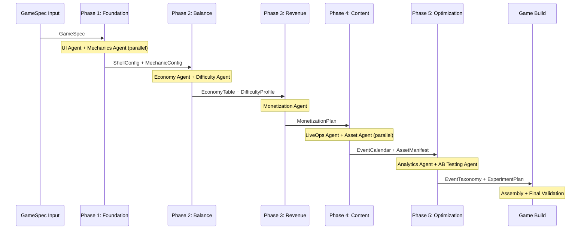

# Game Creation Pipeline

The end-to-end pipeline that transforms a `GameSpec` into a complete, shippable mobile game. Nine specialized AI agents process the specification in six coordinated phases, each building on the outputs of the previous phase.

---

## Pipeline Overview



---

## Phase Definitions

### Phase 1: Foundation (UI + Mechanics)

| Property | Value |
|----------|-------|
| **Agents** | UI Agent (01), Core Mechanics Agent (02) |
| **Parallel?** | Yes -- both read only from `GameSpec`, no cross-dependency |
| **Estimated Duration** | 30-60 seconds |

**Inputs:**

```typescript
// Both agents receive the same GameSpec
interface GameSpec {
  genre: string;            // "runner", "merge", "puzzle", "pvp"
  mechanicType: string;     // Specific mechanic variant
  theme: ThemeBrief;        // Art direction, color mood, audience
  audience: AudienceProfile;
  monetizationTier: 'free' | 'light' | 'mid' | 'heavy';
  referenceGames: string[];
  artStyle: string;
  assetBudget: number;
}
```

**Outputs:**

| Agent | Artifact | Key Contents |
|-------|----------|-------------|
| UI Agent | `ShellConfig` | Screen list, navigation graph, currency bar config, shop slots, ad slot positions, FTUE flow, theme |
| Mechanics Agent | `MechanicConfig` | Mechanic type, scoring formula, reward events, adjustable parameters, level sequence, input model |

**What happens:** The UI Agent generates the shell -- all screens, navigation, theming, and slot positions where other verticals will plug in content. The Mechanics Agent generates the core gameplay module, defining what the player actually does, how scoring works, and what parameters can be tuned by downstream agents.

---

### Phase 2: Balance (Economy + Difficulty)

| Property | Value |
|----------|-------|
| **Agents** | Economy Agent (04), Difficulty Agent (05) |
| **Parallel?** | Partial -- Difficulty can start immediately from `MechanicConfig`, but Economy needs both `MechanicConfig` and `ShellConfig`. There is also a bidirectional dependency: Economy reads `DifficultyProfile` for reward tier mapping, and Difficulty needs Economy's reward tiers to calibrate curves. In practice, Difficulty runs first, then Economy consumes its output. |
| **Estimated Duration** | 45-90 seconds |

**Inputs:**

| Agent | Reads From | Artifact |
|-------|-----------|----------|
| Difficulty Agent | Mechanics Agent | `MechanicConfig` -- adjustable parameters, input model |
| Economy Agent | UI Agent | `ShellConfig` -- shop structure, currency bar config |
| Economy Agent | Mechanics Agent | `MechanicConfig` -- reward events, scoring formula |
| Economy Agent | Difficulty Agent | `DifficultyProfile` -- reward tiers per difficulty level |

**Outputs:**

| Agent | Artifact | Key Contents |
|-------|----------|-------------|
| Difficulty Agent | `DifficultyProfile` | Per-level difficulty parameters, curve shape, difficulty-to-reward-tier mapping |
| Economy Agent | `EconomyTable` | Currency definitions, earn rates, sink costs, time-gates, energy config, pass system, reward tables, pricing |

**What happens:** The Difficulty Agent reads the mechanic's tunable parameters and generates a difficulty curve -- how hard each level is, how parameters scale, and which reward tier each level maps to. The Economy Agent then combines the shell's shop structure, the mechanic's reward events, and the difficulty tiers to produce a complete economy: how much players earn, what things cost, and how long progression takes.

---

### Phase 3: Revenue (Monetization)

| Property | Value |
|----------|-------|
| **Agents** | Monetization Agent (03) |
| **Parallel?** | No -- single agent, sequential |
| **Estimated Duration** | 20-40 seconds |

**Inputs:**

| Reads From | Artifact |
|-----------|----------|
| UI Agent | `ShellConfig` -- ad slot positions, IAP screen hooks |
| Economy Agent | `EconomyTable` -- pricing, currency conversion rates |

**Outputs:**

| Agent | Artifact | Key Contents |
|-------|----------|-------------|
| Monetization Agent | `MonetizationPlan` | IAP catalog, ad placements, rewarded video hooks, pricing tiers, compliance rules, ad frequency caps |

**What happens:** The Monetization Agent places revenue mechanisms into the game. It knows where ad slots exist (from the shell), what currency prices are (from the economy), and positions IAP items, ad triggers, and rewarded videos to maximize revenue without destroying player experience.

---

### Phase 4: Content (LiveOps + Assets)

| Property | Value |
|----------|-------|
| **Agents** | LiveOps Agent (06), Asset Agent (09) |
| **Parallel?** | Partial -- Asset Agent can begin processing requests from Phase 1 and 2 agents early, but LiveOps-specific assets depend on `EventCalendar` output. LiveOps depends on `EconomyTable` and `MechanicConfig`. |
| **Estimated Duration** | 60-120 seconds (Asset Agent is the slowest -- AI image/audio generation) |

**Inputs:**

| Agent | Reads From | Artifact |
|-------|-----------|----------|
| LiveOps Agent | Economy Agent | `EconomyTable` -- reward budget for events |
| LiveOps Agent | Mechanics Agent | `MechanicConfig` -- mini-game slot interface |
| Asset Agent | All upstream agents | `AssetRequest[]` -- art, audio, animation needs |

**Outputs:**

| Agent | Artifact | Key Contents |
|-------|----------|-------------|
| LiveOps Agent | `EventCalendar` | Event schedule, seasonal content, mini-games, milestone definitions, reward tables per event |
| Asset Agent | `AssetManifest` | Delivered assets with metadata, paths, fallbacks, resolution info |

**What happens:** The LiveOps Agent designs the post-launch content calendar -- events, challenges, seasonal themes, and limited-time offers that keep players engaged. The Asset Agent fulfills all asset requests from every other agent, sourcing art, audio, and animation through AI generation, marketplace purchase, or artist commission queues.

---

### Phase 5: Optimization (Analytics + AB Testing)

| Property | Value |
|----------|-------|
| **Agents** | Analytics Agent (08), AB Testing Agent (07) |
| **Parallel?** | No -- AB Testing depends on Analytics output. Analytics runs first. |
| **Estimated Duration** | 30-60 seconds |

**Inputs:**

| Agent | Reads From | Artifact |
|-------|-----------|----------|
| Analytics Agent | All upstream agents | Instrumentation points, event definitions |
| AB Testing Agent | Analytics Agent | `EventTaxonomy` -- what can be measured |
| AB Testing Agent | Economy/Difficulty/Monetization | Tunable parameters |

**Outputs:**

| Agent | Artifact | Key Contents |
|-------|----------|-------------|
| Analytics Agent | `EventTaxonomy` | Full event catalog, funnel definitions, KPI computations, dashboard configs, alerting rules |
| AB Testing Agent | `ExperimentPlan` | Initial experiments, variant definitions, traffic allocation, success metrics, guardrail metrics |

**What happens:** The Analytics Agent instruments the entire game, defining every trackable event, computing KPIs, and configuring dashboards. The AB Testing Agent then uses the analytics taxonomy to design initial experiments -- what to test, how to split traffic, and what metrics determine winners.

---

### Phase 6: Assembly + Output

| Property | Value |
|----------|-------|
| **Agents** | None (orchestrator handles assembly) |
| **Estimated Duration** | 10-20 seconds |

The pipeline orchestrator collects all 9 agent outputs, runs a final cross-validation pass (see [QualityGates.md](./QualityGates.md)), and assembles them into the complete game build.

**Final validation checks:**
- All `AssetRef` values in any config resolve to entries in the `AssetManifest`
- All currency types referenced across agents match `SharedInterfaces` definitions
- All screen names in `MonetizationPlan` and `EventCalendar` exist in `ShellConfig`
- All analytics events referenced in `ExperimentPlan` exist in `EventTaxonomy`
- Performance budget: total asset size within target

---

## Pipeline Timing Summary

| Phase | Agents | Estimated Time | Cumulative |
|-------|--------|---------------|------------|
| 1. Foundation | UI + Mechanics (parallel) | 30-60s | 30-60s |
| 2. Balance | Difficulty then Economy | 45-90s | 75-150s |
| 3. Revenue | Monetization | 20-40s | 95-190s |
| 4. Content | LiveOps + Assets (partial parallel) | 60-120s | 155-310s |
| 5. Optimization | Analytics then AB Testing | 30-60s | 185-370s |
| 6. Assembly | Orchestrator | 10-20s | 195-390s |
| **Total** | | | **~3-7 minutes** |

---

## Parallelization Map

```mermaid
gantt
    title Pipeline Execution Timeline
    dateFormat X
    axisFormat %s

    section Foundation
    UI Agent           :a1, 0, 45
    Mechanics Agent    :a2, 0, 45

    section Balance
    Difficulty Agent   :a3, after a2, 30
    Economy Agent      :a4, after a1 a3, 60

    section Revenue
    Monetization Agent :a5, after a4, 30

    section Content
    Asset Agent (early):a6, after a1 a2, 90
    LiveOps Agent      :a7, after a4 a2, 45
    Asset Agent (late) :a8, after a7, 30

    section Optimization
    Analytics Agent    :a9, after a5 a7, 30
    AB Testing Agent   :a10, after a9, 30

    section Assembly
    Final Assembly     :a11, after a8 a10, 15
```



---

## Walkthrough: Creating a Runner Game

This example traces a runner game (`genre: "runner"`) through every phase.

### Step 1: GameSpec Input

```typescript
const runnerSpec: GameSpec = {
  genre: 'runner',
  mechanicType: 'endless_runner',
  theme: {
    mood: 'energetic',
    setting: 'cyberpunk_city',
    colorPalette: 'neon',
  },
  audience: {
    ageRange: '13-35',
    region: 'global',
    casualLevel: 'mid_casual',
  },
  monetizationTier: 'mid',
  referenceGames: ['Subway Surfers', 'Temple Run 2'],
  artStyle: 'stylized_3d',
  assetBudget: 5000,
};
```

### Step 2: Foundation Phase

**UI Agent** produces a `ShellConfig` with:
- Screens: Splash, MainMenu, Shop, Settings, Leaderboard, DailyRewards
- Navigation: bottom tab bar with Play, Shop, Events, Profile
- Currency bar: coins (basic) + gems (premium) in top header
- Ad slots: interstitial after every 3rd run, rewarded video on death screen
- Theme: neon cyberpunk palette, bold sans-serif typography

**Mechanics Agent** produces a `MechanicConfig` with:
- Mechanic: endless runner with lane-switching, jumping, sliding
- Scoring: distance-based (1 point per meter) + coin pickups
- Reward events: `onLevelComplete` (run ends), `onCurrencyEarned` (coins collected)
- Adjustable parameters: `speed`, `obstacleFrequency`, `coinDensity`, `powerupChance`
- Input model: swipe left/right (lane switch), swipe up (jump), swipe down (slide)

### Step 3: Balance Phase

**Difficulty Agent** produces a `DifficultyProfile`:
- Speed starts at 5 m/s, increases 0.3 m/s per 100m
- Obstacle frequency starts at 1 per 50m, increases to 1 per 15m
- Maps to reward tiers: 0-500m = easy, 500-2000m = medium, 2000-5000m = hard, 5000m+ = very_hard

**Economy Agent** produces an `EconomyTable`:
- Coins earned per run: ~50 (easy) to ~500 (very_hard)
- Character skins: 500-5000 coins or 50-500 gems
- Energy system: 5 lives, regenerate 1 every 20 minutes
- Daily login: escalating coin rewards (50, 100, 150... reset after 7 days)
- Premium currency: 100 gems = $0.99

### Step 4: Revenue Phase

**Monetization Agent** produces a `MonetizationPlan`:
- Rewarded video: "Watch ad for extra life" on death screen (1 per run max)
- Interstitial: after every 3rd run (no more than 1 per 3 minutes)
- IAP: Gem packs ($0.99, $4.99, $9.99, $19.99), Starter Bundle ($2.99, one-time)
- No ads for players who purchased any IAP in last 7 days
- COPPA compliant: age gate before ad display if audience < 13

### Step 5: Content Phase

**LiveOps Agent** produces an `EventCalendar`:
- Week 1: "Neon Rush" challenge (collect 10,000 coins total for exclusive skin)
- Week 3: "Cyberpunk Festival" seasonal event (themed obstacles, 3x coins)
- Monthly: leaderboard tournament (top 100 get premium currency)
- Daily challenges: "Run 2000m without dying", "Collect 50 coins in one run"

**Asset Agent** produces an `AssetManifest`:
- 6 character models (1 default + 5 unlockable)
- 3 environment tilesets (city, subway, rooftop)
- 15 obstacle variants, 8 powerup sprites
- UI icons, sound effects (jump, slide, coin pickup, death)
- Background music: 3 tracks (120 BPM electronic)

### Step 6: Optimization Phase

**Analytics Agent** produces an `EventTaxonomy`:
- 28 tracked events covering gameplay, economy, monetization, and LiveOps
- Funnels: Install > Tutorial > First Run > 3rd Run > First Purchase
- KPIs: D1/D7/D30 retention, ARPDAU, sessions per day, avg run distance

**AB Testing Agent** produces an `ExperimentPlan`:
- Experiment 1: Ad frequency (every 3rd run vs every 5th run) -- metric: D7 retention + ARPDAU
- Experiment 2: Starting coin reward (50 vs 100) -- metric: D1 retention
- Experiment 3: Energy regen time (15min vs 20min vs 30min) -- metric: sessions per day

### Step 7: Assembly

All outputs are merged, cross-validated, and packaged into the final game build. The runner game is ready for deployment.

---

## Related Documents

- [Agent Handoffs](./AgentHandoffs.md) -- What passes between agents
- [Quality Gates](./QualityGates.md) -- Validation at each phase boundary
- [Data Contracts](./DataContracts.md) -- Schema definitions for every artifact
- [Error Recovery](./ErrorRecovery.md) -- What happens when agents fail
- [System Overview](../Architecture/SystemOverview.md) -- Architecture context
- [Shared Interfaces](../Verticals/00_SharedInterfaces.md) -- Cross-vertical contracts
- [Agent Lifecycle](../SemanticDictionary/Concepts_Agent.md) -- Agent states and transitions
