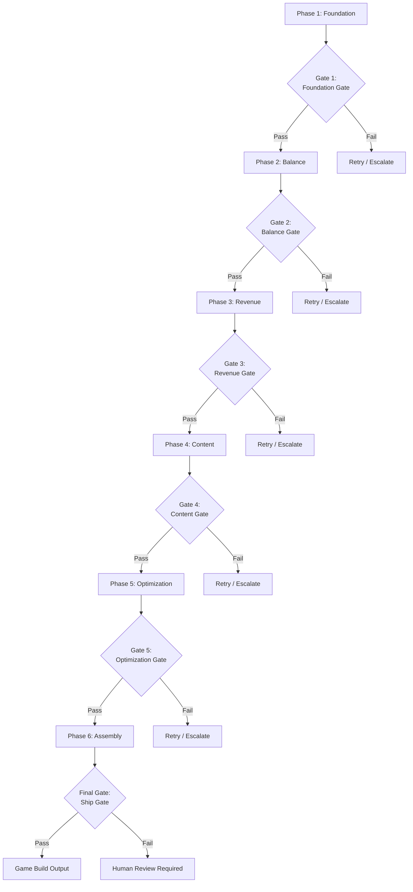
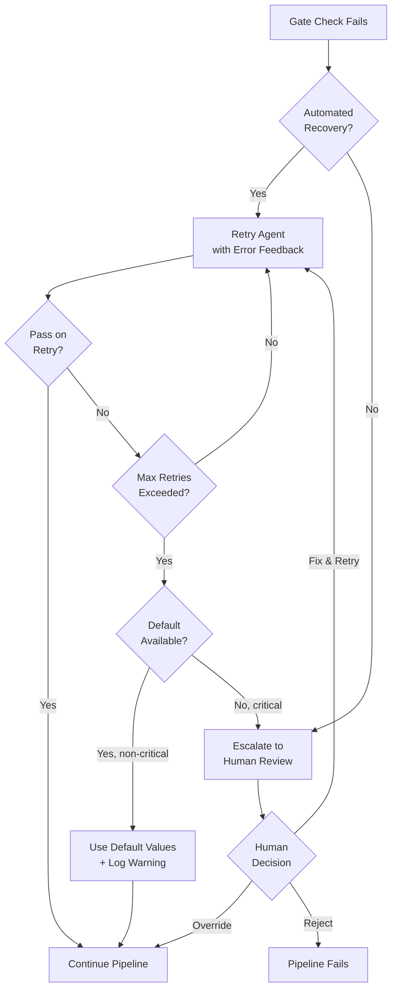

# Quality Gates

A quality gate is a validation checkpoint between pipeline phases. No downstream agent begins processing until the gate for its inputs passes. Gates enforce schema compliance, domain validity, cross-vertical consistency, and ethical constraints.

---

## Gate Architecture



---

## Gate Definitions

### Gate 1: Foundation Gate

**Runs after:** UI Agent and Mechanics Agent complete (Phase 1)
**Blocks:** Economy Agent, Difficulty Agent, Monetization Agent

| Check | Type | Pass Criteria | Fail Action |
|-------|------|--------------|-------------|
| ShellConfig schema | Automated | Conforms to `ShellConfig` JSON schema | Retry UI Agent with schema errors |
| Screen completeness | Automated | At least: Splash, MainMenu, Shop, Settings, GameplaySlot | Retry UI Agent with missing screen list |
| Navigation graph validity | Automated | Every screen reachable from MainMenu; no orphan screens | Retry UI Agent |
| MechanicConfig schema | Automated | Conforms to `MechanicConfig` JSON schema | Retry Mechanics Agent |
| Adjustable params defined | Automated | At least 1 `ParamDefinition` with valid min/max range | Retry Mechanics Agent |
| Reward events defined | Automated | At least `onLevelComplete` event present | Retry Mechanics Agent |
| Theme consistency | Automated | `ShellConfig.theme.palette` has all 8 required colors | Retry UI Agent |
| IMechanic contract compliance | Automated | `MechanicConfig` implements all required lifecycle methods | Retry Mechanics Agent |

**Example: Pass**
```typescript
// ShellConfig has 8 screens, navigation graph connects all of them,
// theme has all palette colors, shop has 3 slot positions
// MechanicConfig has mechanicType "runner", 4 adjustable params,
// 3 reward events including onLevelComplete
// Result: PASS -- proceed to Phase 2
```

**Example: Fail**
```typescript
// ShellConfig is missing the Shop screen
// Error: "Required screen 'Shop' not found in screens array.
//         ShellConfig.screens = ['Splash', 'MainMenu', 'Settings', 'GameplaySlot']"
// Result: FAIL -- retry UI Agent with error feedback
```

---

### Gate 2: Balance Gate

**Runs after:** Difficulty Agent and Economy Agent complete (Phase 2)
**Blocks:** Monetization Agent, LiveOps Agent

| Check | Type | Pass Criteria | Fail Action |
|-------|------|--------------|-------------|
| DifficultyProfile schema | Automated | Conforms to `DifficultyProfile` JSON schema | Retry Difficulty Agent |
| Difficulty curve monotonic | Automated | Difficulty scores increase or stay flat across levels (never decrease by more than 1) | Retry Difficulty Agent |
| All 10 difficulty scores mapped | Automated | `rewardTierMapping` has entries for scores 1 through 10 | Retry Difficulty Agent |
| EconomyTable schema | Automated | Conforms to `EconomyTable` JSON schema | Retry Economy Agent |
| **Economy balance check** | Automated | See [Economy Balance Gate](#economy-balance-gate) below | Retry Economy Agent |
| **Difficulty curve gate** | Automated | See [Difficulty Curve Gate](#difficulty-curve-gate) below | Retry Difficulty Agent |
| Cross-reference: reward tiers | Automated | Every `RewardTier` in `DifficultyProfile` exists in `EconomyTable.rewardTiers` | Retry both agents with alignment error |
| Currency type consistency | Automated | All currency references use types from `SharedInterfaces.CurrencyType` | Retry offending agent |

---

### Gate 3: Revenue Gate

**Runs after:** Monetization Agent completes (Phase 3)
**Blocks:** LiveOps Agent (for monetization-aware events), Analytics Agent

| Check | Type | Pass Criteria | Fail Action |
|-------|------|--------------|-------------|
| MonetizationPlan schema | Automated | Conforms to `MonetizationPlan` JSON schema | Retry Monetization Agent |
| Ad slot validity | Automated | Every `adSlot.screen` exists in `ShellConfig.screens` | Retry Monetization Agent |
| IAP pricing alignment | Automated | All IAP prices use standard App Store price tiers | Retry Monetization Agent |
| **Monetization ethics gate** | Automated + Human | See [Monetization Ethics Gate](#monetization-ethics-gate) below | Escalate to human review |
| Ad frequency cap | Automated | No placement shows more than 1 interstitial per 60 seconds | Retry Monetization Agent |
| Rewarded video cap | Automated | Player cannot watch more than 10 rewarded videos per day | Retry Monetization Agent |
| Currency conversion consistency | Automated | IAP gem prices match `EconomyTable.currencyConversionRates` within 5% | Retry Monetization Agent |

---

### Gate 4: Content Gate

**Runs after:** LiveOps Agent and Asset Agent complete (Phase 4)
**Blocks:** Analytics Agent, AB Testing Agent

| Check | Type | Pass Criteria | Fail Action |
|-------|------|--------------|-------------|
| EventCalendar schema | Automated | Conforms to `EventCalendar` JSON schema | Retry LiveOps Agent |
| Event schedule validity | Automated | No overlapping events of the same type; all events have `startAt` < `endAt` | Retry LiveOps Agent |
| Event reward budgets | Automated | Total rewards across all events in a 30-day window are within 150% of `EconomyTable.monthlyRewardBudget` | Retry LiveOps Agent |
| AssetManifest schema | Automated | Conforms to `AssetManifest` JSON schema | Retry Asset Agent |
| Asset reference resolution | Automated | Every `AssetRef` in `ShellConfig`, `MechanicConfig`, and `EventCalendar` resolves to an entry in `AssetManifest` | Retry Asset Agent for missing assets |
| **Performance budget gate** | Automated | See [Performance Budget Gate](#performance-budget-gate) below | Retry Asset Agent with tighter constraints |
| Asset fallback coverage | Automated | Every critical asset (gameplay sprites, UI icons) has a `fallback` defined | Warn only (non-blocking) |

---

### Gate 5: Optimization Gate

**Runs after:** Analytics Agent and AB Testing Agent complete (Phase 5)
**Blocks:** Final Assembly

| Check | Type | Pass Criteria | Fail Action |
|-------|------|--------------|-------------|
| EventTaxonomy schema | Automated | Conforms to `EventTaxonomy` JSON schema | Retry Analytics Agent |
| Standard events coverage | Automated | All `StandardEvents` from `SharedInterfaces` are present in taxonomy | Retry Analytics Agent |
| Funnel completeness | Automated | At least 1 acquisition funnel, 1 monetization funnel, 1 engagement funnel defined | Retry Analytics Agent |
| ExperimentPlan schema | Automated | Conforms to `ExperimentPlan` JSON schema | Retry AB Testing Agent |
| Experiment metric validity | Automated | All `successMetric` and `guardrailMetric` references exist in `EventTaxonomy` | Retry AB Testing Agent |
| Traffic allocation | Automated | Sum of variant `trafficPercent` values = 100 for each experiment | Retry AB Testing Agent |
| No conflicting experiments | Automated | No two experiments modify the same parameter simultaneously | Retry AB Testing Agent |

---

### Final Gate: Ship Gate

**Runs after:** Assembly combines all 9 agent outputs
**Blocks:** Game build output

| Check | Type | Pass Criteria | Fail Action |
|-------|------|--------------|-------------|
| All 9 agent outputs present | Automated | No missing artifacts (defaults acceptable for optional agents) | Block until resolved |
| Cross-agent reference integrity | Automated | All screen, event, asset, and currency references resolve across all artifacts | Retry offending agents |
| Total asset size | Automated | Combined asset bundle < target size (varies by platform: 150MB Android, 200MB iOS) | Retry Asset Agent with compression |
| SharedInterfaces compliance | Automated | All data types across all artifacts match `SharedInterfaces` definitions exactly | Retry offending agents |
| Privacy compliance | Automated | Analytics events contain no PII fields; consent gates present | Block until fixed |
| Full integration smoke test | Automated | Simulated player session completes: launch > FTUE > first level > first purchase path without errors | Escalate to human review |

---

## Domain-Specific Gates

### Economy Balance Gate

Validates that the economy is balanced -- players can progress without spending but have meaningful reasons to spend.

```typescript
interface EconomyBalanceCheck {
  // Time to earn enough basic currency for cheapest shop item
  minEarnTimeMinutes: { min: 5, max: 60 };

  // Time to earn enough for most expensive basic-currency item
  maxEarnTimeHours: { min: 4, max: 168 }; // 4 hours to 1 week

  // Daily basic currency earn rate at median engagement (3 sessions, 15 min each)
  dailyEarnRate: { min: 50, max: 5000 }; // Depends on economy scale

  // Ratio of daily earn to cheapest item price
  dailyAffordabilityRatio: { min: 0.1, max: 2.0 };

  // Premium to basic currency conversion premium
  premiumConversionPremium: { min: 1.5, max: 10.0 }; // Premium should feel valuable

  // Energy refill time (if energy system exists)
  energyRefillMinutes: { min: 5, max: 60 };

  // Percentage of content accessible without spending
  freeContentPercent: { min: 70, max: 100 };
}
```

**Pass criteria:** All values within defined ranges. Economy sustains engagement for free players while creating natural spending pressure for impatient players.

**Fail scenarios:**
- `minEarnTimeMinutes` < 5: Economy too generous, no reason to spend
- `maxEarnTimeHours` > 168: Most expensive items require over a week of grinding; frustrating
- `freeContentPercent` < 70: Too much content gated behind payment; feels pay-to-win

---

### Difficulty Curve Gate

Validates that the difficulty curve produces a fun and fair experience.

```typescript
interface DifficultyCurveCheck {
  // First 5 levels should be easy (difficulty 1-3)
  tutorialDifficultyCap: 3;

  // Difficulty should never jump more than 2 points between adjacent levels
  maxDifficultyJump: 2;

  // At least 20% of levels should be "easy" (difficulty 1-3)
  easyLevelPercent: { min: 20 };

  // At least 5% of levels should be "extreme" (difficulty 9-10)
  extremeLevelPercent: { min: 5, max: 15 };

  // Curve should have at least 1 "rest" point (difficulty decrease after a spike)
  restPointsRequired: { min: 1 };

  // Estimated win rate for median player on hardest level
  hardestLevelWinRate: { min: 0.05, max: 0.40 };
}
```

**Pass criteria:** Curve starts easy, ramps gradually, has rest points, and top difficulty is challenging but not impossible.

**Fail scenarios:**
- Level 3 has difficulty 7: Too hard too early, new players will churn
- 30 consecutive levels with no difficulty decrease: Monotonous difficulty, no pacing

---

### Monetization Ethics Gate

This gate has both automated and human-review components. It ensures the game's monetization respects players.

| Check | Type | Pass Criteria |
|-------|------|--------------|
| No loot boxes with real-money purchase | Automated | If randomized rewards exist, they are purchasable only with basic (earnable) currency |
| Age-appropriate monetization | Automated | If `audience.ageRange` includes under-13, no direct IAP prompts; COPPA compliant |
| Ad frequency humane | Automated | Interstitials < 1 per 3 minutes; no ads during active gameplay |
| No dark patterns | Human review | No misleading "X" buttons on ads, no fake countdown timers, no bait-and-switch pricing |
| Spending caps for minors | Automated | If audience includes minors, daily and monthly IAP spend caps are configured |
| Transparent pricing | Automated | All prices displayed before purchase confirmation; no hidden costs |

**Escalation:** Ethics gate failures always escalate to human review. The pipeline cannot auto-resolve ethical concerns.

---

### Performance Budget Gate

Validates that assets and configurations will produce a performant game.

| Check | Pass Criteria |
|-------|--------------|
| Total asset bundle size | < 150MB (Android), < 200MB (iOS) |
| Largest single asset | < 10MB |
| Total sprite count | < 500 unique sprites |
| Audio file total | < 30MB |
| Animation frame count (per animation) | < 120 frames |
| Estimated memory footprint | < 200MB peak RAM |
| Screen transition time | < 300ms (per `Theme.animations.screenTransitionMs`) |

---

## Gate Classification

| Gate Type | Decision | Examples |
|-----------|----------|---------|
| **Automated - Blocking** | Pipeline stops; agent retries automatically | Schema validation, range checks, reference integrity |
| **Automated - Warning** | Pipeline continues; issue logged for review | Asset fallback coverage, non-critical missing fields |
| **Human Review - Blocking** | Pipeline stops; human must approve or reject | Ethics gate failures, integration smoke test failures |
| **Human Review - Advisory** | Pipeline continues; human notified for optional review | Economy balance near boundary values, unusual difficulty curves |

---

## Gate Failure Escalation Path



### Escalation Levels

| Level | Trigger | Action | Response Time |
|-------|---------|--------|--------------|
| **L1: Auto-retry** | Schema or range failure | Retry agent with error feedback | Immediate (seconds) |
| **L2: Degraded defaults** | Non-critical agent failure after max retries | Use template defaults, continue | Immediate (seconds) |
| **L3: Human review** | Ethics failure, integration failure, or critical agent exhausts retries | Notify human operator, pipeline paused | Minutes to hours |
| **L4: Pipeline abort** | Human rejects, or unrecoverable corruption | Pipeline terminates, full restart required | Hours to days |

---

## Gate Metrics

The pipeline tracks gate performance to identify consistently problematic agents.

```typescript
interface GateMetrics {
  gateId: string;
  totalRuns: number;
  firstPassRate: number;       // % of runs that pass on first attempt
  avgRetriesBeforePass: number;
  failureRate: number;         // % of runs that ultimately fail (after all retries)
  avgGateTimeMs: number;       // Time to run all checks
  topFailureReasons: Array<{ reason: string; count: number }>;
}
```

---

## Related Documents

- [Game Creation Pipeline](./GameCreationPipeline.md) -- Pipeline phases
- [Agent Handoffs](./AgentHandoffs.md) -- What passes between agents
- [Data Contracts](./DataContracts.md) -- Schema definitions
- [Error Recovery](./ErrorRecovery.md) -- Full failure handling
- [Shared Interfaces](../Verticals/00_SharedInterfaces.md) -- Cross-vertical contracts
- [Agent Lifecycle](../SemanticDictionary/Concepts_Agent.md) -- Agent states
