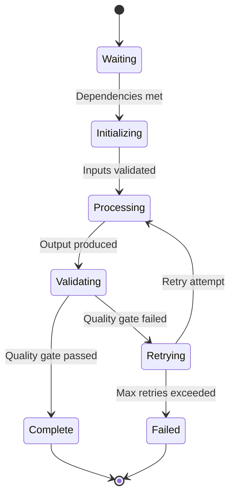
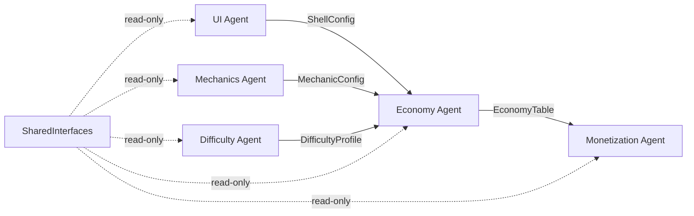

# Concept: Agent

An agent is a specialized AI system that owns one vertical end-to-end. It has defined inputs, processing logic, outputs, and quality criteria.

## Why This Matters

The AI Game Engine doesn't use a single "make me a game" prompt. It decomposes the problem into 9 bounded domains, each handled by a specialized agent. This specialization means:
- Each agent can be optimized for its domain (prompt engineering, fine-tuning, tool selection)
- Agents can be evaluated independently (did the Economy Agent produce balanced tables?)
- Agents can run in parallel when their dependencies allow
- Failed agents can be retried without restarting the entire pipeline

## Agent Properties

```typescript
interface AgentDefinition {
  name: string;                    // e.g., "Economy Agent"
  vertical: VerticalId;            // e.g., "04_Economy"
  inputs: DataContract[];          // What it receives
  outputs: DataContract[];         // What it produces
  dependencies: VerticalId[];      // Must complete before this agent starts
  qualityCriteria: QualityCheck[]; // How to validate output
  maxRetries: number;              // How many times to retry on failure
  timeoutMinutes: number;          // Max execution time
}
```

## Agent Lifecycle



### 1. Waiting
Agent is idle, waiting for upstream agents to complete and produce their outputs.

### 2. Initializing
Agent loads its inputs (data contracts from upstream agents) and validates they conform to expected schemas.

### 3. Processing
Agent generates its outputs. This is where the AI model is invoked with domain-specific prompts, tools, and constraints.

### 4. Validating
The pipeline's quality gate checks the agent's output:
- Does it conform to the output schema?
- Does it satisfy domain-specific quality criteria?
- Is it consistent with SharedInterfaces?

### 5. Complete / Retrying / Failed
If validation passes, the agent is complete and its outputs are available to downstream agents. If validation fails, the agent retries with feedback about what failed. After max retries, the agent fails and the pipeline handles error recovery.

## Agent Autonomy vs Coordination

| Scope | Autonomous (Agent Decides) | Coordinated (SharedInterfaces) |
|-------|---------------------------|-------------------------------|
| **Economy** | Earn rates, sink costs, time-gate durations | Currency types, reward event format |
| **Difficulty** | Curve shape, per-level parameters | Difficulty score range (1-10), reward tier mapping |
| **Monetization** | Ad frequency, IAP pricing | Ad slot positions (defined by UI), currency conversion rates (defined by Economy) |
| **UI** | Layout details, animation timing | Screen list, navigation graph, slot positions |
| **LiveOps** | Event themes, reward tables | Event slot interface, event duration constraints |

**Rule:** Agents have full autonomy within their vertical's scope. They have zero autonomy over SharedInterfaces — those are defined before agents run and are read-only during processing.

## Agent Communication

Agents do NOT communicate directly. They interact through:

1. **Input/Output artifacts** — Each agent reads artifacts from upstream and writes artifacts for downstream
2. **SharedInterfaces** — Pre-agreed contracts that all agents respect
3. **Events** — Analytics events that cross-cutting agents (Analytics, AB Testing) consume
4. **Quality gate feedback** — When an agent fails validation, the error message is the communication



## Agent Evaluation

Each agent is evaluated on:

| Criteria | Example |
|----------|---------|
| **Schema compliance** | Output matches JSON schema |
| **Completeness** | All required fields populated |
| **Consistency** | Values within defined ranges |
| **Domain validity** | Economy balances, difficulty curves are playable |
| **Cross-vertical alignment** | Interfaces match SharedInterfaces contracts |

## Agent Failure Modes

| Failure | Cause | Recovery |
|---------|-------|----------|
| **Schema violation** | Output doesn't match contract | Retry with schema error feedback |
| **Quality failure** | Output is valid but poor (e.g., economy inflates) | Retry with quality feedback |
| **Timeout** | Agent takes too long | Retry with simpler parameters or use defaults |
| **Dependency failure** | Upstream agent failed | Wait for upstream retry or use defaults |
| **Conflict** | Output contradicts another agent | Escalate to human review |

## Related Documents

- [Agent Orchestration](../Architecture/AgentOrchestration.md) — How agents are sequenced
- [Pipeline](../Pipeline/GameCreationPipeline.md) — End-to-end pipeline
- [Quality Gates](../Pipeline/QualityGates.md) — Validation between agents
- [Concepts: Vertical](Concepts_Vertical.md) — The domain an agent owns
- [Glossary: Agent](Glossary.md#agent)
