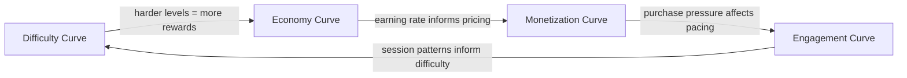

# Concept: Curve

A curve is the progression of a parameter over time or levels. Curves are the language of game balance — they define how hard levels get, how much players earn, and how engagement evolves.

## Why This Matters

Without explicit curves, game balance is ad hoc. AI agents need curves as structured data to generate levels and economy tables that work together. A difficulty curve that doesn't match the economy curve creates either frustration (too hard, not enough rewards) or boredom (too easy, too many rewards).

## Types of Curves

### Difficulty Curve
**What it controls:** How challenging levels are, as a sequence of difficulty scores.
**Produced by:** Difficulty Agent.
**Consumed by:** Level generator, Economy Agent (reward tier mapping).

### Economy Curve
**What it controls:** How much currency the player earns and spends over their lifetime.
**Produced by:** Economy Agent.
**Consumed by:** Monetization Agent (pricing), Difficulty Agent (reward tiers).

### Engagement Curve
**What it controls:** Expected session length and frequency over the player's lifetime.
**Produced by:** Analytics Agent (from data), Economy Agent (design intent).
**Consumed by:** LiveOps Agent (content timing), Monetization Agent (ad pacing).

### Monetization Curve
**What it controls:** When and how aggressively the game surfaces purchase opportunities.
**Produced by:** Monetization Agent.
**Consumed by:** Economy Agent (free-to-paid transition point).

## Curve Representation

A curve is an array of numeric values, one per unit (level, day, session):

```typescript
interface Curve {
  name: string;                    // e.g., "difficulty_main"
  type: 'difficulty' | 'economy' | 'engagement' | 'monetization';
  unit: 'level' | 'day' | 'session';
  values: number[];                // The curve data
  range: { min: number; max: number }; // Valid value range
  interpolation: 'linear' | 'smooth' | 'step'; // Between points
}
```

**Example — Difficulty Curve (30 levels):**
```
Level:      1  2  3  4  5  6  7  8  9 10 11 12 13 14 15
Difficulty: 1  1  2  2  3  2  3  4  4  5  3  4  5  6  7

Level:     16 17 18 19 20 21 22 23 24 25 26 27 28 29 30
Difficulty: 5  6  7  8  9  6  7  8  9 10  7  8  9 10 10
```

Visual (sparkline): `▁▁▂▂▃▂▃▄▄▅▃▄▅▆▇▅▆▇█▉▆▇█▉█▇█▉██`

## Standard Curve Shapes

### Linear Ramp
`[1, 2, 3, 4, 5, 6, 7, 8, 9, 10]`
**Pattern:** Steady increase.
**Use case:** Tutorial levels, early economy.
**Risk:** Boring — predictable progression.

### Sawtooth
`[1, 3, 5, 2, 4, 6, 3, 5, 7, 4, 6, 8]`
**Pattern:** Rise, drop, rise higher.
**Use case:** Difficulty curves — relief levels after hard ones.
**Why:** Prevents fatigue. The "breather level" pattern.

### Staircase
`[2, 2, 2, 4, 4, 4, 6, 6, 6, 8, 8, 8]`
**Pattern:** Plateaus with jumps.
**Use case:** Economy tiers — new content unlocks at each plateau.
**Why:** Clear progression milestones.

### Exponential
`[1, 1, 2, 3, 5, 8, 13, 21, 34, 55]`
**Pattern:** Slow start, accelerating growth.
**Use case:** Economy costs (items get exponentially more expensive).
**Why:** Natural feeling — early progress is fast, late progress is meaningful.

### Boss Rush
`[3, 3, 3, 8, 3, 3, 3, 9, 3, 3, 3, 10]`
**Pattern:** Easy levels punctuated by difficulty spikes.
**Use case:** Games with boss levels or challenge levels.
**Why:** Builds anticipation. Boss levels feel earned.

### Inverted U
`[2, 4, 6, 8, 10, 9, 7, 5, 3, 1]`
**Pattern:** Ramps up then ramps down.
**Use case:** Event difficulty — peaks mid-event, winds down at end.
**Why:** Accessible entry/exit, challenging middle.

## Curve Interactions



**Critical relationship:** Difficulty and Economy curves must be synchronized. If level 15 is very hard (difficulty 8) but only rewards 10 coins (economy says easy-tier), the player feels cheated. The Difficulty Agent and Economy Agent share a reward-tier mapping:

| Difficulty Score | Reward Tier | Basic Currency Multiplier |
|-----------------|-------------|--------------------------|
| 1-2 | Easy | 1.0x |
| 3-4 | Medium | 1.5x |
| 5-6 | Hard | 2.0x |
| 7-8 | Very Hard | 3.0x |
| 9-10 | Extreme | 5.0x |

## AI Generation of Curves

The Difficulty Agent generates curves by:
1. Selecting a base shape (sawtooth, boss rush, etc.)
2. Applying per-mechanic parameters (runner = speed-based, merge = board complexity)
3. Fitting to the economy reward tiers
4. Validating: no level > difficulty 10, no two adjacent levels at max difficulty
5. AB testing: generating variants with different shapes for the same level range

## Related Documents

- [Curve Templates](../Verticals/05_Difficulty/CurveTemplates.md) — All standard curves with data
- [Difficulty Spec](../Verticals/05_Difficulty/Spec.md) — Level generation details
- [Economy Spec](../Verticals/04_Economy/Spec.md) — Economy curve details
- [Balance Levers](../Verticals/04_Economy/BalanceLevers.md) — Tunable economy parameters
- [Glossary: Curve](Glossary.md#curve)
