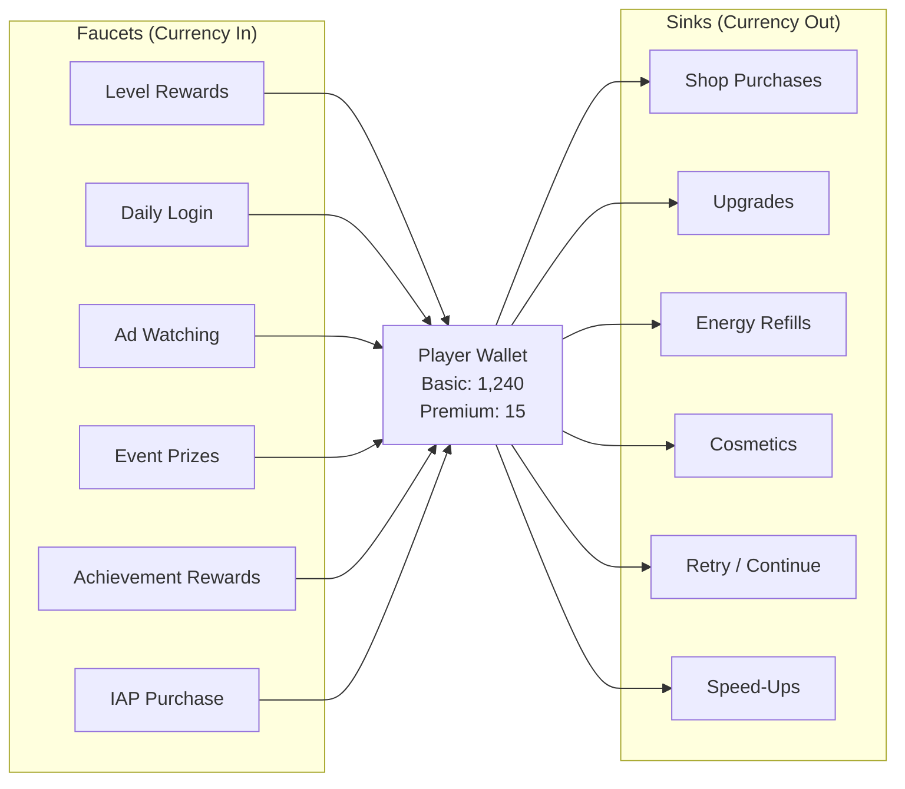

# Concept: Faucet & Sink

Faucets put currency into the player's wallet. Sinks take currency out. The balance between them determines the game's economic health.

## Why This Matters

An economy without enough sinks inflates — players accumulate currency with nothing to spend it on, and purchases feel worthless. An economy with too many sinks deflates — players can never afford anything, creating frustration that pushes them to quit or to pay (which feels coercive).

The Economy Agent must design faucets and sinks that keep currency balances in a healthy range for each player segment.

## The Flow Model

## Faucet Types

### Free Faucets (No Cost to Player)
| Faucet | Trigger | Typical Amount | Frequency |
|--------|---------|---------------|-----------|
| Level completion | Complete a level | 10-100 basic | Per level |
| Daily login | Open app | 25-200 basic, scaling with streak | Daily |
| Achievement | Hit milestone | 50-500 basic | One-time |
| Free daily gift | Timer reset | 10-50 basic | Daily |

### Effort Faucets (Time/Attention Cost)
| Faucet | Trigger | Typical Amount | Frequency |
|--------|---------|---------------|-----------|
| Rewarded ad | Watch 15-30s video | 20-50 basic | Per ad (capped) |
| Event participation | Complete event tasks | 100-1000 basic | Per event |
| Challenge completion | Complete daily challenge | 50-200 basic | Daily |

### Paid Faucets (Real Money)
| Faucet | Trigger | Typical Amount | Frequency |
|--------|---------|---------------|-----------|
| Currency pack IAP | Purchase | 500-50000 basic or 10-1000 premium | As purchased |
| Battle Pass rewards | Purchase pass + play | Spread over 30 days | Seasonal |
| Starter bundle | One-time purchase | Large premium + basic bundle | Once |

## Sink Types

### Progression Sinks (Drive Core Loop)
| Sink | Purpose | Cost Range | Frequency |
|------|---------|-----------|-----------|
| Upgrades | Improve stats/abilities | Exponentially increasing | Per upgrade |
| Unlocks | Access new content | Tiered (100/500/2000/...) | Per unlock |
| Level retry | Continue after failure | 10-50 basic or 1-5 premium | Per retry |

### Cosmetic Sinks (Optional, High-Value)
| Sink | Purpose | Cost Range | Frequency |
|------|---------|-----------|-----------|
| Skins | Visual customization | 200-2000 basic or 50-500 premium | Optional |
| Effects | Visual flair | 100-500 basic | Optional |
| Themes | Environment changes | 500-5000 basic | Optional |

### Convenience Sinks (Time-Saving)
| Sink | Purpose | Cost Range | Frequency |
|------|---------|-----------|-----------|
| Energy refill | Skip wait time | 20-100 basic or 1-5 premium | Per refill |
| Speed-up | Reduce timer | 10-50 basic | Per speed-up |
| Skip level | Bypass hard level | 50-200 basic or 5-20 premium | Per skip |

## The Balance Equation

**Healthy economy:** `Total faucet value ≈ 1.05-1.15 × Total sink value`

Players should slowly accumulate currency (slight faucet surplus) so they feel progress, but not so fast that sinks become meaningless.

### Measuring Balance

| Metric | Healthy Range | Inflation Sign | Deflation Sign |
|--------|--------------|----------------|----------------|
| Median wallet balance | Slowly rising | Rising fast | Falling |
| Sink coverage ratio | 0.85-0.95 | < 0.80 | > 1.00 |
| Time-to-next-purchase | 1-3 sessions | > 5 sessions | < 0.5 sessions |
| "Nothing to buy" complaints | < 5% of reviews | Increasing | N/A |
| "Too expensive" complaints | < 10% of reviews | N/A | Increasing |

### Balancing Levers

When the economy drifts:

**Inflation fix (too much currency):**
- Add new sinks (cosmetics, new upgrade tiers)
- Increase existing sink costs
- Reduce faucet output (lower level rewards)
- Add limited-time high-cost items

**Deflation fix (not enough currency):**
- Increase faucet output (bonus events, higher rewards)
- Reduce sink costs
- Add free faucets (more daily gifts)
- Temporary "sale" prices on popular sinks

## Per-Segment Faucet/Sink Ratios

Different player segments need different economies:

| Segment | Faucet Emphasis | Sink Emphasis | Goal |
|---------|----------------|---------------|------|
| **New players (D0-D3)** | High free faucets | Low sinks | Build habit, show value |
| **Casual (D7+, non-payer)** | Effort faucets (ads) | Medium progression sinks | Monetize via ads |
| **Engaged (D7+, light payer)** | Balanced | Progression + cosmetic sinks | Convert to regular spending |
| **Whale** | Paid faucets | High-value cosmetic sinks | Maximize LTV |
| **Churning** | Bonus faucets (win-back) | Reduced sinks | Re-engage |

## Premium Currency Special Rules

Premium currency (diamonds, crystals) follows different rules:
- **Faucets are scarce:** Small amounts from achievements, events. Primarily from IAP.
- **Sinks are desirable:** Exclusive cosmetics, time-skips, premium-only content.
- **Conversion:** Premium → Basic is allowed (at a favorable rate). Basic → Premium is NOT allowed (forces IAP).
- **No inflation:** Premium currency supply is controlled by IAP pricing, not gameplay faucets.

## Related Documents

- [Economy Spec](../Verticals/04_Economy/Spec.md) — Full economy vertical
- [Balance Levers](../Verticals/04_Economy/BalanceLevers.md) — Tunable parameters
- [Monetization Spec](../Verticals/03_Monetization/Spec.md) — IAP and ad faucets
- [Metrics Dictionary](MetricsDictionary.md) — Currency balance metrics
- [Glossary: Faucet, Sink](Glossary.md#faucet)
