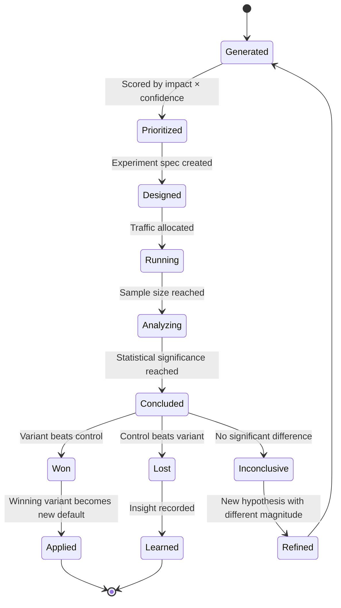
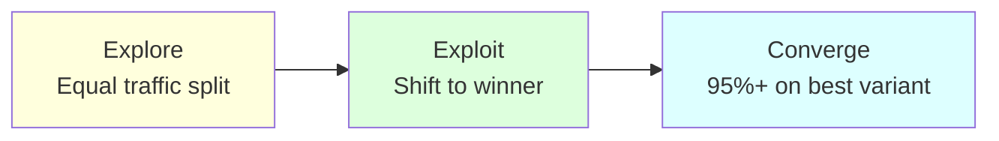

# Concept: Hypothesis

A hypothesis is the starting point of every AB test. It proposes a specific change with a predicted impact on a measurable metric.

## Why This Matters

Without hypotheses, AB testing becomes random tinkering. The AI Game Engine's AB Testing Agent doesn't just test random parameters — it formulates hypotheses based on analytics data, domain knowledge, and prior experiment results. This creates a directed optimization loop instead of a shotgun approach.

## Hypothesis Format

Every hypothesis follows this structure:

> **If** we change `[parameter]` from `[current value]` to `[proposed value]`, **then** `[metric]` will `[improve/decrease]` by `[expected magnitude]` **because** `[reasoning]`.

### Examples

> **If** we change the rewarded ad coin reward from 20 to 40, **then** rewarded ad opt-in rate will improve by 15% **because** the current reward doesn't feel worth 30 seconds of attention.

> **If** we change the difficulty curve from linear ramp to sawtooth, **then** D7 retention will improve by 5% **because** relief levels reduce frustration-driven churn.

> **If** we change the starter bundle price from $4.99 to $2.99, **then** payer conversion rate will improve by 30% **because** the lower price reduces the psychological barrier to first purchase.

## Hypothesis Lifecycle



### 1. Generated
The AB Testing Agent generates hypotheses from:
- **Analytics data:** "D3 retention dropped — what changed at level 5?"
- **Prior experiments:** "Increasing rewards worked for level 10-20; test the same for 20-30"
- **Domain heuristics:** "Games with sawtooth difficulty curves retain better"
- **Cross-game learnings:** "In Game A, $2.99 starters converted 2x better than $4.99"

### 2. Prioritized
Hypotheses are scored by:

| Factor | Weight | Scale |
|--------|--------|-------|
| Expected impact on target metric | 40% | 1-10 |
| Confidence (based on evidence) | 30% | 1-10 |
| Ease of implementation | 20% | 1-10 |
| Risk (downside if wrong) | 10% | 1-10 (inverted — lower risk = higher score) |

**Priority score** = weighted sum. Top hypotheses enter the experiment queue.

### 3. Designed
The hypothesis becomes a formal experiment:

```typescript
interface Experiment {
  id: string;
  hypothesis: string;             // The full hypothesis statement
  parameter: string;              // What's being changed
  metric: string;                 // What's being measured
  control: VariantConfig;         // Current value
  variants: VariantConfig[];      // Proposed values (1-3 variants)
  trafficAllocation: number[];    // % per variant (e.g., [50, 50] or [34, 33, 33])
  minimumSampleSize: number;      // Per variant
  maxDuration: number;            // Days
  successThreshold: number;       // Minimum improvement to declare winner
  guardrailMetrics: string[];     // Metrics that must NOT degrade (e.g., revenue while testing retention)
}
```

### 4. Running
Traffic is allocated to variants. Players are randomly assigned and sticky (same variant for entire experiment).

### 5. Analyzing → Concluded
Statistical analysis determines outcome:
- **Won:** Variant improves target metric by > successThreshold with p < 0.05, AND no guardrail metric degraded
- **Lost:** Control is better, or variant degrades a guardrail metric
- **Inconclusive:** Not enough signal after maxDuration

## Multi-Armed Bandit Mode

For experiments where we want faster convergence and are willing to sacrifice statistical purity:



**How it works:**
1. Start with equal traffic split
2. After initial data (e.g., 100 impressions per variant), calculate each variant's performance
3. Dynamically shift traffic toward better-performing variants
4. Continue until one variant has 95%+ traffic allocation
5. Declare winner

**When to use:** Monetization experiments (ad pricing, IAP offers) where we want to minimize revenue loss from bad variants.

**When NOT to use:** Retention experiments where the signal takes days to emerge.

## Hypothesis Sources by Vertical

| Vertical | Hypothesis Examples |
|----------|-------------------|
| **Economy** | "If we increase daily login rewards by 50%, D1 retention improves by 3%" |
| **Difficulty** | "If we reduce level 5 difficulty from 4 to 3, level 5 completion rate improves by 10%" |
| **Monetization** | "If we move the rewarded ad offer to the death screen instead of results screen, opt-in rate improves by 20%" |
| **UI** | "If we add a currency bar animation on earn, shop visit rate improves by 5%" |
| **LiveOps** | "If we run events every 5 days instead of 7, WAU improves by 8%" |

## Related Documents

- [AB Testing Spec](../Verticals/07_ABTesting/Spec.md) — Full vertical specification
- [Feedback Loop](../Verticals/07_ABTesting/FeedbackLoop.md) — The test-analyze-allocate cycle
- [AB Test Template](../Templates/ABTestDefinition_Template.md) — Experiment definition format
- [Metrics Dictionary](MetricsDictionary.md) — Metrics referenced in hypotheses
- [Glossary: Hypothesis, Experiment](Glossary.md#hypothesis)
