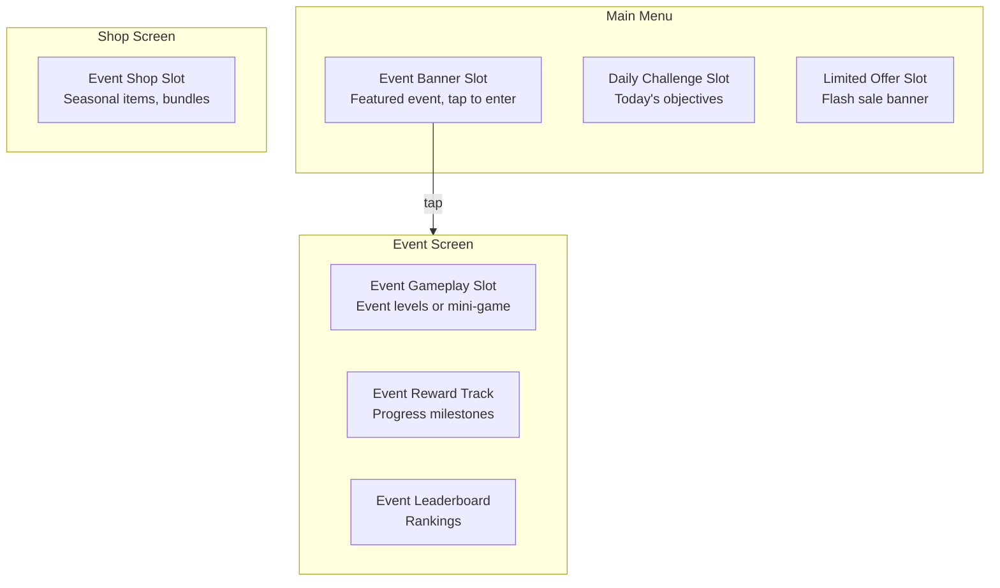
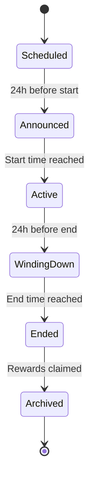

# Concept: LiveOps

LiveOps (Live Operations) is the practice of delivering time-limited content, events, and updates to a live game to sustain engagement and revenue after launch.

## Why This Matters

A mobile game without LiveOps has a fixed content ceiling. Players complete all levels, exhaust all content, and churn. LiveOps extends the game's lifetime by:
- Giving returning players new things to do (content freshness)
- Creating urgency through time-limited events (engagement spikes)
- Providing monetization opportunities through special offers (revenue events)
- Re-engaging churned players through win-back events (resurrection)

The LiveOps Agent generates event calendars, mini-games, and seasonal content that drops into predefined slots in the game.

## Event Types

### Seasonal Events
**Duration:** 2-4 weeks.
**Theme:** Tied to real-world seasons/holidays (Halloween, Chinese New Year, Summer).
**Content:** Themed levels, special rewards, limited-time cosmetics, themed UI overlay.
**Revenue:** Themed IAP bundles, seasonal pass.

### Challenge Events
**Duration:** 3-7 days.
**Theme:** Gameplay-focused (speed run, high score, perfect clear).
**Content:** Modified rules on existing levels, leaderboard, milestone rewards.
**Revenue:** Entry fee (premium currency), retry ads.

### Limited-Time Offers
**Duration:** 24-72 hours.
**Theme:** Value-focused (discounted bundles, bonus currency).
**Content:** Special shop items, flash sales.
**Revenue:** Direct IAP.

### Mini-Games
**Duration:** 1-7 days.
**Theme:** Alternate gameplay (different from core mechanic).
**Content:** Simple game within a game, own reward track.
**Revenue:** Energy/tickets for mini-game (premium currency).

### Daily Challenges
**Duration:** 24 hours (recurring).
**Theme:** Objective-based (collect 500 coins, complete 5 levels without dying).
**Content:** 3-5 objectives per day, reward for each + bonus for all.
**Revenue:** Indirect (drives session frequency).

## Event Slots

Events don't inject themselves randomly into the game. They fill predefined slots:

**Rule:** The shell defines these slots. The LiveOps Agent fills them. The mechanic doesn't know events exist — events sit alongside the mechanic, not inside it.

**Exception:** Challenge events that modify existing levels DO interact with the mechanic. The event slot for challenges includes modified difficulty parameters sent to the mechanic via the standard `setDifficultyParams` interface.

## Event Calendar

The LiveOps Agent generates a rolling event calendar:

| Week | Mon | Tue | Wed | Thu | Fri | Sat | Sun |
|------|-----|-----|-----|-----|-----|-----|-----|
| 1 | Daily | Daily | **Challenge Start** | Daily+Challenge | Daily+Challenge | Daily+Challenge | **Challenge End** |
| 2 | Daily | **Seasonal Start** | Daily+Seasonal | Daily+Seasonal | **Flash Sale** | Daily+Seasonal | Daily+Seasonal |
| 3 | Daily+Seasonal | Daily+Seasonal | **Mini-Game Start** | Daily+Seasonal+MiniGame | Daily+Seasonal+MiniGame | **Mini-Game End** | **Seasonal End** |
| 4 | Daily | Daily | Daily | **Challenge Start** | Daily+Challenge | Daily+Challenge | **Challenge End** |

**Rules:**
- Max 2 concurrent events (excluding daily challenges)
- Min 1 day gap between major events
- Seasonal events anchor the calendar (planned months ahead)
- Challenges and mini-games fill gaps
- Flash sales target weekends or event midpoints

## Event Lifecycle

**Announced:** Banner appears on main menu. "Coming tomorrow!" notification sent.
**Active:** Event slots filled. Players can participate.
**Winding Down:** "Last chance!" notification. Increased urgency messaging.
**Ended:** Event slots cleared. Unclaimed rewards available for 24 hours.
**Archived:** Event data archived for analytics. Assets returned to library.

## LiveOps ↔ Other Verticals

| Vertical | Interaction |
|----------|-------------|
| **Economy** | Events have reward budgets approved by Economy Agent. Event rewards are faucets. |
| **Difficulty** | Challenge events send modified difficulty params to the mechanic. |
| **Monetization** | Event shops and seasonal IAP are Monetization decisions using LiveOps timing. |
| **Analytics** | Event participation, completion, and revenue are tracked events. |
| **AB Testing** | Event reward amounts, durations, and types are testable. |
| **Assets** | Seasonal events require themed art, sourced by Asset Agent. |

## Related Documents

- [LiveOps Spec](../Verticals/06_LiveOps/Spec.md) — Full vertical specification
- [Event Definition Template](../Templates/EventDefinition_Template.md) — Standard event format
- [Economy Spec](../Verticals/04_Economy/Spec.md) — Reward budgets
- [Metrics: LiveOps](MetricsDictionary.md#liveops-metrics) — Event KPIs
- [Glossary: LiveOps, Event](Glossary.md#liveops)
