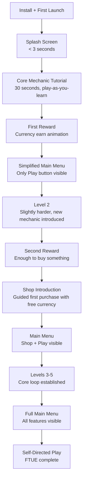

# Concept: Onboarding (FTUE)

First-Time User Experience (FTUE) is the sequence of screens and interactions a new player encounters from install to self-directed play. It's the single biggest lever for D1 retention.

## Why This Matters

A player who doesn't understand the game in the first 60 seconds will uninstall. Mobile players have zero patience and infinite alternatives. The FTUE must:
- Teach the core mechanic in under 30 seconds
- Deliver a reward in under 60 seconds (dopamine hit)
- Progressively reveal complexity over the first 3-5 sessions
- Never block play with forced tutorials

**Industry data:** Games with strong FTUE have 10-15% higher D1 retention than games that dump players into a full UI.

## FTUE Flow

## Progressive Disclosure

Features are revealed in waves, not all at once:

| Session | Features Visible | Features Hidden |
|---------|-----------------|-----------------|
| **First launch** | Play button only | Shop, Events, Settings, Currency details |
| **After level 1** | Play + Currency bar | Shop, Events, Settings |
| **After level 2** | Play + Currency + Shop | Events, Settings |
| **After level 5** | Play + Currency + Shop + Settings | Events (until first event) |
| **After first event** | Everything | Nothing |

**Rule:** Each reveal is accompanied by a subtle highlight animation (pulsing glow, arrow indicator) that draws attention without blocking interaction.

## Tutorial Principles

### 1. Play-As-You-Learn
Don't pause gameplay to show text boxes. Overlay instructions on live gameplay.
- **Good:** Arrow pointing at obstacle during live run, "Swipe up to jump!"
- **Bad:** Modal dialog: "Welcome to Runner Game! Tap OK to learn about jumping."

### 2. Immediate Reward
The first action the player takes must produce a visible, positive result.
- **Good:** First tap/swipe produces coin burst + score popup
- **Bad:** First action is a settings screen or account creation

### 3. Failure is Okay
Let the player fail in level 1, but make failure painless (instant retry, no currency cost, no ad).
- **Good:** Player crashes, "Try again!" button appears immediately
- **Bad:** Player crashes, interstitial ad, then retry

### 4. Skip is Always Available
Every tutorial step has a skip button. Experienced players (reinstalls, genre veterans) should never be trapped.
- **Good:** Small "Skip" text in corner of every tutorial step
- **Bad:** Forced 2-minute tutorial with no escape

### 5. Contextual, Not Front-Loaded
Teach features when the player first needs them, not at install.
- **Good:** Shop tutorial triggers when player has enough currency to buy something
- **Bad:** Shop tutorial on first launch when player has 0 currency

## FTUE Metrics

| Metric | Target | Alarm |
|--------|--------|-------|
| Tutorial completion rate | > 85% | < 70% (tutorial too long or confusing) |
| Time to first reward | < 60 seconds | > 120 seconds |
| Time to first play | < 10 seconds from splash | > 30 seconds |
| Skip rate | < 30% | > 50% (tutorial feels unnecessary to most) |
| D1 retention (tutorial completers) | > 45% | < 35% |
| D1 retention (tutorial skippers) | > 30% | < 20% |

## FTUE ↔ Other Verticals

| Vertical | FTUE Interaction |
|----------|-----------------|
| **Core Mechanics** | First level is a tutorial level with reduced difficulty and guided input |
| **Economy** | First reward is generous (3-5x normal) to demonstrate value |
| **Monetization** | No ads during FTUE (first 3 sessions). No IAP prompts until after shop intro. |
| **Difficulty** | Levels 1-3 are below the normal difficulty curve (tutorial curve) |
| **Analytics** | FTUE steps are individually tracked events for funnel analysis |
| **AB Testing** | FTUE flow is testable — tutorial length, reward amounts, reveal order |

## Anti-Patterns

| Anti-Pattern | Impact | Fix |
|-------------|--------|-----|
| Forced account creation before play | 30-50% drop-off | Guest mode first, account creation later |
| Permission requests before value shown | 15-25% drop-off | Ask for notifications after first session, not first launch |
| Showing all UI immediately | Cognitive overload, higher churn | Progressive disclosure |
| Tutorial > 2 minutes | Impatience-driven uninstalls | Keep core tutorial < 30 seconds |
| No skip option | Frustrates experienced players | Always offer skip |
| Ads during FTUE | Signals low quality | No ads until session 3+ |

## Related Documents

- [UI Onboarding Spec](../Verticals/01_UI/Onboarding.md) — Concrete FTUE implementation
- [UI Spec](../Verticals/01_UI/Spec.md) — Shell screens and navigation
- [Metrics Dictionary](MetricsDictionary.md) — Retention and engagement metrics
- [Concepts: Shell](Concepts_Shell.md) — The UI frame that hosts FTUE
- [Glossary: FTUE](Glossary.md#ftue-first-time-user-experience)
