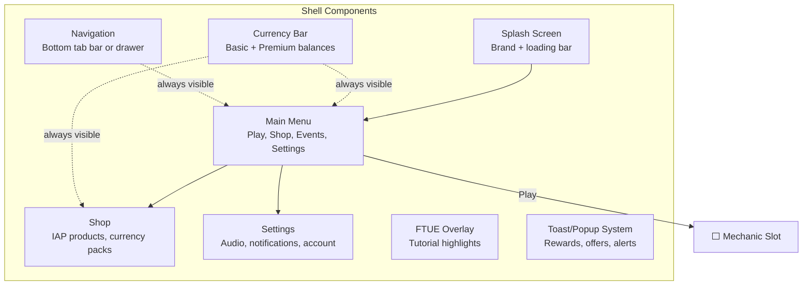

# Concept: Shell

The shell is the standardized UI frame that wraps every game. It handles everything outside of gameplay: loading, menus, navigation, currency display, shop, settings, and onboarding.

## Why This Matters

Building UI from scratch for each game is wasteful. The shell is 60-70% of a mobile game's screens — loading, main menu, shop, settings, event tabs, currency display — and these screens are structurally identical across genres. A runner and a merge game have different gameplay but the same main menu layout, the same shop flow, and the same currency bar.

By standardizing the shell, we:
- Reduce per-game development cost by 60-70%
- Ensure consistent UX across all games
- Enable the Monetization, Economy, and LiveOps agents to work with a known UI structure
- Allow theming to differentiate games visually without structural changes

## Shell Components

### Splash Screen
- App icon, studio logo, loading progress bar
- Loads game config, ad SDKs, analytics, cloud sync in background
- Target: visible within 1 second, complete within 3 seconds

### Main Menu
- Primary actions: Play, Shop, Events (if active), Settings
- Displays: player level, currency bar, event banners, daily reward claim
- Entry point for all navigation

### Currency Bar
- Persistent top bar showing basic and premium currency balances
- Tap on currency → navigate to shop
- Animated earn/spend effects (coins flying in/out)

### Navigation
- Bottom tab bar (iOS pattern) or hamburger drawer (Android pattern)
- Tabs: Home, Play, Shop, Events, Profile
- Adapts to platform conventions

### Shop
- Sections: Featured, Currency Packs, Bundles, Daily Deals
- Each section is a shop slot — Monetization Agent populates it
- IAP flow: tap → confirm → app store payment → receipt validation → deliver

### Settings
- Audio (music volume, SFX volume)
- Notifications (enable/disable, quiet hours)
- Account (link, restore purchases, delete data)
- Language (if localized)
- Privacy (GDPR consent, data controls)

### FTUE Overlay
- Semi-transparent highlights guiding new players
- Progressive: first session covers basics, subsequent sessions reveal advanced features
- Skippable: always has a "skip" option

### Toast/Popup System
- Non-blocking notifications: "Level complete! +50 coins"
- Blocking modals: "Watch ad for 2x rewards?" / "Special offer: $4.99 starter pack"
- Queue-based: popups don't stack, they queue

## Theming

The shell is structurally identical across games but visually distinct through theming:

| Element | What Changes | What Stays |
|---------|-------------|------------|
| Colors | Palette (primary, secondary, accent, background) | Layout positions |
| Typography | Font family, sizes | Hierarchy (H1, body, caption) |
| Icons | Currency icon, navigation icons | Icon positions and sizes |
| Animations | Transition style, particle effects | Transition timing |
| Sound | Menu music, button SFX | Event model (play on tap, etc.) |
| Imagery | Background art, character art | Screen structure |

**Rule:** Theming changes the look, never the structure. A themed shell has the same screens, the same navigation flow, and the same slot positions.

## Shell vs Mechanic Boundary

| Responsibility | Shell | Mechanic |
|---------------|-------|----------|
| Loading screen | Yes | No |
| Main menu | Yes | No |
| Currency bar | Yes | No (but emits currency events) |
| Shop | Yes | No |
| Core gameplay rendering | No | Yes |
| In-level HUD (score, timer) | No | Yes (using shell's theme) |
| Ad trigger (between levels) | Yes (listens to LevelComplete) | No (emits LevelComplete) |
| Pause/resume | Yes (system-level) | Yes (gameplay-level) |

## Related Documents

- [Slot Architecture](../Architecture/SlotArchitecture.md) — How the shell hosts slots
- [UI Spec](../Verticals/01_UI/Spec.md) — Full UI vertical specification
- [Onboarding](../Verticals/01_UI/Onboarding.md) — FTUE details
- [Concepts: Slot](Concepts_Slot.md) — Slot mechanism
- [Glossary: Shell](Glossary.md#shell)
