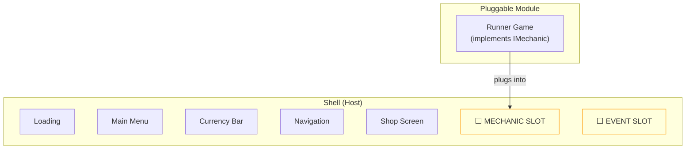

# Concept: Slot

A slot is an interface boundary where a module plugs into a host framework. The host defines expectations; the module fulfills them. Neither knows the other's internals.

## Why This Matters

The slot is what makes the AI Game Engine modular. Without slots, every game is a monolith. With slots, we build the shell once and plug in 10+ different mechanics, any number of LiveOps events, and configurable monetization — all without changing the shell.

## Types of Slots

| Slot Type | Host | Module | Cardinality | Lifetime |
|-----------|------|--------|-------------|----------|
| **Mechanic** | Shell (gameplay area) | Runner, Merge, PVP, Puzzle | Exactly 1 | Permanent (game identity) |
| **Event** | Shell (event areas) | Seasonal challenge, mini-game | 0-3 concurrent | Temporary (days to weeks) |
| **Ad** | Shell + Gameplay (trigger points) | Interstitial, Rewarded, Banner | Multiple | Per-impression |
| **Shop** | Shop screen (product areas) | IAP products, currency packs | Dynamic | Configured per update |

## The Composition Model

**Key insight:** The slot is empty. It's a placeholder with a contract. The shell renders a blank area and says "whoever fills this must emit these events and accept these inputs." The mechanic fills the area and says "I emit these events and accept these inputs."

## What Makes a Good Slot

1. **Narrow interface.** The fewer methods/events in the contract, the more modules can implement it.
2. **Event-based communication.** Modules publish events; hosts subscribe. No direct method calls across the boundary.
3. **No shared state.** The module owns its internal state. The host owns its UI state. They sync through events.
4. **Lifecycle-aware.** Slots have clear init → start → pause → resume → dispose phases.
5. **Theme-consuming.** Modules receive the host's theme and render consistently.

## Common Mistakes

| Anti-Pattern | Why It's Wrong | Correct Approach |
|-------------|---------------|-----------------|
| Module calls host methods directly | Creates tight coupling | Module publishes events; host listens |
| Host reaches into module state | Breaks encapsulation | Host reads state through getter interface |
| Module renders outside its slot area | Breaks layout consistency | Module renders only within its allocated rect |
| Slot interface has 50+ methods | Too specific, limits reuse | Keep to < 15 methods/events |
| Module ignores theme | Visual inconsistency | Module applies provided theme to all UI |

## Slot vs Plugin vs Inheritance

| Mechanism | Coupling | Runtime | Use Case |
|-----------|---------|---------|----------|
| **Slot** | Interface contract only | Compiled in | AI Game Engine modules |
| **Plugin** | Dynamic loading, loose contract | Runtime-loaded | Extensible IDEs, CMS |
| **Inheritance** | Shares implementation | Compiled in | Framework base classes |

Slots are specifically chosen over plugins (no dynamic loading overhead on mobile) and inheritance (no base class pollution, easier to swap).

## Related Documents

- [Slot Architecture](../Architecture/SlotArchitecture.md) — Full technical spec with pseudocode
- [Concepts: Shell](Concepts_Shell.md) — The host that contains slots
- [Core Mechanics Interfaces](../Verticals/02_CoreMechanics/Interfaces.md) — IMechanic contract
- [Glossary: Slot](Glossary.md#slot)
