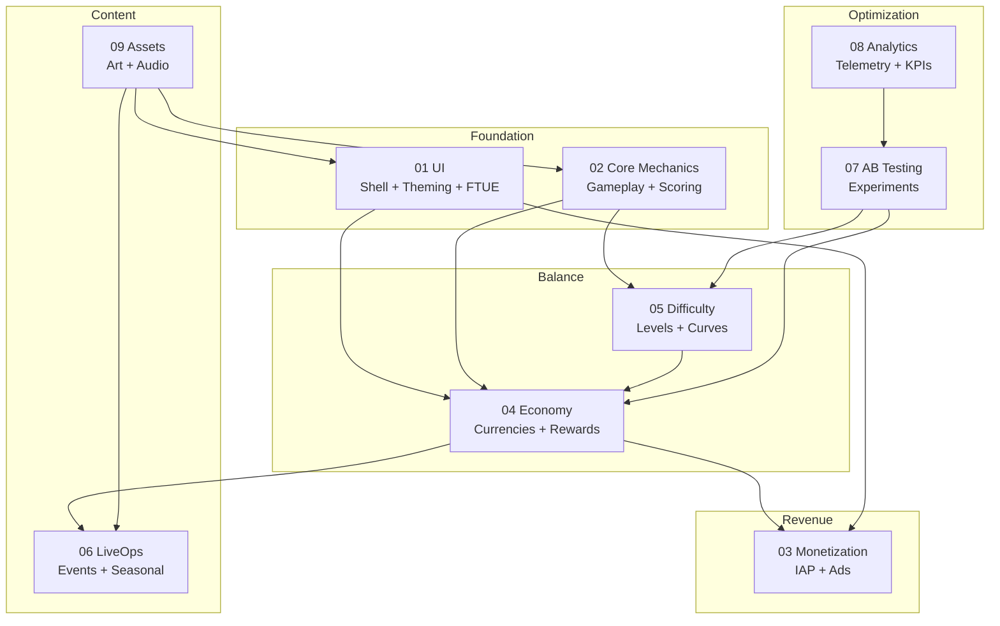

# Concept: Vertical

A vertical is a domain of responsibility owned by one AI agent. It has defined scope, inputs, outputs, and boundaries.

## Why This Matters

The AI Game Engine decomposes game creation into 9 verticals so each AI agent has a bounded problem to solve. Without vertical decomposition, a single agent would need to simultaneously reason about UI layout, economy balance, difficulty curves, ad placement, and analytics — a scope too broad for reliable output.

Verticals are the organizational primitive of the entire system.

## The 9 Verticals

## Vertical Properties

Every vertical has:

| Property | Description |
|----------|-------------|
| **Scope** | What this vertical is responsible for |
| **Inputs** | Data artifacts it receives from upstream verticals |
| **Outputs** | Data artifacts it produces for downstream verticals |
| **Boundaries** | What this vertical explicitly does NOT do |
| **Agent** | The AI agent that owns this vertical |
| **Quality Criteria** | How to evaluate the agent's output |
| **Dependencies** | Which other verticals must complete first |

## Vertical vs Module vs Agent

| Concept | What It Is | Analogy |
|---------|-----------|---------|
| **Vertical** | A domain of responsibility | A department in a company |
| **Module** | A code artifact implementing the vertical | A product the department ships |
| **Agent** | The AI that does the work | An employee in the department |

A vertical is conceptual (it's the "economy" domain). A module is concrete (it's the economy configuration files). An agent is the AI that produces the module.

## Cross-Cutting Concerns

Some concerns span multiple verticals:

| Concern | Touches | Resolution |
|---------|---------|-----------|
| **Analytics events** | All verticals | Analytics Agent defines taxonomy; other agents emit events through it |
| **AB testability** | All verticals | AB Testing Agent defines experiment hooks; other agents expose parameters |
| **Theming** | UI, Mechanics, LiveOps, Assets | UI Agent owns theme; others consume it |
| **Compliance** | Monetization, Analytics, Economy | Monetization Agent owns compliance; others follow its constraints |
| **Performance** | All verticals | Performance budgets constrain all agents equally |

Cross-cutting concerns are handled through:
1. **SharedInterfaces.md** — Defines contracts that multiple verticals must implement
2. **Event model** — Verticals communicate through events, not direct calls
3. **Quality gates** — Pipeline validates cross-vertical consistency at handoff points

## Vertical Independence

Verticals should be as independent as possible:
- Each agent reads only its defined inputs (no peeking at other verticals' internals)
- Each agent writes only its defined outputs
- Changes to one vertical require updating SharedInterfaces only if the cross-vertical contract changes
- Verticals can be developed and tested in isolation using mock inputs

**The exception:** Economy ↔ Difficulty ↔ Monetization are tightly coupled. Their shared interfaces must be defined first (in `00_SharedInterfaces.md`) before any of them are specified.

## Related Documents

- [System Overview](../Architecture/SystemOverview.md) — How verticals fit together
- [Agent Orchestration](../Architecture/AgentOrchestration.md) — How agents coordinate
- [SharedInterfaces](../Verticals/00_SharedInterfaces.md) — Cross-vertical contracts
- [Concepts: Agent](Concepts_Agent.md) — The AI that owns a vertical
- [Glossary: Vertical](Glossary.md#vertical)
