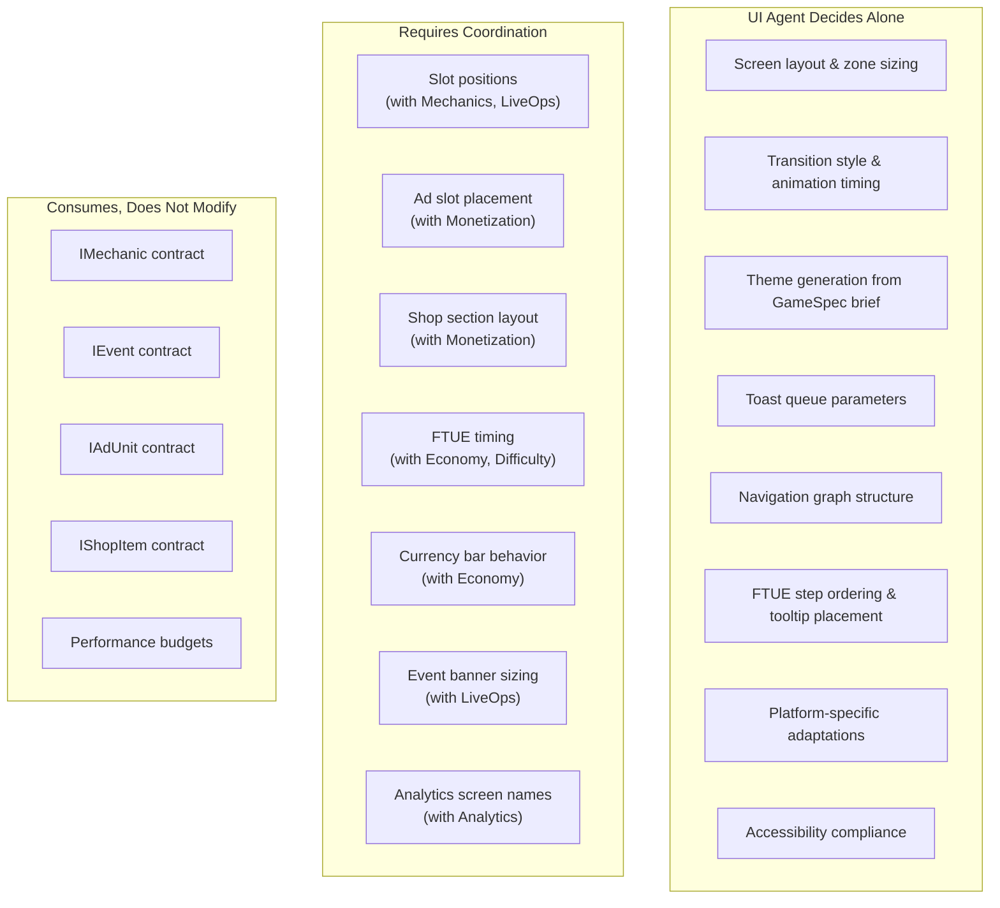
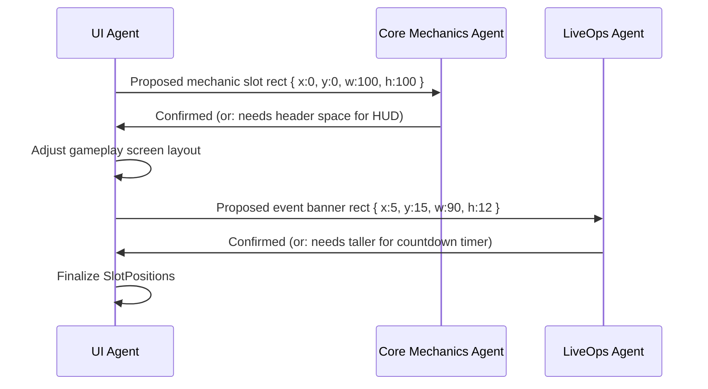
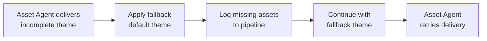

# UI Agent Responsibilities

What the UI Agent decides autonomously, what requires coordination with other verticals, quality criteria for its output, and failure modes with recovery strategies.

---

## Decision Authority

---

## Autonomous Decisions

These decisions are made solely by the UI Agent based on the GameSpec input and Asset Agent theme assets. No coordination required.

### Layout & Visual Design

| Decision | Input | Criteria |
|----------|-------|----------|
| Screen zone sizing | GameSpec.genre, device tiers | Gameplay area maximized; chrome minimized |
| Color palette application | Theme from Asset Agent | WCAG 2.1 AA contrast ratios (4.5:1 text, 3:1 large text) |
| Typography scale | Theme.typography + platform | Readable at arm's length; no text < 12pt logical |
| Icon placement | Platform conventions | iOS: center-aligned bottom tabs. Android: left-aligned drawer or bottom tabs |
| Safe area handling | Device tier data | Notch, home indicator, status bar fully respected |

### Animation & Transitions

| Decision | Constraints | Default |
|----------|-------------|---------|
| Screen transition style | < 300ms duration; must not drop frames | slide_left for forward, slide_right for back |
| Currency animation style | < 600ms for earn; < 400ms for spend | Coin fly-in from source position |
| Button press feedback | < 120ms response | Scale down 95% + haptic tap |
| Popup entry animation | < 400ms | Slide up + fade in |
| Toast animation | < 200ms entry; < 200ms exit | Slide down from top |

### Navigation Graph

The UI Agent constructs the navigation graph autonomously based on:
1. The standard screen set (splash, main_menu, gameplay, shop, events, settings, profile)
2. Additional screens derived from the GameSpec (e.g., level_select if the genre supports it)
3. Modal screens (level_complete, level_failed, daily_reward)

**Rule:** Every screen must be reachable from main_menu in <= 2 taps. The agent validates this constraint before output.

### FTUE Step Design

The UI Agent designs FTUE steps autonomously, including:
- Tooltip text and positioning
- Highlight target selection
- Dim background decisions
- Auto-advance timing
- Step ordering within the fixed progressive disclosure framework

**Constraint:** The progressive disclosure *schedule* (which features unlock at which level) is coordinated with Economy and Difficulty. The *presentation* of each disclosure step is autonomous.

---

## Coordinated Decisions

These decisions require input from or agreement with other verticals. The UI Agent proposes; the other agent validates.

### Slot Positions (with Core Mechanics, LiveOps)

| Coordination Point | UI Agent Proposes | Other Agent Validates |
|-------------------|-------------------|----------------------|
| Mechanic slot size | Full-screen rect | Core Mechanics confirms HUD fits |
| Event banner size | Standard banner rect | LiveOps confirms content fits |
| Event detail area | 80% height rect | LiveOps confirms layout needs |

### Ad Placement (with Monetization)

| Coordination Point | UI Agent Proposes | Monetization Validates |
|-------------------|-------------------|----------------------|
| Interstitial trigger points | Between levels, on death | Frequency caps respected |
| Rewarded ad prompt position | Level complete modal | Reward amount visible |
| Banner position | Bottom 8% of screen | Does not overlap gameplay |
| FTUE ad suppression window | First 3 sessions | Revenue impact acceptable |

### Shop Layout (with Monetization)

| Coordination Point | UI Agent Proposes | Monetization Validates |
|-------------------|-------------------|----------------------|
| Number of shop sections | 4 (Featured, Packs, Bundles, Deals) | Catalog fits sections |
| Items per section | 4-6 visible without scroll | Priority items are above fold |
| Featured section size | Top 40% of shop screen | High-value items get prominence |
| Price display format | "{icon} {amount}" or "${price}" | All price types renderable |

### FTUE Timing (with Economy, Difficulty)

| Coordination Point | UI Agent Proposes | Other Agent Validates |
|-------------------|-------------------|----------------------|
| First reward timing | After level 1 (< 60s) | Economy: reward amount is 3-5x normal |
| Shop unlock timing | After level 2 | Economy: player has enough currency to buy something |
| Difficulty during tutorial | Levels 1-3 marked as FTUE | Difficulty: tutorial curve applied (below normal) |
| Ad suppression window | Sessions 1-3 | Monetization: revenue impact acceptable |

### Analytics Screen Names (with Analytics)

The UI Agent assigns `analyticsName` to each screen. Analytics Agent validates that:
- Names follow snake_case convention
- Names match the `StandardEvents.screen_view.screen_name` taxonomy
- No naming collisions exist

---

## Quality Criteria

The UI Agent's output (`ShellConfig`) is validated against these quality gates before handoff to downstream agents.

### Structural Quality

| Criterion | Validation Method | Pass Threshold |
|-----------|------------------|----------------|
| All standard screens present | Schema check against required set | 9/9 screens |
| Navigation graph is connected | BFS from main_menu | All screens reachable |
| Navigation graph has no dead ends | Every non-root screen has a back path | 100% |
| All slot positions have valid rects | Rect within 0-100 bounds, no overlaps | 100% |
| FTUE covers levels 1-5 | Step count and level coverage check | >= 5 steps |

### Visual Quality

| Criterion | Validation Method | Pass Threshold |
|-----------|------------------|----------------|
| Text contrast ratios | WCAG 2.1 AA automated check | All text >= 4.5:1 |
| Tap target sizes | Minimum dimension check | All targets >= 44x44 pt |
| No overlapping interactive elements | Collision detection on tap targets | 0 overlaps |
| Theme completeness | All 8 palette colors, 4 font configs, 14+ icons | 100% |
| Animation timings within budget | Comparison against PerformanceBudgets | 100% |

### Behavioral Quality

| Criterion | Validation Method | Pass Threshold |
|-----------|------------------|----------------|
| Toast queue handles rapid fire | Simulate 20 toasts in 1 second | No stacking, queue < 10 |
| FTUE skip works from any step | Simulate skip at each step | All steps skippable |
| Deep links resolve correctly | Test all DeepLinkRoute patterns | 100% resolution |
| Back navigation never crashes | Walk all back edges | No null destinations |
| Modal dismissal returns to correct screen | Test dismiss from every modal | 100% correct |

---

## Failure Modes and Recovery

### Failure Mode 1: Theme Assets Missing

| Aspect | Detail |
|--------|--------|
| Detection | Theme validation fails: missing palette colors, fonts, or icons |
| Impact | Visual inconsistency; game looks generic |
| Recovery | Apply built-in default theme (neutral gray palette, system fonts) |
| Escalation | Pipeline flags Asset Agent for re-delivery |

### Failure Mode 2: Navigation Graph Disconnected

| Aspect | Detail |
|--------|--------|
| Detection | BFS from main_menu does not reach all registered screens |
| Impact | Player cannot access some screens |
| Recovery | Auto-add edges from main_menu to unreachable screens with default transition |
| Prevention | Graph validation runs before output; agent retries if disconnected |

### Failure Mode 3: Slot Position Conflict

| Aspect | Detail |
|--------|--------|
| Detection | Two slots overlap by > 10% area on the same screen |
| Impact | Visual glitch; tap targets ambiguous |
| Recovery | Resize smaller slot to eliminate overlap; log adjustment |
| Prevention | Collision detection during slot registration |

### Failure Mode 4: FTUE Step Unreachable

| Aspect | Detail |
|--------|--------|
| Detection | An FTUE step references a screen or element that does not exist |
| Impact | FTUE breaks at that step; player is stuck or auto-skipped |
| Recovery | Skip the broken step; log error; continue FTUE from next valid step |
| Prevention | FTUE steps validated against screen registry before output |

### Failure Mode 5: Performance Budget Exceeded

| Aspect | Detail |
|--------|--------|
| Detection | Transition duration > 16ms frame budget; UI memory > 30 MB |
| Impact | Dropped frames during transitions; potential OS kill on low-end devices |
| Recovery | Reduce animation complexity (fewer particles, simpler easing); compress theme assets |
| Prevention | Performance profiling on target device tier before output |

### Failure Mode 6: Toast Queue Overflow

| Aspect | Detail |
|--------|--------|
| Detection | Queue depth exceeds maxQueueDepth (default 10) |
| Impact | Oldest non-priority items are silently dropped |
| Recovery | Drop lowest-priority items first; log dropped toast count |
| Prevention | Rate-limit toast producers; increase minIntervalMs if overflow is frequent |

---

## Agent Boundaries

### The UI Agent Does NOT:

| Responsibility | Actual Owner |
|---------------|-------------|
| Decide reward amounts shown in celebrations | Economy Agent (04) |
| Decide which ad to show or ad frequency | Monetization Agent (03) |
| Decide shop item pricing or catalog | Monetization Agent (03) |
| Decide event content or schedule | LiveOps Agent (06) |
| Decide difficulty of tutorial levels | Difficulty Agent (05) |
| Create art assets or audio | Asset Agent (09) |
| Define analytics event taxonomy | Analytics Agent (08) |
| Run AB test experiments | AB Testing Agent (07) |

### The UI Agent DOES:

| Responsibility | Details |
|---------------|---------|
| Define screen structure and layout | All screen definitions, zones, slot positions |
| Generate the navigation graph | All edges, triggers, deep links |
| Generate the theme specification | Palette, typography, icons, animation timings |
| Design the FTUE presentation | Step ordering, tooltips, highlights, progressive disclosure |
| Configure the toast/popup system | Queue parameters, animation, positioning |
| Ensure accessibility compliance | Contrast, tap targets, screen reader labels |
| Ensure performance compliance | Frame budgets, memory budgets, transition timings |

---

## Related Documents

- [Spec](./Spec.md) -- Vertical scope, inputs, outputs, constraints
- [Interfaces](./Interfaces.md) -- Shell APIs consumed by other verticals
- [DataModels](./DataModels.md) -- ShellConfig and sub-schema definitions
- [Onboarding](./Onboarding.md) -- FTUE specification
- [SharedInterfaces](../00_SharedInterfaces.md) -- Cross-vertical contracts
- [SlotArchitecture](../../Architecture/SlotArchitecture.md) -- Slot composition model
- [PerformanceBudgets](../../Architecture/PerformanceBudgets.md) -- Frame and memory budgets
- [SystemOverview](../../Architecture/SystemOverview.md) -- Agent orchestration context
- [Concepts: Shell](../../SemanticDictionary/Concepts_Shell.md) -- Shell concept
- [Concepts: Vertical](../../SemanticDictionary/Concepts_Vertical.md) -- Vertical concept
