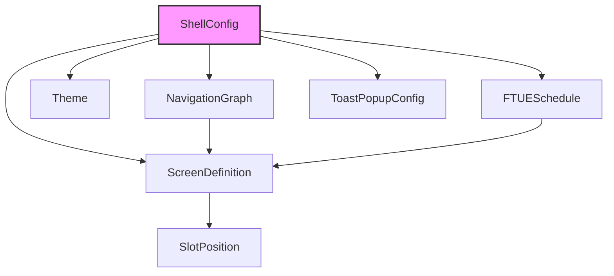
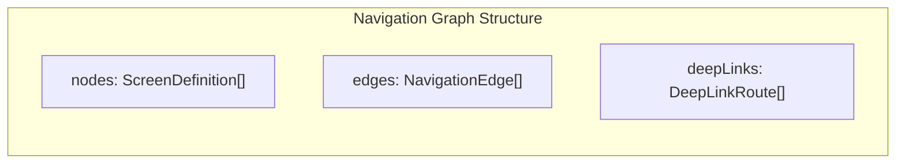

# UI Shell Data Models

Schemas for all data artifacts produced and consumed by the UI vertical. The primary output artifact is `ShellConfig` -- the complete description of a game's shell that downstream agents consume.

> All types reference shared types from [SharedInterfaces](../00_SharedInterfaces.md): `Theme`, `AssetRef`, `CurrencyType`, `CurrencyAmount`, `RewardBundle`, `GameEvent`.

---

## Schema Dependency Graph



---

## ShellConfig

The root output artifact of the UI Agent. Contains everything needed to construct and run the game shell.

```typescript
interface ShellConfig {
  /** Unique config version for cache invalidation */
  version: string;

  /** Game identity */
  gameId: string;
  gameName: string;

  /** Complete screen definitions */
  screens: ScreenDefinition[];

  /** Navigation graph linking screens */
  navigation: NavigationGraph;

  /** Visual theme */
  theme: Theme;

  /** Onboarding / progressive disclosure schedule */
  ftue: FTUESchedule;

  /** Toast and popup system configuration */
  toastConfig: ToastSystemConfig;

  /** Platform-specific overrides */
  platformOverrides: PlatformOverrides;

  /** Metadata */
  generatedAt: ISO8601;
  generatedBy: 'ui_agent';
  pipelineRunId: string;
}
```

### Validation Rules

| Field | Rule |
|-------|------|
| `screens` | Must contain at least: splash, main_menu, gameplay, shop, settings |
| `navigation` | Every screen must be reachable from main_menu within 2 taps |
| `theme` | All 8 palette colors must have >= 4.5:1 contrast ratio against background |
| `ftue` | Must define steps covering levels 1 through 5 |
| `version` | Semantic versioning (e.g., "1.0.0") |

---

## ScreenDefinition

A single screen in the shell. Each screen has a layout, slot positions, overlay configuration, and transition rules.

```typescript
interface ScreenDefinition {
  /** Unique screen identifier */
  id: string;

  /** Human-readable name */
  name: string;

  /** Screen behavior type */
  type: 'standard' | 'modal' | 'overlay' | 'fullscreen';

  /** Analytics event name for screen_view */
  analyticsName: string;

  /** Which persistent overlays are visible on this screen */
  persistentOverlays: PersistentOverlay[];

  /** Slot positions hosted by this screen */
  slots: SlotPosition[];

  /** Entry transition animation */
  transitionIn: TransitionConfig;

  /** Exit transition animation */
  transitionOut: TransitionConfig;

  /** FTUE unlock condition (omit for always-visible screens) */
  unlockCondition?: UnlockCondition;

  /** Layout zones within the screen */
  layout: ScreenLayout;

  /** Background asset */
  background?: AssetRef;

  /** Whether the system back button / swipe-back is enabled */
  backEnabled: boolean;
}

type PersistentOverlay = 'currencyBar' | 'navBar' | 'toast';

interface ScreenLayout {
  /** Safe area insets (notch, status bar, home indicator) */
  safeArea: { top: number; bottom: number; left: number; right: number };

  /** Named layout zones within the screen */
  zones: LayoutZone[];
}

interface LayoutZone {
  id: string;
  rect: Rect;
  purpose: 'content' | 'slot' | 'header' | 'footer' | 'sidebar';
}

interface Rect {
  /** All values are percentages of screen dimensions (0-100) */
  x: number;
  y: number;
  width: number;
  height: number;
}
```

### Standard Screens

Every game shell must include these screens:

| Screen ID | Name | Type | Overlays | Slots |
|-----------|------|------|----------|-------|
| `splash` | Splash Screen | fullscreen | none | none |
| `main_menu` | Main Menu | standard | currencyBar, navBar, toast | event (banner) |
| `gameplay` | Gameplay | fullscreen | currencyBar (collapsed) | mechanic |
| `level_complete` | Level Complete | modal | currencyBar | ad (rewarded) |
| `level_failed` | Level Failed | modal | currencyBar | ad (rewarded) |
| `shop` | Shop | standard | currencyBar, navBar, toast | shop (N sections) |
| `events` | Events | standard | currencyBar, navBar, toast | event (detail) |
| `settings` | Settings | standard | navBar | none |
| `profile` | Profile | standard | currencyBar, navBar | none |

---

## SlotPosition

Defines where a slot is placed within a screen. References the slot types from [SlotArchitecture](../../Architecture/SlotArchitecture.md).

```typescript
interface SlotPosition {
  /** Unique slot identifier */
  slotId: string;

  /** What type of module this slot accepts */
  slotType: 'mechanic' | 'event' | 'ad' | 'shop';

  /** Position and size within the host screen (percentage-based) */
  rect: Rect;

  /** Rendering order. Higher = rendered on top. */
  zIndex: number;

  /** Which screen this slot belongs to */
  hostScreenId: string;

  /** Whether this slot is visible during FTUE (before full unlock) */
  visibleDuringFTUE: boolean;

  /** Max number of modules that can occupy this slot simultaneously */
  maxOccupants: number;
}
```

### Slot Position Defaults

| Slot Type | Typical Rect | zIndex | Max Occupants |
|-----------|-------------|--------|---------------|
| mechanic | `{ x: 0, y: 0, width: 100, height: 100 }` | 0 | 1 |
| event (banner) | `{ x: 5, y: 15, width: 90, height: 12 }` | 10 | 1 |
| event (detail) | `{ x: 0, y: 10, width: 100, height: 80 }` | 0 | 3 |
| ad (banner) | `{ x: 0, y: 92, width: 100, height: 8 }` | 20 | 1 |
| ad (rewarded) | `{ x: 10, y: 40, width: 80, height: 20 }` | 30 | 1 |
| shop (section) | `{ x: 0, y: 0, width: 100, height: 100 }` | 0 | Dynamic |

---

## NavigationGraph

Defines all valid screen-to-screen transitions. The graph is directed -- each edge has a source, target, and trigger.



```typescript
interface NavigationGraph {
  /** All screens in the graph (references ScreenDefinition.id) */
  nodes: string[];

  /** Directed edges between screens */
  edges: NavigationEdge[];

  /** Deep-link routing table */
  deepLinks: DeepLinkRoute[];

  /** The root screen (always main_menu) */
  rootScreenId: string;

  /** Maximum navigation stack depth before auto-collapsing */
  maxStackDepth: number;
}

interface NavigationEdge {
  /** Source screen ID */
  from: string;

  /** Target screen ID */
  to: string;

  /** What triggers this transition */
  trigger: NavigationTrigger;

  /** Transition animation override (uses screen default if omitted) */
  transition?: TransitionConfig;

  /** Whether this edge is available during FTUE */
  availableDuringFTUE: boolean;

  /** Analytics label for this transition */
  analyticsLabel: string;
}

type NavigationTrigger =
  | { type: 'button_tap'; buttonId: string }
  | { type: 'event'; eventName: string }
  | { type: 'deep_link'; pattern: string }
  | { type: 'back' }
  | { type: 'auto'; conditionMet: string };

interface TransitionConfig {
  type: 'slide_left' | 'slide_right' | 'slide_up' | 'slide_down' | 'fade' | 'none';
  durationMs: number;
  easing: 'ease_in' | 'ease_out' | 'ease_in_out' | 'linear';
}

interface DeepLinkRoute {
  /** URI pattern with placeholders, e.g., "game://shop/{section}" */
  pattern: string;

  /** Target screen ID */
  screenId: string;

  /** Parameter extraction rules */
  params: Record<string, 'string' | 'number'>;
}
```

### Navigation Edge Inventory

| From | To | Trigger | FTUE Available |
|------|----|---------|----------------|
| splash | main_menu | auto (load complete) | Yes |
| main_menu | gameplay | button_tap (play_button) | Yes |
| main_menu | shop | button_tap (shop_tab) | After level 2 |
| main_menu | events | button_tap (events_tab) | After level 5 |
| main_menu | settings | button_tap (settings_tab) | After level 5 |
| main_menu | profile | button_tap (profile_tab) | After level 5 |
| gameplay | level_complete | event (onLevelComplete) | Yes |
| gameplay | level_failed | event (onPlayerDied) | Yes |
| gameplay | main_menu | button_tap (exit_button) | Yes |
| level_complete | gameplay | button_tap (next_level) | Yes |
| level_complete | main_menu | button_tap (home_button) | Yes |
| level_complete | shop | button_tap (offer_tap) | After level 2 |
| level_failed | gameplay | button_tap (retry_button) | Yes |
| level_failed | main_menu | button_tap (home_button) | Yes |
| shop | main_menu | back | After level 2 |
| events | main_menu | back | After level 5 |
| settings | main_menu | back | After level 5 |
| profile | main_menu | back | After level 5 |

---

## Theme

The theme schema is defined in [SharedInterfaces](../00_SharedInterfaces.md#theme-contract). Reproduced here with UI-specific annotations:

```typescript
interface Theme {
  id: string;
  name: string;

  palette: {
    primary: string;           // Main brand color. Buttons, headers.
    secondary: string;         // Supporting color. Secondary buttons, accents.
    accent: string;            // Highlight color. Notifications, badges, calls-to-action.
    background: string;        // Screen background. Must contrast with text >= 4.5:1.
    surface: string;           // Card/panel background. Slightly lighter than background.
    error: string;             // Error states, destructive actions.
    text: string;              // Primary text. Must contrast with background >= 4.5:1.
    textSecondary: string;     // Secondary text, captions. Must contrast >= 3:1.
  };

  typography: {
    heading: FontConfig;       // Screen titles, section headers
    body: FontConfig;          // Description text, dialog bodies
    caption: FontConfig;       // Timestamps, labels, secondary info
    number: FontConfig;        // Scores, currency amounts, timers
  };

  icons: Record<string, AssetRef>;  // Standard icon set (see table below)

  animations: {
    screenTransitionMs: number;    // 200-300ms recommended
    currencyEarnMs: number;        // 400-600ms for coin fly-in
    buttonPressMs: number;         // 80-120ms for tap feedback
    popupEntryMs: number;          // 200-400ms for modal entry
  };
}

interface FontConfig {
  fontFamily: string;
  fontSize: number;            // In logical points (not pixels)
  fontWeight: number;          // 100-900
  lineHeight: number;          // Multiplier (e.g., 1.4)
}
```

### Standard Icon Set

The `icons` record must include at minimum:

| Key | Purpose | Used In |
|-----|---------|---------|
| `currency_basic` | Basic currency icon | Currency bar, shop, rewards |
| `currency_premium` | Premium currency icon | Currency bar, shop, rewards |
| `nav_home` | Home tab icon | Navigation bar |
| `nav_play` | Play tab icon | Navigation bar |
| `nav_shop` | Shop tab icon | Navigation bar |
| `nav_events` | Events tab icon | Navigation bar |
| `nav_profile` | Profile tab icon | Navigation bar |
| `settings_gear` | Settings icon | Settings button |
| `back_arrow` | Back navigation | Screen headers |
| `close_x` | Close / dismiss | Modals, overlays |
| `lock` | Locked feature | FTUE-locked screens |
| `star_empty` | Empty star (level rating) | Level complete |
| `star_filled` | Filled star (level rating) | Level complete |
| `ad_play` | Rewarded ad indicator | Ad prompts |

---

## FTUESchedule

Defines the complete onboarding flow. See [Onboarding.md](./Onboarding.md) for the full specification.

```typescript
interface FTUESchedule {
  /** Ordered list of FTUE steps */
  steps: FTUEStep[];

  /** Progressive disclosure rules */
  disclosureRules: DisclosureRule[];

  /** Whether skip is available on every step */
  skipAlwaysAvailable: boolean;

  /** Maximum total FTUE duration target */
  maxTotalDurationSeconds: number;
}

interface FTUEStep {
  /** Unique step identifier */
  id: string;

  /** Human-readable step name */
  name: string;

  /** Step ordering index (0-based) */
  index: number;

  /** Which screen this step occurs on */
  screenId: string;

  /** Type of tutorial interaction */
  type: 'highlight' | 'tooltip' | 'guided_action' | 'play_level' | 'reward' | 'reveal';

  /** What the player must do to complete this step */
  completionCondition: FTUECompletionCondition;

  /** UI element to highlight (if type is highlight or tooltip) */
  highlightTarget?: string;

  /** Instruction text shown to the player */
  instructionText: string;

  /** Position of the instruction tooltip */
  tooltipPosition: 'above' | 'below' | 'left' | 'right' | 'center';

  /** Whether the rest of the screen is dimmed */
  dimBackground: boolean;

  /** Auto-advance after this many seconds (0 = manual only) */
  autoAdvanceSeconds: number;

  /** Analytics event name for this step */
  analyticsEventName: string;
}

type FTUECompletionCondition =
  | { type: 'tap_target'; targetId: string }
  | { type: 'level_complete'; levelId: string }
  | { type: 'currency_earned'; minAmount: number }
  | { type: 'navigation'; targetScreenId: string }
  | { type: 'auto'; delaySeconds: number };

interface DisclosureRule {
  /** Feature being gated */
  featureId: string;

  /** Human-readable feature name */
  featureName: string;

  /** When this feature becomes visible */
  unlockTrigger: UnlockTrigger;

  /** Animation played when the feature is revealed */
  revealAnimation: 'pulse' | 'glow' | 'slide_in' | 'bounce' | 'none';
}

type UnlockTrigger =
  | { type: 'level_reached'; level: number }
  | { type: 'ftue_step_complete'; stepId: string }
  | { type: 'session_count'; count: number }
  | { type: 'days_since_install'; days: number };
```

### Default Disclosure Rules

| Feature | Unlock Trigger | Reveal Animation |
|---------|---------------|-----------------|
| Play button | Always visible | none |
| Currency bar | After level 1 complete | slide_in |
| Shop tab | After level 2 complete | pulse |
| Settings tab | After level 5 complete | glow |
| Events tab | After first event activates | bounce |
| Profile tab | After level 5 complete | glow |
| Daily reward | After session 2 | pulse |
| Ad reward multiplier | After level 3 complete | glow |

---

## ToastSystemConfig

Global configuration for the toast and popup queue.

```typescript
interface ToastSystemConfig {
  /** Maximum number of toasts in the queue */
  maxQueueDepth: number;

  /** Minimum time between consecutive toasts (ms) */
  minIntervalMs: number;

  /** Default toast display duration (ms) */
  defaultDurationMs: number;

  /** Whether toasts are paused during screen transitions */
  pauseDuringTransitions: boolean;

  /** Whether monetization modals are suppressed during FTUE */
  suppressMonetizationDuringFTUE: boolean;

  /** Toast positioning */
  toastPosition: 'top' | 'bottom';

  /** Toast entry/exit animation */
  toastAnimation: TransitionConfig;

  /** Modal backdrop opacity (0.0 - 1.0) */
  modalBackdropOpacity: number;

  /** Default modal entry animation */
  modalAnimation: TransitionConfig;

  /** Reward celebration config */
  rewardCelebration: RewardCelebrationConfig;
}

interface RewardCelebrationConfig {
  /** Duration of the full celebration sequence (ms) */
  totalDurationMs: number;

  /** Whether to show particle effects */
  particlesEnabled: boolean;

  /** Whether to animate individual items flying in */
  itemFlyInEnabled: boolean;

  /** Sound effect asset */
  sfx?: AssetRef;
}
```

### Default Toast Configuration

| Setting | Default Value |
|---------|--------------|
| maxQueueDepth | 10 |
| minIntervalMs | 2000 |
| defaultDurationMs | 3000 |
| pauseDuringTransitions | true |
| suppressMonetizationDuringFTUE | true |
| toastPosition | top |
| modalBackdropOpacity | 0.6 |
| rewardCelebration.totalDurationMs | 2500 |
| rewardCelebration.particlesEnabled | true |
| rewardCelebration.itemFlyInEnabled | true |

---

## PlatformOverrides

Platform-specific adjustments to the shell configuration.

```typescript
interface PlatformOverrides {
  ios: PlatformConfig;
  android: PlatformConfig;
}

interface PlatformConfig {
  /** Navigation style */
  navigationStyle: 'bottom_tabs' | 'drawer' | 'top_tabs';

  /** Safe area insets (notch, status bar, home indicator) */
  defaultSafeArea: { top: number; bottom: number; left: number; right: number };

  /** Whether to use platform-native haptic feedback */
  hapticsEnabled: boolean;

  /** Status bar style */
  statusBarStyle: 'light' | 'dark' | 'auto';

  /** Whether to respect system font size accessibility setting */
  respectSystemFontSize: boolean;
}
```

### Platform Defaults

| Setting | iOS | Android |
|---------|-----|---------|
| navigationStyle | bottom_tabs | bottom_tabs |
| defaultSafeArea.top | 47 | 24 |
| defaultSafeArea.bottom | 34 | 0 |
| hapticsEnabled | true | true |
| statusBarStyle | auto | auto |
| respectSystemFontSize | true | true |

---

## Schema Validation Summary

| Schema | Required Fields | Cardinality | References |
|--------|----------------|-------------|------------|
| ShellConfig | gameId, screens, navigation, theme, ftue | 1 per game | Root artifact |
| ScreenDefinition | id, name, type, analyticsName | 9+ (standard set) | ShellConfig.screens |
| SlotPosition | slotId, slotType, rect, hostScreenId | 1+ per game | ScreenDefinition.slots |
| NavigationGraph | nodes, edges, rootScreenId | 1 per ShellConfig | ShellConfig.navigation |
| NavigationEdge | from, to, trigger | 15+ (standard set) | NavigationGraph.edges |
| Theme | id, palette, typography, icons, animations | 1 per ShellConfig | SharedInterfaces |
| FTUESchedule | steps, disclosureRules | 1 per ShellConfig | ShellConfig.ftue |
| FTUEStep | id, screenId, type, completionCondition | 5+ steps | FTUESchedule.steps |
| ToastSystemConfig | maxQueueDepth, minIntervalMs | 1 per ShellConfig | ShellConfig.toastConfig |

---

## Related Documents

- [SharedInterfaces](../00_SharedInterfaces.md) -- Theme, AssetRef, CurrencyType, RewardBundle definitions
- [Spec](./Spec.md) -- UI vertical scope and output definitions
- [Interfaces](./Interfaces.md) -- Shell APIs that consume these models
- [AgentResponsibilities](./AgentResponsibilities.md) -- What the UI Agent populates vs what other agents provide
- [Onboarding](./Onboarding.md) -- FTUE step details and progressive disclosure logic
- [SlotArchitecture](../../Architecture/SlotArchitecture.md) -- Slot type definitions and contracts
- [PerformanceBudgets](../../Architecture/PerformanceBudgets.md) -- Memory and timing constraints
- [Glossary](../../SemanticDictionary/Glossary.md) -- Term definitions
