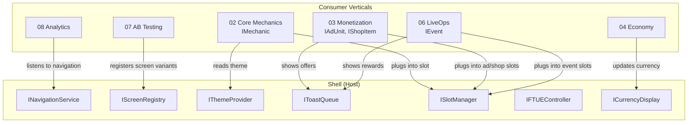
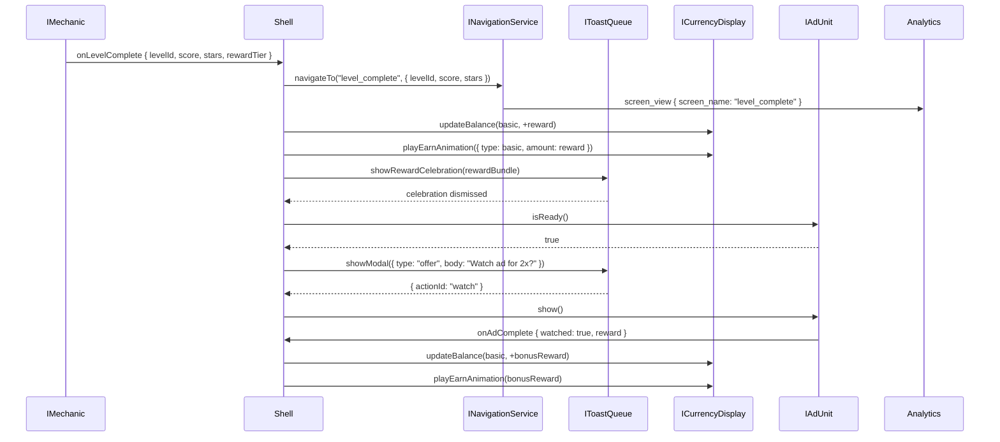

# UI Shell Interfaces

APIs and contracts that other verticals use to interact with the shell. The shell is the **host**; other verticals are **modules** that plug into it through slots and consume its services through these interfaces.

> All cross-vertical communication uses the `GameEvent<T>` pattern defined in [SharedInterfaces](../00_SharedInterfaces.md). No direct method calls across vertical boundaries.

---

## Interface Map



---

## INavigationService

Controls screen-to-screen transitions. All navigation flows through this service -- no screen navigates directly to another.

```typescript
interface INavigationService {
  /**
   * Navigate to a registered screen by ID.
   * Returns false if the screen is locked (FTUE gating).
   */
  navigateTo(screenId: string, params?: Record<string, unknown>): boolean;

  /**
   * Go back to the previous screen in the stack.
   * Returns false if at root (main menu).
   */
  goBack(): boolean;

  /**
   * Get the current active screen ID.
   */
  getCurrentScreen(): string;

  /**
   * Get the full navigation stack (for analytics breadcrumbs).
   */
  getNavigationStack(): readonly string[];

  /**
   * Check if a screen is currently accessible (not FTUE-locked).
   */
  isScreenUnlocked(screenId: string): boolean;

  /**
   * Deep-link entry: navigate to a screen from outside the app
   * (push notification, ad callback, store link).
   */
  handleDeepLink(uri: string): boolean;

  /** Events */
  readonly events: {
    /** Fired before transition begins. Cancelable. */
    onNavigationRequested: GameEvent<{
      from: string;
      to: string;
      params?: Record<string, unknown>;
    }>;
    /** Fired after transition completes. */
    onNavigationComplete: GameEvent<{
      from: string;
      to: string;
      durationMs: number;
    }>;
    /** Fired when a locked screen is tapped. */
    onLockedScreenTapped: GameEvent<{
      screenId: string;
      unlockCondition: string;
    }>;
  };
}
```

### Navigation Rules

| Rule | Description |
|------|-------------|
| Stack-based | Forward navigation pushes; back pops. Main menu is always the root. |
| FTUE gating | `isScreenUnlocked()` checks the FTUE schedule. Locked screens show a lock icon + tooltip. |
| Transition style | Determined by the navigation graph edge metadata (slide, fade, modal). |
| Deep-link resolution | URI is parsed into `screenId` + `params`. Unknown URIs navigate to main menu. |
| Analytics emission | Every `onNavigationComplete` triggers a `screen_view` analytics event automatically. |

---

## IScreenRegistry

Registers and manages screen definitions. Used at init time, not at runtime.

```typescript
interface IScreenRegistry {
  /**
   * Register a new screen definition.
   * Called during shell initialization.
   */
  registerScreen(definition: ScreenDefinition): void;

  /**
   * Get a registered screen by ID.
   */
  getScreen(screenId: string): ScreenDefinition | undefined;

  /**
   * Get all registered screens.
   */
  getAllScreens(): readonly ScreenDefinition[];

  /**
   * Register a screen variant for AB testing.
   * The variant replaces the original screen when the experiment is active.
   */
  registerVariant(
    screenId: string,
    variantId: string,
    overrides: Partial<ScreenDefinition>
  ): void;

  /**
   * Activate an AB test variant for a screen.
   */
  activateVariant(screenId: string, variantId: string): void;
}

interface ScreenDefinition {
  id: string;
  name: string;
  type: 'standard' | 'modal' | 'overlay' | 'fullscreen';
  persistentOverlays: ('currencyBar' | 'navBar' | 'toast')[];
  slots: SlotPosition[];
  unlockCondition?: UnlockCondition;
  analyticsName: string;     // snake_case name for screen_view events
  transitionIn: TransitionConfig;
  transitionOut: TransitionConfig;
}

interface SlotPosition {
  slotId: string;
  slotType: 'mechanic' | 'event' | 'ad' | 'shop';
  rect: { x: number; y: number; width: number; height: number };
  zIndex: number;
}

interface UnlockCondition {
  type: 'level_reached' | 'ftue_step_complete' | 'always';
  value: string | number;    // Level number or FTUE step ID
}

interface TransitionConfig {
  type: 'slide_left' | 'slide_right' | 'slide_up' | 'fade' | 'none';
  durationMs: number;        // Must be <= 300ms
  easing: 'ease_in' | 'ease_out' | 'ease_in_out' | 'linear';
}
```

---

## IThemeProvider

Provides the active theme to all consumers. The theme is immutable once set -- consumers read it, never mutate it.

```typescript
interface IThemeProvider {
  /**
   * Get the current active theme.
   * Guaranteed non-null after shell initialization.
   */
  getTheme(): Theme;

  /**
   * Apply a theme overlay (e.g., for a seasonal event).
   * Overlay merges on top of the base theme.
   * Returns a cleanup function to restore the base theme.
   */
  applyOverlay(overlay: Partial<Theme>): () => void;

  /**
   * Get a resolved color by semantic name.
   * Shortcut for getTheme().palette[name].
   */
  getColor(name: keyof Theme['palette']): string;

  /**
   * Get a resolved font config by role.
   */
  getFont(role: keyof Theme['typography']): FontConfig;

  /**
   * Get a standard icon asset reference.
   */
  getIcon(name: string): AssetRef | undefined;

  /** Events */
  readonly events: {
    /** Fired when a theme overlay is applied or removed. */
    onThemeChanged: GameEvent<{ theme: Theme; isOverlay: boolean }>;
  };
}
```

### Theme Contract

The `Theme` interface is defined in [SharedInterfaces](../00_SharedInterfaces.md#theme-contract). Key points:

- **Palette:** 8 semantic colors (primary, secondary, accent, background, surface, error, text, textSecondary)
- **Typography:** 4 font roles (heading, body, caption, number)
- **Icons:** Standard icon set as `Record<string, AssetRef>`
- **Animations:** 4 timing values (screenTransitionMs, currencyEarnMs, buttonPressMs, popupEntryMs)

---

## IToastQueue

Manages non-blocking notifications and blocking modals. Prevents popup spam through queuing.

```typescript
interface IToastQueue {
  /**
   * Show a non-blocking toast notification.
   * Auto-dismisses after durationMs.
   */
  showToast(config: ToastConfig): string;  // Returns toast ID

  /**
   * Show a blocking modal popup.
   * Returns a promise that resolves with the user's action.
   */
  showModal(config: ModalConfig): Promise<ModalResult>;

  /**
   * Show a reward celebration overlay.
   * Animated currency/item display.
   */
  showRewardCelebration(reward: RewardBundle): Promise<void>;

  /**
   * Dismiss a specific toast by ID.
   */
  dismissToast(toastId: string): void;

  /**
   * Clear the entire queue (e.g., on screen transition).
   */
  clearQueue(): void;

  /**
   * Get the current queue depth.
   */
  getQueueDepth(): number;

  /** Events */
  readonly events: {
    onToastShown: GameEvent<{ toastId: string; type: string }>;
    onToastDismissed: GameEvent<{ toastId: string; action?: string }>;
    onModalShown: GameEvent<{ modalId: string; type: string }>;
    onModalDismissed: GameEvent<{ modalId: string; action: string }>;
  };
}

interface ToastConfig {
  type: 'info' | 'success' | 'warning' | 'error' | 'reward';
  message: string;
  icon?: AssetRef;
  durationMs: number;         // 2000-5000ms typical
  position: 'top' | 'bottom';
  priority: number;            // Higher = shown first. Default 0.
}

interface ModalConfig {
  type: 'confirm' | 'offer' | 'reward' | 'error' | 'custom';
  title: string;
  body: string;
  image?: AssetRef;
  actions: ModalAction[];
  dismissable: boolean;        // Can tap outside to close?
  priority: number;
}

interface ModalAction {
  id: string;
  label: string;
  style: 'primary' | 'secondary' | 'destructive';
  closeOnTap: boolean;
}

interface ModalResult {
  modalId: string;
  actionId: string;            // Which button was tapped
  durationShownMs: number;     // How long the modal was visible
}
```

### Queue Rules

| Rule | Detail |
|------|--------|
| Max visible toasts | 1 at a time; others queue |
| Max queue depth | 10; oldest non-priority items are dropped |
| Modal priority | Modals always show before toasts |
| Rate limit | Min 2 seconds between consecutive toasts |
| Screen transition | Queue is paused during transitions, resumed after |
| FTUE suppression | Monetization modals (offers, ads) are suppressed during FTUE |

---

## ISlotManager

Manages slot registration and module assignment. Used by the shell internally and by agents that need to query slot availability.

```typescript
interface ISlotManager {
  /**
   * Register a slot position in the shell.
   */
  registerSlot(position: SlotPosition): void;

  /**
   * Assign a module to a slot.
   * The module must implement the contract for that slot type.
   */
  assignModule(slotId: string, module: IMechanic | IEvent | IAdUnit | IShopItem): void;

  /**
   * Remove a module from a slot (e.g., event ending).
   */
  removeModule(slotId: string): void;

  /**
   * Get all registered slots.
   */
  getSlots(): readonly SlotPosition[];

  /**
   * Get available (unoccupied) slots of a given type.
   */
  getAvailableSlots(type: SlotPosition['slotType']): readonly SlotPosition[];

  /** Events */
  readonly events: {
    onModuleAssigned: GameEvent<{ slotId: string; moduleType: string }>;
    onModuleRemoved: GameEvent<{ slotId: string }>;
  };
}
```

### Slot Type Contracts

Each slot type expects a specific interface from [SharedInterfaces](../00_SharedInterfaces.md):

| Slot Type | Required Interface | Reference |
|-----------|-------------------|-----------|
| `mechanic` | `IMechanic` | [SharedInterfaces: IMechanic](../00_SharedInterfaces.md#mechanic--shell-contract-imechanic) |
| `event` | `IEvent` | [SharedInterfaces: IEvent](../00_SharedInterfaces.md#liveops--shell-contract-ievent) |
| `ad` | `IAdUnit` | [SharedInterfaces: IAdUnit](../00_SharedInterfaces.md#monetization--shell-contract-iadunit-ishopitem) |
| `shop` | `IShopItem` | [SharedInterfaces: IShopItem](../00_SharedInterfaces.md#monetization--shell-contract-iadunit-ishopitem) |

---

## IFTUEController

Controls the onboarding overlay and progressive disclosure. See [Onboarding.md](./Onboarding.md) for the full FTUE specification.

```typescript
interface IFTUEController {
  /**
   * Check if the player is currently in FTUE.
   */
  isInFTUE(): boolean;

  /**
   * Get the current FTUE step.
   */
  getCurrentStep(): FTUEStep | undefined;

  /**
   * Advance to the next FTUE step.
   * Called by the shell when step completion conditions are met.
   */
  advanceStep(): void;

  /**
   * Skip the remaining FTUE entirely.
   */
  skipFTUE(): void;

  /**
   * Check if a feature is currently visible under progressive disclosure.
   */
  isFeatureVisible(featureId: string): boolean;

  /**
   * Get all features and their visibility status.
   */
  getDisclosureState(): Record<string, boolean>;

  /** Events */
  readonly events: {
    onStepStarted: GameEvent<{ stepId: string; stepIndex: number }>;
    onStepCompleted: GameEvent<{ stepId: string; stepIndex: number; skipped: boolean }>;
    onFTUEComplete: GameEvent<{ skipped: boolean; totalSteps: number; completedSteps: number }>;
    onFeatureUnlocked: GameEvent<{ featureId: string; trigger: string }>;
  };
}

/** See DataModels.md for FTUEStep definition */
```

---

## ICurrencyDisplay

Controls the persistent currency bar. The Economy Agent pushes balance updates; the shell animates them.

```typescript
interface ICurrencyDisplay {
  /**
   * Update the displayed balance for a currency type.
   * The display animates from current to new value.
   */
  updateBalance(type: CurrencyType, newBalance: number): void;

  /**
   * Play a currency earn animation (coins flying in).
   * Used after level rewards, ad rewards, purchases.
   */
  playEarnAnimation(amount: CurrencyAmount): void;

  /**
   * Play a currency spend animation (coins flying out).
   * Used after shop purchases.
   */
  playSpendAnimation(amount: CurrencyAmount): void;

  /**
   * Show the "insufficient funds" indicator on a currency type.
   * Pulsing red highlight + navigate-to-shop hint.
   */
  showInsufficientFunds(type: CurrencyType): void;

  /** Events */
  readonly events: {
    onCurrencyTapped: GameEvent<{ type: CurrencyType }>;  // Navigate to shop
    onAnimationComplete: GameEvent<{ type: CurrencyType; newBalance: number }>;
  };
}
```

---

## Event Flow: Level Complete Example

End-to-end event flow when a player completes a level, showing how interfaces interact:



---

## Cross-Vertical Interface Summary

| Interface | Primary Consumers | Purpose |
|-----------|-------------------|---------|
| `INavigationService` | Analytics, AB Testing | Screen flow tracking, variant routing |
| `IScreenRegistry` | AB Testing | Screen variant registration |
| `IThemeProvider` | Core Mechanics, LiveOps, Assets | Visual consistency |
| `IToastQueue` | Monetization, LiveOps, Economy | Notifications and offers |
| `ISlotManager` | Core Mechanics, Monetization, LiveOps | Module placement |
| `IFTUEController` | Difficulty, Economy, Monetization | Feature visibility gating |
| `ICurrencyDisplay` | Economy | Balance updates and animations |

---

## Related Documents

- [SharedInterfaces](../00_SharedInterfaces.md) -- IMechanic, IEvent, IAdUnit, IShopItem, Theme, GameEvent
- [Spec](./Spec.md) -- UI vertical scope, inputs, outputs
- [DataModels](./DataModels.md) -- ShellConfig, ScreenDefinition, FTUEStep schemas
- [AgentResponsibilities](./AgentResponsibilities.md) -- Coordination requirements
- [Onboarding](./Onboarding.md) -- FTUE flow details
- [SlotArchitecture](../../Architecture/SlotArchitecture.md) -- Slot composition model
- [EventModel](../../Architecture/EventModel.md) -- Cross-vertical event system
- [Glossary](../../SemanticDictionary/Glossary.md) -- Term definitions
