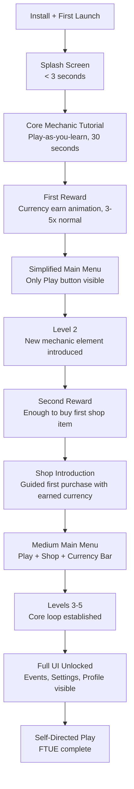
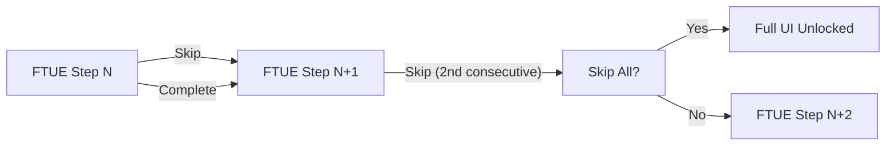
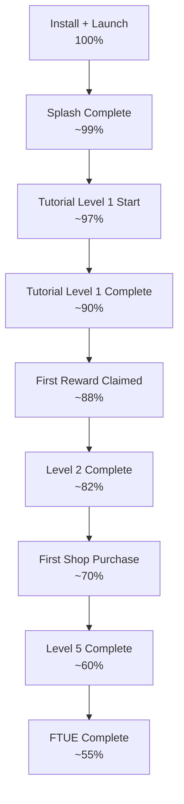
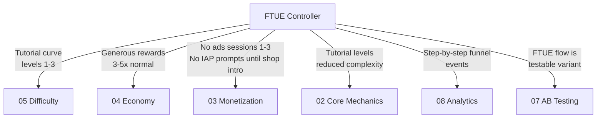

# Onboarding (FTUE) Specification

The First-Time User Experience (FTUE) is the sequence of screens and interactions a new player encounters from install to self-directed play. It is the single biggest lever for D1 retention.

> **Core principle:** Teach through play, not through text. The player should be *doing* within 10 seconds and *rewarded* within 60 seconds.

See [Concepts: Onboarding](../../SemanticDictionary/Concepts_Onboarding.md) for the foundational concepts behind this specification.

---

## FTUE Flow



---

## FTUE Step Definitions

Each step follows the `FTUEStep` schema defined in [DataModels.md](./DataModels.md#ftueschedule).

### Step 1: Splash to Gameplay (Auto)

| Field | Value |
|-------|-------|
| id | `ftue_splash_to_play` |
| screenId | `splash` |
| type | `guided_action` |
| completionCondition | `{ type: "auto", delaySeconds: 3 }` |
| instructionText | (none -- splash screen has no tutorial text) |
| dimBackground | false |
| autoAdvanceSeconds | 3 |

**What happens:** App loads. Splash screen shows brand logo and loading bar. After load completes (max 3 seconds), the player transitions directly into the first tutorial level -- not the main menu. The menu is deferred until after the first play session.

### Step 2: Core Mechanic Tutorial

| Field | Value |
|-------|-------|
| id | `ftue_core_tutorial` |
| screenId | `gameplay` |
| type | `play_level` |
| completionCondition | `{ type: "level_complete", levelId: "tutorial_1" }` |
| instructionText | Genre-specific (e.g., "Swipe up to jump!") |
| highlightTarget | Primary input area |
| dimBackground | false |
| autoAdvanceSeconds | 0 (manual) |

**What happens:** Player enters tutorial level 1. A semi-transparent overlay arrow points to the primary input area. The instruction text appears as a floating label. Gameplay is live -- the player learns by doing. The level is short (15-30 seconds) and has reduced difficulty (Difficulty Agent applies tutorial curve).

**Key constraints:**
- No pausing gameplay for text modals
- Instruction text disappears after first successful input
- Level difficulty is 1/10 (tutorial curve from Difficulty Agent)
- Failure is free: instant retry, no currency cost, no ad

### Step 3: First Reward

| Field | Value |
|-------|-------|
| id | `ftue_first_reward` |
| screenId | `level_complete` |
| type | `reward` |
| completionCondition | `{ type: "tap_target", targetId: "claim_reward_button" }` |
| instructionText | "You earned coins! Tap to collect." |
| highlightTarget | `claim_reward_button` |
| dimBackground | true |
| autoAdvanceSeconds | 0 |

**What happens:** Level complete screen shows with a reward celebration animation. The reward is 3-5x the normal amount for a level 1 completion (Economy Agent provides generous FTUE rewards). Currency bar appears for the first time with a slide-in animation. Player taps to claim.

**Coordination:** Economy Agent must set level 1 FTUE reward to 3-5x baseline.

### Step 4: Simplified Main Menu

| Field | Value |
|-------|-------|
| id | `ftue_simple_menu` |
| screenId | `main_menu` |
| type | `highlight` |
| completionCondition | `{ type: "tap_target", targetId: "play_button" }` |
| instructionText | "Ready for the next challenge?" |
| highlightTarget | `play_button` |
| dimBackground | true |
| autoAdvanceSeconds | 5 |

**What happens:** Main menu appears for the first time, but only the Play button is visible. All other tabs (Shop, Events, Settings, Profile) are hidden. Currency bar is visible showing the just-earned balance. A pulsing highlight draws attention to the Play button.

**Progressive disclosure state:** Play button + Currency bar visible. Everything else hidden.

### Step 5: Level 2

| Field | Value |
|-------|-------|
| id | `ftue_level_2` |
| screenId | `gameplay` |
| type | `play_level` |
| completionCondition | `{ type: "level_complete", levelId: "tutorial_2" }` |
| instructionText | Genre-specific secondary mechanic hint |
| highlightTarget | New mechanic element |
| dimBackground | false |
| autoAdvanceSeconds | 0 |

**What happens:** Level 2 introduces one new mechanic element (e.g., a new obstacle type, a new merge tier, a new ability). A brief tooltip appears on first encounter with the new element. Difficulty is still low (2/10). Level is slightly longer (20-40 seconds).

### Step 6: Second Reward + Shop Introduction

| Field | Value |
|-------|-------|
| id | `ftue_shop_intro` |
| screenId | `shop` |
| type | `guided_action` |
| completionCondition | `{ type: "tap_target", targetId: "first_purchase_item" }` |
| instructionText | "Spend your coins on an upgrade!" |
| highlightTarget | `first_purchase_item` |
| dimBackground | true |
| autoAdvanceSeconds | 0 |

**What happens:** After level 2 reward, the Shop tab appears in the navigation bar with a pulse animation. The player is guided to the shop. One item is highlighted -- it must be affordable with the currency earned from levels 1-2. The player completes their first purchase, learning the buy flow.

**Coordination:** Economy Agent must ensure cumulative rewards from levels 1-2 cover the first shop item's price. Monetization Agent must have a suitable starter item in the catalog.

### Step 7: Levels 3-5 (Core Loop Established)

| Field | Value |
|-------|-------|
| id | `ftue_core_loop` |
| screenId | `gameplay` |
| type | `play_level` |
| completionCondition | `{ type: "level_complete", levelId: "level_5" }` |
| instructionText | (none -- player is self-directing) |
| dimBackground | false |
| autoAdvanceSeconds | 0 |

**What happens:** Player plays levels 3 through 5 without tutorial overlays. This is where the core loop (play, earn, spend, play) establishes itself. Difficulty gradually increases (3/10 to 5/10). Between levels, the main menu progressively reveals more features.

### Step 8: Full UI Reveal

| Field | Value |
|-------|-------|
| id | `ftue_full_reveal` |
| screenId | `main_menu` |
| type | `reveal` |
| completionCondition | `{ type: "auto", delaySeconds: 3 }` |
| instructionText | "All features unlocked!" |
| dimBackground | false |
| autoAdvanceSeconds | 3 |

**What happens:** After level 5, the main menu shows all tabs: Settings, Profile, and (if an event is active) Events. Each newly visible element gets a brief glow animation. A toast notification reads "All features unlocked!" FTUE is now complete.

---

## Progressive Disclosure Schedule

Features are revealed in waves. Each reveal is accompanied by a visual indicator (pulse, glow, bounce) that draws attention without blocking interaction.

```mermaid
gantt
    title Feature Visibility Timeline
    dateFormat X
    axisFormat %s

    section Always Visible
    Play Button        :done, 0, 1

    section After Level 1
    Currency Bar        :active, 1, 2

    section After Level 2
    Shop Tab            :2, 3
    Level Select        :2, 3

    section After Level 3
    Ad Reward Multiplier :3, 4
    Daily Reward         :3, 4

    section After Level 5
    Settings Tab        :5, 6
    Profile Tab         :5, 6
    Social Features     :5, 6

    section Dynamic
    Events Tab          :crit, 5, 7
```



| Feature | Unlock Trigger | Reveal Animation | Rationale |
|---------|---------------|-----------------|-----------|
| Play button | Always | none | Core action must be immediately available |
| Currency bar | Level 1 complete | slide_in from top | Player just earned currency; show them the balance |
| Shop tab | Level 2 complete | pulse on nav icon | Player has enough to buy; show them where |
| Level select | Level 2 complete | slide_in | Multiple levels available; show selection |
| Ad reward multiplier | Level 3 complete | glow on prompt | Player has seen base rewards; now offer 2x |
| Daily reward | Session 2 start | bounce on icon | Returning player; reward the return |
| Settings tab | Level 5 complete | glow on nav icon | Player is committed; offer customization |
| Profile tab | Level 5 complete | glow on nav icon | Player is committed; offer identity |
| Social features | Level 5 complete | pulse on icon | After core engagement is established |
| Events tab | First event activates | bounce + banner | Only show when there is something to show |

---

## Skip Behavior

Every FTUE step has a skip option. Experienced players (reinstalls, genre veterans) must never be trapped.

### Skip Rules

| Rule | Detail |
|------|--------|
| Skip button visibility | Small "Skip" text in top-right corner of every tutorial overlay |
| Skip button delay | Skip appears after 1 second (prevents accidental taps) |
| Skip scope | Tapping skip advances to the next step, not the entire FTUE |
| Skip All option | After skipping 2 consecutive steps, offer "Skip all remaining tutorials?" |
| Post-skip state | All features unlock immediately; FTUE marked complete |
| Analytics | Each skip fires `ftue_step_skipped` event with stepId |

### Skip Flow



---

## Metrics Tracked During FTUE

Every FTUE step emits analytics events. These form the FTUE funnel.

### Per-Step Metrics

| Metric | Event Name | Properties |
|--------|-----------|------------|
| Step started | `ftue_step_started` | stepId, stepIndex, timestamp |
| Step completed | `ftue_step_completed` | stepId, stepIndex, durationMs, skipped |
| Step skipped | `ftue_step_skipped` | stepId, stepIndex, skipMethod |
| Feature revealed | `ftue_feature_unlocked` | featureId, trigger, timestamp |

### Aggregate FTUE Metrics

| Metric | Formula | Target | Alarm |
|--------|---------|--------|-------|
| Tutorial completion rate | completers / starters | > 85% | < 70% |
| Time to first reward | median(step3.timestamp - splash.timestamp) | < 60s | > 120s |
| Time to first play | median(step2.timestamp - splash.timestamp) | < 10s | > 30s |
| Skip rate | skippers / starters | < 30% | > 50% |
| D1 retention (completers) | D1 retention of FTUE completers | > 45% | < 35% |
| D1 retention (skippers) | D1 retention of FTUE skippers | > 30% | < 20% |
| Median FTUE duration | median(ftue_complete.timestamp - splash.timestamp) | < 5 min | > 10 min |
| Steps completed before skip | median(last_completed_step.index) of skippers | > 3 | < 2 |

### FTUE Funnel



---

## Interaction with Other Verticals During FTUE

The FTUE window creates special conditions for every other vertical. These conditions are communicated via the `FTUESchedule` in the [ShellConfig](./DataModels.md#shellconfig).

### Vertical Interaction Matrix



| Vertical | FTUE Condition | Rationale |
|----------|---------------|-----------|
| **Core Mechanics (02)** | Level 1 is a tutorial level with guided input and simplified mechanics. Level 2 introduces exactly one new element. Levels 3-5 gradually add complexity. | Cognitive load must be minimal at start |
| **Monetization (03)** | No interstitial ads during sessions 1-3. No IAP prompts until after shop introduction step. Rewarded ads appear only after level 3. Banner ads suppressed until FTUE complete. | Ads during FTUE signal low quality and cause uninstalls |
| **Economy (04)** | Level 1 reward is 3-5x normal baseline. Cumulative rewards from levels 1-2 must cover the first shop item. No energy cost during FTUE. | Player must feel rich and see value in earning |
| **Difficulty (05)** | Levels 1-3 use the tutorial difficulty curve (DifficultyScore 1-3). Failure on level 1 is nearly impossible. Sawtooth not applied until level 6+. | Frustration during FTUE causes uninstalls |
| **LiveOps (06)** | No event popups during FTUE. Event tab hidden until after level 5. Active events are invisible to FTUE players. | Additional content overwhelms new players |
| **AB Testing (07)** | FTUE flow itself is an AB-testable variant (tutorial length, reward amounts, reveal order). Test enrollment happens at install. | FTUE is the highest-impact area to optimize |
| **Analytics (08)** | Each FTUE step emits a tracked event. The FTUE funnel is a first-class analytics pipeline. | Without per-step tracking, FTUE cannot be optimized |

---

## Anti-Patterns

| Anti-Pattern | Impact | Correct Approach |
|-------------|--------|-----------------|
| Forced account creation before play | 30-50% drop-off at this step | Guest mode first. Account creation offered after session 3+. |
| Permission requests before value shown | 15-25% rejection rate higher than post-value | Request push notifications after first session, not first launch. |
| Showing all UI at once | Cognitive overload; player does not know where to tap | Progressive disclosure: start with Play only. |
| Tutorial longer than 2 minutes | Impatience-driven uninstalls | Core tutorial < 30 seconds of active play. |
| No skip option | Frustrates experienced players; bad reviews | Skip always available after 1-second delay. |
| Ads during FTUE | Signals low-quality app; player uninstalls | Zero ads in sessions 1-3. |
| Teaching features player cannot use yet | Confusion and forgotten lessons | Teach shop when player can buy. Teach events when events exist. |
| Text-heavy modal tutorials | Players tap through without reading | Play-as-you-learn with minimal floating labels. |
| Rewarding tutorial completion with premium currency | Devalues premium currency; sets wrong expectation | Reward with basic currency during FTUE. |
| Same difficulty for tutorial and regular levels | Tutorial feels too hard or regular feels too easy | Separate tutorial curve (Difficulty Agent). |

---

## FTUE Configuration Example

Complete FTUE schedule for a hypothetical runner game:

```typescript
const runnerFTUESchedule: FTUESchedule = {
  steps: [
    {
      id: 'ftue_splash_to_play',
      name: 'Auto-start tutorial',
      index: 0,
      screenId: 'splash',
      type: 'guided_action',
      completionCondition: { type: 'auto', delaySeconds: 3 },
      instructionText: '',
      tooltipPosition: 'center',
      dimBackground: false,
      autoAdvanceSeconds: 3,
      analyticsEventName: 'ftue_splash_complete',
    },
    {
      id: 'ftue_core_tutorial',
      name: 'Learn to jump',
      index: 1,
      screenId: 'gameplay',
      type: 'play_level',
      completionCondition: { type: 'level_complete', levelId: 'tutorial_1' },
      highlightTarget: 'screen_center',
      instructionText: 'Swipe up to jump!',
      tooltipPosition: 'center',
      dimBackground: false,
      autoAdvanceSeconds: 0,
      analyticsEventName: 'ftue_tutorial_1_complete',
    },
    {
      id: 'ftue_first_reward',
      name: 'Claim first coins',
      index: 2,
      screenId: 'level_complete',
      type: 'reward',
      completionCondition: { type: 'tap_target', targetId: 'claim_reward_button' },
      highlightTarget: 'claim_reward_button',
      instructionText: 'You earned 500 coins! Tap to collect.',
      tooltipPosition: 'above',
      dimBackground: true,
      autoAdvanceSeconds: 0,
      analyticsEventName: 'ftue_first_reward_claimed',
    },
    {
      id: 'ftue_simple_menu',
      name: 'Tap Play again',
      index: 3,
      screenId: 'main_menu',
      type: 'highlight',
      completionCondition: { type: 'tap_target', targetId: 'play_button' },
      highlightTarget: 'play_button',
      instructionText: 'Ready for the next challenge?',
      tooltipPosition: 'below',
      dimBackground: true,
      autoAdvanceSeconds: 5,
      analyticsEventName: 'ftue_play_tapped',
    },
    {
      id: 'ftue_level_2',
      name: 'Learn to slide',
      index: 4,
      screenId: 'gameplay',
      type: 'play_level',
      completionCondition: { type: 'level_complete', levelId: 'tutorial_2' },
      highlightTarget: 'screen_bottom',
      instructionText: 'Swipe down to slide!',
      tooltipPosition: 'center',
      dimBackground: false,
      autoAdvanceSeconds: 0,
      analyticsEventName: 'ftue_tutorial_2_complete',
    },
    {
      id: 'ftue_shop_intro',
      name: 'First purchase',
      index: 5,
      screenId: 'shop',
      type: 'guided_action',
      completionCondition: { type: 'tap_target', targetId: 'first_purchase_item' },
      highlightTarget: 'first_purchase_item',
      instructionText: 'Spend your coins on a speed boost!',
      tooltipPosition: 'above',
      dimBackground: true,
      autoAdvanceSeconds: 0,
      analyticsEventName: 'ftue_first_purchase',
    },
    {
      id: 'ftue_core_loop',
      name: 'Play levels 3-5',
      index: 6,
      screenId: 'gameplay',
      type: 'play_level',
      completionCondition: { type: 'level_complete', levelId: 'level_5' },
      instructionText: '',
      tooltipPosition: 'center',
      dimBackground: false,
      autoAdvanceSeconds: 0,
      analyticsEventName: 'ftue_core_loop_complete',
    },
    {
      id: 'ftue_full_reveal',
      name: 'All features unlocked',
      index: 7,
      screenId: 'main_menu',
      type: 'reveal',
      completionCondition: { type: 'auto', delaySeconds: 3 },
      instructionText: 'All features unlocked!',
      tooltipPosition: 'center',
      dimBackground: false,
      autoAdvanceSeconds: 3,
      analyticsEventName: 'ftue_complete',
    },
  ],
  disclosureRules: [
    { featureId: 'play_button', featureName: 'Play', unlockTrigger: { type: 'level_reached', level: 0 }, revealAnimation: 'none' },
    { featureId: 'currency_bar', featureName: 'Currency Bar', unlockTrigger: { type: 'ftue_step_complete', stepId: 'ftue_first_reward' }, revealAnimation: 'slide_in' },
    { featureId: 'shop_tab', featureName: 'Shop', unlockTrigger: { type: 'level_reached', level: 2 }, revealAnimation: 'pulse' },
    { featureId: 'ad_multiplier', featureName: 'Ad Reward Multiplier', unlockTrigger: { type: 'level_reached', level: 3 }, revealAnimation: 'glow' },
    { featureId: 'daily_reward', featureName: 'Daily Reward', unlockTrigger: { type: 'session_count', count: 2 }, revealAnimation: 'pulse' },
    { featureId: 'settings_tab', featureName: 'Settings', unlockTrigger: { type: 'level_reached', level: 5 }, revealAnimation: 'glow' },
    { featureId: 'profile_tab', featureName: 'Profile', unlockTrigger: { type: 'level_reached', level: 5 }, revealAnimation: 'glow' },
    { featureId: 'events_tab', featureName: 'Events', unlockTrigger: { type: 'days_since_install', days: 1 }, revealAnimation: 'bounce' },
  ],
  skipAlwaysAvailable: true,
  maxTotalDurationSeconds: 300,
};
```

---

## Related Documents

- [Spec](./Spec.md) -- UI vertical scope and FTUE as a deliverable
- [Interfaces](./Interfaces.md) -- IFTUEController API
- [DataModels](./DataModels.md) -- FTUEStep and FTUESchedule schemas
- [AgentResponsibilities](./AgentResponsibilities.md) -- FTUE coordination requirements
- [SharedInterfaces](../00_SharedInterfaces.md) -- CurrencyAmount, RewardBundle for FTUE rewards
- [Concepts: Onboarding](../../SemanticDictionary/Concepts_Onboarding.md) -- FTUE concept deep dive
- [Concepts: Shell](../../SemanticDictionary/Concepts_Shell.md) -- Shell component hosting FTUE
- [MetricsDictionary](../../SemanticDictionary/MetricsDictionary.md) -- Retention and engagement metric formulas
- [PerformanceBudgets](../../Architecture/PerformanceBudgets.md) -- Timing constraints
- [Glossary](../../SemanticDictionary/Glossary.md) -- Term definitions
