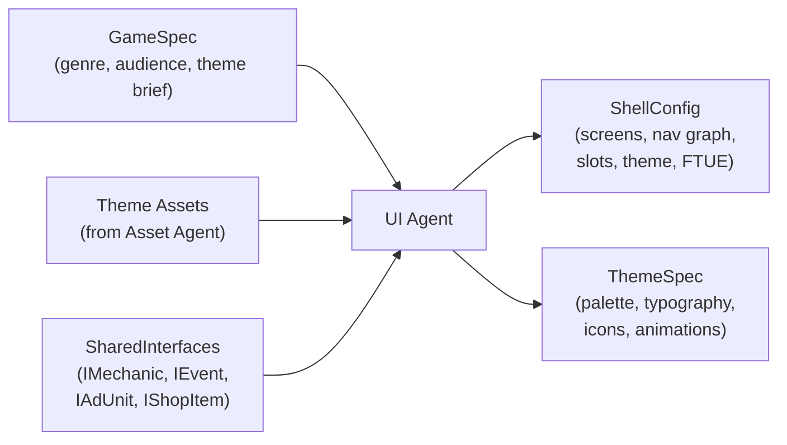
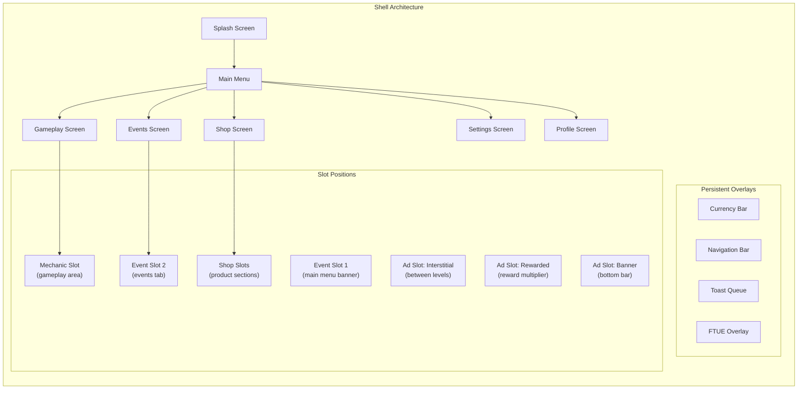
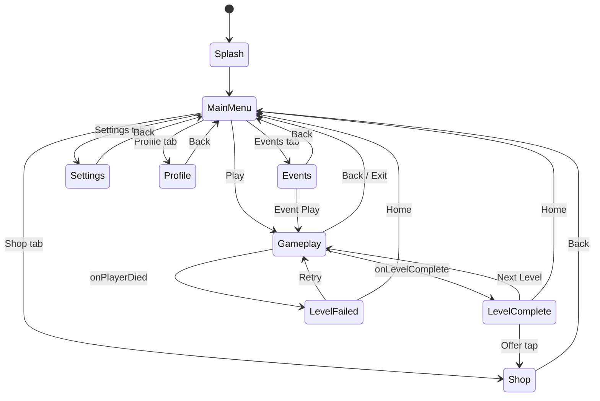
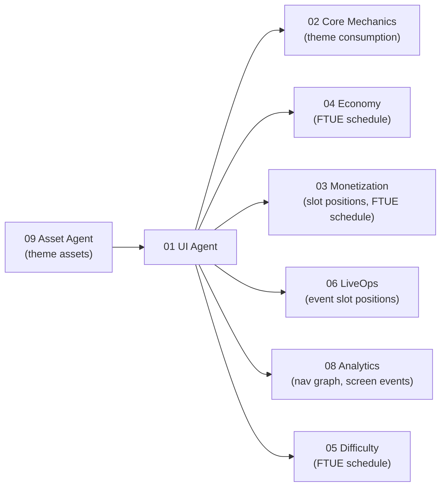

# UI Shell Vertical Specification

The UI vertical owns the **shell** -- the standardized UI frame that wraps every game produced by the AI Game Engine. The shell handles everything outside of core gameplay: loading, main menu, currency display, navigation, shop, settings, onboarding, and the toast/popup system.

---

## Purpose

Build the shell once, theme it per game, and expose **slots** where other verticals plug in their content. The shell is 60-70% of a mobile game's screen count but structurally identical across genres. By standardizing it, we eliminate redundant UI work and give every downstream agent (Monetization, Economy, LiveOps) a known surface to target.

---

## Scope

### In Scope

| Area | Description |
|------|-------------|
| **Splash / Loading** | Brand logo, loading progress, background initialization |
| **Main Menu** | Primary navigation hub: Play, Shop, Events, Settings |
| **Currency Bar** | Persistent display of basic and premium currency balances |
| **Navigation** | Bottom tab bar (iOS) / drawer (Android), screen routing |
| **Shop** | IAP product display, currency packs, bundles, daily deals |
| **Settings** | Audio, notifications, account, privacy, language |
| **FTUE Overlay** | Tutorial highlights, progressive disclosure schedule |
| **Toast / Popup System** | Non-blocking toasts, blocking modals, reward celebrations |
| **Theming** | Color palette, typography, icon set, animation timing |
| **Navigation Graph** | Screen-to-screen transitions, deep-link entry points |

### Out of Scope

| Area | Owner |
|------|-------|
| Core gameplay rendering | Core Mechanics Agent (02) |
| In-level HUD (score, timer) | Core Mechanics Agent (uses shell theme) |
| Economy balance / reward amounts | Economy Agent (04) |
| Ad content and mediation | Monetization Agent (03) |
| Event content and scheduling | LiveOps Agent (06) |
| Asset creation (art, audio) | Asset Agent (09) |

---

## Inputs and Outputs

### Inputs

| Input | Source | Description |
|-------|--------|-------------|
| `GameSpec` | Pipeline entry | Genre, target audience, theme brief, monetization tier |
| `Theme` assets | Asset Agent (09) | Color palette artwork, font files, icon sprites, background art |
| `IMechanic` | SharedInterfaces | Contract the mechanic slot expects |
| `IEvent` | SharedInterfaces | Contract the event slots expect |
| `IAdUnit` | SharedInterfaces | Contract ad placements expect |
| `IShopItem` | SharedInterfaces | Contract shop item displays expect |

### Outputs

| Output | Consumer | Description |
|--------|----------|-------------|
| `ShellConfig` | All downstream agents | Complete screen list, navigation graph, slot positions, FTUE schedule |
| `ThemeSpec` | Core Mechanics, LiveOps, Assets | Full theme definition for visual consistency |
| `NavigationGraph` | Analytics Agent | Screen flow for funnel analysis |
| `FTUESchedule` | Difficulty, Economy, Monetization | Progressive disclosure timing so agents know when features appear |

---

## Architecture

---

## Screen Inventory

| Screen | Entry Point | Persistent Overlays | Slots Hosted |
|--------|-------------|---------------------|-------------|
| Splash | App launch | None | None |
| Main Menu | Post-splash, back from any | Currency Bar, Nav Bar | Event Slot 1 (banner) |
| Gameplay | Play button / level select | Currency Bar (collapsed) | Mechanic Slot |
| Shop | Nav bar / currency tap | Currency Bar, Nav Bar | Shop Slots (N sections) |
| Events | Nav bar / event banner tap | Currency Bar, Nav Bar | Event Slot 2 |
| Settings | Nav bar / gear icon | Nav Bar | None |
| Profile | Nav bar / avatar tap | Currency Bar, Nav Bar | None |
| Level Complete | Mechanic onLevelComplete | Currency Bar | Ad Slot: Rewarded |
| Level Failed | Mechanic onPlayerDied | Currency Bar | Ad Slot: Rewarded |

---

## Navigation Graph

---

## Performance Budgets

All budgets reference the target device tier defined in [PerformanceBudgets.md](../../Architecture/PerformanceBudgets.md).

| Metric | Budget | Rationale |
|--------|--------|-----------|
| Screen transition duration | < 16ms (1 frame at 60fps) | Transitions must not drop frames |
| Splash to main menu | < 3 seconds total | Industry standard for mobile |
| Time to interactive (main menu) | < 1 second after splash | Player must see actionable UI fast |
| Toast render time | < 8ms | Non-blocking overlay must be instant |
| Popup queue processing | < 1 popup per 5 seconds | Prevent popup spam |
| UI framework memory | < 30 MB | Budget from PerformanceBudgets.md |
| Theme asset memory | < 20 MB | Subset of texture budget |
| Currency bar update | < 4ms | Animated counter must not jank |

---

## Constraints

1. **Progressive disclosure.** New players see a simplified UI. Features unlock according to the FTUE schedule. See [Onboarding.md](./Onboarding.md).
2. **Platform adaptation.** Bottom tab bar on iOS, navigation drawer option on Android. The navigation graph is identical; only the chrome changes.
3. **Theming never changes structure.** A themed shell has the same screens, same navigation flow, same slot positions. Only visuals differ.
4. **Slot isolation.** The shell never reaches into a slot's internal state. Communication is event-based only, per [SlotArchitecture.md](../../Architecture/SlotArchitecture.md).
5. **Accessibility.** Minimum 4.5:1 contrast ratio for text, tap targets >= 44x44 points, screen reader labels on all interactive elements.
6. **No blocking during load.** Splash screen runs asset loading, ad SDK init, and analytics init concurrently in background.

---

## Success Criteria

| Criterion | Measurement |
|-----------|-------------|
| All 9 standard screens render correctly | Visual regression test pass |
| Navigation graph is complete and cycle-free (except back navigation) | Graph validation tool |
| Every slot position is defined with coordinates and size | ShellConfig schema validation |
| FTUE flow covers levels 1 through 5 | FTUE schedule completeness check |
| Theme applies consistently to all screens | Theme diff tool (no unstyled elements) |
| Screen transitions meet 16ms budget | Performance profiler on target device |
| Toast/popup queue processes without stacking | Integration test with rapid-fire events |
| Currency bar animates earn/spend correctly | Animation test with mock economy events |
| Shop renders all IShopItem sections | Integration test with mock catalog |

---

## Dependencies

| Dependency | Direction | What Flows |
|-----------|-----------|------------|
| Asset Agent (09) | Upstream to UI | Theme assets (palette artwork, fonts, icons, backgrounds) |
| Core Mechanics (02) | UI to downstream | Theme for mechanic rendering |
| Economy (04) | UI to downstream | FTUE schedule (when shop unlocks, when currency bar appears) |
| Monetization (03) | UI to downstream | Ad slot positions, FTUE schedule (no ads during onboarding) |
| LiveOps (06) | UI to downstream | Event slot positions and sizes |
| Difficulty (05) | UI to downstream | FTUE schedule (tutorial difficulty window) |
| Analytics (08) | UI to downstream | Navigation graph for screen_view events |

---

## Related Documents

- [SharedInterfaces](../00_SharedInterfaces.md) -- Cross-vertical contracts (IMechanic, IEvent, IAdUnit, IShopItem, Theme)
- [Interfaces](./Interfaces.md) -- Shell API for other verticals
- [DataModels](./DataModels.md) -- ShellConfig, screen, navigation, theme schemas
- [AgentResponsibilities](./AgentResponsibilities.md) -- What the UI Agent decides vs coordinates
- [Onboarding](./Onboarding.md) -- FTUE flow specification
- [SlotArchitecture](../../Architecture/SlotArchitecture.md) -- How slots connect modules to the shell
- [PerformanceBudgets](../../Architecture/PerformanceBudgets.md) -- Device tiers and frame budgets
- [SystemOverview](../../Architecture/SystemOverview.md) -- Full system architecture
- [Concepts: Shell](../../SemanticDictionary/Concepts_Shell.md) -- Shell concept deep dive
- [Concepts: Slot](../../SemanticDictionary/Concepts_Slot.md) -- Slot mechanism explanation
- [Glossary](../../SemanticDictionary/Glossary.md) -- Term definitions
