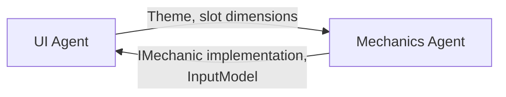
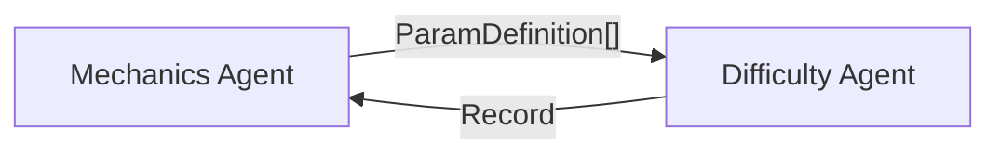
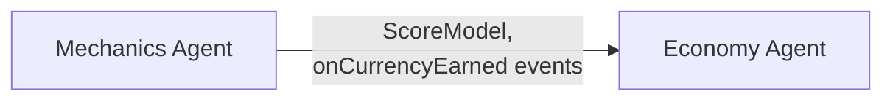
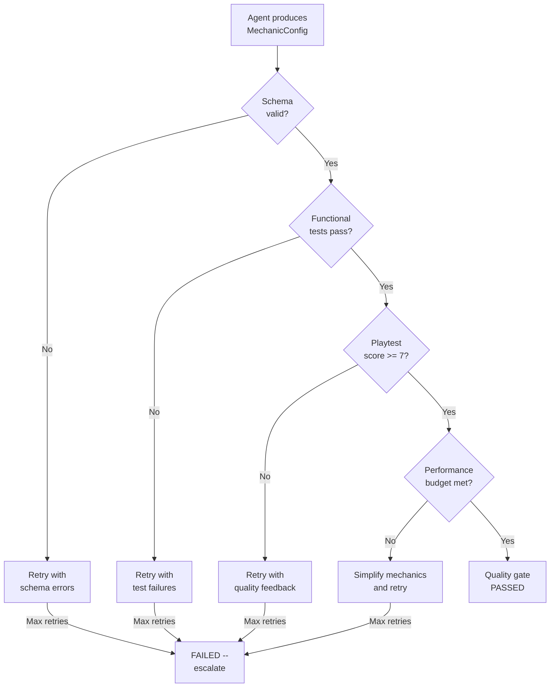

# Core Mechanics Vertical -- Agent Responsibilities

> Defines the autonomy boundaries, coordination requirements, quality criteria, and failure modes for the Core Mechanics Agent.

---

## Role Summary

The Core Mechanics Agent transforms a `GameSpec` (genre + mechanic type + reference games) into a fully configured `MechanicConfig` that implements the [IMechanic](Interfaces.md#imechanic) interface. It decides *how the game plays* -- the moment-to-moment loop, controls, scoring, and level structure.

---

## Autonomous Decisions

The Mechanics Agent has **full authority** over the following decisions. No coordination with other agents is required.

### Gameplay Rules

| Decision | Description | Example |
|----------|-------------|---------|
| Core loop design | The repeating action-reward cycle | Runner: run, collect, dodge, repeat |
| Entity behavior | How game objects move and interact | Obstacles spawn in patterns, enemies patrol routes |
| Collision rules | What happens when entities overlap | Player hits obstacle = lose life, player hits coin = collect |
| Physics model | Gravity, friction, momentum | Jump arc in platformer, merge snap in merge games |
| Progression within level | How the level evolves as time passes | Runner speeds up, puzzle board fills |
| Power-up design | What power-ups exist and what they do | Shield (invincibility), magnet (auto-collect), 2x score |

### Scoring Formula

| Decision | Description | Example |
|----------|-------------|---------|
| Base points | Points per action | 10 points per coin collected |
| Combo system | Whether combos exist, multiplier formula | 3 consecutive dodges = 1.5x, 6 = 2.0x |
| Bonus definitions | Special achievements and their point values | "No Hit" bonus = 500 points |
| Star thresholds | Score boundaries for 1, 2, 3 stars | 500 / 1200 / 2000 for a level |
| Display format | How score is shown on screen | Integer, thousands separator, abbreviated |

### Input Mapping

| Decision | Description | Example |
|----------|-------------|---------|
| Gesture selection | Which gestures the mechanic uses | Runner: swipe L/R/U/D + tap |
| Action mapping | Gesture-to-action bindings | Swipe up = jump, swipe down = slide |
| Input regions | Which screen areas accept which gestures | Full gameplay area for swipes, HUD buttons for tap |
| Cooldowns | Per-gesture cooldown timing | Power-up tap has 5s cooldown |
| Thresholds | Gesture sensitivity | Swipe requires > 50px drag |

### Level Structure

| Decision | Description | Example |
|----------|-------------|---------|
| Win condition types | What the player must achieve | Survive 60s, score 2000, collect all stars |
| Lose condition types | What causes failure | 3 hits, time runs out, fall off screen |
| Level layout | Spatial arrangement of entities | Obstacle patterns, platform placement |
| Pacing within level | How intensity varies | Start slow, build to climax |
| Time limits | Whether levels are timed | Timed puzzle levels, untimed endless runner |

---

## Coordinated Decisions

These decisions require the Mechanics Agent to respect contracts defined by other agents or in [SharedInterfaces](../00_SharedInterfaces.md).

### With UI Agent (Shell)

| Interface Point | What Mechanics Provides | What UI Provides | Contract |
|-----------------|------------------------|------------------|----------|
| Mechanic slot | Rendering within slot bounds | Slot dimensions, position | Mechanic never renders outside slot |
| Theme | In-level HUD uses Theme colors/fonts | `Theme` object | [SharedInterfaces: Theme](../00_SharedInterfaces.md#theme-contract) |
| Events | `onLevelComplete`, `onPlayerDied`, etc. | Event subscriptions | [IMechanic.events](Interfaces.md#imechanic-full-contract) |
| Input | `InputModel` describing required gestures | Input system routing | Input events forwarded to mechanic |
| Pause/Resume | Responds to `pause()`/`resume()` | Calls lifecycle methods | State transitions per contract |

**Coordination rule:** The Mechanics Agent must never dictate shell layout. It renders *within* the slot and communicates *through* events.

### With Difficulty Agent

| Interface Point | What Mechanics Provides | What Difficulty Provides | Contract |
|-----------------|------------------------|------------------------|----------|
| Parameter declarations | `getAdjustableParams()` with names, types, ranges | -- | [ParamDefinition](Interfaces.md#paramdefinition-difficulty-parameter-contract) |
| Per-level values | -- | Values for each param at each level | Values within declared `[min, max]` |
| Difficulty scores | -- | `DifficultyScore` (1-10) per level | Maps to `RewardTier` via [SharedInterfaces](../00_SharedInterfaces.md#difficulty--economy-contract) |

**Coordination rule:** The Mechanics Agent defines *what* can be tuned. The Difficulty Agent decides *how much* to tune it. The Mechanics Agent must accept any value within its declared ranges.

### With Economy Agent

| Interface Point | What Mechanics Provides | What Economy Provides | Contract |
|-----------------|------------------------|----------------------|----------|
| Score-to-reward mapping | `ScoreModel` with expected score ranges | Reward amounts per tier | [DIFFICULTY_REWARD_MAP](../00_SharedInterfaces.md#difficulty--economy-contract) |
| Currency events | `onCurrencyEarned` with `CurrencyAmount` | -- | [CurrencyAmount](../00_SharedInterfaces.md#core-data-types) schema |
| Level complete | `LevelCompletePayload` with `rewardTier` | Reward calculation | `rewardTier` derived from difficulty |

**Coordination rule:** The Mechanics Agent emits currency events; it never reads or writes wallet balances. The Economy Agent owns all currency math.

### With Analytics Agent

| Event | Payload | When Emitted |
|-------|---------|-------------|
| `level_start` | `{ level_id, difficulty }` | `start()` called |
| `level_complete` | `LevelCompletePayload` | Win condition met |
| `level_fail` | `{ level_id, cause, attempt }` | Lose condition met |

**Coordination rule:** The Mechanics Agent emits events using the [Analytics Event Contract](../00_SharedInterfaces.md#analytics-event-contract). Event names and payloads are defined by the Analytics Agent.

---

## Quality Criteria

### Functional Quality

| Criterion | Measurement | Pass Threshold |
|-----------|-------------|----------------|
| IMechanic contract compliance | All methods implemented, all events wired | 100% |
| Schema compliance | `MechanicConfig` passes JSON validation | 100% |
| State machine correctness | No invalid state transitions | 0 violations |
| Input responsiveness | Gesture-to-action latency | < 50ms |
| Event correctness | Events fire at correct moments with valid payloads | 100% |

### Gameplay Quality

| Criterion | Measurement | Pass Threshold |
|-----------|-------------|----------------|
| Core loop clarity | Playtest: "Do I understand what to do?" (1-10) | >= 8 |
| Fun factor | Playtest: "Is this fun?" (1-10) | >= 7 |
| Difficulty adjustability | All params accept full range without breaking | 100% |
| Star balance | 3-star achievable by skilled play, 1-star by average | Verified |
| Session length | Average level completion within expected range | 30s-180s per level |

### Technical Quality

| Criterion | Measurement | Pass Threshold |
|-----------|-------------|----------------|
| Frame rate | FPS during gameplay | >= 60 fps |
| Memory usage | Mechanic module memory footprint | < 100 MB |
| Load time | Time from `init()` to ready | < 2 seconds |
| Dispose completeness | No leaked resources after `dispose()` | 0 leaks |
| Slot containment | Rendering stays within slot bounds | 0 overflows |

---

## Failure Modes

### Recoverable Failures

| Failure | Symptom | Root Cause | Recovery |
|---------|---------|------------|----------|
| **Schema violation** | `MechanicConfig` fails validation | Missing field, wrong type, out-of-range value | Retry with schema error as feedback |
| **Unbalanced scoring** | Star thresholds unreachable or trivial | Bad basePoints or threshold calculation | Recalculate with playtest simulation |
| **Input conflict** | Two gestures map to same action ambiguously | Overlapping input regions or gesture confusion | Simplify input model, separate regions |
| **Boring loop** | Playtest fun score < 5 | Too simple, no variety, no challenge | Add combo system, vary obstacles, add power-ups |
| **Difficulty break** | Extreme param values crash or freeze mechanic | Missing clamp logic or edge case | Add bounds checking in `setDifficultyParams()` |

### Non-Recoverable Failures

| Failure | Symptom | Root Cause | Escalation |
|---------|---------|------------|------------|
| **Unknown mechanic type** | `mechanicType` not in catalog | GameSpec specifies unsupported type | Reject with error; ask pipeline for clarification |
| **Incompatible reference game** | Reference game contradicts mechanic type | GameSpec says "runner" but references "Candy Crush" | Escalate to human review |
| **Performance impossible** | 60 fps not achievable with required entity count | Mechanic design exceeds device capability | Simplify mechanic or lower entity cap |

### Failure Detection Flow

---

## Decision Matrix

Quick reference for the Mechanics Agent: "Can I decide this myself?"

| Decision | Autonomous? | Coordinate With | Notes |
|----------|-------------|-----------------|-------|
| Which gestures to use | Yes | -- | Agent's choice based on mechanic type |
| Scoring formula | Yes | -- | Agent defines freely |
| Star thresholds | Yes | -- | Must be achievable (validated by playtest) |
| Combo mechanics | Yes | -- | Optional; agent decides if mechanic needs combos |
| Level layout | Yes | -- | Spatial arrangement is mechanic-internal |
| Win/lose conditions | Yes | -- | Must be expressible in WinCondition/LoseCondition types |
| Difficulty param names | Yes | -- | Agent declares; Difficulty Agent consumes |
| Difficulty param *values* | No | Difficulty Agent | Difficulty Agent sets per-level values |
| Currency earn rates | No | Economy Agent | Mechanic emits events; Economy sets amounts |
| Theme colors/fonts | No | UI Agent | Mechanic consumes theme, never overrides |
| Ad trigger timing | No | Monetization Agent | Shell handles ads on level transitions |
| Analytics event schema | No | Analytics Agent | Must match [StandardEvents](../00_SharedInterfaces.md#analytics-event-contract) |

---

## Handoff Artifacts

What the Mechanics Agent produces and where it goes:

| Artifact | Format | Consumer | Handoff Point |
|----------|--------|----------|---------------|
| `MechanicConfig` | JSON | UI, Difficulty, Economy, Analytics | Pipeline stage output |
| `ParamDefinition[]` | JSON array | Difficulty Agent | Embedded in `MechanicConfig` via `getAdjustableParams()` |
| `InputModel` | JSON | UI Agent | Embedded in `MechanicConfig` |
| `ScoreModel` | JSON | Economy Agent | Separate artifact |
| IMechanic runtime | Code module | Shell (runtime) | Build output |

---

## Related Documents

- [Spec.md](Spec.md) -- Full vertical specification
- [Interfaces.md](Interfaces.md) -- Interface contracts
- [DataModels.md](DataModels.md) -- Schema definitions
- [MechanicCatalog.md](MechanicCatalog.md) -- Per-type default configurations
- [Concepts: Agent](../../SemanticDictionary/Concepts_Agent.md) -- Agent lifecycle and properties
- [SharedInterfaces](../00_SharedInterfaces.md) -- Cross-vertical contracts
