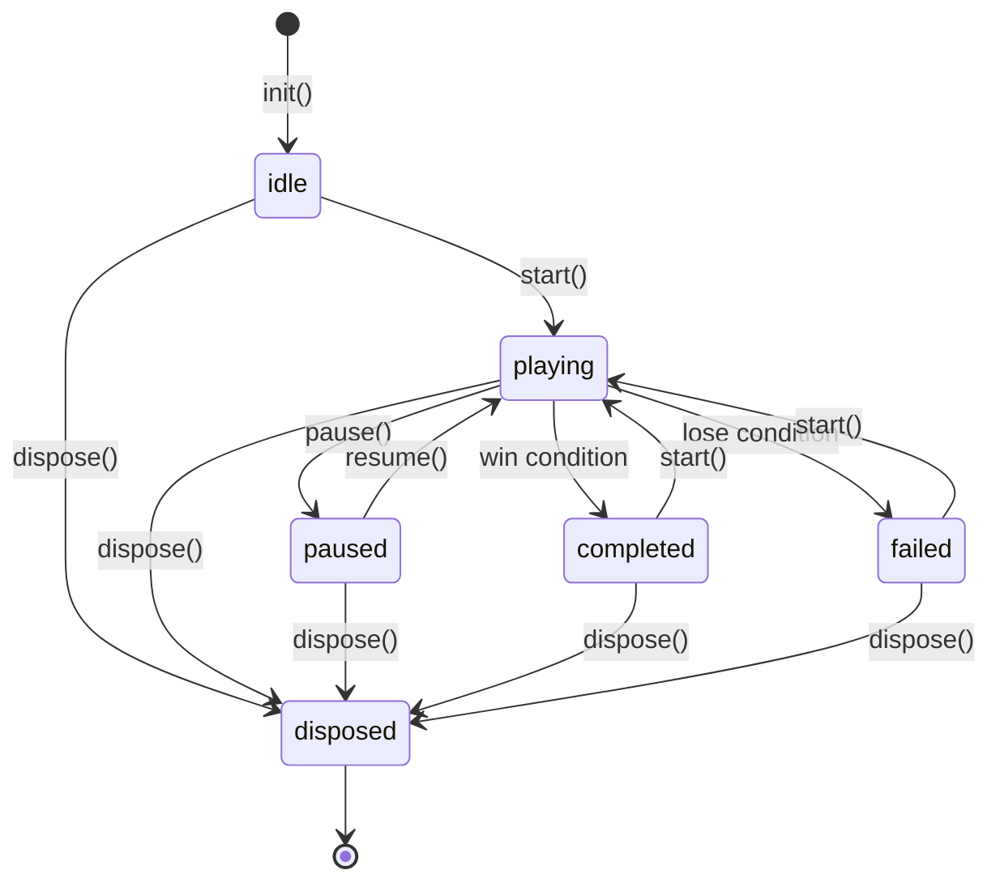
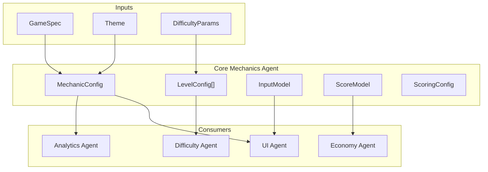

# Core Mechanics Vertical -- Data Models

> JSON schemas and TypeScript type definitions for all data structures owned by the Core Mechanics vertical. Each schema includes validation rules, examples, and downstream consumers.

---

## MechanicConfig

The primary output artifact of the Core Mechanics Agent. Fully describes a configured gameplay module.

```typescript
interface MechanicConfig {
  mechanicType: string;
  theme: Theme;
  initialDifficulty: Record<string, number>;
  levelSequence: LevelConfig[];
  scoring: ScoringConfig;
  inputModel: InputModel;
}
```

### JSON Schema

```json
{
  "$schema": "https://json-schema.org/draft/2020-12/schema",
  "$id": "MechanicConfig",
  "type": "object",
  "required": ["mechanicType", "theme", "initialDifficulty", "levelSequence", "scoring", "inputModel"],
  "properties": {
    "mechanicType": {
      "type": "string",
      "enum": ["runner", "merge", "pvp_arena", "match3", "idle_clicker", "tower_defense",
               "card_battle", "trivia", "platformer", "tapper"],
      "description": "Must match a MechanicCatalog entry."
    },
    "theme": { "$ref": "Theme" },
    "initialDifficulty": {
      "type": "object",
      "additionalProperties": { "type": "number" },
      "minProperties": 1,
      "description": "Keys must match names from getAdjustableParams()."
    },
    "levelSequence": {
      "type": "array",
      "items": { "$ref": "LevelConfig" },
      "minItems": 1,
      "maxItems": 1000,
      "description": "Ordered list of levels. At least 1 for validation."
    },
    "scoring": { "$ref": "ScoringConfig" },
    "inputModel": { "$ref": "InputModel" }
  }
}
```

### Validation Rules

| Rule | Check | Error |
|------|-------|-------|
| `mechanicType` in catalog | Must be one of the 10 catalog types | `INVALID_MECHANIC_TYPE` |
| `initialDifficulty` keys match params | Every key must exist in `getAdjustableParams()` | `UNKNOWN_DIFFICULTY_PARAM` |
| `initialDifficulty` values in range | Each value within param's `[min, max]` | `DIFFICULTY_OUT_OF_RANGE` |
| `levelSequence` not empty | At least 1 level | `EMPTY_LEVEL_SEQUENCE` |
| `scoring.basePoints` > 0 | Positive integer | `INVALID_BASE_POINTS` |
| `inputModel.supportedGestures` not empty | At least 1 gesture | `NO_INPUT_GESTURES` |

### Example

```json
{
  "mechanicType": "runner",
  "theme": { "id": "neon_city", "name": "Neon City", "palette": { "...": "..." } },
  "initialDifficulty": {
    "speed": 5.0,
    "obstacle_density": 0.3,
    "lane_count": 3
  },
  "levelSequence": [
    {
      "levelId": "level_1",
      "difficulty": 1,
      "params": { "speed": 3.0, "obstacle_density": 0.1 },
      "winConditions": [{ "type": "survive_duration", "target": 60, "description": "Survive 60 seconds" }],
      "loseConditions": [{ "type": "health_depleted", "description": "Hit 3 obstacles" }],
      "timeLimitSeconds": 0,
      "starThresholds": { "oneStar": 500, "twoStar": 1200, "threeStar": 2000 }
    }
  ],
  "scoring": {
    "basePoints": 10,
    "combo": { "comboStartThreshold": 3, "comboMultiplier": 0.5, "maxComboLevel": 10, "comboTimeoutSeconds": 2.0 },
    "bonuses": [
      { "name": "No Hit", "trigger": "no_damage", "points": 500, "description": "Complete level without hitting obstacles" }
    ],
    "displayFormat": "thousands_separator"
  },
  "inputModel": {
    "supportedGestures": ["swipe_left", "swipe_right", "swipe_up", "swipe_down", "tap"],
    "mappings": [
      { "gesture": "swipe_left", "action": "lane_left", "description": "Move one lane left" },
      { "gesture": "swipe_right", "action": "lane_right", "description": "Move one lane right" },
      { "gesture": "swipe_up", "action": "jump", "description": "Jump over obstacle" },
      { "gesture": "swipe_down", "action": "slide", "description": "Slide under obstacle" },
      { "gesture": "tap", "action": "use_powerup", "cooldownMs": 5000, "description": "Activate collected powerup" }
    ],
    "inputRegions": [
      { "name": "gameplay", "rect": { "x": 0, "y": 0, "width": 1, "height": 0.85 }, "acceptedGestures": [] }
    ]
  }
}
```

### Consumers

| Consumer | What They Use |
|----------|--------------|
| UI Agent | `theme`, `inputModel` (to wire gestures) |
| Difficulty Agent | `initialDifficulty`, `levelSequence` (to overlay difficulty curve) |
| Economy Agent | `scoring` (to map scores to rewards) |
| Analytics Agent | `mechanicType`, `levelSequence` (for event context) |

---

## LevelConfig

Per-level configuration. Produced by the Mechanics Agent, refined by the Difficulty Agent.

```typescript
interface LevelConfig {
  levelId: string;
  difficulty: DifficultyScore;      // 1-10
  params: Record<string, number>;
  winConditions: WinCondition[];
  loseConditions: LoseCondition[];
  timeLimitSeconds: number;
  starThresholds: StarThresholds;
}
```

### JSON Schema

```json
{
  "$id": "LevelConfig",
  "type": "object",
  "required": ["levelId", "difficulty", "params", "winConditions", "loseConditions",
               "timeLimitSeconds", "starThresholds"],
  "properties": {
    "levelId": {
      "type": "string",
      "pattern": "^level_[0-9]+$"
    },
    "difficulty": {
      "type": "integer",
      "minimum": 1,
      "maximum": 10
    },
    "params": {
      "type": "object",
      "additionalProperties": { "type": "number" }
    },
    "winConditions": {
      "type": "array",
      "items": { "$ref": "WinCondition" },
      "minItems": 1,
      "description": "ALL must be satisfied to win."
    },
    "loseConditions": {
      "type": "array",
      "items": { "$ref": "LoseCondition" },
      "minItems": 1,
      "description": "ANY triggers failure."
    },
    "timeLimitSeconds": {
      "type": "number",
      "minimum": 0,
      "description": "0 means no time limit."
    },
    "starThresholds": { "$ref": "StarThresholds" }
  }
}
```

### Validation Rules

| Rule | Check |
|------|-------|
| `levelId` is unique | No duplicates in `levelSequence` |
| `difficulty` is 1-10 | Integer, inclusive range |
| `winConditions` non-empty | At least one win condition |
| `loseConditions` non-empty | At least one lose condition |
| `starThresholds` ordered | `oneStar` < `twoStar` < `threeStar` |
| `params` keys match mechanic | All keys exist in `getAdjustableParams()` |

---

## InputModel

Describes what input patterns a mechanic uses and how they map to game actions.

```typescript
interface InputModel {
  supportedGestures: GestureType[];
  mappings: InputMapping[];
  inputRegions: InputRegion[];
}

type GestureType = 'tap' | 'double_tap' | 'swipe_left' | 'swipe_right'
                 | 'swipe_up' | 'swipe_down' | 'drag' | 'hold' | 'pinch'
                 | 'release';
```

### Gesture Reference

| Gesture | Description | Common Use Cases |
|---------|-------------|------------------|
| `tap` | Single touch and release | Select, shoot, place, collect |
| `double_tap` | Two taps within 300ms | Activate special ability |
| `swipe_left` | Horizontal drag left > 50px | Move left, dodge left, discard |
| `swipe_right` | Horizontal drag right > 50px | Move right, dodge right, accept |
| `swipe_up` | Vertical drag up > 50px | Jump, throw, launch |
| `swipe_down` | Vertical drag down > 50px | Slide, duck, descend |
| `drag` | Touch and continuous move | Move item, aim, steer |
| `hold` | Touch sustained > 500ms | Charge, build, aim |
| `pinch` | Two-finger spread/squeeze | Zoom (tower defense, map) |
| `release` | Finger lifted after hold/drag | Fire charged shot, drop item |

### JSON Schema

```json
{
  "$id": "InputModel",
  "type": "object",
  "required": ["supportedGestures", "mappings", "inputRegions"],
  "properties": {
    "supportedGestures": {
      "type": "array",
      "items": {
        "type": "string",
        "enum": ["tap", "double_tap", "swipe_left", "swipe_right", "swipe_up",
                 "swipe_down", "drag", "hold", "pinch", "release"]
      },
      "minItems": 1,
      "uniqueItems": true
    },
    "mappings": {
      "type": "array",
      "items": { "$ref": "InputMapping" },
      "minItems": 1
    },
    "inputRegions": {
      "type": "array",
      "items": { "$ref": "InputRegion" },
      "minItems": 1
    }
  }
}
```

---

## ScoreModel

Describes the scoring output of a mechanic. Consumed by the Economy Agent to map scores to currency rewards.

```typescript
interface ScoreModel {
  /** Mechanic type this scoring applies to. */
  mechanicType: string;

  /** Points awarded per basic scoring action. */
  basePointsPerAction: number;

  /** Typical score range per level at each difficulty tier. */
  expectedScoreRanges: Record<DifficultyScore, { min: number; max: number }>;

  /** How score maps to star ratings. */
  starDistribution: {
    /** Percentage of players expected to earn 1 star. */
    oneStarPercent: number;
    /** Percentage of players expected to earn 2 stars. */
    twoStarPercent: number;
    /** Percentage of players expected to earn 3 stars. */
    threeStarPercent: number;
  };

  /** Score-to-currency conversion hint. Economy Agent uses this to set reward amounts. */
  suggestedCurrencyPerPoint: number;
}
```

### Example

```json
{
  "mechanicType": "runner",
  "basePointsPerAction": 10,
  "expectedScoreRanges": {
    "1": { "min": 200, "max": 800 },
    "2": { "min": 300, "max": 1200 },
    "3": { "min": 500, "max": 1800 },
    "5": { "min": 800, "max": 3000 },
    "7": { "min": 1200, "max": 5000 },
    "10": { "min": 2000, "max": 10000 }
  },
  "starDistribution": {
    "oneStarPercent": 70,
    "twoStarPercent": 40,
    "threeStarPercent": 15
  },
  "suggestedCurrencyPerPoint": 0.1
}
```

---

## MechanicState Enum and Transitions

```typescript
type MechanicState = 'idle' | 'playing' | 'paused' | 'completed' | 'failed';
```

### Transition Table

| Current State | Valid Next States | Invalid Transitions |
|---------------|-------------------|---------------------|
| `idle` | `playing` | `paused`, `completed`, `failed` |
| `playing` | `paused`, `completed`, `failed` | `idle` |
| `paused` | `playing` | `idle`, `completed`, `failed` |
| `completed` | `playing` (next level) | `idle`, `paused`, `failed` |
| `failed` | `playing` (retry) | `idle`, `paused`, `completed` |

### State Transition Diagram



### State Invariants

| State | Invariants |
|-------|-----------|
| `idle` | No rendering, no input processing, no timers active |
| `playing` | Rendering active, input accepted, timers running, score updating |
| `paused` | Rendering frozen frame, input ignored, timers frozen, score frozen |
| `completed` | Rendering level-complete animation, input ignored, final score locked |
| `failed` | Rendering failure animation, input ignored, final score locked |
| `disposed` | All resources released, instance unusable |

---

## Per-Mechanic-Type Parameter Schemas

Each mechanic type exposes a unique set of difficulty parameters. These are the `ParamDefinition[]` returned by `getAdjustableParams()`.

### Runner Parameters

```typescript
const RUNNER_PARAMS: ParamDefinition[] = [
  { name: 'speed',            type: 'float', min: 1.0, max: 20.0,  default: 5.0,  description: 'Forward movement speed (units/sec)' },
  { name: 'obstacle_density', type: 'float', min: 0.05, max: 0.8,  default: 0.2,  description: 'Obstacles per screen length (0-1)' },
  { name: 'lane_count',       type: 'int',   min: 2,   max: 5,     default: 3,    description: 'Number of parallel lanes' },
  { name: 'obstacle_variety', type: 'int',   min: 1,   max: 8,     default: 3,    description: 'Number of distinct obstacle types' },
  { name: 'powerup_frequency',type: 'float', min: 0.0, max: 0.5,   default: 0.15, description: 'Powerup spawn chance per section' },
  { name: 'coin_density',     type: 'float', min: 0.1, max: 1.0,   default: 0.4,  description: 'Collectible coins per screen length' },
];
```

### Merge Parameters

```typescript
const MERGE_PARAMS: ParamDefinition[] = [
  { name: 'grid_width',       type: 'int',   min: 3,   max: 9,    default: 5,   description: 'Grid columns' },
  { name: 'grid_height',      type: 'int',   min: 3,   max: 9,    default: 5,   description: 'Grid rows' },
  { name: 'item_types',       type: 'int',   min: 3,   max: 12,   default: 5,   description: 'Number of distinct mergeable item types' },
  { name: 'merge_chain_max',  type: 'int',   min: 3,   max: 10,   default: 5,   description: 'Maximum chain length before final item' },
  { name: 'spawn_rate',       type: 'float', min: 0.5, max: 5.0,  default: 2.0, description: 'New items spawned per merge action' },
  { name: 'board_fill_start', type: 'float', min: 0.1, max: 0.7,  default: 0.3, description: 'Initial board fill percentage' },
];
```

### Match-3 Parameters

```typescript
const MATCH3_PARAMS: ParamDefinition[] = [
  { name: 'grid_width',       type: 'int',   min: 5,   max: 10,   default: 7,   description: 'Grid columns' },
  { name: 'grid_height',      type: 'int',   min: 5,   max: 12,   default: 9,   description: 'Grid rows' },
  { name: 'color_count',      type: 'int',   min: 4,   max: 8,    default: 5,   description: 'Number of piece colors' },
  { name: 'move_limit',       type: 'int',   min: 5,   max: 50,   default: 20,  description: 'Maximum moves per level' },
  { name: 'special_threshold',type: 'int',   min: 4,   max: 6,    default: 4,   description: 'Match length to create special piece' },
  { name: 'blocker_density',  type: 'float', min: 0.0, max: 0.3,  default: 0.05,description: 'Percentage of cells with blockers' },
];
```

> For parameters of all 10 mechanic types, see [MechanicCatalog.md](MechanicCatalog.md).

---

## Supporting Enums and Types

### WinCondition Types

| Type | Description | Target Interpretation |
|------|-------------|----------------------|
| `score_reached` | Player achieves target score | Score value |
| `objectives_complete` | All level objectives done | Number of objectives |
| `survive_duration` | Stay alive for target seconds | Seconds |
| `collect_all` | Collect all items on the level | Item count |
| `defeat_all` | Defeat all enemies | Enemy count |

### LoseCondition Types

| Type | Description |
|------|-------------|
| `time_expired` | Timer reached zero |
| `health_depleted` | Health/lives reached zero |
| `lives_exhausted` | No remaining retries |
| `objective_failed` | A critical objective became impossible |

### ScoringConfig Display Formats

| Format | Example | Use Case |
|--------|---------|----------|
| `integer` | `12450` | Small scores |
| `thousands_separator` | `12,450` | Medium scores |
| `abbreviated` | `12.4K` | Large scores (idle games) |

---

## Data Flow Diagram



---

## Related Documents

- [Interfaces.md](Interfaces.md) -- TypeScript interface definitions with method docs
- [Spec.md](Spec.md) -- Processing flow and validation rules
- [MechanicCatalog.md](MechanicCatalog.md) -- All per-mechanic parameter schemas
- [SharedInterfaces](../00_SharedInterfaces.md) -- Shared types (Theme, DifficultyScore, etc.)
- [Concepts: Curve](../../SemanticDictionary/Concepts_Curve.md) -- Difficulty curve data model
