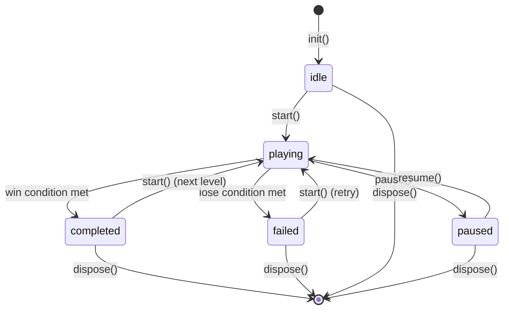
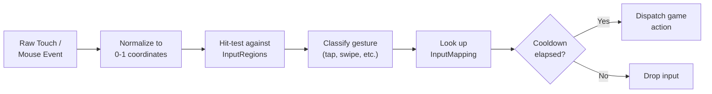
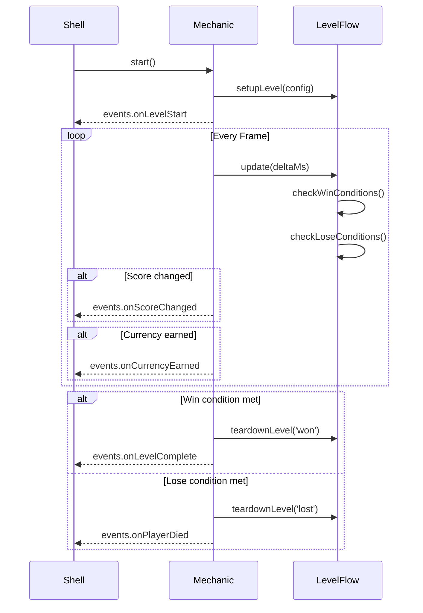

# Core Mechanics Vertical -- Interfaces

> Complete interface definitions for the Core Mechanics vertical. The canonical IMechanic contract lives in [SharedInterfaces](../00_SharedInterfaces.md#mechanic--shell-contract-imechanic); this file provides detailed method documentation, supporting interfaces, and design rationale.

---

## IMechanic (Full Contract)

The IMechanic interface is the slot contract between the gameplay module and the UI shell. The shell instantiates one IMechanic, calls its lifecycle methods, and subscribes to its events.

```typescript
interface IMechanic {
  // ─── Lifecycle ─────────────────────────────────────
  /**
   * Initialize the mechanic with its full configuration.
   * Called once before any other method. Must complete synchronously
   * or return a Promise that resolves within 2 seconds.
   * After init(), the mechanic is in the 'idle' state.
   *
   * @param config - Full mechanic configuration including type, theme,
   *                 initial difficulty, and level sequence.
   * @throws ConfigError if config is invalid or missing required fields.
   */
  init(config: MechanicConfig): void;

  /**
   * Start gameplay. Transitions from 'idle' or 'completed'/'failed' to 'playing'.
   * The mechanic begins rendering, accepting input, and updating game state.
   * Emits onLevelStart immediately.
   */
  start(): void;

  /**
   * Pause gameplay. Transitions from 'playing' to 'paused'.
   * All timers freeze, input is ignored, rendering continues (frozen frame).
   * The shell calls this on app-background, system overlay, or player-initiated pause.
   */
  pause(): void;

  /**
   * Resume gameplay. Transitions from 'paused' to 'playing'.
   * Timers resume, input is re-enabled.
   * A brief countdown (3-2-1) may be shown before gameplay resumes.
   */
  resume(): void;

  /**
   * Dispose of all resources. Called when the shell unmounts the mechanic.
   * Must release all textures, audio, timers, and event subscriptions.
   * After dispose(), the mechanic instance must not be reused.
   */
  dispose(): void;

  // ─── Difficulty Integration ────────────────────────
  /**
   * Apply new difficulty parameters. Called between levels or mid-level
   * (for adaptive difficulty). Parameters are key-value pairs where keys
   * match names from getAdjustableParams().
   *
   * Unknown keys are silently ignored. Out-of-range values are clamped
   * to the parameter's declared min/max.
   *
   * @param params - Map of parameter name to value.
   */
  setDifficultyParams(params: Record<string, number>): void;

  /**
   * Return the list of adjustable difficulty parameters this mechanic supports.
   * Used by the Difficulty Agent to generate difficulty curves.
   * Must return the same set of parameters across the mechanic's lifetime.
   *
   * @returns Array of parameter definitions with name, type, range, and defaults.
   */
  getAdjustableParams(): ParamDefinition[];

  // ─── State ─────────────────────────────────────────
  /**
   * Return the current state of the mechanic.
   * The shell uses this to update its UI (e.g., show pause overlay, end screen).
   *
   * @returns Current MechanicState value.
   */
  getCurrentState(): MechanicState;

  // ─── Events ────────────────────────────────────────
  /**
   * Event channels published by the mechanic, consumed by the shell
   * and other verticals. Uses the GameEvent pattern from SharedInterfaces.
   *
   * The mechanic MUST publish these events at the correct moments.
   * The shell subscribes during init() and unsubscribes during dispose().
   */
  readonly events: {
    /** Emitted when a level begins. Fires after start() or after advancing to next level. */
    onLevelStart: GameEvent<{ levelId: string; difficulty: DifficultyScore }>;

    /** Emitted when the player completes a level successfully. */
    onLevelComplete: GameEvent<LevelCompletePayload>;

    /** Emitted when the player fails (dies, runs out of time, etc.). */
    onPlayerDied: GameEvent<{ levelId: string; cause: string }>;

    /** Emitted whenever the score changes. Delta can be positive or negative. */
    onScoreChanged: GameEvent<{ score: number; delta: number }>;

    /** Emitted when the player earns currency through gameplay actions. */
    onCurrencyEarned: GameEvent<CurrencyAmount>;

    /** Emitted when the mechanic requests a pause (e.g., tutorial popup). */
    onPauseRequested: GameEvent<void>;
  };
}
```

---

## MechanicState

```typescript
/**
 * State machine for the mechanic's lifecycle.
 * Transitions are enforced -- invalid transitions throw StateError.
 */
type MechanicState = 'idle' | 'playing' | 'paused' | 'completed' | 'failed';
```

### State Transition Diagram



### Valid Transitions

| From | To | Trigger |
|------|----|---------|
| `idle` | `playing` | `start()` |
| `playing` | `paused` | `pause()` |
| `paused` | `playing` | `resume()` |
| `playing` | `completed` | Win condition met internally |
| `playing` | `failed` | Lose condition met internally |
| `completed` | `playing` | `start()` (advances to next level) |
| `failed` | `playing` | `start()` (retries current level) |
| Any | disposed | `dispose()` |

---

## MechanicConfig

```typescript
interface MechanicConfig {
  /** Mechanic type identifier. Must match a catalog entry. */
  mechanicType: string;

  /** Visual theme from the shell. Applied to in-level HUD elements. */
  theme: Theme;

  /** Starting difficulty parameters. Keys match getAdjustableParams() names. */
  initialDifficulty: Record<string, number>;

  /** Ordered sequence of levels to play through. */
  levelSequence: LevelConfig[];

  /** Scoring configuration for this mechanic instance. */
  scoring: ScoringConfig;

  /** Input mapping for this mechanic instance. */
  inputModel: InputModel;
}
```

See [DataModels.md](DataModels.md#mechanicconfig) for full schema with validation rules.

---

## LevelConfig

```typescript
interface LevelConfig {
  /** Unique identifier for this level. Format: "level_{number}" */
  levelId: string;

  /** Difficulty score from the difficulty curve. 1-10 integer. */
  difficulty: DifficultyScore;

  /** Mechanic-specific parameters for this level. */
  params: Record<string, number>;

  /** Win conditions. ALL must be satisfied. */
  winConditions: WinCondition[];

  /** Lose conditions. ANY triggers failure. */
  loseConditions: LoseCondition[];

  /** Time limit in seconds. 0 means no time limit. */
  timeLimitSeconds: number;

  /** Target scores for star ratings. */
  starThresholds: StarThresholds;
}

interface WinCondition {
  type: 'score_reached' | 'objectives_complete' | 'survive_duration' | 'collect_all' | 'defeat_all';
  target: number;
  description: string;
}

interface LoseCondition {
  type: 'time_expired' | 'health_depleted' | 'lives_exhausted' | 'objective_failed';
  description: string;
}

interface StarThresholds {
  /** Minimum score for 1 star. Completing the level without reaching this gives 0 stars. */
  oneStar: number;
  /** Minimum score for 2 stars. */
  twoStar: number;
  /** Minimum score for 3 stars. Must be achievable by skilled play. */
  threeStar: number;
}
```

---

## Input Handling Abstraction

The input system translates raw platform gestures into mechanic-specific game actions. This abstraction lets the same mechanic work across touch, mouse, and keyboard.

```typescript
interface InputModel {
  /** Which input patterns this mechanic uses. */
  supportedGestures: GestureType[];

  /** Mapping from gesture to game action. */
  mappings: InputMapping[];

  /** Screen regions that accept input. Normalized 0-1 coordinates. */
  inputRegions: InputRegion[];
}

type GestureType = 'tap' | 'double_tap' | 'swipe_left' | 'swipe_right'
                 | 'swipe_up' | 'swipe_down' | 'drag' | 'hold' | 'pinch'
                 | 'release';

interface InputMapping {
  /** The gesture that triggers this action. */
  gesture: GestureType;

  /** The game action performed. Mechanic-specific string. */
  action: string;

  /** Optional: minimum gesture magnitude (e.g., swipe distance in normalized units). */
  threshold?: number;

  /** Optional: cooldown in milliseconds before this gesture can trigger again. */
  cooldownMs?: number;

  /** Human-readable description for tutorials and help. */
  description: string;
}

interface InputRegion {
  /** Unique name for this region. */
  name: string;

  /** Normalized bounding box within the mechanic slot. (0,0) = top-left, (1,1) = bottom-right. */
  rect: { x: number; y: number; width: number; height: number };

  /** Which gestures this region accepts. Empty means all from supportedGestures. */
  acceptedGestures: GestureType[];
}
```

### Gesture Processing Pipeline



---

## Scoring System Interface

```typescript
interface ScoringConfig {
  /** Base points awarded per scoring action. */
  basePoints: number;

  /** Combo system configuration. null if no combo system. */
  combo: ComboConfig | null;

  /** Bonus point sources. */
  bonuses: BonusDefinition[];

  /** Score display format. */
  displayFormat: 'integer' | 'thousands_separator' | 'abbreviated';
}

interface ComboConfig {
  /** Number of consecutive actions to start a combo. */
  comboStartThreshold: number;

  /** Points multiplier per combo level. Formula: basePoints * (1 + comboLevel * comboMultiplier) */
  comboMultiplier: number;

  /** Maximum combo level. */
  maxComboLevel: number;

  /** Seconds of inactivity before combo resets. */
  comboTimeoutSeconds: number;
}

interface BonusDefinition {
  /** Name of the bonus. */
  name: string;

  /** When the bonus is awarded. */
  trigger: 'level_complete' | 'no_damage' | 'speed_clear' | 'full_collect' | 'combo_max';

  /** Points awarded. */
  points: number;

  /** Human-readable description. */
  description: string;
}
```

### Score Calculation Formula

```
totalScore = sum(actionScores) + sum(bonuses)

actionScore = basePoints * (1 + comboLevel * comboMultiplier)

stars = score >= threeStar ? 3
      : score >= twoStar   ? 2
      : score >= oneStar   ? 1
      : 0
```

---

## Level Flow Interface

```typescript
interface ILevelFlow {
  /**
   * Called when a level begins. Sets up entities, timers, and initial state.
   * @param config - The LevelConfig for this level.
   */
  setupLevel(config: LevelConfig): void;

  /**
   * The main update loop. Called every frame during the 'playing' state.
   * @param deltaMs - Milliseconds since last frame.
   */
  update(deltaMs: number): void;

  /**
   * Check if any win conditions are satisfied.
   * @returns The first satisfied win condition, or null.
   */
  checkWinConditions(): WinCondition | null;

  /**
   * Check if any lose conditions are triggered.
   * @returns The first triggered lose condition, or null.
   */
  checkLoseConditions(): LoseCondition | null;

  /**
   * Called when the level ends (win or lose). Cleans up level-specific state.
   * @param result - Whether the player won or lost.
   */
  teardownLevel(result: 'won' | 'lost'): void;
}
```

### Level Lifecycle Sequence



---

## ParamDefinition (Difficulty Parameter Contract)

```typescript
interface ParamDefinition {
  /** Parameter name. Snake_case. Must be unique within the mechanic. */
  name: string;

  /** Data type. Determines how the Difficulty Agent generates values. */
  type: 'float' | 'int';

  /** Minimum allowed value (inclusive). */
  min: number;

  /** Maximum allowed value (inclusive). */
  max: number;

  /** Default value. Used when no difficulty override is provided. */
  default: number;

  /** Human-readable description. Used in tooling and debugging. */
  description: string;
}
```

**Contract with Difficulty Agent:**
- The Mechanics Agent calls `getAdjustableParams()` to declare what can be tuned.
- The Difficulty Agent generates values within the declared ranges and calls `setDifficultyParams()`.
- Unknown parameter names in `setDifficultyParams()` are silently ignored.
- Out-of-range values are clamped to `[min, max]`.

---

## LevelCompletePayload

```typescript
interface LevelCompletePayload {
  /** Which level was completed. */
  levelId: string;

  /** Final score. */
  score: number;

  /** Stars earned (0-3). Based on star thresholds. */
  stars: number;

  /** Seconds spent in the level (excluding paused time). */
  timeSeconds: number;

  /** The difficulty score this level was played at. */
  difficulty: DifficultyScore;

  /** Reward tier derived from difficulty. See SharedInterfaces DIFFICULTY_REWARD_MAP. */
  rewardTier: RewardTier;
}
```

This payload is consumed by:
- **Economy Agent** -- to calculate currency rewards (using `rewardTier`).
- **Analytics Agent** -- to log `level_complete` events.
- **Difficulty Agent** -- to adapt future level difficulty based on performance.
- **Shell** -- to display the level-complete screen.

---

## Shared Type References

The following types are defined in [SharedInterfaces](../00_SharedInterfaces.md) and used by this vertical:

| Type | Defined In | Used For |
|------|-----------|----------|
| `DifficultyScore` | SharedInterfaces | Level difficulty (1-10) |
| `RewardTier` | SharedInterfaces | Reward mapping from difficulty |
| `CurrencyAmount` | SharedInterfaces | Currency earned events |
| `Theme` | SharedInterfaces | Visual theming of HUD |
| `GameEvent<T>` | SharedInterfaces | Event publish/subscribe pattern |
| `PlayerContext` | SharedInterfaces | Player segmentation (consumed, not produced) |

---

## Related Documents

- [Spec.md](Spec.md) -- Vertical specification and scope
- [DataModels.md](DataModels.md) -- JSON schemas for all data structures
- [AgentResponsibilities.md](AgentResponsibilities.md) -- Autonomy boundaries
- [MechanicCatalog.md](MechanicCatalog.md) -- Per-mechanic-type parameter definitions
- [SharedInterfaces](../00_SharedInterfaces.md) -- Cross-vertical contracts
- [Concepts: Slot](../../SemanticDictionary/Concepts_Slot.md) -- Slot architecture
