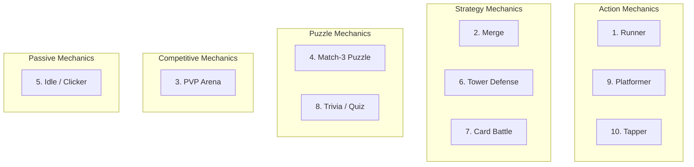

# Core Mechanics Vertical -- Mechanic Catalog

> Detailed catalog of all supported mechanic types. Each entry describes the genre, core loop, input model, scoring approach, difficulty parameters, and how the mechanic maps to the [IMechanic](Interfaces.md#imechanic) interface.

---

## Catalog Overview



| # | Type | Genre | Reference Game | Session Length | Complexity |
|---|------|-------|---------------|---------------|------------|
| 1 | Runner | Endless runner | Subway Surfers | 60-180s | Low |
| 2 | Merge | Merge/discovery | Merge Dragons | 120-600s | Medium |
| 3 | PVP Arena | Competitive | Clash Royale | 120-300s | High |
| 4 | Match-3 Puzzle | Puzzle | Candy Crush Saga | 60-180s | Medium |
| 5 | Idle/Clicker | Idle/incremental | Cookie Clicker | 30-300s | Low |
| 6 | Tower Defense | Strategy | Bloons TD 6 | 180-600s | High |
| 7 | Card Battle | TCG/strategy | Hearthstone | 180-600s | High |
| 8 | Trivia/Quiz | Knowledge | Trivia Crack | 30-120s | Low |
| 9 | Platformer | Action/platformer | Geometry Dash | 30-120s | Medium |
| 10 | Tapper | Timing/reflex | Piano Tiles | 15-60s | Low |

---

## 1. Runner

**Genre:** Endless runner
**Reference games:** Subway Surfers, Temple Run, Crossy Road

### Core Loop

```
Run forward (auto-scroll) --> Dodge obstacles (swipe) --> Collect coins/items -->
Score increases --> Speed ramps up --> Repeat until death or level end
```

### Input Model

| Gesture | Action | Description |
|---------|--------|-------------|
| `swipe_left` | `lane_left` | Move one lane to the left |
| `swipe_right` | `lane_right` | Move one lane to the right |
| `swipe_up` | `jump` | Jump over ground obstacles |
| `swipe_down` | `slide` | Slide under overhead obstacles |
| `tap` | `use_powerup` | Activate collected power-up (cooldown: 5s) |

### Scoring

- **Base:** 10 points per coin collected, 1 point per meter run
- **Combo:** Consecutive coins without hitting obstacles. Multiplier: `1 + (streak / 5) * 0.5`, max 3.0x
- **Bonuses:** No Hit (+500), Speed Demon (survive 30s at max speed, +1000), Full Collect (+300)
- **Star thresholds (typical):** 500 / 1500 / 3000

### Difficulty Parameters

| Parameter | Type | Min | Max | Default | Description |
|-----------|------|-----|-----|---------|-------------|
| `speed` | float | 1.0 | 20.0 | 5.0 | Forward movement speed (units/sec) |
| `obstacle_density` | float | 0.05 | 0.8 | 0.2 | Obstacles per screen length |
| `lane_count` | int | 2 | 5 | 3 | Number of parallel lanes |
| `obstacle_variety` | int | 1 | 8 | 3 | Distinct obstacle types |
| `powerup_frequency` | float | 0.0 | 0.5 | 0.15 | Powerup spawn chance per section |
| `coin_density` | float | 0.1 | 1.0 | 0.4 | Collectible coins per screen length |

### IMechanic Mapping

| IMechanic Method/Event | Runner Implementation |
|------------------------|---------------------|
| `init()` | Load lane geometry, obstacle pool, coin sprites |
| `start()` | Begin auto-scroll, spawn first obstacles |
| `pause()` / `resume()` | Freeze/resume scroll and timers |
| `onLevelStart` | Fires with speed and obstacle config |
| `onLevelComplete` | Fires when distance target reached (or endless: N/A) |
| `onPlayerDied` | Fires on 3rd obstacle hit; cause = obstacle type |
| `onScoreChanged` | Fires on each coin collect and distance milestone |
| `onCurrencyEarned` | Fires on coin collect; amount = coin value |

---

## 2. Merge

**Genre:** Merge/discovery
**Reference games:** Merge Dragons, EverMerge, Merge Mansion

### Core Loop

```
Drag items together --> Items merge into higher-tier item --> New items spawn -->
Discover new item types --> Fill board strategically --> Complete objectives
```

### Input Model

| Gesture | Action | Description |
|---------|--------|-------------|
| `drag` | `merge_item` | Drag item onto matching item to merge |
| `tap` | `select_item` | Select item to view info |
| `double_tap` | `quick_merge` | Auto-merge all matching adjacent items |
| `hold` | `show_info` | Show item chain and next merge result |

### Scoring

- **Base:** 50 points per merge, scaled by tier (tier * 50)
- **Combo:** Chain merges within 3s. Multiplier: `1 + chainLength * 0.25`, max 4.0x
- **Bonuses:** Discovery (+200 per new item type), Board Clear (+1000), Chain Master (5+ chain, +500)
- **Star thresholds (typical):** 1000 / 3000 / 6000

### Difficulty Parameters

| Parameter | Type | Min | Max | Default | Description |
|-----------|------|-----|-----|---------|-------------|
| `grid_width` | int | 3 | 9 | 5 | Grid columns |
| `grid_height` | int | 3 | 9 | 5 | Grid rows |
| `item_types` | int | 3 | 12 | 5 | Distinct mergeable item types |
| `merge_chain_max` | int | 3 | 10 | 5 | Max chain length before final item |
| `spawn_rate` | float | 0.5 | 5.0 | 2.0 | New items per merge action |
| `board_fill_start` | float | 0.1 | 0.7 | 0.3 | Initial board fill percentage |

### IMechanic Mapping

| IMechanic Method/Event | Merge Implementation |
|------------------------|---------------------|
| `init()` | Generate grid, populate initial items from `board_fill_start` |
| `start()` | Enable drag input, start level timer |
| `onLevelComplete` | All objectives met (target items merged) |
| `onPlayerDied` | Board full with no valid merges |
| `onScoreChanged` | On each merge; delta = tier * basePoints * comboMultiplier |
| `onCurrencyEarned` | On special item merge; amount varies by item tier |

---

## 3. PVP Arena

**Genre:** Asynchronous or real-time competitive
**Reference games:** Clash Royale, Brawl Stars, auto-battlers

### Core Loop

```
Match with opponent --> Deploy units/abilities --> Battle plays out -->
Win or lose --> Gain/lose trophies --> Upgrade units --> Rematch
```

### Input Model

| Gesture | Action | Description |
|---------|--------|-------------|
| `tap` | `deploy_unit` | Place unit at tapped location |
| `drag` | `aim_ability` | Drag to aim special ability |
| `hold` | `charge_ability` | Charge up ability power |
| `release` | `fire_ability` | Release charged ability |
| `swipe_up` | `cycle_hand` | Cycle through available units |

### Scoring

- **Base:** Damage dealt to opponent structures. 100 points per structure HP removed
- **Combo:** N/A (real-time combat, no combo system)
- **Bonuses:** Quick Win (win in < 60s, +500), Perfect (no structures lost, +1000), Overtime Clutch (+300)
- **Star thresholds:** 1 star = win, 2 stars = destroy 2+ structures, 3 stars = destroy all structures

### Difficulty Parameters

| Parameter | Type | Min | Max | Default | Description |
|-----------|------|-----|-----|---------|-------------|
| `ai_skill` | float | 0.1 | 1.0 | 0.5 | AI opponent skill level (reaction time, strategy) |
| `unit_count` | int | 4 | 12 | 8 | Units available per match |
| `match_duration` | int | 60 | 300 | 180 | Match time limit in seconds |
| `elixir_rate` | float | 0.5 | 3.0 | 1.0 | Resource regeneration rate (units/sec) |
| `arena_size` | int | 1 | 5 | 3 | Arena complexity tier |

### IMechanic Mapping

| IMechanic Method/Event | PVP Implementation |
|------------------------|-------------------|
| `init()` | Load arena, unit roster, matchmaking config |
| `start()` | Find opponent (AI or async), start countdown |
| `onLevelComplete` | Win condition: destroy opponent base or higher score at timeout |
| `onPlayerDied` | Lose condition: player base destroyed or lower score at timeout |
| `onScoreChanged` | On damage dealt; delta = damage amount |
| `onCurrencyEarned` | Post-match reward; amount varies by win/loss and trophy tier |

---

## 4. Match-3 Puzzle

**Genre:** Puzzle
**Reference games:** Candy Crush Saga, Bejeweled, Gardenscapes

### Core Loop

```
Swap adjacent pieces --> Match 3+ same-color --> Pieces clear, new fall -->
Cascades trigger --> Special pieces form from 4+/5+ matches --> Complete objectives
```

### Input Model

| Gesture | Action | Description |
|---------|--------|-------------|
| `swipe_left` | `swap_left` | Swap piece with left neighbor |
| `swipe_right` | `swap_right` | Swap piece with right neighbor |
| `swipe_up` | `swap_up` | Swap piece with upper neighbor |
| `swipe_down` | `swap_down` | Swap piece with lower neighbor |
| `tap` | `activate_special` | Activate a special piece in place |

### Scoring

- **Base:** 30 points per matched piece
- **Combo:** Cascade multiplier. Each cascade level adds 1.5x. Cascade 1 = 1.5x, cascade 2 = 2.0x, etc.
- **Bonuses:** No Moves Wasted (complete with 0 spare moves, +500), Cascade King (4+ cascades, +300), All Specials Used (+200)
- **Star thresholds (typical):** 3000 / 8000 / 15000

### Difficulty Parameters

| Parameter | Type | Min | Max | Default | Description |
|-----------|------|-----|-----|---------|-------------|
| `grid_width` | int | 5 | 10 | 7 | Grid columns |
| `grid_height` | int | 5 | 12 | 9 | Grid rows |
| `color_count` | int | 4 | 8 | 5 | Number of piece colors |
| `move_limit` | int | 5 | 50 | 20 | Maximum moves per level |
| `special_threshold` | int | 4 | 6 | 4 | Match length to create special piece |
| `blocker_density` | float | 0.0 | 0.3 | 0.05 | Percentage of cells with blockers |

### IMechanic Mapping

| IMechanic Method/Event | Match-3 Implementation |
|------------------------|----------------------|
| `init()` | Generate grid, validate solvability |
| `start()` | Enable swipe input, display objectives |
| `onLevelComplete` | All objectives met (clear N blockers, collect N items) |
| `onPlayerDied` | Moves exhausted without completing objectives |
| `onScoreChanged` | On each match + cascade; delta includes cascade multiplier |
| `onCurrencyEarned` | On level complete; scaled by remaining moves |

---

## 5. Idle/Clicker

**Genre:** Idle/incremental
**Reference games:** Cookie Clicker, Adventure Capitalist, Egg Inc

### Core Loop

```
Tap to earn --> Buy upgrades --> Earn passively --> Buy more upgrades -->
Prestige for permanent multiplier --> Restart loop at higher power
```

### Input Model

| Gesture | Action | Description |
|---------|--------|-------------|
| `tap` | `earn` | Tap to earn base currency |
| `double_tap` | `boost` | Temporary 2x earning boost (5s) |
| `hold` | `auto_tap` | Simulated rapid tapping while holding |
| `swipe_up` | `navigate_upgrades` | Open upgrade panel |
| `swipe_down` | `navigate_prestige` | Open prestige panel |

### Scoring

- **Base:** Currency earned is the score. Displayed in abbreviated format (1.2M, 3.4B)
- **Combo:** Tap speed multiplier. Sustained tapping > 5/sec = 1.5x, > 10/sec = 2.0x
- **Bonuses:** Prestige Bonus (permanent multiplier per prestige), Milestone (reach target amount, +fixed reward)
- **Star thresholds:** Based on currency milestones per session (varies by prestige level)

### Difficulty Parameters

| Parameter | Type | Min | Max | Default | Description |
|-----------|------|-----|-----|---------|-------------|
| `base_earn_rate` | float | 0.1 | 10.0 | 1.0 | Currency per tap |
| `passive_rate` | float | 0.0 | 100.0 | 0.5 | Currency per second (idle) |
| `upgrade_cost_scale` | float | 1.1 | 3.0 | 1.5 | Cost multiplier per upgrade level |
| `prestige_threshold` | float | 100.0 | 1e12 | 1000.0 | Currency needed to prestige |
| `prestige_multiplier` | float | 1.1 | 5.0 | 2.0 | Multiplier gained per prestige |
| `offline_earning_cap` | float | 0.1 | 1.0 | 0.5 | Fraction of online rate earned offline |

### IMechanic Mapping

| IMechanic Method/Event | Idle Implementation |
|------------------------|-------------------|
| `init()` | Load upgrade tree, restore offline earnings |
| `start()` | Begin passive earning timer, enable tapping |
| `pause()` | Switch to offline earning mode |
| `onLevelComplete` | Milestone reached (prestige threshold); level = prestige cycle |
| `onPlayerDied` | N/A (idle games have no fail state; map to prestige reset) |
| `onScoreChanged` | Continuous; fires at 1/sec intervals with accumulated delta |
| `onCurrencyEarned` | On tap and passive tick; amount = rate * multipliers |

---

## 6. Tower Defense

**Genre:** Strategy/tower defense
**Reference games:** Bloons TD 6, Kingdom Rush, Plants vs Zombies

### Core Loop

```
Wave announced --> Place/upgrade towers --> Wave spawns -->
Enemies traverse path --> Towers attack automatically --> Survive all waves
```

### Input Model

| Gesture | Action | Description |
|---------|--------|-------------|
| `tap` | `place_tower` | Place tower at tapped location |
| `drag` | `aim_tower` | Drag to set tower targeting direction |
| `hold` | `show_range` | Show tower attack range overlay |
| `double_tap` | `upgrade_tower` | Upgrade selected tower |
| `pinch` | `zoom_map` | Zoom in/out on the map |
| `swipe_left` | `cycle_tower_prev` | Cycle to previous tower type |
| `swipe_right` | `cycle_tower_next` | Cycle to next tower type |

### Scoring

- **Base:** 10 points per enemy defeated, scaled by enemy tier
- **Combo:** Kill streak within 2s. Multiplier: `1 + streak * 0.1`, max 3.0x
- **Bonuses:** Flawless Wave (no enemies reach end, +200), Efficient Build (under budget, +500 per unspent unit), Speed Clear (+300)
- **Star thresholds (typical):** 2000 / 5000 / 10000

### Difficulty Parameters

| Parameter | Type | Min | Max | Default | Description |
|-----------|------|-----|-----|---------|-------------|
| `wave_count` | int | 3 | 30 | 10 | Total waves per level |
| `enemies_per_wave` | int | 5 | 50 | 15 | Base enemies per wave (scales with wave number) |
| `enemy_hp_scale` | float | 0.5 | 5.0 | 1.0 | HP multiplier for enemies |
| `enemy_speed` | float | 0.5 | 3.0 | 1.0 | Movement speed multiplier |
| `starting_gold` | int | 100 | 1000 | 300 | Currency to place initial towers |
| `tower_types` | int | 3 | 10 | 5 | Number of available tower types |
| `path_complexity` | int | 1 | 5 | 2 | Map path branching and length |

### IMechanic Mapping

| IMechanic Method/Event | Tower Defense Implementation |
|------------------------|---------------------------|
| `init()` | Load map, path data, tower and enemy definitions |
| `start()` | Display map, enable tower placement, start wave 1 countdown |
| `onLevelComplete` | All waves survived |
| `onPlayerDied` | Too many enemies reached the end (lives depleted) |
| `onScoreChanged` | On each enemy defeat; delta = enemyTier * basePoints * streakMultiplier |
| `onCurrencyEarned` | On enemy defeat; gold for placing more towers |

---

## 7. Card Battle

**Genre:** TCG/collectible card game
**Reference games:** Hearthstone, Clash Royale (card aspect), Slay the Spire

### Core Loop

```
Draw hand --> Play cards (spend mana) --> Cards resolve effects -->
Opponent turn (AI) --> Manage health/board --> Win by depleting opponent HP
```

### Input Model

| Gesture | Action | Description |
|---------|--------|-------------|
| `drag` | `play_card` | Drag card from hand to board |
| `tap` | `select_target` | Select attack target |
| `hold` | `inspect_card` | View card details and stats |
| `swipe_left` | `end_turn` | End current turn |
| `swipe_right` | `view_discard` | View discard pile |

### Scoring

- **Base:** 100 points per damage dealt to opponent
- **Combo:** Cards played in synergistic sequence. Agent defines synergy pairs
- **Bonuses:** Lethal Puzzle (exact damage kill, +500), Card Advantage (end with more cards, +200), Untouched (+1000 for no damage taken)
- **Star thresholds:** 1 star = win, 2 stars = win with > 50% HP, 3 stars = win with > 80% HP

### Difficulty Parameters

| Parameter | Type | Min | Max | Default | Description |
|-----------|------|-----|-----|---------|-------------|
| `deck_size` | int | 10 | 40 | 20 | Cards in player deck |
| `hand_size` | int | 3 | 7 | 5 | Maximum cards in hand |
| `max_mana` | int | 3 | 15 | 10 | Maximum mana per turn (grows per turn) |
| `ai_skill` | float | 0.1 | 1.0 | 0.5 | AI opponent intelligence |
| `card_variety` | int | 5 | 30 | 12 | Distinct card types in pool |
| `opponent_hp` | int | 10 | 100 | 30 | Opponent starting health |

### IMechanic Mapping

| IMechanic Method/Event | Card Battle Implementation |
|------------------------|--------------------------|
| `init()` | Load card pool, build decks, set up board |
| `start()` | Draw opening hand, set mana to 1, begin turn 1 |
| `onLevelComplete` | Opponent HP reaches 0 |
| `onPlayerDied` | Player HP reaches 0 |
| `onScoreChanged` | On damage dealt; delta = damage * 100 |
| `onCurrencyEarned` | Post-match; scaled by stars and win/loss |

---

## 8. Trivia/Quiz

**Genre:** Knowledge/quiz
**Reference games:** Trivia Crack, QuizUp, HQ Trivia

### Core Loop

```
Question displayed --> Read question + answers --> Select answer before timer -->
Correct = points + streak --> Wrong = streak reset --> Complete all questions
```

### Input Model

| Gesture | Action | Description |
|---------|--------|-------------|
| `tap` | `select_answer` | Tap answer option (A/B/C/D) |
| `swipe_right` | `use_hint` | Use a hint (eliminate wrong answer) |
| `swipe_left` | `skip_question` | Skip question (if skips available) |

### Scoring

- **Base:** 100 points per correct answer
- **Combo:** Answer streak. Multiplier: `1 + streak * 0.25`, max 5.0x. Reset on wrong answer
- **Bonuses:** Speed Bonus (answer in < 3s, +50), Perfect Round (all correct, +500), No Hints (+200)
- **Star thresholds (typical):** 500 / 1200 / 2000

### Difficulty Parameters

| Parameter | Type | Min | Max | Default | Description |
|-----------|------|-----|-----|---------|-------------|
| `question_count` | int | 5 | 30 | 10 | Questions per round |
| `time_per_question` | int | 5 | 30 | 15 | Seconds to answer each question |
| `answer_count` | int | 2 | 6 | 4 | Number of answer options |
| `category_count` | int | 1 | 10 | 3 | Number of categories per round |
| `hint_count` | int | 0 | 5 | 2 | Available hints per round |
| `difficulty_tier` | int | 1 | 5 | 2 | Question difficulty level |

### IMechanic Mapping

| IMechanic Method/Event | Trivia Implementation |
|------------------------|---------------------|
| `init()` | Load question bank, select categories, shuffle |
| `start()` | Display first question, start timer |
| `onLevelComplete` | All questions answered (regardless of correctness) |
| `onPlayerDied` | N/A (or: 3 wrong answers = fail in challenge mode) |
| `onScoreChanged` | On each answer; delta = points * streakMultiplier (0 if wrong) |
| `onCurrencyEarned` | On correct answer; amount scales with difficulty tier |

---

## 9. Platformer

**Genre:** Action/platformer
**Reference games:** Geometry Dash, Super Meat Boy, Doodle Jump

### Core Loop

```
Run/scroll forward --> Jump over gaps/obstacles --> Collect items -->
Reach end of level --> Retry on death --> Master timing and patterns
```

### Input Model

| Gesture | Action | Description |
|---------|--------|-------------|
| `tap` | `jump` | Jump (height based on press duration for variable jump) |
| `hold` | `jump_high` | Extended jump (hold = higher arc) |
| `swipe_left` | `move_left` | Move character left (if not auto-runner) |
| `swipe_right` | `move_right` | Move character right (if not auto-runner) |
| `swipe_down` | `ground_pound` | Fast fall / ground slam |
| `double_tap` | `double_jump` | Second jump in air (if unlocked) |

### Scoring

- **Base:** 10 points per coin/collectible, 100 points per level section cleared
- **Combo:** Consecutive coins without landing. Air combo: `1 + airCoins * 0.3`, max 3.0x
- **Bonuses:** Speedrun (under par time, +500), All Coins (+300), No Death (+1000)
- **Star thresholds (typical):** 1000 / 3000 / 5000

### Difficulty Parameters

| Parameter | Type | Min | Max | Default | Description |
|-----------|------|-----|-----|---------|-------------|
| `scroll_speed` | float | 1.0 | 15.0 | 4.0 | Auto-scroll speed (units/sec) |
| `platform_gap` | float | 1.0 | 8.0 | 3.0 | Average gap between platforms (units) |
| `obstacle_density` | float | 0.05 | 0.6 | 0.2 | Obstacles per screen |
| `gravity` | float | 5.0 | 25.0 | 10.0 | Gravity strength (units/sec^2) |
| `jump_force` | float | 5.0 | 20.0 | 12.0 | Initial jump velocity |
| `collectible_density` | float | 0.1 | 1.0 | 0.4 | Coins per screen length |

### IMechanic Mapping

| IMechanic Method/Event | Platformer Implementation |
|------------------------|-------------------------|
| `init()` | Load level geometry, spawn collectibles and obstacles |
| `start()` | Begin scroll or player control, start timer |
| `onLevelComplete` | Reach end-of-level marker |
| `onPlayerDied` | Fall into pit, hit lethal obstacle; cause = "pit" / "spike" / etc. |
| `onScoreChanged` | On collect and section clear |
| `onCurrencyEarned` | On coin collect |

---

## 10. Tapper

**Genre:** Timing/reflex
**Reference games:** Piano Tiles, Flappy Bird, Tap Tap Revenge

### Core Loop

```
Targets appear in rhythm/sequence --> Tap at correct timing/position -->
Accuracy determines score --> Tempo increases --> Survive or complete song/pattern
```

### Input Model

| Gesture | Action | Description |
|---------|--------|-------------|
| `tap` | `hit_target` | Tap on or near a target at correct timing |
| `hold` | `sustain_note` | Hold for sustained targets (rhythm games) |
| `release` | `release_note` | Release at correct end time |
| `swipe_down` | `flick_target` | Flick target (variation for variety) |

### Scoring

- **Base:** Points based on timing accuracy: Perfect (100), Great (75), Good (50), Miss (0)
- **Combo:** Consecutive non-miss hits. Multiplier: `1 + streak * 0.1`, max 5.0x
- **Bonuses:** Full Combo (no misses, +1000), All Perfect (every hit is Perfect, +2000), Speed Demon (survive fast section, +300)
- **Star thresholds (typical):** 5000 / 12000 / 18000

### Difficulty Parameters

| Parameter | Type | Min | Max | Default | Description |
|-----------|------|-----|-----|---------|-------------|
| `tempo_bpm` | int | 60 | 240 | 120 | Beats per minute (target frequency) |
| `target_count` | int | 10 | 200 | 50 | Total targets per level |
| `lane_count` | int | 1 | 6 | 4 | Number of input lanes |
| `timing_window_ms` | int | 50 | 300 | 150 | Milliseconds for "Perfect" hit |
| `sustain_ratio` | float | 0.0 | 0.5 | 0.1 | Fraction of targets that are sustained |
| `tempo_ramp` | float | 0.0 | 2.0 | 0.5 | BPM increase per 25% of level |

### IMechanic Mapping

| IMechanic Method/Event | Tapper Implementation |
|------------------------|--------------------|
| `init()` | Load target sequence (generated or from pattern), set BPM |
| `start()` | Begin target scroll, enable hit detection |
| `onLevelComplete` | All targets have scrolled past (level finished) |
| `onPlayerDied` | Consecutive misses exceed threshold (e.g., 5 in a row) |
| `onScoreChanged` | On each target interaction; delta = accuracy points * comboMultiplier |
| `onCurrencyEarned` | On Perfect hits; amount = 1 coin per Perfect |

---

## Cross-Mechanic Comparison

### Input Complexity

| Mechanic | Gestures Used | Input Intensity | Cognitive Load |
|----------|--------------|-----------------|----------------|
| Runner | 5 (swipe 4-dir + tap) | High (reactive) | Low |
| Merge | 4 (drag, tap, double_tap, hold) | Low (deliberate) | Medium |
| PVP Arena | 5 (tap, drag, hold, release, swipe) | High (strategic + reactive) | High |
| Match-3 | 5 (swipe 4-dir + tap) | Medium (deliberate) | Medium |
| Idle/Clicker | 5 (tap, double_tap, hold, swipe 2-dir) | Very low (tap-wait) | Low |
| Tower Defense | 7 (tap, drag, hold, double_tap, pinch, swipe 2-dir) | Medium (planning) | High |
| Card Battle | 5 (drag, tap, hold, swipe 2-dir) | Low (turn-based) | High |
| Trivia | 3 (tap, swipe 2-dir) | Low (selection) | Medium (knowledge) |
| Platformer | 6 (tap, hold, swipe 4-dir, double_tap) | High (reactive) | Medium |
| Tapper | 4 (tap, hold, release, swipe_down) | Very high (rhythm) | Low |

### Difficulty Parameter Count

```mermaid
bar
    title Adjustable Parameters Per Mechanic
    "Runner" : 6
    "Merge" : 6
    "PVP Arena" : 5
    "Match-3" : 6
    "Idle" : 6
    "Tower Def" : 7
    "Card" : 6
    "Trivia" : 6
    "Platformer" : 6
    "Tapper" : 6
```

### Revenue Model Affinity

| Mechanic | Ad Revenue Fit | IAP Revenue Fit | Primary Monetization |
|----------|---------------|-----------------|---------------------|
| Runner | High (between runs) | Medium (cosmetics, revives) | Rewarded ads + cosmetics |
| Merge | Medium (between levels) | High (energy, premium items) | IAP energy + item packs |
| PVP Arena | Low (breaks flow) | High (card packs, battle pass) | Battle pass + card packs |
| Match-3 | High (between levels, on fail) | High (extra moves, boosters) | IAP boosters + rewarded ads |
| Idle/Clicker | High (rewarded boost) | Medium (premium currency) | Rewarded ads + premium skips |
| Tower Defense | Medium (between waves) | Medium (tower packs) | IAP tower unlocks + rewarded ads |
| Card Battle | Low (breaks immersion) | High (card packs, cosmetics) | Card packs + battle pass |
| Trivia | High (between rounds) | Low (hint packs) | Ad-supported + hint IAP |
| Platformer | High (on death, between levels) | Medium (level packs, cosmetics) | Rewarded ads + level packs |
| Tapper | High (between attempts) | Low (cosmetic themes) | Ad-supported + cosmetics |

---

## Adding New Mechanic Types

To add a new mechanic to the catalog:

1. **Define the entry** following the template above (core loop, input model, scoring, difficulty params, IMechanic mapping)
2. **Add the type** to the `mechanicType` enum in [DataModels.md](DataModels.md#mechanicconfig)
3. **Define parameters** as `ParamDefinition[]` in [DataModels.md](DataModels.md#per-mechanic-type-parameter-schemas)
4. **Register in SharedInterfaces** if the new type requires new event payloads (most will not)
5. **Validate** that the new type can implement all [IMechanic](Interfaces.md#imechanic) methods without exceptions

---

## Related Documents

- [Spec.md](Spec.md) -- Vertical specification and processing flow
- [Interfaces.md](Interfaces.md) -- IMechanic contract details
- [DataModels.md](DataModels.md) -- Schema definitions for MechanicConfig and parameters
- [AgentResponsibilities.md](AgentResponsibilities.md) -- Autonomy boundaries
- [SharedInterfaces](../00_SharedInterfaces.md) -- Cross-vertical contracts
- [Glossary: Mechanic](../../SemanticDictionary/Glossary.md#mechanic) -- Term definition
- [Glossary: Core Loop](../../SemanticDictionary/Glossary.md#core-loop) -- Term definition
- [Concepts: Curve](../../SemanticDictionary/Concepts_Curve.md) -- Difficulty curve patterns
