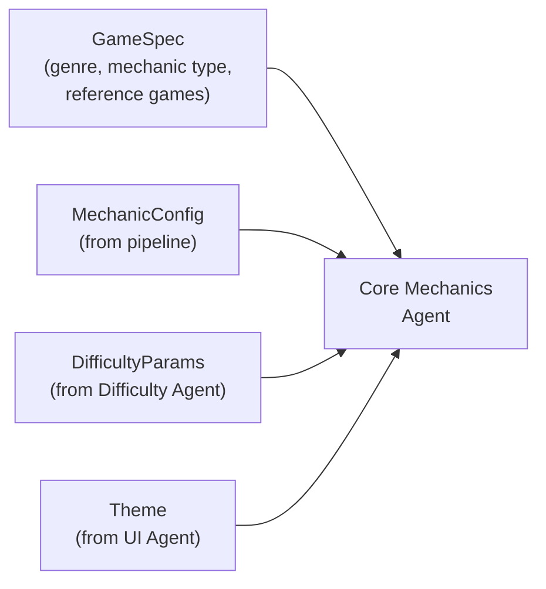
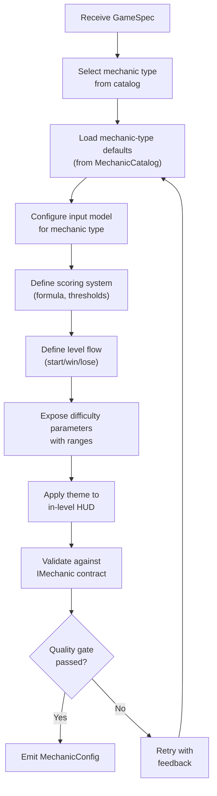
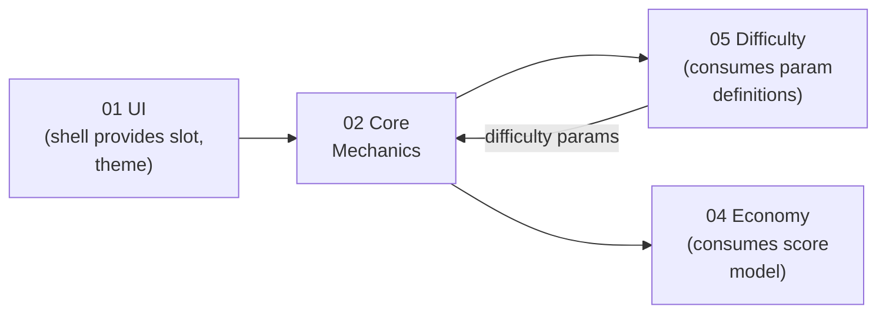

# Core Mechanics Vertical -- Specification

> Vertical 02 of 09. Owns the slottable gameplay module that plugs into the UI shell's mechanic slot.

---

## Purpose

Generate a modular core gameplay module that implements the [IMechanic](../00_SharedInterfaces.md#mechanic--shell-contract-imechanic) interface and renders within the shell's mechanic slot. The module delivers the moment-to-moment gameplay: input handling, scoring, level flow, in-level HUD, and difficulty integration.

Every game built by the AI Game Engine has exactly one core mechanic. The mechanic is what the player *does* -- the verb of the game. Everything else (menus, economy, ads, events) wraps around it.

---

## Scope

### In Scope

| Area | Description |
|------|-------------|
| **Gameplay logic** | Rules, physics, entity behavior, collision, state machines |
| **Input handling** | Mapping player gestures (tap, swipe, drag, hold) to game actions |
| **Scoring** | Score calculation, combo multipliers, star thresholds |
| **In-level HUD** | Score display, timer, health bar, progress indicator (rendered inside the mechanic slot) |
| **Level flow** | Start conditions, play phase, win/lose conditions, level transitions |
| **Difficulty integration** | Exposing adjustable parameters, accepting difficulty params from the Difficulty Agent |
| **Event emission** | Publishing gameplay events (`onLevelComplete`, `onScoreChanged`, etc.) to the shell |

### Out of Scope

| Area | Owner |
|------|-------|
| Shell UI (menus, shop, currency bar) | [UI Vertical](../01_UI/) |
| Economy balancing (earn rates, costs) | [Economy Vertical](../04_Economy/) |
| Difficulty curve generation | [Difficulty Vertical](../05_Difficulty/) |
| Ad placement and triggers | [Monetization Vertical](../03_Monetization/) |
| LiveOps event content | [LiveOps Vertical](../06_LiveOps/) |
| Art and audio assets | [Assets Vertical](../09_Assets/) |

---

## Inputs

| Input | Source | Schema |
|-------|--------|--------|
| `GameSpec` | Pipeline entry point | `{ genre: string, mechanicType: string, referenceGames: string[], targetAudience: string }` |
| `MechanicConfig` | Pipeline / previous pass | See [DataModels.md](DataModels.md#mechanicconfig) |
| `DifficultyParams` | Difficulty Agent | `Record<string, number>` -- per-mechanic adjustable parameters |
| `Theme` | UI Agent | See [SharedInterfaces: Theme](../00_SharedInterfaces.md#theme-contract) |

---

## Outputs

| Output | Consumer | Schema |
|--------|----------|--------|
| `MechanicConfig` (fully configured) | UI Agent, Economy Agent, Difficulty Agent | See [DataModels.md](DataModels.md#mechanicconfig) |
| `ParamDefinition[]` | Difficulty Agent | Adjustable difficulty parameter definitions |
| `InputModel` | UI Agent (for input system integration) | See [DataModels.md](DataModels.md#inputmodel) |
| `ScoreModel` | Economy Agent (for reward mapping) | See [DataModels.md](DataModels.md#scoremodel) |
| IMechanic implementation | Shell (runtime) | See [Interfaces.md](Interfaces.md#imechanic) |

---

## Processing Flow

### Step Details

1. **Select mechanic type.** Map `GameSpec.mechanicType` to one of the [catalog entries](MechanicCatalog.md). If the type is ambiguous, infer from `referenceGames`.

2. **Load defaults.** Each mechanic type has default input mappings, scoring formulas, and difficulty parameter sets. See [MechanicCatalog.md](MechanicCatalog.md) for per-type defaults.

3. **Configure input model.** Define which gestures the mechanic uses, what actions they map to, and the input regions on screen.

4. **Define scoring system.** Choose a scoring formula, combo rules, and star thresholds (1-star, 2-star, 3-star).

5. **Define level flow.** Specify start conditions (countdown? immediate?), play phase (timed? score-based? survival?), and end conditions (all objectives met? time runs out? player dies?).

6. **Expose difficulty parameters.** Each mechanic type has 3-8 adjustable parameters (speed, enemy count, time limit, etc.) with `min`, `max`, `default`, and `type`. These are consumed by the [Difficulty Vertical](../05_Difficulty/).

7. **Apply theme.** The in-level HUD (score, timer, health) uses the Theme from the UI Agent for font, color, and animation consistency.

8. **Validate.** Ensure the output conforms to [IMechanic](Interfaces.md#imechanic) and all [SharedInterfaces](../00_SharedInterfaces.md) contracts.

---

## Dependencies

| Dependency | Direction | What Flows |
|------------|-----------|------------|
| UI (01) | UI --> Mechanics | Theme, slot dimensions, input system |
| UI (01) | Mechanics --> UI | IMechanic implementation, events |
| Difficulty (05) | Mechanics --> Difficulty | `ParamDefinition[]` (what can be tuned) |
| Difficulty (05) | Difficulty --> Mechanics | `Record<string, number>` (actual values per level) |
| Economy (04) | Mechanics --> Economy | `ScoreModel`, `onCurrencyEarned` events |
| Analytics (08) | Mechanics --> Analytics | `level_start`, `level_complete`, `level_fail` events |

---

## Constraints

### Performance Budgets

| Metric | Budget | Rationale |
|--------|--------|-----------|
| Frame rate | 60 fps minimum during gameplay | Smooth gameplay feel |
| Input latency | < 50ms from gesture to visual response | Responsive controls |
| Level load time | < 2 seconds | No patience loss between levels |
| Memory footprint | < 100 MB for mechanic module | Mobile device constraints |
| Draw calls per frame | < 200 | GPU budget on low-end devices |

### Interface Constraints

- **Must implement [IMechanic](../00_SharedInterfaces.md#mechanic--shell-contract-imechanic)** -- all lifecycle methods, events, and state management.
- **Must render within slot area** -- the mechanic never draws outside its allocated screen rectangle.
- **Must accept difficulty params at runtime** -- `setDifficultyParams()` can be called between levels.
- **Must emit all required events** -- `onLevelStart`, `onLevelComplete`, `onPlayerDied`, `onScoreChanged`, `onCurrencyEarned`.
- **Must consume theme** -- in-level HUD uses the shell's `Theme` for visual consistency.

### Design Constraints

- **One mechanic per game** -- no hybrid mechanics (e.g., runner-merge). Pick one.
- **Mechanic-agnostic shell** -- the shell has no knowledge of the mechanic's internals.
- **No direct economy access** -- the mechanic emits `onCurrencyEarned` events; it never reads or writes currency balances directly.

---

## Success Criteria

| Criterion | Measurement | Threshold |
|-----------|-------------|-----------|
| **Core loop is fun** | Internal playtest score (1-10) | >= 7 |
| **Difficulty params are adjustable** | All exposed params accept values within declared range | 100% |
| **Events fire correctly** | All IMechanic events emit with valid payloads | 100% |
| **Schema compliance** | MechanicConfig passes JSON schema validation | 100% |
| **Performance** | Maintains 60 fps on target device tier | >= 95th percentile |
| **Input responsiveness** | Gesture-to-action latency | < 50ms |
| **Star balance** | 3-star achievable by skilled play, 1-star by average play | Verified by playtest |
| **Theme consistency** | In-level HUD visually matches shell UI | Visual review pass |

---

## Quality Gate Checklist

Before this vertical's output is accepted by downstream agents:

- [ ] `MechanicConfig` conforms to [DataModels.md](DataModels.md#mechanicconfig) schema
- [ ] IMechanic implementation has all lifecycle methods
- [ ] All 6 event channels are wired and emit valid payloads
- [ ] `getAdjustableParams()` returns 3+ parameter definitions
- [ ] Input model covers all required gestures for the mechanic type
- [ ] Scoring formula produces non-negative integers
- [ ] Star thresholds are ordered: 1-star < 2-star < 3-star
- [ ] In-level HUD uses `Theme` colors, fonts, and animation timings
- [ ] No rendering outside the mechanic slot area
- [ ] Performance budgets met on simulated low-end device

---

## Related Documents

- [Interfaces.md](Interfaces.md) -- Full IMechanic contract and supporting interfaces
- [DataModels.md](DataModels.md) -- All schemas for this vertical
- [AgentResponsibilities.md](AgentResponsibilities.md) -- What the Mechanics Agent decides vs coordinates
- [MechanicCatalog.md](MechanicCatalog.md) -- Detailed catalog of 10+ mechanic types
- [SharedInterfaces](../00_SharedInterfaces.md) -- Cross-vertical contracts
- [Glossary: Mechanic](../../SemanticDictionary/Glossary.md#mechanic) -- Term definition
- [Glossary: Core Loop](../../SemanticDictionary/Glossary.md#core-loop) -- Term definition
- [Concepts: Slot](../../SemanticDictionary/Concepts_Slot.md) -- How slots work
- [Concepts: Shell](../../SemanticDictionary/Concepts_Shell.md) -- Shell-mechanic boundary
