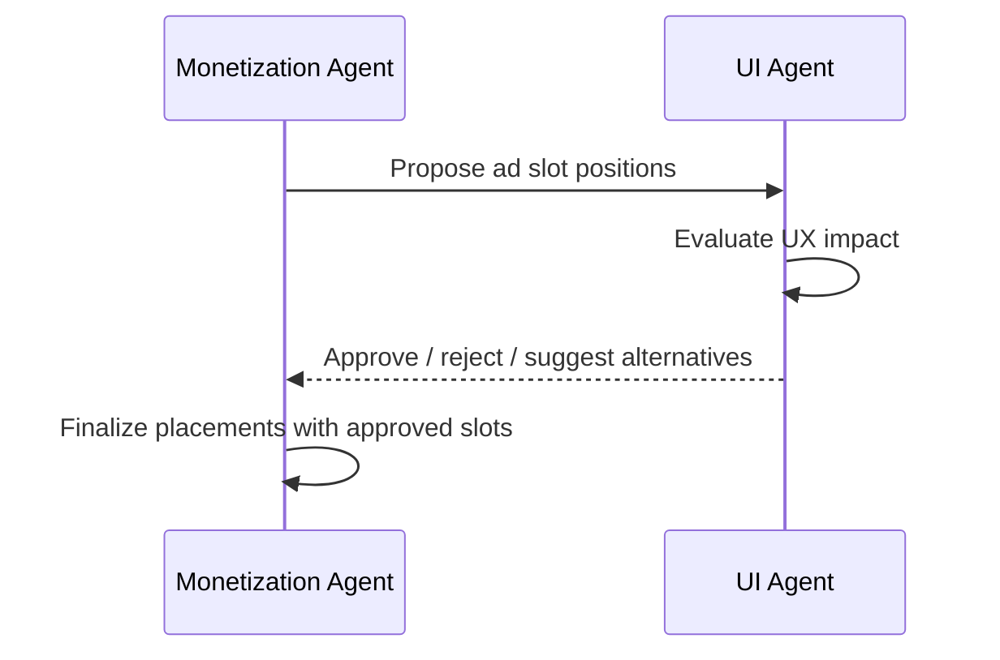

# Monetization Vertical -- Agent Responsibilities

> **Owner:** Monetization Agent
> **Version:** 1.0.0

---

## Overview

The Monetization Agent owns all revenue-generating touchpoints within the game. This document defines what the agent decides autonomously, what requires coordination with other verticals, quality criteria for its outputs, and known failure modes.

```mermaid
flowchart TD
    subgraph Autonomous Decisions
        AF[Ad Frequency Tuning]
        OT[Offer Timing]
        PP[IAP Price Points]
        MW[Mediation Waterfall Ordering]
        FP[Floor Price Adjustment]
        SR[Shop Section Rotation]
    end

    subgraph Coordinated Decisions
        AS[Ad Slot Positions -- with UI]
        PR[Pricing Strategy -- with Economy]
        CO[Compliance Rules -- with Legal]
        EO[Event Offers -- with LiveOps]
        EX[Experiment Design -- with AB Testing]
        SE[Segment Definitions -- with Analytics]
    end

    subgraph Quality Gates
        EC[Ethical Compliance Check]
        RV[Revenue Validation]
        RT[Retention Impact Check]
    end

    Autonomous Decisions --> Quality Gates
    Coordinated Decisions --> Quality Gates

    style Autonomous Decisions fill:#90ee90,stroke:#333
    style Coordinated Decisions fill:#87CEEB,stroke:#333
    style Quality Gates fill:#FFD700,stroke:#333
```

---

## Autonomous Decisions

The Monetization Agent makes these decisions independently, within the bounds of [ethical guardrails](EthicalGuardrails.md) and [compliance rules](Compliance.md).

### Ad Frequency Tuning

| Aspect | Detail |
|--------|--------|
| **What** | Adjust how often each ad format appears per session, per hour, per day |
| **Inputs** | Current ad metrics (fill rate, eCPM, opt-in rate), retention data, segment profiles |
| **Constraints** | Must respect frequency caps from [EthicalGuardrails](EthicalGuardrails.md) |
| **Output** | Updated `FrequencyCap` values in `AdPlacement` schemas |
| **Cadence** | Re-evaluated every tuning cycle (simulated weekly) |

**Decision logic:**

```typescript
// Pseudocode for frequency tuning
function tuneAdFrequency(
  placement: AdPlacement,
  metrics: AdMetrics,
  retentionDelta: number
): FrequencyCap {
  const currentCap = placement.frequencyCap;
  const ethicalMax = getEthicalMax(placement.format);

  // If retention is dropping, reduce frequency
  if (retentionDelta < -0.02) {
    return reduceCap(currentCap, 0.8); // 20% reduction
  }

  // If fill rate is low, reduce frequency (wasted requests)
  if (metrics.fillRate < 0.90) {
    return reduceCap(currentCap, 0.9);
  }

  // If opt-in rate is high and below ethical max, consider increase
  if (placement.format === 'rewarded' && metrics.optInRate > 0.60) {
    return increaseCap(currentCap, 1.1, ethicalMax);
  }

  return currentCap; // No change
}
```

### Offer Timing

| Aspect | Detail |
|--------|--------|
| **What** | Determine when contextual offers appear, delay durations, cooldowns |
| **Inputs** | Player lifecycle stage, recent behavior, purchase history, active offers |
| **Constraints** | No offers during FTUE; no dark patterns; respect impression limits |
| **Output** | Updated `OfferConfig.duration` and `OfferConfig.limits` values |
| **Cadence** | Continuous (per-trigger evaluation) |

### IAP Price Points

| Aspect | Detail |
|--------|--------|
| **What** | Set price tiers for each IAP product, bonus percentages for larger packs |
| **Inputs** | EconomyTable exchange rates, competitor benchmarks, segment spending data |
| **Constraints** | Must use standard app store price tiers; must respect spending caps |
| **Output** | `IAPProduct.priceTiers` and `IAPProduct.defaultPriceUsdCents` |
| **Cadence** | Set at plan generation; revised per AB test results |

### Mediation Waterfall Ordering

| Aspect | Detail |
|--------|--------|
| **What** | Order ad networks by expected eCPM, per format, per geo |
| **Inputs** | Historical eCPM data per network/format/geo |
| **Constraints** | Max 5 networks per waterfall; total timeout <= 10s |
| **Output** | Updated `WaterfallConfig.entries` ordering |
| **Cadence** | Re-evaluated per tuning cycle |

### Floor Price Adjustment

| Aspect | Detail |
|--------|--------|
| **What** | Set minimum eCPM thresholds per network to reject low-value impressions |
| **Inputs** | Rolling 7-day eCPM averages, fill rate per network |
| **Constraints** | Floor must not cause fill rate to drop below 90% |
| **Output** | Updated `WaterfallEntry.floorCpm` values |
| **Cadence** | Re-evaluated per tuning cycle |

### Shop Section Rotation

| Aspect | Detail |
|--------|--------|
| **What** | Select which products appear in daily deals and featured sections |
| **Inputs** | Product performance data, player segment, inventory |
| **Constraints** | Must not show items exceeding segment spending caps |
| **Output** | Updated `ShopSection.items` and `RefreshConfig.productPool` |
| **Cadence** | Daily (daily deals), weekly (featured) |

---

## Coordinated Decisions

These decisions require input from or agreement with other verticals. The Monetization Agent proposes; the partner vertical must approve or negotiate.

### Ad Slot Positions (with UI)



| Aspect | Detail |
|--------|--------|
| **What** | Where in the UI and gameplay flow ads can appear |
| **Partner** | UI vertical |
| **Protocol** | Monetization proposes positions; UI validates UX impact |
| **Conflict resolution** | UI has veto on positions that break UX principles |
| **Output** | Agreed `AdSlotDefinition[]` in ShellConfig |

### Pricing Strategy (with Economy)

| Aspect | Detail |
|--------|--------|
| **What** | IAP price points, premium currency exchange rates, reward values for ads |
| **Partner** | Economy vertical |
| **Protocol** | Economy sets exchange rates and faucet/sink balance; Monetization sets IAP prices within those constraints |
| **Conflict resolution** | Economy has veto on changes that break faucet/sink balance |
| **Output** | Aligned `PriceTier[]` and `RewardBundle` values |

### Compliance Rules (with Legal)

| Aspect | Detail |
|--------|--------|
| **What** | Legal requirements per region, age rating implications, store policies |
| **Partner** | External legal review (not an agent) |
| **Protocol** | Monetization encodes compliance rules; legal validates |
| **Conflict resolution** | Legal requirements always override design preferences |
| **Output** | Validated `EthicalConfig.regionalOverrides` |

### Event Offers (with LiveOps)

| Aspect | Detail |
|--------|--------|
| **What** | Limited-time offers tied to LiveOps events |
| **Partner** | LiveOps vertical |
| **Protocol** | LiveOps defines event schedule and theme; Monetization creates aligned offers |
| **Conflict resolution** | LiveOps owns event timing; Monetization owns offer pricing |
| **Output** | `OfferConfig` entries with `trigger: 'event_start'` |

### Experiment Design (with AB Testing)

| Aspect | Detail |
|--------|--------|
| **What** | Which monetization parameters to test, what variants to define |
| **Partner** | AB Testing vertical |
| **Protocol** | Monetization proposes hypotheses; AB Testing designs experiments |
| **Conflict resolution** | AB Testing owns methodology; Monetization owns parameter selection |
| **Output** | Experiment configurations targeting monetization metrics |

### Segment Definitions (with Analytics)

| Aspect | Detail |
|--------|--------|
| **What** | How player spending segments are defined (whale/dolphin/minnow/free thresholds) |
| **Partner** | Analytics vertical |
| **Protocol** | Analytics defines segmentation logic; Monetization consumes segments |
| **Conflict resolution** | Analytics owns segment boundaries; Monetization adapts strategies to them |
| **Output** | `PlayerContext.segments.spending` thresholds |

---

## Quality Criteria

### Revenue Targets

| Metric | Minimum | Target | Stretch | Source |
|--------|---------|--------|---------|--------|
| ARPDAU (casual) | $0.03 | $0.08 | $0.15 | [MetricsDictionary](../../SemanticDictionary/MetricsDictionary.md) |
| ARPDAU (mid-core) | $0.10 | $0.25 | $0.50 | [MetricsDictionary](../../SemanticDictionary/MetricsDictionary.md) |
| Payer conversion D30 | 1.5% | 3% | 5% | Industry benchmark |
| ARPPU monthly | $8 | $15 | $25 | Industry benchmark |

### Ethical Compliance

| Criteria | Measurement | Threshold |
|----------|-------------|-----------|
| Guardrail violations | Count per plan generation | **Zero tolerance** |
| Spending cap breaches | Count per 10,000 transactions | **Zero tolerance** |
| Dark pattern flags | Automated scan + manual review | **Zero tolerance** |
| Transparent odds compliance | Audit of all randomized purchases | 100% |
| FTUE ad protection | Verify no ads in sessions 1-3 | 100% |

### Ad Performance

| Metric | Minimum | Target |
|--------|---------|--------|
| Ad fill rate | 90% | 95%+ |
| Rewarded ad opt-in rate | 40% | 55%+ |
| eCPM (rewarded, US) | $8 | $15+ |
| eCPM (interstitial, US) | $4 | $8+ |
| Banner viewability | 50% | 70%+ |

### Retention Impact

| Metric | Maximum Allowed |
|--------|----------------|
| D1 retention drop (ads vs no-ads) | -2% |
| D7 retention drop (ads vs no-ads) | -3% |
| D30 retention drop (ads vs no-ads) | -5% |
| Session length reduction | -10% |

---

## Failure Modes

### Critical Failures (Immediate Action Required)

| Failure | Detection | Impact | Recovery |
|---------|-----------|--------|----------|
| Ethical guardrail violation | Automated validation rejects plan | Blocks deployment | Fix violation, regenerate plan, re-validate |
| Spending cap bypass | Runtime monitoring alert | Financial and legal risk | Emergency hotfix, refund affected players |
| Ads during FTUE | QA detection or player report | D1 retention crash | Disable ads, verify session counting logic |
| Undisclosed odds | Compliance audit or store review | App store rejection, legal exposure | Add odds display, resubmit for review |
| Store policy violation | App store rejection | Cannot publish update | Review [Compliance.md](Compliance.md), fix, resubmit |

### Degraded Performance

| Failure | Detection | Impact | Recovery |
|---------|-----------|--------|----------|
| Low ad fill rate (<80%) | Metrics dashboard | Revenue below target | Audit mediation config, add networks, lower floors |
| Low rewarded opt-in (<30%) | Metrics dashboard | Revenue and engagement loss | Review reward values, placement triggers, UX |
| High interstitial skip rate | Analytics events | Wasted impressions, poor UX | Reduce frequency, improve timing |
| IAP conversion below minimum | Cohort analysis | Revenue below target | Review pricing, offer timing, shop layout |
| Retention drop > thresholds | AB test comparison | Long-term revenue risk | Reduce ad frequency, review offer aggressiveness |

### Coordination Failures

| Failure | Detection | Impact | Recovery |
|---------|-----------|--------|----------|
| UI rejects all ad slot proposals | Handoff rejection | No ad revenue | Propose less intrusive alternatives |
| Economy rejects pricing | Handoff rejection | IAP catalog misaligned | Align exchange rates, adjust price tiers |
| LiveOps event schedule conflict | Calendar overlap detection | Offer cannibalization | Coordinate event and offer timing |
| AB test contaminates monetization metrics | Anomaly detection | Invalid experiment results | Isolate experiments, extend test duration |

---

## Decision Authority Matrix

Summary of who owns what, for quick reference.

| Decision | Owner | Approver | Veto Power |
|----------|-------|----------|------------|
| Ad frequency caps | Monetization | -- | Ethical guardrails |
| Ad slot positions | Monetization (propose) | UI | UI |
| IAP price points | Monetization | Economy | Economy |
| Offer timing | Monetization | -- | Ethical guardrails |
| Mediation waterfall | Monetization | -- | -- |
| Floor prices | Monetization | -- | -- |
| Shop layout | Monetization (content) | UI (rendering) | UI |
| Spending caps | Ethical guardrails | -- | Cannot be overridden |
| Compliance rules | Legal/Compliance | -- | Cannot be overridden |
| Segment definitions | Analytics | Monetization (consume) | Analytics |
| Event offer content | Monetization | LiveOps (timing) | LiveOps |
| Experiment parameters | Monetization (propose) | AB Testing (design) | AB Testing |

---

## Related Documents

- [Spec](Spec.md) -- Vertical specification
- [Interfaces](Interfaces.md) -- API contracts
- [Data Models](DataModels.md) -- Schema definitions
- [Ethical Guardrails](EthicalGuardrails.md) -- Hard rules
- [Compliance](Compliance.md) -- Legal requirements
- [Shared Interfaces](../00_SharedInterfaces.md) -- Cross-vertical contracts
- [Metrics Dictionary](../../SemanticDictionary/MetricsDictionary.md) -- KPI formulas
