# Monetization Vertical -- Compliance

> **Owner:** Monetization Agent
> **Version:** 1.0.0
> **Status:** Legal requirements override all design preferences. This document encodes rules; it does not constitute legal advice.

---

## Overview

This document catalogs the legal and platform regulations that constrain the Monetization Agent's outputs. Compliance rules are encoded into the `EthicalConfig.regionalOverrides` schema (see [DataModels.md](DataModels.md)) and enforced alongside [ethical guardrails](EthicalGuardrails.md).

```mermaid
flowchart TD
    subgraph Federal/International Law
        COPPA[COPPA - US]
        GDPR[GDPR - EU/EEA]
    end

    subgraph Platform Policies
        APPLE[Apple App Store]
        GOOGLE[Google Play]
    end

    subgraph Regional Regulations
        BE[Belgium - Loot Box Ban]
        CN[China - Real Name + Playtime]
        JP[Japan - Kompu Gacha Ban]
        NL[Netherlands - Loot Box Regulation]
        KR[South Korea - Probability Disclosure]
    end

    subgraph Rating Systems
        ESRB[ESRB - North America]
        PEGI[PEGI - Europe]
        IARC[IARC - International]
    end

    COPPA --> MP[MonetizationPlan]
    GDPR --> MP
    APPLE --> MP
    GOOGLE --> MP
    BE --> MP
    CN --> MP
    JP --> MP
    NL --> MP
    KR --> MP
    ESRB --> MP
    PEGI --> MP
    IARC --> MP

    style MP fill:#e8d44d,stroke:#333
```



---

## 1. COPPA (Children's Online Privacy Protection Act)

**Jurisdiction:** United States
**Applies when:** Game is directed at children under 13, or the operator has actual knowledge that a user is under 13.

### Requirements

| Requirement | Implementation |
|-------------|---------------|
| **Verifiable parental consent** | Must obtain consent before collecting personal data from children under 13 |
| **No behavioral advertising** | No targeted ads based on user behavior for under-13 users |
| **Limited data collection** | Collect only data necessary for the activity |
| **Parental access** | Parents can review, delete, and refuse further collection of child's data |
| **Data retention limits** | Retain child data only as long as necessary |
| **Secure data handling** | Reasonable security measures for child data |

### Monetization Impact

```typescript
interface COPPAConfig {
  /** Whether the game is directed at children under 13 */
  childDirected: boolean;

  /** Whether mixed-audience mode is enabled (some users are under 13) */
  mixedAudience: boolean;

  /** Ad networks approved for COPPA compliance */
  approvedAdNetworks: string[];

  /** Whether contextual (non-behavioral) ads are permitted */
  contextualAdsOnly: boolean;

  /** Whether IAP is disabled for under-13 users */
  iapDisabledForChildren: boolean;

  /** Parental consent verification method */
  consentMethod: 'credit_card' | 'government_id' | 'signed_form'
                | 'knowledge_based' | 'facial_recognition';
}
```

| Feature | Child-Directed App | Mixed-Audience App |
|---------|-------------------|-------------------|
| Behavioral ads | Prohibited | Prohibited for under-13 |
| Contextual ads | Allowed (COPPA-safe networks) | Allowed |
| IAP | Requires parental consent | Requires age gate + consent |
| Rewarded ads | Allowed (COPPA-safe networks) | Allowed with age verification |
| Data collection for analytics | Minimal, anonymized | Age-segmented policies |
| Push notifications | Parental consent required | Age-gated |

### COPPA-Compliant Ad Networks

| Network | COPPA-Certified | Notes |
|---------|----------------|-------|
| AdMob (child-directed mode) | Yes | Must enable child-directed flag |
| Unity Ads (COPPA mode) | Yes | Separate COPPA-compliant SDK |
| ironSource (COPPA mode) | Yes | Must enable COPPA flag |
| AppLovin (age-restricted mode) | Yes | Must configure age restrictions |

---

## 2. GDPR (General Data Protection Regulation)

**Jurisdiction:** European Union and European Economic Area
**Applies when:** Game is available to EU/EEA residents or processes their data.

### Requirements

| Requirement | Implementation |
|-------------|---------------|
| **Lawful basis for processing** | Consent or legitimate interest for each data type |
| **Consent management** | Clear opt-in (not pre-checked), granular per purpose |
| **Right to erasure** | Player can request deletion of all personal data |
| **Right to data portability** | Player can export their data in machine-readable format |
| **Data minimization** | Collect only what is necessary |
| **Privacy by design** | Data protection built into system architecture |
| **Data breach notification** | Notify authority within 72 hours of a breach |
| **DPO appointment** | Required if large-scale processing of children's data |

### Monetization-Specific GDPR Impact

| Monetization Feature | GDPR Requirement |
|---------------------|-----------------|
| Ad personalization | Explicit consent required; must offer non-personalized option |
| Player segmentation | Consent for profiling; must disclose segmentation logic |
| Purchase history tracking | Legitimate interest (fulfillment) but erasure must be supported |
| Analytics for monetization | Anonymized or consented data only |
| Cross-device tracking | Explicit consent required |
| Email marketing (offers) | Separate opt-in consent |

```typescript
interface GDPRConsentState {
  /** Whether the player has consented to personalized ads */
  personalizedAds: boolean;

  /** Whether the player has consented to analytics */
  analytics: boolean;

  /** Whether the player has consented to profiling (segmentation) */
  profiling: boolean;

  /** Whether the player has consented to marketing communications */
  marketing: boolean;

  /** Timestamp of consent */
  consentTimestamp: ISO8601;

  /** Version of privacy policy consented to */
  policyVersion: string;
}

function getAdConfig(consent: GDPRConsentState): AdRequestConfig {
  return {
    personalizedAds: consent.personalizedAds,
    // If no consent for personalized ads, serve contextual only
    contextualOnly: !consent.personalizedAds,
    // If no analytics consent, do not track ad performance per-user
    anonymizeTracking: !consent.analytics,
  };
}
```

---

## 3. Apple App Store Review Guidelines

**Applies to:** All iOS and macOS builds.

### IAP Requirements

| Rule | Guideline | Implementation |
|------|-----------|----------------|
| **All digital goods via Apple IAP** | 3.1.1 | No external payment links for digital content |
| **Restore purchases** | 3.1.1 | Must implement restore button for non-consumable and subscription IAP |
| **Clear subscription terms** | 3.1.2 | Display price, duration, renewal terms before purchase |
| **Free trial disclosure** | 3.1.2(a) | Clearly state when trial ends and what happens after |
| **No artificial scarcity** | 3.1.1 | Cannot falsely claim limited stock for digital goods |
| **Loot box odds** | 3.1.1 | Must disclose odds before purchase |
| **No pay-to-win in multiplayer** | 3.1.1 | Fair matchmaking regardless of spending |

### Ad Policies

| Rule | Guideline | Implementation |
|------|-----------|----------------|
| **No full-screen ads in small apps** | 3.1.1 | Interstitials must have clear dismiss button |
| **No deceptive ads** | 3.1.1 | Ads must not mimic system alerts or game UI |
| **Kids category restrictions** | 1.3 | No third-party analytics or ads in Kids category |
| **Ad tracking transparency** | 5.1.2(i) | Must use ATT framework for ad tracking on iOS 14.5+ |

### Subscription Rules

| Rule | Guideline |
|------|-----------|
| Must offer monthly option if offering longer terms | 3.1.2(a) |
| Auto-renewal disclosure before purchase | 3.1.2(a) |
| Easy cancellation path (link to Settings) | 3.1.2(a) |
| Grace period handling for failed renewals | 3.1.2(b) |
| Subscription group management | 3.1.2(c) |

---

## 4. Google Play Developer Policy

**Applies to:** All Android builds distributed via Google Play.

### Billing Policy

| Rule | Policy | Implementation |
|------|--------|----------------|
| **Google Play Billing for digital goods** | Payments policy | Use Google Play Billing Library |
| **Clear pricing** | Payments policy | Show price in local currency before purchase |
| **Refund support** | Payments policy | Process refund requests within 48 hours |
| **Subscription transparency** | Subscription policy | Clear terms, easy cancellation via Play Store |

### Ads Policy

| Rule | Policy | Implementation |
|------|--------|----------------|
| **No deceptive ads** | Ads policy | Ads must be distinguishable from content |
| **Interstitial dismiss** | Ads policy | Close button visible after 5 seconds max |
| **No accidental clicks** | Ads policy | Ad placement must not invite unintentional taps |
| **Personalized ads consent** | EU consent | Must use Google's consent framework for EEA users |

### Families Policy (Designed for Families)

| Rule | Families policy | Implementation |
|------|----------------|----------------|
| **Ad SDK certification** | Must use Google-certified ad SDKs for families | Limit to certified networks |
| **No behavioral targeting** | No interest-based or remarketing ads | Contextual ads only |
| **Age verification** | Must verify age at account/profile creation | Neutral age gate (date entry) |
| **IAP restrictions** | Parental authentication for purchases | Require device password/biometric |
| **No incentivized ads** | No rewarded ads that encourage excessive viewing | Cap rewarded views |

---

## 5. Regional Regulations

### Belgium -- Loot Box Ban

**Status:** Paid loot boxes classified as gambling since 2018.
**Applies when:** Game is available in Belgium (`BE`).

| Rule | Implementation |
|------|----------------|
| Paid loot boxes prohibited | Disable all randomized IAP for Belgian users |
| Loot boxes with earned currency | Allowed if currency cannot be purchased |
| Cosmetic-only loot boxes | Still prohibited if purchased with real money (directly or indirectly) |

```typescript
const BELGIUM_OVERRIDE: RegionalComplianceOverride = {
  country: 'BE',
  lootBoxBanned: true,
  realNameRequired: false,
  adRestrictions: {},
};
```

### China -- Real-Name Registration and Playtime Limits

**Status:** Enforced since 2021 (NPPA regulations).
**Applies when:** Game is available in China (`CN`).

| Rule | Implementation |
|------|----------------|
| Real-name registration required | All users must register with real name and national ID |
| Minors limited to 3 hours/week | Friday, Saturday, Sunday 20:00-21:00 only (under 18) |
| No IAP for minors without parental consent | Disable purchases for verified minors |
| Loot box odds disclosure mandatory | Show exact probabilities |
| Virtual currency purchase limits for minors | Monthly caps: under-8 none, 8-16 CNY 200, 16-18 CNY 400 |
| No rewards for first-login or daily-login for minors | Prevents "login habit" formation |

```typescript
const CHINA_OVERRIDE: RegionalComplianceOverride = {
  country: 'CN',
  lootBoxBanned: false, // Not banned, but odds must be disclosed
  realNameRequired: true,
  spendingCapOverride: {
    // Minors: stricter caps per Chinese regulation
    perMonth: 0,     // For under-8, handled by age check
  },
};
```

### Japan -- Kompu Gacha Ban

**Status:** Self-regulation since 2012 (JOGA guidelines).
**Applies when:** Game is available in Japan (`JP`).

| Rule | Implementation |
|------|----------------|
| Complete gacha prohibited | Cannot require collecting a full set of random items to receive a reward |
| Individual gacha allowed | Single random draws are permitted |
| Odds disclosure required | Must show probability for each item tier |
| Spending disclosure | Must show total amount spent in current session |

```typescript
const JAPAN_OVERRIDE: RegionalComplianceOverride = {
  country: 'JP',
  lootBoxBanned: false,
  realNameRequired: false,
  // Kompu gacha validation is handled by catalog validation
};

function validateNoKompuGacha(catalog: IAPCatalog): ValidationResult {
  for (const product of catalog.products) {
    if (product.category === 'bundle') {
      // Check if bundle requires collecting random items
      const requiresSetCollection = checkSetCollectionMechanic(product);
      if (requiresSetCollection) {
        return {
          valid: false,
          rule: 'JAPAN_KOMPU_GACHA',
          reason: `Product ${product.productId} uses kompu gacha mechanic`
        };
      }
    }
  }
  return { valid: true };
}
```

### Netherlands -- Loot Box Regulation

**Status:** Dutch Gaming Authority classifies some loot boxes as gambling.
**Applies when:** Game is available in Netherlands (`NL`).

| Rule | Implementation |
|------|----------------|
| Loot boxes with tradeable items are gambling | Disable if items can be traded/sold |
| Non-tradeable loot boxes | May be allowed but odds must be disclosed |
| Warning labels required | Display warning about random nature before purchase |

### South Korea -- Probability Disclosure

**Status:** Game Industry Promotion Act (2022 amendment).
**Applies when:** Game is available in South Korea (`KR`).

| Rule | Implementation |
|------|----------------|
| Probability disclosure mandatory | Show exact drop rates for all randomized items |
| Include enhanced/pity rates | If pity system exists, show effective rates |
| Monthly spending reports | Players can request their spending history |
| Cooling-off period | Allow refunds within 7 days of purchase (conditions apply) |

---

## 6. Age Rating Implications

### Rating Systems and Monetization Constraints

| Rating System | Region | Key Ratings |
|--------------|--------|-------------|
| ESRB | North America | E, E10+, T, M, AO |
| PEGI | Europe | 3, 7, 12, 16, 18 |
| IARC | International (digital) | Universal system for app stores |

### ESRB Ratings and Monetization

| Rating | Age | IAP Restrictions | Ad Restrictions | Loot Box |
|--------|-----|-----------------|-----------------|----------|
| **E (Everyone)** | All ages | Parental gate required | COPPA-safe networks only | Odds required; "includes random items" label |
| **E10+** | 10+ | Parental gate for under-13 | Age-appropriate content | Odds required |
| **T (Teen)** | 13+ | Standard | Standard | Odds required |
| **M (Mature)** | 17+ | Standard | Standard | Odds required |

**Important:** ESRB added "In-Game Purchases (Includes Random Items)" interactive element label. Games with randomized IAP must carry this label.

### PEGI Ratings and Monetization

| Rating | Age | IAP Restrictions | Ad Restrictions |
|--------|-----|-----------------|-----------------|
| **PEGI 3** | 3+ | No IAP without parental consent | No ads (recommended) |
| **PEGI 7** | 7+ | Parental gate required | Age-appropriate only |
| **PEGI 12** | 12+ | Parental gate for under-16 (GDPR) | Standard with consent |
| **PEGI 16** | 16+ | Standard with consent | Standard with consent |
| **PEGI 18** | 18+ | Standard | Standard |

### IARC (International Age Rating Coalition)

IARC provides a unified questionnaire-based rating that maps to local systems (ESRB, PEGI, USK, ClassInd, GRAC). Key monetization questions:

| Question | Impact |
|----------|--------|
| Does the app contain in-app purchases? | Flagged in store listing |
| Are purchases randomized (loot boxes)? | May increase age rating |
| Does the app contain advertising? | Flagged; child-directed apps restricted |
| Can users interact with each other? | May increase rating; affects ad targeting |
| Does the app share personal data with third parties? | Privacy implications for ratings |

---

## Implementation Checklist Per Platform

### iOS Checklist

- [ ] All digital content uses StoreKit / Apple IAP
- [ ] Restore purchases button implemented
- [ ] ATT (App Tracking Transparency) prompt before ad tracking
- [ ] Subscription terms displayed before purchase confirmation
- [ ] Loot box odds displayed before purchase
- [ ] Kids Category rules followed (if applicable)
- [ ] Privacy nutrition labels accurate in App Store Connect
- [ ] Sign in with Apple offered (if any third-party login)
- [ ] No external payment links for digital goods

### Android Checklist

- [ ] All digital content uses Google Play Billing Library
- [ ] GDPR consent dialog (UMP SDK) for EEA users
- [ ] Families Self-Certified Ads SDK Program compliance (if applicable)
- [ ] Data safety section accurate in Play Console
- [ ] Age verification for Designed for Families
- [ ] Subscription terms and cancellation disclosed
- [ ] Loot box odds displayed before purchase
- [ ] No deceptive ad placements

### Regional Compliance Checklist

- [ ] Belgium (`BE`): Paid loot boxes disabled
- [ ] China (`CN`): Real-name registration; minor playtime limits; spending caps
- [ ] Japan (`JP`): No kompu gacha; odds disclosed
- [ ] Netherlands (`NL`): Loot box warning labels; tradeable items checked
- [ ] South Korea (`KR`): Odds disclosed; spending reports available; cooling-off period

### Cross-Platform Checklist

- [ ] Spending caps enforced consistently across platforms
- [ ] Age verification consistent across platforms
- [ ] Consent state synchronized across platforms (for cross-platform accounts)
- [ ] Regional overrides applied based on user's region, not app store region
- [ ] Privacy policy covers all monetization data collection
- [ ] Terms of service covers IAP, subscriptions, and virtual currency

---

## Compliance Monitoring

| Activity | Frequency | Owner |
|----------|-----------|-------|
| Platform policy review | Quarterly | Monetization Agent + Legal |
| Regional regulation scan | Quarterly | Legal |
| Age rating re-evaluation | Per major update | Monetization Agent |
| COPPA audit | Annually | Legal + Privacy |
| GDPR data processing review | Annually | Privacy |
| Ad network certification check | Semi-annually | Monetization Agent |
| Spending cap verification | Monthly | Automated + Manual audit |

---

## Related Documents

- [Ethical Guardrails](EthicalGuardrails.md) -- Hard rules that supplement compliance
- [Spec](Spec.md) -- Vertical specification
- [Data Models](DataModels.md) -- `EthicalConfig`, `RegionalComplianceOverride` schemas
- [Interfaces](Interfaces.md) -- Enforcement APIs
- [Agent Responsibilities](AgentResponsibilities.md) -- Compliance coordination protocols
- [Glossary](../../SemanticDictionary/Glossary.md) -- Compliance, Dark Pattern definitions
