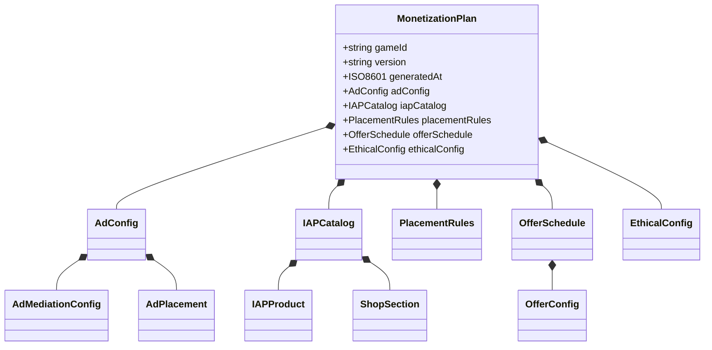
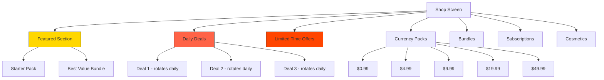

# Monetization Vertical -- Data Models

> **Owner:** Monetization Agent
> **Version:** 1.0.0
> **Depends on:** [SharedInterfaces.md](../00_SharedInterfaces.md) for base types

---

## Overview

This document defines the complete data schemas for all artifacts the Monetization Agent produces. The root artifact is `MonetizationPlan`, which contains all sub-schemas.



---

## 1. MonetizationPlan (Root Schema)

The top-level output artifact of the Monetization Agent.

```typescript
interface MonetizationPlan {
  /** Unique identifier for the game this plan targets */
  gameId: string;

  /** Semantic version of this plan */
  version: string;

  /** Timestamp when the agent generated this plan */
  generatedAt: ISO8601;

  /** Monetization tier from GameSpec */
  monetizationTier: 'ad_supported' | 'iap_focused' | 'hybrid';

  /** Target audience age range */
  targetAgeRange: { min: number; max: number };

  /** Ad configuration: mediation, placements, frequency */
  adConfig: AdConfig;

  /** In-app purchase catalog: products, shop layout */
  iapCatalog: IAPCatalog;

  /** Rules governing when ads and offers appear */
  placementRules: PlacementRules;

  /** Scheduled and contextual offers */
  offerSchedule: OfferSchedule;

  /** Ethical constraints and compliance flags */
  ethicalConfig: EthicalConfig;

  /** Revenue projections used for validation */
  revenueProjections: RevenueProjection;
}

interface RevenueProjection {
  /** Projected ARPDAU by source */
  arpdau: {
    ads: number;          // In cents
    iap: number;
    total: number;
  };
  /** Projected revenue mix percentages (must sum to 100) */
  revenueMix: {
    rewardedAds: number;
    interstitialAds: number;
    bannerAds: number;
    iap: number;
    subscriptions: number;
  };
  /** Projected payer conversion at D30 */
  payerConversionD30: number;
  /** Confidence interval */
  confidence: 'low' | 'medium' | 'high';
}
```

---

## 2. AdPlacement Schema

Defines a single ad placement: what triggers it, what format, how often, and what reward (if any).

```typescript
interface AdPlacement {
  /** Unique placement identifier */
  placementId: string;

  /** Human-readable name for dashboards */
  name: string;

  /** Ad format for this placement */
  format: 'banner' | 'interstitial' | 'rewarded';

  /** What game event triggers this placement */
  trigger: AdTrigger;

  /** Frequency capping rules */
  frequencyCap: FrequencyCap;

  /** Minimum cooldown between impressions at this placement */
  cooldownSeconds: number;

  /** Reward granted for watching (rewarded ads only) */
  reward?: RewardBundle;

  /** Whether the player can opt out (always true for rewarded) */
  playerOptIn: boolean;

  /** Priority when multiple placements compete */
  priority: number;

  /** Segments this placement applies to (empty = all) */
  targetSegments: string[];

  /** Segments excluded from this placement */
  excludeSegments: string[];

  /** Minimum session number before this placement activates */
  minSessionNumber: number;

  /** Whether this placement is currently active */
  enabled: boolean;
}

interface AdTrigger {
  /** Event that fires this trigger */
  event: 'level_complete' | 'level_fail' | 'screen_transition'
       | 'menu_open' | 'energy_depleted' | 'shop_visit'
       | 'daily_login' | 'session_start' | 'timed';

  /** Additional conditions that must be true */
  conditions: TriggerCondition[];

  /** For timed triggers: interval in seconds */
  intervalSeconds?: number;
}

interface TriggerCondition {
  /** Field to evaluate */
  field: string;           // e.g., "player.level", "session.duration"

  /** Comparison operator */
  operator: 'eq' | 'neq' | 'gt' | 'gte' | 'lt' | 'lte' | 'in';

  /** Value to compare against */
  value: string | number | boolean | string[];
}

interface FrequencyCap {
  /** Max impressions per session (-1 = unlimited) */
  perSession: number;

  /** Max impressions per hour */
  perHour: number;

  /** Max impressions per day */
  perDay: number;
}
```

### Standard Placement Templates

| Placement ID | Format | Trigger | Freq/Hour | Cooldown | Reward |
|-------------|--------|---------|-----------|----------|--------|
| `rewarded_level_fail` | Rewarded | `level_fail` | 6 | 30s | Continue from checkpoint |
| `rewarded_double_reward` | Rewarded | `level_complete` | 4 | 60s | 2x level reward |
| `rewarded_energy` | Rewarded | `energy_depleted` | 3 | 120s | 1 energy unit |
| `rewarded_daily_boost` | Rewarded | `daily_login` | 1 | N/A | 2x daily reward |
| `interstitial_level_end` | Interstitial | `level_complete` | 2 | 120s | None |
| `interstitial_transition` | Interstitial | `screen_transition` | 2 | 180s | None |
| `banner_main_menu` | Banner | `menu_open` | -1 | 0s | None |
| `banner_results` | Banner | `level_complete` | -1 | 0s | None |

---

## 3. IAPProduct Schema

Defines a single in-app purchase product with all metadata required for app store submission and in-game display.

```typescript
interface IAPProduct {
  /** Store product ID (must match Apple/Google product ID) */
  productId: string;

  /** Internal product name */
  name: string;

  /** Player-facing description */
  description: string;

  /** Product category */
  category: ProductCategory;

  /** Product type for store configuration */
  storeType: 'consumable' | 'non_consumable' | 'subscription';

  /** Price tiers for different regions */
  priceTiers: PriceTier[];

  /** Default price in USD (cents) */
  defaultPriceUsdCents: number;

  /** What the player receives */
  contents: RewardBundle;

  /** Store metadata for submission */
  storeMetadata: StoreMetadata;

  /** Visual display configuration */
  display: ProductDisplay;

  /** Availability rules */
  availability: ProductAvailability;

  /** For subscriptions: billing details */
  subscription?: SubscriptionConfig;
}

type ProductCategory =
  | 'currency_pack'
  | 'starter_pack'
  | 'bundle'
  | 'cosmetic'
  | 'subscription'
  | 'special_offer';

interface PriceTier {
  /** Apple/Google price tier number */
  tier: number;

  /** ISO 4217 currency code */
  currency: string;

  /** Price in smallest currency unit (cents, pence, etc.) */
  amount: number;

  /** Human-readable formatted price */
  formattedPrice: string;
}

interface StoreMetadata {
  /** Apple App Store product ID */
  appleProductId: string;

  /** Google Play product ID */
  googleProductId: string;

  /** Localized names per language (ISO 639-1) */
  localizedNames: Record<string, string>;

  /** Localized descriptions per language */
  localizedDescriptions: Record<string, string>;

  /** Review notes for app store reviewers */
  reviewNotes: string;
}

interface ProductDisplay {
  /** Icon asset reference */
  icon: AssetRef;

  /** Background color (hex) */
  backgroundColor: string;

  /** Badge to show on the item */
  badge?: 'new' | 'sale' | 'popular' | 'limited' | 'best_value';

  /** Original price for discount display */
  originalPrice?: Price;

  /** Discount percentage to display (0-100) */
  discountPercent?: number;

  /** Sort priority within its section */
  sortOrder: number;
}

interface ProductAvailability {
  /** Whether the product is currently available */
  enabled: boolean;

  /** Start date (null = always available) */
  startDate?: ISO8601;

  /** End date (null = never expires) */
  endDate?: ISO8601;

  /** Max purchases per player (null = unlimited) */
  purchaseLimit?: number;

  /** Required player level to see this product */
  minPlayerLevel: number;

  /** Segments that can see this product (empty = all) */
  targetSegments: string[];
}

interface SubscriptionConfig {
  /** Billing period */
  period: 'weekly' | 'monthly' | 'quarterly' | 'yearly';

  /** Free trial duration in days (0 = no trial) */
  freeTrialDays: number;

  /** Introductory offer price (cents) */
  introPrice?: number;

  /** Introductory offer duration in periods */
  introPeriods?: number;

  /** Grace period for failed renewals (days) */
  gracePeriodDays: number;

  /** Benefits granted while subscribed */
  benefits: SubscriptionBenefit[];
}

interface SubscriptionBenefit {
  type: 'ad_removal' | 'daily_reward' | 'exclusive_content'
      | 'currency_bonus' | 'cosmetic_access';
  description: string;
  value?: number;
}
```

### Standard IAP Products

| Product ID | Category | Price (USD) | Contents |
|-----------|----------|-------------|----------|
| `currency_pack_small` | Currency Pack | $0.99 | 100 premium |
| `currency_pack_medium` | Currency Pack | $4.99 | 550 premium (+10% bonus) |
| `currency_pack_large` | Currency Pack | $9.99 | 1200 premium (+20% bonus) |
| `currency_pack_xlarge` | Currency Pack | $19.99 | 2600 premium (+30% bonus) |
| `currency_pack_mega` | Currency Pack | $49.99 | 7000 premium (+40% bonus) |
| `starter_pack` | Starter Pack | $2.99 | 200 premium + 5000 basic + 3 items |
| `no_ads` | Non-Consumable | $4.99 | Remove interstitials permanently |
| `vip_monthly` | Subscription | $9.99/mo | Ad removal + daily premium + exclusives |

---

## 4. ShopSection Schema

Defines a section within the shop screen, controlling layout and content rotation.

```typescript
interface ShopSection {
  /** Unique section identifier */
  sectionId: string;

  /** Display name shown as section header */
  name: string;

  /** Section type determines layout and behavior */
  type: ShopSectionType;

  /** Products in this section */
  items: ShopSectionItem[];

  /** Display order in the shop (lower = higher) */
  sortOrder: number;

  /** Whether this section is collapsible */
  collapsible: boolean;

  /** Whether this section starts collapsed */
  defaultCollapsed: boolean;

  /** Refresh behavior for rotating content */
  refresh?: RefreshConfig;

  /** Section-level visibility rules */
  visibility: SectionVisibility;

  /** Section header styling */
  headerStyle: {
    backgroundColor?: string;
    icon?: AssetRef;
    countdown?: boolean;           // Show timer for expiring sections
  };
}

type ShopSectionType =
  | 'featured'        // Hero banner, 1-3 highlighted items
  | 'daily_deals'     // Rotating deals, refresh daily
  | 'currency_packs'  // Standard currency purchase options
  | 'bundles'         // Value bundles with multiple items
  | 'cosmetics'       // Visual customization items
  | 'subscriptions'   // Recurring purchase options
  | 'event_offers'    // LiveOps event-specific items
  | 'limited_time';   // Time-limited special offers

interface ShopSectionItem {
  /** Reference to an IAPProduct */
  productId: string;

  /** Position within the section */
  position: number;

  /** Override display settings for this context */
  displayOverride?: Partial<ProductDisplay>;
}

interface RefreshConfig {
  /** How often the section rotates content */
  interval: 'hourly' | 'daily' | 'weekly' | 'event_based';

  /** UTC hour when daily refresh occurs (0-23) */
  refreshHourUtc?: number;

  /** Number of items to show per rotation */
  itemsPerRotation: number;

  /** Pool of products to rotate through */
  productPool: string[];
}

interface SectionVisibility {
  /** Minimum player level to see this section */
  minPlayerLevel: number;

  /** Maximum player level (null = no max) */
  maxPlayerLevel?: number;

  /** Target segments (empty = all) */
  targetSegments: string[];

  /** Hide if player has no-ads purchase */
  hideIfNoAds: boolean;

  /** Only show during active LiveOps events */
  requireActiveEvent?: string;
}
```

### Standard Shop Layout



---

## 5. OfferConfig Schema

Defines a contextual or scheduled offer that appears outside the regular shop flow.

```typescript
interface OfferConfig {
  /** Unique offer identifier */
  offerId: string;

  /** Human-readable name */
  name: string;

  /** What triggers this offer to appear */
  trigger: OfferTriggerConfig;

  /** What is being offered */
  product: OfferProduct;

  /** How the offer is displayed */
  display: OfferDisplay;

  /** Time constraints */
  duration: OfferDuration;

  /** Pricing (may differ from catalog price) */
  pricing: OfferPricing;

  /** Targeting rules */
  targeting: OfferTargeting;

  /** Frequency and impression limits */
  limits: OfferLimits;

  /** Priority when multiple offers are eligible */
  priority: number;

  /** Whether this offer is currently active */
  enabled: boolean;
}

interface OfferTriggerConfig {
  /** Event that fires this trigger */
  event: 'level_complete' | 'level_fail' | 'session_start'
       | 'session_end' | 'currency_depleted' | 'milestone_reached'
       | 'return_from_churn' | 'event_start' | 'scheduled';

  /** Additional conditions */
  conditions: TriggerCondition[];

  /** For scheduled offers: cron-like schedule */
  schedule?: {
    startDate: ISO8601;
    endDate: ISO8601;
    daysOfWeek?: number[];     // 0=Sun, 6=Sat
    hoursUtc?: number[];       // Which hours to show
  };
}

interface OfferProduct {
  /** Reference to an IAPProduct (or inline definition) */
  productId?: string;

  /** Inline product definition for one-off offers */
  inlineProduct?: {
    name: string;
    contents: RewardBundle;
    storeType: 'consumable';
  };
}

interface OfferDisplay {
  /** Popup title */
  title: string;

  /** Popup subtitle/description */
  subtitle: string;

  /** Background image */
  backgroundImage: AssetRef;

  /** Item icon */
  itemIcon: AssetRef;

  /** Call-to-action button text */
  ctaText: string;

  /** Dismiss button text (must be clearly visible -- no dark patterns) */
  dismissText: string;

  /** Whether to show a countdown timer */
  showCountdown: boolean;

  /** Animation style */
  entryAnimation: 'slide_up' | 'fade_in' | 'scale_in';
}

interface OfferDuration {
  /** How long the offer is available after trigger */
  availableForSeconds: number;

  /** How long the popup stays on screen before auto-dismiss */
  displaySeconds: number;

  /** Minimum delay after trigger before showing (seconds) */
  delayAfterTrigger: number;
}

interface OfferPricing {
  /** Displayed price */
  price: Price;

  /** Original price for discount display */
  originalPrice?: Price;

  /** Discount percentage (calculated, for display) */
  discountPercent?: number;

  /** Whether this is a real discount or marketing framing */
  isGenuineDiscount: boolean;   // Must be true -- no fake discounts
}

interface OfferTargeting {
  /** Player segments to target */
  segments: string[];

  /** Minimum player level */
  minLevel: number;

  /** Maximum player level */
  maxLevel?: number;

  /** Minimum days since install */
  minDaysSinceInstall: number;

  /** Exclude players who already purchased this product */
  excludeExistingPurchasers: boolean;
}

interface OfferLimits {
  /** Max times this offer can be shown to one player */
  maxImpressionsPerPlayer: number;

  /** Cooldown between impressions (seconds) */
  impressionCooldownSeconds: number;

  /** Max purchases per player */
  maxPurchasesPerPlayer: number;

  /** Global max impressions across all players */
  globalMaxImpressions?: number;
}
```

### Standard Offer Templates

| Offer ID | Trigger | Product | Duration | Target |
|----------|---------|---------|----------|--------|
| `starter_offer` | `session_start` (session 3-5) | Starter Pack at 50% off | 24 hours | New players, level 3+ |
| `fail_continue` | `level_fail` (attempt >= 3) | Continue pack (3 continues) | 5 minutes | All segments |
| `currency_depleted` | `currency_depleted` | Small currency pack | 10 minutes | Minnow, dolphin |
| `comeback_offer` | `return_from_churn` | Welcome back bundle | 48 hours | Churned players |
| `milestone_reward` | `milestone_reached` | Milestone celebration pack | 1 hour | All segments |
| `weekend_special` | `scheduled` (Sat-Sun) | Weekend bundle | 48 hours | Engaged players |

---

## 6. AdMediationConfig Schema

Configures the ad mediation layer: which networks to use, in what order, with what floor prices.

```typescript
interface AdMediationConfig {
  /** Mediation provider */
  provider: 'max' | 'ironsource' | 'admob_mediation' | 'custom';

  /** Global settings */
  global: MediationGlobalConfig;

  /** Per-format waterfall configurations */
  waterfalls: Record<AdFormat, GeoWaterfallMap>;

  /** Network-specific credentials (references to secrets, never inline) */
  networkCredentials: NetworkCredentialRef[];

  /** A/B test overrides for mediation parameters */
  experimentOverrides?: Record<string, Partial<AdMediationConfig>>;
}

interface MediationGlobalConfig {
  /** Maximum time to wait for an ad to fill (seconds) */
  globalTimeoutSeconds: number;

  /** Whether to enable bidding (header bidding / in-app bidding) */
  biddingEnabled: boolean;

  /** Minimum eCPM to accept across all networks (cents) */
  globalFloorCpm: number;

  /** Whether to log mediation events for debugging */
  debugLogging: boolean;

  /** SDK initialization delay after app start (seconds) */
  initDelaySeconds: number;

  /** Maximum ad assets cached in memory (MB) */
  maxCacheMemoryMb: number;
}

type GeoWaterfallMap = Record<string, WaterfallConfig>;
// Key is ISO 3166-1 alpha-2 country code, "default" for fallback

interface WaterfallConfig {
  /** Ordered list of network entries */
  entries: WaterfallEntry[];

  /** Total timeout for this waterfall (seconds) */
  timeoutSeconds: number;

  /** Whether to use bidding for this format/geo */
  biddingEnabled: boolean;

  /** Auto-refresh interval for banners (seconds, 0 = no refresh) */
  autoRefreshSeconds?: number;
}

interface WaterfallEntry {
  /** Ad network identifier */
  network: AdNetwork;

  /** Priority in the waterfall (1 = first) */
  priority: number;

  /** Floor eCPM in cents -- reject responses below this */
  floorCpm: number;

  /** Per-network timeout (seconds) */
  timeoutSeconds: number;

  /** Whether this entry is currently active */
  enabled: boolean;

  /** Network-specific placement/zone ID */
  placementId: string;

  /** Whether this network supports bidding */
  supportsBidding: boolean;
}

type AdNetwork =
  | 'admob'
  | 'applovin'
  | 'ironsource'
  | 'unity_ads'
  | 'meta_audience'
  | 'vungle'
  | 'chartboost'
  | 'mintegral'
  | 'inmobi'
  | 'pangle';

interface NetworkCredentialRef {
  network: AdNetwork;
  /** Reference to secret store key -- NEVER store credentials inline */
  appKeyRef: string;
  /** Platform-specific IDs */
  platforms: {
    ios?: { appId: string; adUnitIds: Record<AdFormat, string> };
    android?: { appId: string; adUnitIds: Record<AdFormat, string> };
  };
}

type AdFormat = 'banner' | 'interstitial' | 'rewarded';
```

### Example Waterfall (US, Rewarded)

| Priority | Network | Floor eCPM | Timeout | Bidding |
|----------|---------|-----------|---------|---------|
| 1 | AppLovin | $25.00 | 5s | Yes |
| 2 | ironSource | $20.00 | 5s | Yes |
| 3 | AdMob | $15.00 | 5s | Yes |
| 4 | Unity Ads | $10.00 | 4s | No |
| 5 | Vungle | $8.00 | 4s | No |

---

## Ethical Config Schema

Embedded in `MonetizationPlan`, references [EthicalGuardrails.md](EthicalGuardrails.md).

```typescript
interface EthicalConfig {
  /** Spending caps by segment */
  spendingCaps: Record<string, SpendingLimits>;

  /** Ad frequency limits by segment */
  adFrequencyLimits: Record<string, FrequencyCap>;

  /** Minimum session number before any ads */
  noAdSessionThreshold: number;    // Default: 3 (FTUE)

  /** Whether loot box odds must be displayed */
  transparentOddsRequired: boolean; // Always true

  /** Whether parental gates are required for IAP */
  parentalGateRequired: boolean;

  /** Age rating this plan is designed for */
  targetAgeRating: 'everyone' | 'everyone_10+' | 'teen' | 'mature';

  /** Regions with special compliance rules */
  regionalOverrides: Record<string, RegionalComplianceOverride>;
}

interface RegionalComplianceOverride {
  /** ISO 3166-1 alpha-2 country code */
  country: string;

  /** Whether loot boxes are banned */
  lootBoxBanned: boolean;

  /** Whether real-name registration is required */
  realNameRequired: boolean;

  /** Additional spending caps for this region */
  spendingCapOverride?: Partial<SpendingLimits>;

  /** Whether specific ad formats are restricted */
  adRestrictions?: Partial<Record<AdFormat, boolean>>;
}
```

---

## Schema Validation Rules

All schemas are validated before the `MonetizationPlan` is accepted:

| Rule | Validation | Failure Action |
|------|-----------|----------------|
| No empty catalogs | `iapCatalog.products.length > 0` | Reject plan |
| Valid price tiers | All prices > 0, valid currency codes | Reject plan |
| Frequency caps set | All interstitial placements have caps | Reject plan |
| FTUE protection | `noAdSessionThreshold >= 3` | Reject plan |
| Spending caps present | All segments have spending limits | Reject plan |
| No orphan references | All `productId` refs resolve to catalog | Reject plan |
| Discount integrity | `isGenuineDiscount` must be verifiable | Reject plan |
| Reward values set | All rewarded placements have non-empty rewards | Reject plan |
| Waterfall non-empty | Every format has at least 1 network entry | Warn |
| Store IDs present | All products have Apple + Google IDs | Warn |

---

## Related Documents

- [Spec](Spec.md) -- Vertical specification
- [Interfaces](Interfaces.md) -- API contracts that use these schemas
- [Ethical Guardrails](EthicalGuardrails.md) -- Constraints on schema values
- [Compliance](Compliance.md) -- Regional overrides and legal schemas
- [Shared Interfaces](../00_SharedInterfaces.md) -- Base types (`Price`, `RewardBundle`, etc.)
- [Glossary](../../SemanticDictionary/Glossary.md) -- Term definitions
