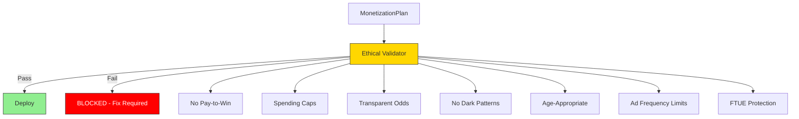
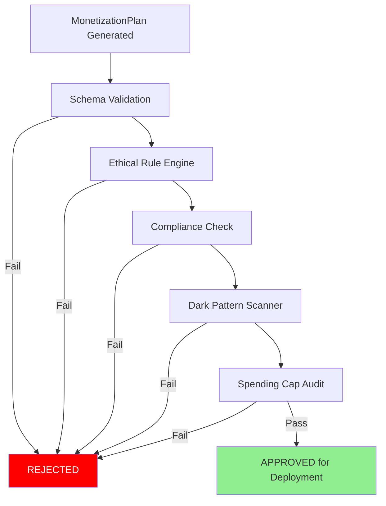
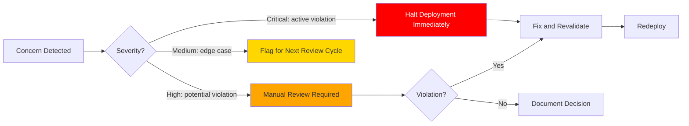

# Monetization Vertical -- Ethical Guardrails

> **Owner:** Monetization Agent
> **Version:** 1.0.0
> **Status:** These are HARD RULES. They cannot be overridden by any agent, experiment, or business decision.

---

## Overview

Ethical guardrails are non-negotiable constraints on the Monetization Agent. They exist to protect players -- especially vulnerable populations -- from exploitative practices. Violation of any guardrail is a **critical failure** that blocks deployment.



---

## Hard Rules

### 1. No Pay-to-Win

**Rule:** No IAP or ad-gated purchase may grant a gameplay advantage that cannot be earned through normal play.

| Allowed | Prohibited |
|---------|-----------|
| Cosmetic items (skins, themes, emotes) | Stat boosts purchasable only with real money |
| Time-skip (speed up wait timers) | Exclusive weapons/abilities behind paywall |
| Premium currency earnable in-game (slowly) | Levels/content locked behind IAP with no alternative |
| Convenience items (inventory expansion) | PvP matchmaking advantage for payers |
| Ad-skip / no-ads purchase | "Power-up" items with no free equivalent |

**Validation check:**

```typescript
function validateNoPayToWin(product: IAPProduct): ValidationResult {
  const contents = product.contents;

  // Check each item in the bundle
  for (const item of contents.items) {
    const itemDef = getItemDefinition(item.itemId);

    // FAIL if item grants combat/gameplay stats
    if (itemDef.grantsStats && !itemDef.earnableViaGameplay) {
      return {
        valid: false,
        rule: 'NO_PAY_TO_WIN',
        reason: `Item ${item.itemId} grants stats not earnable via gameplay`
      };
    }
  }

  return { valid: true };
}
```

### 2. Spending Caps

**Rule:** Per-session, per-day, and per-month spending limits are enforced by player segment. These caps cannot be bypassed.

#### Per-Segment Spending Caps

| Segment | Per Session | Per Day | Per Month | Lifetime |
|---------|------------|---------|-----------|----------|
| **New** (D0-D7) | $4.99 | $9.99 | $29.99 | $49.99 |
| **Free** | $9.99 | $19.99 | $49.99 | No cap |
| **Minnow** | $9.99 | $24.99 | $99.99 | No cap |
| **Dolphin** | $19.99 | $49.99 | $199.99 | No cap |
| **Whale** | $49.99 | $99.99 | $499.99 | No cap |
| **Minor** (under 18) | $4.99 | $9.99 | $29.99 | $99.99 |
| **Child** (under 13) | $0.00 | $0.00 | $0.00 | $0.00 |

**Implementation notes:**
- Caps are enforced at the API layer before purchase processing
- `validateSpendingCap()` in [Interfaces.md](Interfaces.md) must be called before every IAP
- When a cap is reached, the purchase button is disabled with a clear explanation
- No "ask parent" flow for children under 13 without verified parental consent (see [Compliance.md](Compliance.md))
- Spending data resets at midnight UTC (per-day) and first of month UTC (per-month)

```typescript
function enforceSpendingCap(
  player: PlayerContext,
  purchaseAmount: number  // cents
): SpendingCapCheck {
  const limits = getSpendingLimits(player.segments);
  const current = getCurrentSpend(player.playerId);

  // Check each cap level
  if (current.session + purchaseAmount > limits.perSession * 100) {
    return blocked('session', limits.perSession, current.session);
  }
  if (current.day + purchaseAmount > limits.perDay * 100) {
    return blocked('day', limits.perDay, current.day);
  }
  if (current.month + purchaseAmount > limits.perMonth * 100) {
    return blocked('month', limits.perMonth, current.month);
  }

  return { allowed: true, currentSpend: current };
}
```

### 3. Transparent Odds

**Rule:** All randomized purchases (loot boxes, gacha, mystery bundles) must display exact probabilities for every possible outcome before the player commits to purchase.

| Requirement | Detail |
|-------------|--------|
| Probability display | Every item/tier must show its drop rate as a percentage |
| Display timing | Odds must be visible BEFORE the purchase confirmation screen |
| Format | Plain text, minimum 12pt equivalent, not hidden behind a scroll or tap |
| Accuracy | Displayed odds must match the actual server-side random distribution exactly |
| Pity system disclosure | If a pity/mercy system exists, its mechanics must be described |
| Aggregate rates | For tiered systems, show both individual item rates and tier rates |

**Example display:**

```
╔══════════════════════════════════╗
║  Mystery Chest -- Drop Rates    ║
╠══════════════════════════════════╣
║  ★★★★★ Legendary:    2.0%      ║
║  ★★★★  Epic:         8.0%      ║
║  ★★★   Rare:        25.0%      ║
║  ★★    Uncommon:    35.0%      ║
║  ★     Common:      30.0%      ║
╠══════════════════════════════════╣
║  Pity: Guaranteed ★★★★+ after  ║
║  50 opens without one           ║
╚══════════════════════════════════╝
```

### 4. No Dark Patterns

**Rule:** No UI/UX design that manipulates players into unintended purchases or continued play against their interest.

#### Prohibited Dark Patterns

| Pattern | Definition | Example | Why It Is Banned |
|---------|-----------|---------|-----------------|
| **Fake urgency** | False countdown timers or limited stock claims | "Only 2 left!" when supply is infinite | Pressures irrational decisions |
| **Confirm-shaming** | Dismissal text that guilts the player | "No thanks, I don't want to be awesome" | Emotional manipulation |
| **Hidden costs** | Fees or requirements revealed only after commitment | "Processing fee" added at checkout | Deceptive pricing |
| **Forced continuity** | Auto-renewal without clear disclosure and easy cancellation | Subscription with no cancel button | Traps players in unwanted payments |
| **Bait and switch** | Advertising one offer, delivering another | "50% off!" but base price was inflated | Deception |
| **Guilt mechanics** | In-game characters expressing sadness at not purchasing | Pet crying when player declines purchase | Emotional exploitation |
| **Obstruction** | Making it deliberately hard to cancel, unsubscribe, or dismiss | Tiny "X" button on offer popup | Manipulative UX |
| **Nagging** | Repeatedly showing dismissed offers | Same popup after every level | Wearing down resistance |
| **Sneak into basket** | Adding items to cart without consent | Auto-adding "protection" to purchase | Unauthorized charges |

**Validation checklist for every offer popup:**

```typescript
interface DarkPatternCheck {
  // Dismiss button must be at least 44x44px (Apple HIG minimum)
  dismissButtonMinSize: { width: 44; height: 44 };

  // Dismiss text must be neutral ("No thanks", "Maybe later", "Close")
  dismissTextNeutral: boolean;

  // No countdown unless offer genuinely expires
  countdownIsReal: boolean;

  // If discount shown, original price must be the real historical price
  discountIsGenuine: boolean;

  // Maximum impressions per player per offer (see OfferLimits)
  maxImpressions: number;

  // Minimum cooldown between showing the same offer (seconds)
  minCooldownSeconds: number;
}
```

### 5. Age-Appropriate Monetization

**Rule:** No IAP prompts or purchase flows presented to minors (under 18) without appropriate gating. No IAP of any kind for children under 13 without verified parental consent.

| Age Group | IAP Allowed | Ad Types Allowed | Parental Gate | Spending Cap |
|-----------|-------------|------------------|---------------|-------------|
| Under 13 | No (without parental consent) | Rewarded only (COPPA-compliant networks) | Required for all purchases | $0/session |
| 13-17 | Yes (with gate) | All formats (age-appropriate content) | Required for purchases > $4.99 | $29.99/month |
| 18+ | Yes | All formats | Not required | Per-segment caps apply |

**Parental gate implementation:**
- Must require an action a child cannot easily perform (e.g., math problem, text entry, age verification)
- Must NOT be a simple "Are you over 18?" checkbox
- Gate result is cached for the session only -- re-prompted each new session
- See [Compliance.md](Compliance.md) for COPPA-specific requirements

### 6. Ad Frequency Limits

**Rule:** Hard caps on ad impressions to prevent ad fatigue and protect player experience.

#### Interstitial Ad Limits

| Metric | Limit | Rationale |
|--------|-------|-----------|
| Per hour | 3 max | Prevents session disruption |
| Per session | 5 max | Bounds total session interruption |
| Per day | 15 max | Prevents daily fatigue |
| Minimum cooldown | 120 seconds | Ensures gameplay between ads |
| Post-purchase cooldown | 300 seconds | Respects payer goodwill |

#### Rewarded Ad Limits

| Metric | Limit | Rationale |
|--------|-------|-----------|
| Per hour | 6 max | Higher because voluntary |
| Per session | 10 max | Prevents economy flooding |
| Per day | 20 max | Bounds daily reward income |
| Minimum cooldown | 30 seconds | Brief pause between views |

#### Banner Ad Limits

| Metric | Limit | Rationale |
|--------|-------|-----------|
| Refresh interval | 30 seconds min | Store policy compliance |
| Screens with banners | Non-gameplay screens only | No gameplay obstruction |
| Size | 320x50 max (phone), 728x90 (tablet) | Standard IAB sizes |

#### Segment-Based Ad Frequency Profiles

| Segment | Interstitials/Hour | Rewarded/Hour | Banners |
|---------|-------------------|---------------|---------|
| **Whale** | 0 (auto-disabled) | 3 | Disabled |
| **Dolphin** | 1 | 4 | Disabled |
| **Minnow** | 2 | 6 | Enabled |
| **Free** | 3 | 6 | Enabled |
| **New** (D0-D7) | 1 | 3 | Disabled |
| **Minor** | 1 | 3 | Disabled |
| **Child** | 0 | 2 (COPPA networks only) | Disabled |

### 7. No Ads During FTUE

**Rule:** No advertisements of any format during the first 3 sessions (FTUE period).

| Session | Ads Allowed | Offers Allowed | Shop Visible |
|---------|-------------|----------------|-------------|
| 1 | None | None | Hidden |
| 2 | None | None | Hidden |
| 3 | None | None | Visible (browse only) |
| 4+ | Per segment rules | Per segment rules | Full functionality |

**Rationale:** The first 3 sessions determine D1 and D3 retention. Any monetization friction during FTUE dramatically reduces retention. See [Metrics Dictionary](../../SemanticDictionary/MetricsDictionary.md) for retention benchmarks.

**Implementation:**
- Session count is tracked per `PlayerContext.sessionCount`
- The `noAdSessionThreshold` in `EthicalConfig` is set to 3 minimum
- Ad SDK initialization is deferred until session 4 (saves ~800ms cold start)

---

## Enforcement Mechanism



### Validation Pipeline

| Stage | What It Checks | Pass Criteria |
|-------|---------------|---------------|
| Schema Validation | All required fields present, types correct | Zero schema errors |
| Ethical Rule Engine | All 7 hard rules satisfied | Zero violations |
| Compliance Check | Regional rules applied correctly | All regions compliant |
| Dark Pattern Scanner | Offer displays, dismiss buttons, urgency claims | Zero dark patterns detected |
| Spending Cap Audit | All segments have caps, caps are within limits | All caps set and reasonable |

### Runtime Enforcement

Beyond plan-time validation, these rules are also enforced at runtime:

| Check | When | Action on Failure |
|-------|------|-------------------|
| Spending cap | Before every IAP | Block purchase, show explanation |
| Ad frequency | Before every ad request | Suppress ad, log event |
| FTUE protection | Before every ad/offer | Suppress if session < threshold |
| Age gate | Before IAP for minors | Show parental gate |
| Odds display | Before randomized purchase | Show odds panel |

---

## Review Checklist for New Monetization Features

Before any new monetization feature (new ad placement, new IAP product, new offer type) can be added to the `MonetizationPlan`, it must pass this checklist:

### Pre-Approval Checklist

- [ ] **Pay-to-win check:** Does this feature grant any gameplay advantage not earnable through play?
- [ ] **Spending cap compliance:** Are spending caps respected for all segments?
- [ ] **Transparent odds:** If randomized, are exact probabilities displayed?
- [ ] **Dark pattern scan:** Does any UI element use fake urgency, confirm-shaming, or guilt?
- [ ] **Age-appropriate:** Is the feature gated appropriately for minors?
- [ ] **Ad frequency:** Does adding this placement exceed any frequency cap?
- [ ] **FTUE protection:** Is the feature disabled during the first 3 sessions?
- [ ] **Dismiss affordance:** Can the player clearly and easily dismiss any popup?
- [ ] **Genuine pricing:** Are all discounts based on real historical prices?
- [ ] **Compliance:** Does the feature comply with all regions in [Compliance.md](Compliance.md)?

### Post-Launch Monitoring

- [ ] **Retention impact:** D7 retention delta within -3% of no-ads baseline
- [ ] **Spending distribution:** No anomalous spending spikes in vulnerable segments
- [ ] **Complaint monitoring:** Player support tickets mentioning the feature
- [ ] **Store review flags:** Any app store review issues related to the feature
- [ ] **Ad performance:** Fill rate and eCPM within expected ranges

---

## Escalation Protocol

When an ethical concern is raised:



| Severity | Example | Response Time | Action |
|----------|---------|--------------|--------|
| Critical | Spending cap bypassed in production | Immediate | Halt, fix, redeploy |
| High | New offer type may violate dark pattern rules | Before next deployment | Manual review, approve/reject |
| Medium | Edge case in age gating for 13-year-olds | Next review cycle | Document, add test case |
| Low | Suggestion to improve odds display formatting | Backlog | Track for future improvement |

---

## Related Documents

- [Spec](Spec.md) -- Vertical specification
- [Compliance](Compliance.md) -- Legal requirements that supplement these guardrails
- [Agent Responsibilities](AgentResponsibilities.md) -- How the agent enforces these rules
- [Data Models](DataModels.md) -- `EthicalConfig` schema
- [Interfaces](Interfaces.md) -- `validateSpendingCap()`, `shouldShowAd()` enforcement APIs
- [Glossary](../../SemanticDictionary/Glossary.md) -- Dark Pattern, Ethical Guardrail definitions
