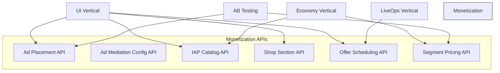

# Monetization Vertical -- Interfaces

> **Owner:** Monetization Agent
> **Version:** 1.0.0
> **Depends on:** [SharedInterfaces.md](../00_SharedInterfaces.md) for `IAdUnit`, `IShopItem`, `PlayerContext`, `Price`, `RewardBundle`

---

## Overview

This document defines the API contracts the Monetization vertical exposes to other verticals and the contracts it consumes. All cross-vertical communication uses the [GameEvent](../00_SharedInterfaces.md) pattern -- no direct method calls across boundaries.



---

## 1. Ad Placement API

Defines where, when, and how often ads appear. The UI vertical consumes this API to render ad units at the correct moments.

```typescript
/**
 * Ad Placement API
 * Consumed by: UI vertical (ad rendering), Runtime (SDK triggers)
 * References: IAdUnit from SharedInterfaces
 */

interface IAdPlacementService {
  /**
   * Returns all ad placements for the current game configuration.
   * Placements are pre-filtered by ethical guardrails and compliance rules.
   */
  getPlacements(): AdPlacement[];

  /**
   * Checks whether a specific placement should fire right now,
   * given the player's current context and frequency state.
   */
  shouldShowAd(
    placementId: string,
    context: AdTriggerContext
  ): AdDecision;

  /**
   * Records that an ad was shown, updating frequency counters
   * and cooldown timers. Must be called after every impression.
   */
  recordImpression(
    placementId: string,
    result: AdImpressionResult
  ): void;

  /**
   * Returns remaining ad budget for this session/hour/day.
   * UI uses this to hide ad buttons when limits are reached.
   */
  getRemainingBudget(
    playerId: string,
    format: AdFormat
  ): AdBudget;
}

type AdFormat = 'banner' | 'interstitial' | 'rewarded';

interface AdTriggerContext {
  player: PlayerContext;
  currentScreen: string;
  sessionNumber: number;          // 1-indexed within lifetime
  sessionDurationSeconds: number;
  levelJustCompleted?: string;
  levelJustFailed?: string;
  timeSinceLastAdSeconds: number;
}

interface AdDecision {
  show: boolean;
  reason: string;                 // Human-readable explanation
  blockedBy?: string;             // Guardrail or rule that blocked
  suggestedDelay?: number;        // Seconds to wait before retrying
}

interface AdImpressionResult {
  format: AdFormat;
  network: string;                // Which ad network served it
  watched: boolean;               // For rewarded: did they finish?
  durationSeconds: number;
  revenue: number;                // eCPM-estimated revenue in cents
}

interface AdBudget {
  format: AdFormat;
  remainingThisSession: number;   // -1 = unlimited (banners)
  remainingThisHour: number;
  remainingThisDay: number;
  nextAvailableAt?: ISO8601;      // If on cooldown
}
```

### Placement Trigger Points

| Trigger | Format | Typical Timing |
|---------|--------|---------------|
| `level_complete` | Interstitial or Rewarded | After results screen, before next level |
| `level_fail` | Rewarded (retry/continue) | On death screen, optional |
| `main_menu` | Banner | Persistent at screen bottom |
| `between_screens` | Interstitial | On navigation transitions |
| `shop_bonus` | Rewarded | In shop, "watch for bonus" button |
| `energy_refill` | Rewarded | When energy depleted |
| `daily_reward_boost` | Rewarded | Daily login screen, double reward |

---

## 2. Ad Mediation Configuration API

Configures the mediation waterfall -- which ad networks to query, in what order, with what floor prices.

```typescript
/**
 * Ad Mediation Configuration API
 * Consumed by: Runtime (SDK initialization)
 */

interface IAdMediationService {
  /**
   * Returns the mediation configuration for a specific ad format and geo.
   * The waterfall is ordered by expected eCPM descending.
   */
  getWaterfall(
    format: AdFormat,
    geo: string                    // ISO 3166-1 alpha-2
  ): MediationWaterfall;

  /**
   * Returns the complete mediation config for all formats.
   * Used during SDK initialization.
   */
  getFullConfig(): AdMediationConfig;

  /**
   * Updates floor prices based on observed eCPM data.
   * Called by the agent during autonomous tuning cycles.
   */
  updateFloorPrices(
    updates: FloorPriceUpdate[]
  ): void;
}

interface MediationWaterfall {
  format: AdFormat;
  geo: string;
  entries: WaterfallEntry[];
  timeout: DurationSeconds;        // Max time for entire waterfall
}

interface WaterfallEntry {
  network: string;                 // "admob", "ironsource", "applovin", etc.
  priority: number;                // 1 = highest
  floorPriceCpm: number;           // Minimum eCPM to accept, in cents
  timeout: DurationSeconds;        // Per-network timeout
  enabled: boolean;
}

interface FloorPriceUpdate {
  network: string;
  format: AdFormat;
  geo: string;
  newFloorCpm: number;
  reason: string;
}
```

---

## 3. IAP Catalog API

Defines all purchasable products and their metadata for app store submission and in-game display.

```typescript
/**
 * IAP Catalog API
 * Consumed by: UI vertical (shop rendering), App stores (product sync)
 * References: IShopItem, Price from SharedInterfaces
 */

interface IIAPCatalogService {
  /**
   * Returns the complete IAP catalog, including all products
   * across all shop sections.
   */
  getCatalog(): IAPCatalog;

  /**
   * Returns products filtered by category.
   */
  getProductsByCategory(
    category: ProductCategory
  ): IAPProduct[];

  /**
   * Returns a specific product by its store product ID.
   */
  getProduct(productId: string): IAPProduct | null;

  /**
   * Returns products available for a specific player segment.
   * Segment-aware pricing may alter displayed prices.
   */
  getProductsForSegment(
    segment: PlayerContext['segments']
  ): IAPProduct[];

  /**
   * Validates a purchase receipt against the catalog.
   * Returns the reward to grant if valid.
   */
  validatePurchase(
    productId: string,
    receipt: string
  ): PurchaseValidation;
}

type ProductCategory =
  | 'currency_pack'
  | 'starter_pack'
  | 'bundle'
  | 'cosmetic'
  | 'subscription'
  | 'special_offer';

interface IAPCatalog {
  products: IAPProduct[];
  lastUpdated: ISO8601;
  version: string;
}

interface PurchaseValidation {
  valid: boolean;
  productId: string;
  reward?: RewardBundle;
  reason?: string;                 // If invalid, why
}
```

See [DataModels.md](DataModels.md) for the full `IAPProduct` schema.

---

## 4. Shop Section Configuration API

Configures how the shop screen is organized into sections, what goes in each section, and how items are sorted.

```typescript
/**
 * Shop Section Configuration API
 * Consumed by: UI vertical (shop screen layout)
 */

interface IShopConfigService {
  /**
   * Returns all shop sections in display order.
   */
  getSections(): ShopSection[];

  /**
   * Returns a specific section with its current items.
   * Items may change based on time (daily deals) or segment.
   */
  getSection(
    sectionId: string,
    context: ShopContext
  ): ShopSection;

  /**
   * Returns the daily deal rotation for today.
   * Deals refresh at server midnight UTC.
   */
  getDailyDeals(
    context: ShopContext
  ): ShopItem[];

  /**
   * Returns featured items based on player context.
   * Featured items appear at the top of the shop.
   */
  getFeaturedItems(
    context: ShopContext
  ): ShopItem[];
}

interface ShopContext {
  player: PlayerContext;
  currentTime: ISO8601;
  activeEvents: string[];          // LiveOps event IDs
}

interface ShopItem {
  product: IAPProduct;
  display: ShopItemDisplay;        // From SharedInterfaces
  position: number;                // Sort order within section
  expiresAt?: ISO8601;             // For time-limited items
  purchaseLimit?: number;          // Max purchases per player
  purchaseCount: number;           // Current purchases by this player
}
```

See [DataModels.md](DataModels.md) for the full `ShopSection` schema.

---

## 5. Offer Scheduling API

Manages contextual and timed offers -- popups, promotions, and limited-time deals that appear outside the shop.

```typescript
/**
 * Offer Scheduling API
 * Consumed by: UI vertical (popup system), LiveOps vertical (event offers)
 */

interface IOfferScheduleService {
  /**
   * Returns all active offers for the current moment and player.
   * Offers are filtered by eligibility, cooldowns, and ethical rules.
   */
  getActiveOffers(
    context: OfferContext
  ): OfferConfig[];

  /**
   * Checks whether a specific trigger should produce an offer popup.
   */
  evaluateTrigger(
    trigger: OfferTrigger,
    context: OfferContext
  ): OfferDecision;

  /**
   * Records that an offer was displayed to a player.
   * Used for impression tracking and cooldown management.
   */
  recordOfferImpression(
    offerId: string,
    playerId: string
  ): void;

  /**
   * Records that a player dismissed or purchased an offer.
   */
  recordOfferOutcome(
    offerId: string,
    playerId: string,
    outcome: 'purchased' | 'dismissed' | 'expired'
  ): void;
}

type OfferTrigger =
  | 'level_complete'
  | 'level_fail'
  | 'session_start'
  | 'session_end'
  | 'currency_depleted'
  | 'milestone_reached'
  | 'return_from_churn'
  | 'event_start'
  | 'scheduled';

interface OfferContext {
  player: PlayerContext;
  currentScreen: string;
  trigger: OfferTrigger;
  triggerData?: Record<string, unknown>;
  currentTime: ISO8601;
}

interface OfferDecision {
  showOffer: boolean;
  offer?: OfferConfig;
  reason: string;
  blockedBy?: string;              // Guardrail or rule that blocked
}
```

See [DataModels.md](DataModels.md) for the full `OfferConfig` schema.

---

## 6. Segment-Aware Pricing API

Enables differentiated pricing and offer strategies per player segment. Ensures spending caps and ethical rules are respected per-segment.

```typescript
/**
 * Segment-Aware Pricing API
 * Consumed by: Economy vertical (price validation), UI vertical (display prices)
 */

interface ISegmentPricingService {
  /**
   * Returns the effective price for a product given a player's segment.
   * May apply discounts, bonuses, or restrictions.
   */
  getEffectivePrice(
    productId: string,
    segment: PlayerContext['segments']
  ): SegmentPrice;

  /**
   * Returns spending limits for a player segment.
   * Limits are per-session, per-day, and per-month.
   */
  getSpendingLimits(
    segment: PlayerContext['segments']
  ): SpendingLimits;

  /**
   * Checks whether a purchase would exceed spending caps.
   * Must be called before processing any IAP.
   */
  validateSpendingCap(
    playerId: string,
    price: Price
  ): SpendingCapCheck;

  /**
   * Returns the ad frequency profile for a segment.
   * Controls how many ads each segment sees.
   */
  getAdFrequencyProfile(
    segment: PlayerContext['segments']
  ): AdFrequencyProfile;
}

interface SegmentPrice {
  productId: string;
  basePrice: Price;
  effectivePrice: Price;
  discount?: {
    percentage: number;
    reason: string;                // "new_player_discount", "win_back", etc.
  };
  bonusContent?: RewardBundle;     // Extra items added for this segment
}

interface SpendingLimits {
  perSession: number;              // In cents, 0 = no purchases allowed
  perDay: number;
  perMonth: number;
  lifetime?: number;               // Optional lifetime cap
}

interface SpendingCapCheck {
  allowed: boolean;
  currentSpend: {
    session: number;
    day: number;
    month: number;
    lifetime: number;
  };
  remainingBudget: {
    session: number;
    day: number;
    month: number;
  };
  reason?: string;                 // If blocked, which cap was hit
}

interface AdFrequencyProfile {
  spending: PlayerContext['segments']['spending'];
  maxInterstitialsPerHour: number;
  maxInterstitialsPerSession: number;
  rewardedAdCooldownSeconds: number;
  bannerEnabled: boolean;
  interstitialEnabled: boolean;
}
```

---

## Shared Interface References

The following interfaces from [SharedInterfaces.md](../00_SharedInterfaces.md) are used throughout this vertical:

| Interface | Usage in Monetization |
|-----------|----------------------|
| `IAdUnit` | Runtime contract for loading and showing ads |
| `IShopItem` | Runtime contract for displaying and purchasing items |
| `ShopItemDisplay` | Display metadata for shop items |
| `Price` | All pricing (real money and virtual currency) |
| `PurchaseResult` | IAP transaction outcome |
| `AdResult` | Ad view outcome |
| `RewardBundle` | Rewards granted from ads and purchases |
| `PlayerContext` | Player data for segment-aware decisions |
| `CurrencyAmount` | Currency values in rewards and prices |
| `GameEvent<T>` | Cross-vertical event communication |

---

## Event Contracts

Events emitted by the Monetization vertical, matching the [Analytics Event Contract](../00_SharedInterfaces.md):

```typescript
// Emitted when an ad is requested from the mediation layer
type AdRequested = {
  format: AdFormat;
  placement: string;
  network?: string;
};

// Emitted when a player watches an ad (full or partial)
type AdWatched = {
  format: AdFormat;
  placement: string;
  completed: boolean;
  reward?: CurrencyAmount;
  network: string;
  ecpmCents: number;
};

// Emitted when a player initiates an IAP
type IAPInitiated = {
  product_id: string;
  price: Price;
  trigger: OfferTrigger | 'shop_browse';
};

// Emitted when an IAP completes successfully
type IAPCompleted = {
  product_id: string;
  price: Price;
  receipt: string;
};

// Emitted when an IAP fails
type IAPFailed = {
  product_id: string;
  reason: string;
};

// Emitted when an offer is shown to a player
type OfferShown = {
  offer_id: string;
  trigger: OfferTrigger;
  product_id: string;
  price: Price;
};

// Emitted when a spending cap is hit
type SpendingCapHit = {
  player_id: string;
  cap_type: 'session' | 'day' | 'month' | 'lifetime';
  cap_amount: number;
  attempted_amount: number;
};
```

---

## Related Documents

- [Spec](Spec.md) -- Vertical specification
- [Data Models](DataModels.md) -- Schema definitions for all data types
- [Ethical Guardrails](EthicalGuardrails.md) -- Hard rules enforced by these APIs
- [Compliance](Compliance.md) -- Legal requirements affecting API behavior
- [Shared Interfaces](../00_SharedInterfaces.md) -- Cross-vertical contracts
- [Metrics Dictionary](../../SemanticDictionary/MetricsDictionary.md) -- KPI definitions
