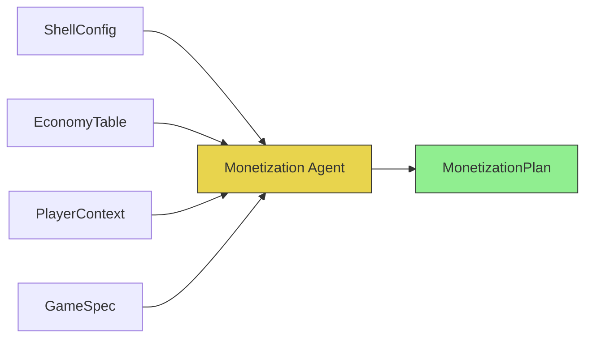
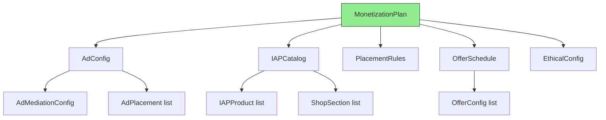
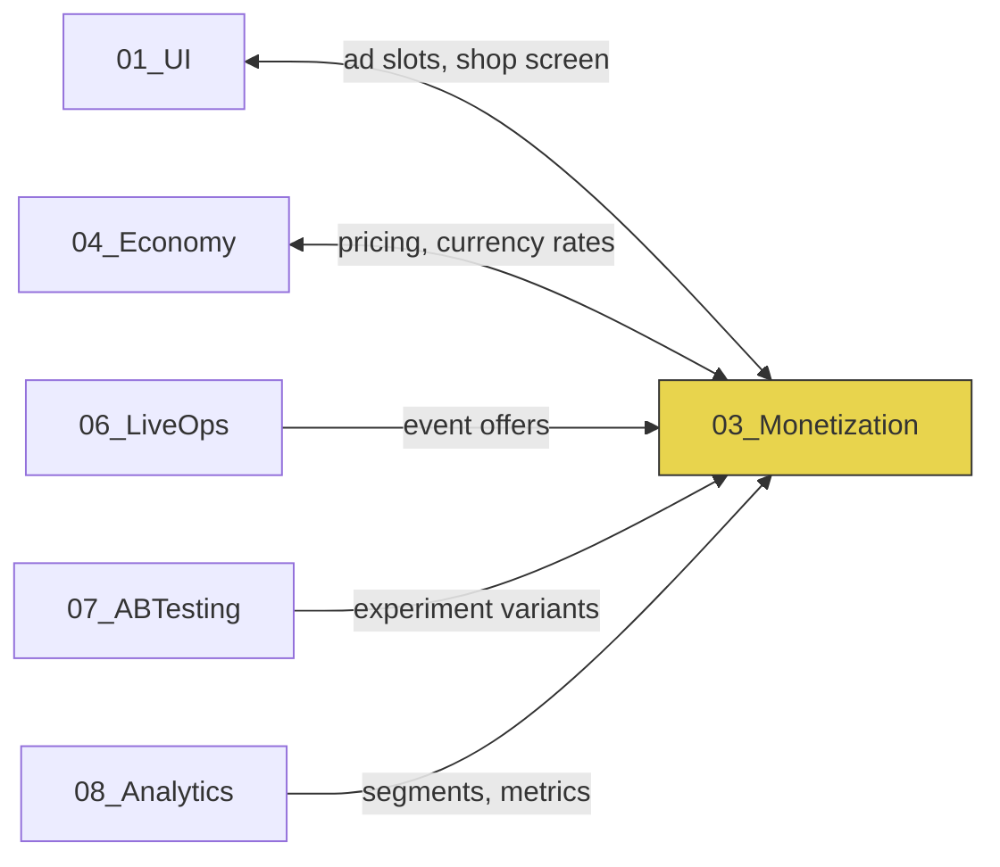
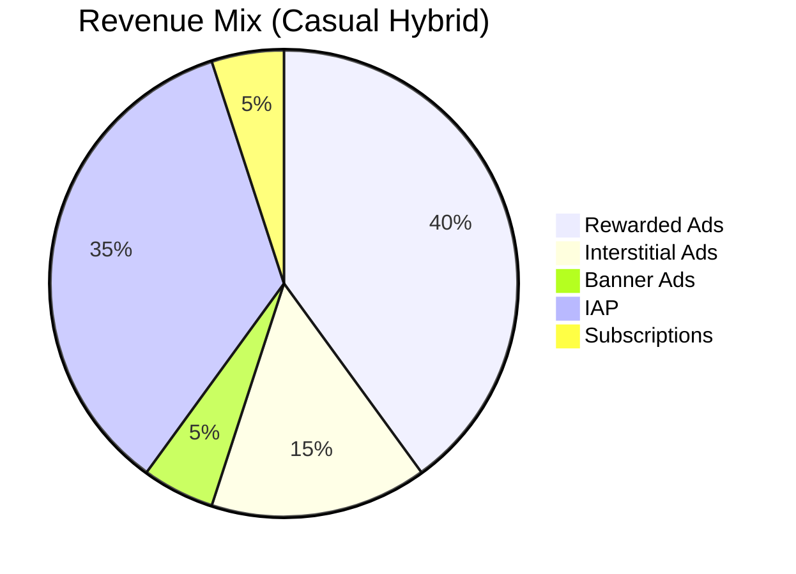
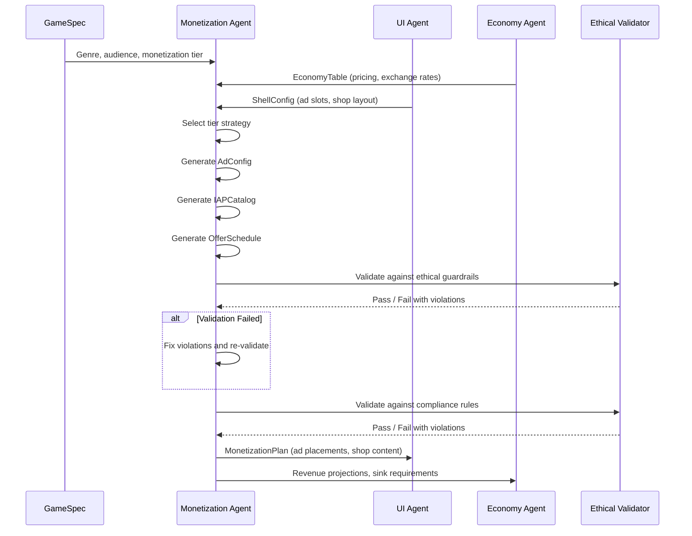

# Monetization Vertical -- Specification

> **Owner:** Monetization Agent
> **Version:** 1.0.0
> **Status:** Draft

---

## Purpose

Place revenue touchpoints -- advertisements and in-app purchases -- ethically and effectively within the game. The Monetization Agent generates a complete `MonetizationPlan` that maximizes sustainable revenue without degrading player retention or violating [ethical guardrails](EthicalGuardrails.md).

---

## Scope

| In Scope | Out of Scope |
|----------|-------------|
| Ad mediation configuration | Ad SDK implementation (runtime concern) |
| Ad placement rules (where, when, how often) | Ad creative production |
| IAP catalog definition | Payment processing (handled by app stores) |
| Shop section configuration | Shop UI rendering (owned by [UI vertical](../01_UI/)) |
| Offer timing and scheduling | Price localization (owned by [Economy vertical](../04_Economy/)) |
| Segment-aware pricing and frequency | Player segmentation logic (owned by [Analytics](../08_Analytics/)) |
| Ethical guardrail enforcement | Legal counsel (external) |
| Compliance rule encoding | Regulatory interpretation |

---

## Inputs



### ShellConfig (from UI vertical)

Defines available ad slot positions within the shell and gameplay flow.

| Field | Type | Description |
|-------|------|-------------|
| `adSlots` | `AdSlotDefinition[]` | Available positions for ad units |
| `shopScreenLayout` | `ShopLayout` | Shop screen structure and section slots |
| `offerPopupSlots` | `PopupSlot[]` | Positions where contextual offers can appear |
| `ftueEndLevel` | `number` | Level at which FTUE ends (no ads before this) |

### EconomyTable (from Economy vertical)

Pricing context for IAP items and virtual currency exchange rates.

| Field | Type | Description |
|-------|------|-------------|
| `currencyExchangeRate` | `number` | Premium currency units per $1 USD |
| `pricePointTiers` | `PriceTier[]` | Standard IAP price points ($0.99 - $99.99) |
| `rewardValues` | `Record<RewardTier, RewardBundle>` | Reward tier values for ad rewards |
| `sinkTargets` | `SinkTarget[]` | Economy sinks the shop must support |

### PlayerContext (from Shared Interfaces)

Real-time player data for segment-aware decisions. See [SharedInterfaces.md](../00_SharedInterfaces.md) for the full `PlayerContext` schema.

### GameSpec (Pipeline input)

High-level game configuration including genre, target audience, monetization tier (ad-supported, IAP-focused, hybrid), and reference games.

---

## Outputs

The Monetization Agent produces a single `MonetizationPlan` artifact. See [DataModels.md](DataModels.md) for the complete schema.



### MonetizationPlan Components

| Component | Description | Consumed By |
|-----------|-------------|-------------|
| `adConfig` | Mediation settings, placements, frequency rules | UI (rendering), Runtime (SDK init) |
| `iapCatalog` | Products, pricing, store metadata | UI (shop), App stores (product sync) |
| `placementRules` | When/where to show ads and offers | UI (trigger logic) |
| `offerSchedule` | Timed and contextual offer definitions | UI (popup system), LiveOps (events) |
| `ethicalConfig` | Spending caps, frequency limits, compliance flags | Runtime (enforcement) |

---

## Dependencies



| Dependency | Direction | What Flows |
|------------|-----------|------------|
| UI | Bidirectional | UI provides slot positions; Monetization provides ad/shop content |
| Economy | Bidirectional | Economy provides pricing tables; Monetization provides IAP revenue data |
| LiveOps | Inbound | LiveOps provides event context for limited-time offers |
| AB Testing | Inbound | AB Testing provides experiment variants for monetization parameters |
| Analytics | Inbound | Analytics provides player segments and performance metrics |

---

## Constraints

### Ethical (Hard Rules)

All ethical constraints are non-negotiable. See [EthicalGuardrails.md](EthicalGuardrails.md) for the complete list.

- No pay-to-win mechanics
- Spending caps enforced per segment
- Transparent odds on all randomized purchases
- No dark patterns (fake urgency, confirm-shaming, hidden costs)
- No ads during FTUE (first 3 sessions)
- Age-appropriate monetization gating

### Compliance (Legal)

All compliance requirements override design preferences. See [Compliance.md](Compliance.md) for details.

- COPPA: under-13 restrictions
- GDPR: data consent requirements
- App store policies: Apple and Google IAP rules
- Regional: Belgium loot box ban, China real-name, Japan kompu gacha ban

### Performance

| Constraint | Limit | Rationale |
|------------|-------|-----------|
| Ad SDK init | Deferred until after FTUE | Reduces cold-start time by ~800ms |
| Ad preload | Max 2 formats preloaded simultaneously | Memory budget: 50MB for ad assets |
| Shop load time | < 500ms for catalog render | Player patience threshold |
| Offer popup delay | Min 2s after screen transition | Prevents jarring UX |
| Mediation waterfall | Max 5 networks in chain | Timeout budget: 10s per ad request |

---

## Success Criteria

| Metric | Target | Measurement |
|--------|--------|-------------|
| ARPDAU | $0.05 - $0.15 (casual) | See [MetricsDictionary](../../SemanticDictionary/MetricsDictionary.md) |
| Payer conversion (D30) | 2 - 5% | IAP purchasers / D30 cohort |
| Ad fill rate | > 95% | Impressions served / requests made |
| Rewarded ad opt-in rate | > 50% | Watchers / offered |
| D7 retention delta | < 2% drop vs. no-ads baseline | AB test comparison |
| Ethical compliance | 100% | Zero guardrail violations |
| eCPM (rewarded) | > $10 | Revenue per 1000 impressions |
| Time-to-first-offer | D1 - D3 | Median across new cohort |

### Revenue Mix Targets



---

## Monetization Tier Strategies

The `MonetizationPlan` adapts its strategy based on the monetization tier specified in the GameSpec. Each tier produces a fundamentally different balance of ad placements, IAP catalog depth, and offer aggressiveness.

### Ad-Supported Tier

For games where the primary revenue source is advertising. IAP exists only as ad-removal and minor convenience purchases.

```typescript
const AD_SUPPORTED_STRATEGY: TierStrategy = {
  adWeight: 0.85,          // 85% of revenue from ads
  iapWeight: 0.15,         // 15% from IAP
  adFormats: ['banner', 'interstitial', 'rewarded'],
  iapCategories: ['no_ads', 'cosmetic'],
  maxIAPProducts: 10,
  interstitialFrequency: 'standard',   // Per ethical limits
  rewardedPlacementCount: 4,           // Multiple rewarded touchpoints
  shopComplexity: 'minimal',           // Simple shop, few sections
};
```

| Metric Target | Ad-Supported |
|---------------|-------------|
| ARPDAU | $0.04 - $0.08 |
| Payer Conversion D30 | 1 - 2% |
| Ad Revenue Share | 80 - 90% |
| Rewarded Opt-In | > 55% |

### IAP-Focused Tier

For games where in-app purchases drive the majority of revenue. Ads are minimal or absent, focusing on rewarded ads as a monetization complement.

```typescript
const IAP_FOCUSED_STRATEGY: TierStrategy = {
  adWeight: 0.20,          // 20% of revenue from ads
  iapWeight: 0.80,         // 80% from IAP
  adFormats: ['rewarded'], // No interstitials, no banners
  iapCategories: ['currency_pack', 'starter_pack', 'bundle',
                  'cosmetic', 'subscription', 'special_offer'],
  maxIAPProducts: 40,
  interstitialFrequency: 'none',
  rewardedPlacementCount: 2,           // Fewer, higher-value placements
  shopComplexity: 'full',              // Full shop with all sections
};
```

| Metric Target | IAP-Focused |
|---------------|------------|
| ARPDAU | $0.10 - $0.30 |
| Payer Conversion D30 | 3 - 6% |
| ARPPU Monthly | $15 - $30 |
| IAP Revenue Share | 75 - 85% |

### Hybrid Tier

The most common strategy for casual games. Balances ad revenue with IAP, using rewarded ads as a gateway to IAP conversion.

```typescript
const HYBRID_STRATEGY: TierStrategy = {
  adWeight: 0.55,          // 55% of revenue from ads
  iapWeight: 0.45,         // 45% from IAP
  adFormats: ['banner', 'interstitial', 'rewarded'],
  iapCategories: ['currency_pack', 'starter_pack', 'bundle',
                  'cosmetic', 'subscription'],
  maxIAPProducts: 25,
  interstitialFrequency: 'moderate',
  rewardedPlacementCount: 3,
  shopComplexity: 'standard',
};
```

| Metric Target | Hybrid |
|---------------|--------|
| ARPDAU | $0.06 - $0.15 |
| Payer Conversion D30 | 2 - 4% |
| Ad Revenue Share | 50 - 60% |
| IAP Revenue Share | 40 - 50% |

---

## Agent Workflow



### Processing Steps

| Step | Action | Input | Output | Validation |
|------|--------|-------|--------|------------|
| 1 | Select tier strategy | GameSpec.monetizationTier | TierStrategy | Tier must be valid |
| 2 | Map ad slots to placements | ShellConfig.adSlots + TierStrategy | AdPlacement[] | No conflicting slots |
| 3 | Configure mediation | TierStrategy.adFormats | AdMediationConfig | At least 1 network per format |
| 4 | Build IAP catalog | EconomyTable + TierStrategy | IAPProduct[] | Prices within store tiers |
| 5 | Configure shop sections | IAPCatalog + ShellConfig.shopLayout | ShopSection[] | All products in a section |
| 6 | Schedule offers | PlayerContext patterns + TierStrategy | OfferConfig[] | No dark patterns |
| 7 | Apply ethical guardrails | Full MonetizationPlan | EthicalConfig | Zero violations |
| 8 | Apply compliance rules | Full MonetizationPlan + target regions | RegionalOverrides | All regions compliant |
| 9 | Generate revenue projections | Complete MonetizationPlan | RevenueProjection | Within target range |

---

## Glossary Reference

Key terms used in this specification. See [Glossary](../../SemanticDictionary/Glossary.md) for full definitions.

| Term | Quick Definition |
|------|-----------------|
| Ad Mediation | Layer that selects the highest-paying ad network per impression |
| Ad Slot | Designated UI position for an advertisement |
| Dark Pattern | Manipulative UI design that exploits player psychology |
| FTUE | First-Time User Experience (first 3 sessions) |
| IAP | In-App Purchase via app store payment system |
| Segment | Behavioral player group (whale, dolphin, minnow, free) |
| Sink | Mechanism that removes currency from the player's wallet |
| Faucet | Mechanism that adds currency to the player's wallet |

---

## Related Documents

- [Interfaces](Interfaces.md) -- API contracts
- [Data Models](DataModels.md) -- Schema definitions
- [Agent Responsibilities](AgentResponsibilities.md) -- Decision authority
- [Ethical Guardrails](EthicalGuardrails.md) -- Hard rules
- [Compliance](Compliance.md) -- Legal requirements
- [Shared Interfaces](../00_SharedInterfaces.md) -- `IAdUnit`, `IShopItem` contracts
- [Glossary](../../SemanticDictionary/Glossary.md) -- Term definitions
- [Metrics Dictionary](../../SemanticDictionary/MetricsDictionary.md) -- KPI formulas
