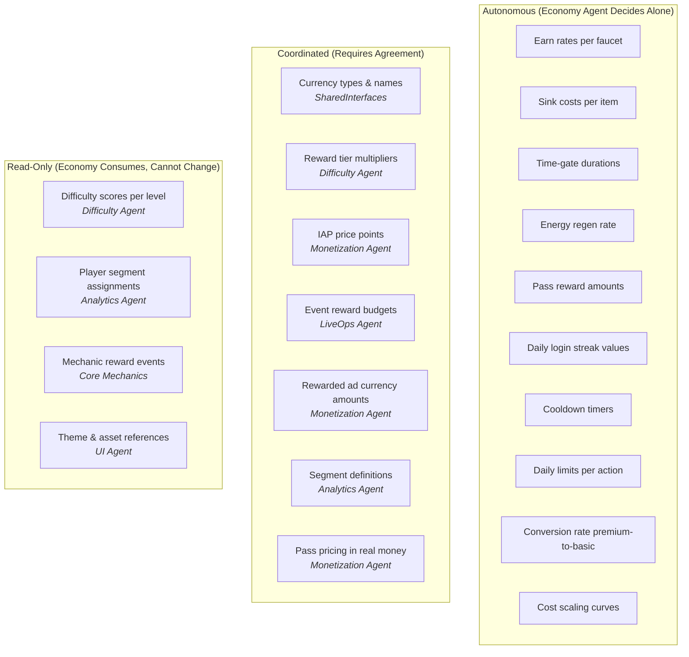
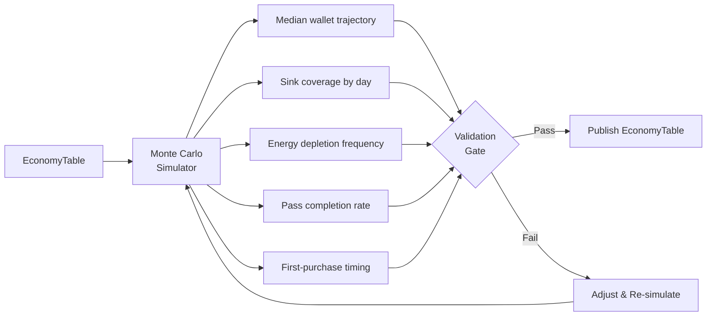
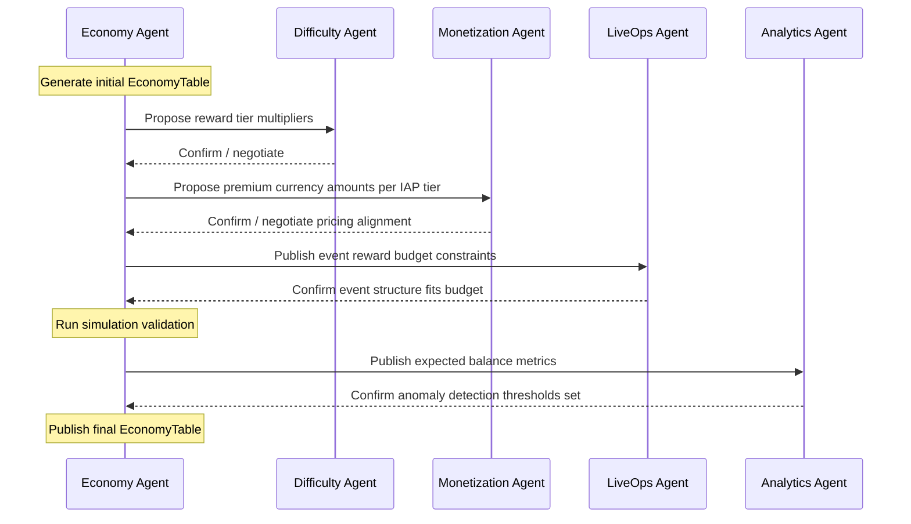

# Economy Vertical — Agent Responsibilities

> **Owner:** Economy Agent
> **Version:** 1.0
> **Status:** Draft

This document defines what the Economy Agent decides autonomously, what requires coordination with other agents, and how to detect when the economy is failing.

---

## Decision Authority

---

## Autonomous Decisions

The Economy Agent has full authority over these parameters. Changes are applied directly to the [EconomyTable](./DataModels.md) without cross-vertical approval.

### Earn Rates

| Decision | Description | Constraint |
|----------|-------------|------------|
| Base faucet amounts | How much each faucet pays out | Must maintain sink coverage 0.85-0.95 |
| Faucet scaling curves | How earn rates grow with progression | Staircase or linear; no exponential earning |
| Daily login streak values | Coin amounts for consecutive login days | Day 7 bonus must be > 3x Day 1 |
| Challenge reward amounts | Daily/weekly challenge payouts | Must be completable in 1-2 sessions |
| Achievement reward amounts | One-time milestone payouts | Proportional to effort required |

### Sink Costs

| Decision | Description | Constraint |
|----------|-------------|------------|
| Upgrade cost curve | Exponential cost scaling per upgrade level | Multiplier between 2.0x and 3.0x per tier |
| Cosmetic item prices | Cost for skins, effects, themes | Premium cosmetics must feel aspirational but achievable in < 2 weeks for engaged free players |
| Energy refill cost | Basic and premium refill prices | Must be < 1 session's earnings (basic) |
| Retry / continue cost | Cost to retry a failed level | Must feel cheap enough that rage-quitting is worse |
| Skip costs | Cost to bypass content | Must be > 3x the expected reward from completing normally |

### Time-Gates

| Decision | Description | Constraint |
|----------|-------------|------------|
| Energy max and regen rate | How long players wait between sessions | Full regen: 1.5-3 hours |
| Cooldown durations | Free gift timer, shop refresh timer | Aligned with expected session intervals |
| Daily limit counts | How many rewarded ads, free gifts per day | Rewarded ads: 3-8 per day |

### Pass Reward Amounts

| Decision | Description | Constraint |
|----------|-------------|------------|
| Free track rewards per level | What non-paying players earn from the pass | Total free-track value >= 2x pass price equivalent |
| Premium track rewards per level | What paying players earn from the pass | Total premium-track value >= 5x pass price |
| Pass XP per action | How fast players progress through the pass | Completable in 80% of pass duration with daily play |
| Pass XP scaling | XP required per level escalation | 10% escalation per level (compounding) |

---

## Coordinated Decisions

These require agreement with the listed agent before implementation. The Economy Agent proposes; the partner agent approves or negotiates.

### Currency Types (SharedInterfaces)

| What | Partner | Process |
|------|---------|---------|
| Currency names ("Coins", "Gems") | SharedInterfaces (all agents) | Defined in [SharedInterfaces](../00_SharedInterfaces.md); changes require version bump |
| Currency display properties | UI Agent | Economy proposes; UI confirms visual compatibility |
| New currency introduction | All agents | Requires architecture review; NOT done lightly |

### Reward Tier Multipliers (Difficulty Agent)

| What | Partner | Process |
|------|---------|---------|
| `basicCurrencyMultiplier` per tier | Difficulty Agent | Economy proposes multipliers; Difficulty confirms tier distribution makes sense |
| `xpMultiplier` per tier | Difficulty Agent | Same negotiation |
| `itemDropChance` per tier | Difficulty Agent | Economy sets drop rates; Difficulty validates they align with level pacing |

The shared contract is `DIFFICULTY_REWARD_MAP` and `RewardTierConfig` in [SharedInterfaces](../00_SharedInterfaces.md).

### IAP Price Points (Monetization Agent)

| What | Partner | Process |
|------|---------|---------|
| Premium currency per IAP tier | Monetization Agent | Monetization sets real-money prices; Economy defines how much premium currency each tier grants |
| Value perception ratio | Monetization Agent | The "best value" badge should go to the tier Economy + Monetization jointly agree on |
| Starter bundle contents | Monetization Agent | Economy defines currency amounts; Monetization defines pricing and targeting |

### Event Reward Budgets (LiveOps Agent)

| What | Partner | Process |
|------|---------|---------|
| Total reward budget per event | LiveOps Agent | Economy sets the budget ceiling; LiveOps distributes across milestones |
| Event currency multipliers | LiveOps Agent | Economy approves any "double coins" or bonus events to prevent inflation spikes |
| Seasonal economy adjustments | LiveOps Agent | Holiday events may temporarily increase faucets; Economy pre-approves the bounds |

---

## Quality Criteria

The Economy Agent validates every `EconomyTable` against these criteria before publishing.

### Structural Validation

| Check | Rule | Severity |
|-------|------|----------|
| All faucets have valid triggers | Every `FaucetConfig.trigger.event` maps to an actual game event | CRITICAL |
| All sinks have valid categories | Every `SinkConfig.category` is one of: progression, cosmetic, convenience | CRITICAL |
| No negative amounts | All `baseAmount`, `baseCost` > 0 | CRITICAL |
| Currency types match SharedInterfaces | Only `'basic'` or `'premium'` used | CRITICAL |
| Energy config is self-consistent | `startingEnergy` <= `maxEnergy`; `regenCap` <= `maxEnergy` (or `overflowMax`) | HIGH |

### Balance Validation

| Check | Rule | Severity |
|-------|------|----------|
| Sink coverage in range | Projected sink/faucet ratio: 0.85-0.95 | CRITICAL |
| No dead-end economy | Every level range has at least one affordable sink | HIGH |
| Premium scarcity maintained | Free premium faucets < 15% of total premium supply | HIGH |
| Pass is completable | 80% of pass levels reachable in 80% of pass duration | HIGH |
| Earning curve matches cost curve | At every progression point, time-to-next-purchase is 1-3 sessions | MEDIUM |

### Simulation Validation

The Economy Agent runs a Monte Carlo simulation of 1,000 synthetic players across 30 days to validate:

| Simulated Metric | Pass Condition |
|------------------|----------------|
| Median basic wallet at D30 | 1.5x - 3x starting balance |
| Sink coverage D7-D30 | 0.85 - 0.95 |
| % of simulated players hitting zero energy D1-D7 | 40-70% (should create natural monetization pressure) |
| Simulated pass completion rate | > 60% if playing daily |
| Simulated time-to-first-affordable-skin | < 5 sessions |

---

## Failure Modes

### Inflation

**Symptoms:**
- Median wallet balance growing > 10% per week
- Sink coverage < 0.80
- Players stockpiling currency with nothing to buy
- "Nothing to buy" reviews increasing

**Root Causes:**
- Faucets too generous (often after an event with uncapped rewards)
- Not enough sinks at the current progression tier
- New content drop delayed, leaving players without sinks

**Recovery:**
1. Reduce faucet output (lower level rewards, cap event rewards)
2. Add emergency cosmetic sinks (limited-time items)
3. Introduce new upgrade tier to absorb excess currency
4. DO NOT punish players by taking currency away

### Deflation

**Symptoms:**
- Median wallet balance declining or stagnant
- Sink coverage > 1.00
- "Too expensive" reviews increasing
- Low engagement with sinks (players can't afford anything)

**Root Causes:**
- Sink costs scaled too aggressively
- Faucets not scaling with progression
- Premium sinks priced out of reach for free players

**Recovery:**
1. Increase faucet output (bonus events, higher daily login rewards)
2. Reduce sink costs (temporary "sale" or permanent repricing)
3. Add new free faucets (more rewarded ad slots, free gifts)
4. Grant one-time currency gifts to affected segments

### Dead Economy

**Symptoms:**
- Players stop engaging with sinks entirely
- Very high wallet balances + zero purchases
- No conversion pressure (free players never feel need to spend)

**Root Causes:**
- Sink catalog is stale (no new items for weeks)
- All meaningful progression is gated behind premium currency
- Sinks don't feel valuable (cosmetics are boring, upgrades are invisible)

**Recovery:**
1. Launch new sink content immediately (emergency cosmetic drop)
2. Add aspirational sinks (expensive but visually impressive items)
3. Create limited-time exclusive sinks with FOMO pressure
4. Revisit sink design with UI Agent for better perceived value

### Predatory Economy

**Symptoms:**
- Spending velocity alerts firing frequently
- Negative app store reviews about aggressive monetization
- Whale spending exceeding ethical thresholds
- Free players churning at high rates due to perceived pay-to-win

**Root Causes:**
- Sink costs too high relative to free faucets
- Premium currency gates on critical progression
- Insufficient free-path through content

**Recovery:**
1. Activate spending caps immediately
2. Reduce premium-exclusive content
3. Increase free faucet output
4. Add more basic-currency paths to progression
5. Review with [Monetization Ethical Guardrails](../03_Monetization/EthicalGuardrails.md)

---

## Coordination Protocol

### Conflict Resolution

When agents disagree:

1. **Economy + Difficulty:** Economy's sink coverage target takes priority. Difficulty adjusts tier distribution to match.
2. **Economy + Monetization:** Joint review required. Neither agent can unilaterally change IAP-related parameters.
3. **Economy + LiveOps:** Economy sets the budget ceiling. LiveOps distributes within it. If LiveOps needs more budget, escalate to joint review.

---

## Related Documents

- [Spec](./Spec.md) — Design goals and constraints
- [Interfaces](./Interfaces.md) — API contracts
- [DataModels](./DataModels.md) — Schema definitions
- [BalanceLevers](./BalanceLevers.md) — Full parameter table
- [Segmentation](./Segmentation.md) — Per-segment responsibilities
- [SharedInterfaces](../00_SharedInterfaces.md) — Cross-vertical contracts
