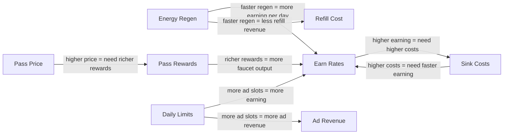

# Economy Vertical — Balance Levers

> **Owner:** Economy Agent
> **Version:** 1.0
> **Status:** Draft

Every tunable parameter in the economy, organized by category. This is the definitive reference for what can be changed, what the safe ranges are, and which parameters are eligible for AB testing.

See [DataModels](./DataModels.md) for schema definitions and [AgentResponsibilities](./AgentResponsibilities.md) for who has authority to change each lever.

---

## How to Read This Document

Each parameter table uses these columns:

| Column | Meaning |
|--------|---------|
| **Parameter** | The config field name as it appears in the [EconomyTable](./DataModels.md) |
| **Default** | The starting value before any AB test or segment override |
| **Min** | The lowest safe value (below this risks deflation, frustration, or broken UX) |
| **Max** | The highest safe value (above this risks inflation, exploitation, or trivialization) |
| **Unit** | What the number represents |
| **Description** | What this lever controls |
| **AB** | Whether this parameter is eligible for AB testing (Y/N) |
| **Side** | Server-side (S) or client-side (C) tunability |

---

## Earn Rate Levers

Parameters controlling how much currency flows into the player's wallet.

| Parameter | Default | Min | Max | Unit | Description | AB | Side |
|-----------|---------|-----|-----|------|-------------|-----|------|
| `faucets.level_complete.baseAmount` | 25 | 5 | 100 | basic | Base coins earned per level completion | Y | S |
| `faucets.level_complete.tierMultiplier.easy` | 1.0 | 0.5 | 1.5 | multiplier | Reward multiplier for easy-tier levels | Y | S |
| `faucets.level_complete.tierMultiplier.medium` | 1.5 | 1.0 | 2.5 | multiplier | Reward multiplier for medium-tier levels | Y | S |
| `faucets.level_complete.tierMultiplier.hard` | 2.0 | 1.5 | 3.5 | multiplier | Reward multiplier for hard-tier levels | Y | S |
| `faucets.level_complete.tierMultiplier.very_hard` | 3.0 | 2.0 | 5.0 | multiplier | Reward multiplier for very-hard-tier levels | Y | S |
| `faucets.level_complete.tierMultiplier.extreme` | 5.0 | 3.0 | 8.0 | multiplier | Reward multiplier for extreme-tier levels | Y | S |
| `faucets.daily_login.baseAmount` | 50 | 10 | 200 | basic | Coins earned on daily login (Day 1 of streak) | Y | S |
| `faucets.daily_login.streakMultiplier` | 1.5 | 1.0 | 3.0 | multiplier | How much each streak day scales the base | Y | S |
| `faucets.daily_login.streakMaxDays` | 7 | 3 | 14 | days | After this day, streak resets or plateaus | Y | S |
| `faucets.daily_login_streak.premiumAmount` | 2 | 0 | 10 | premium | Premium currency on Day 7 streak bonus | Y | S |
| `faucets.rewarded_ad.amount` | 30 | 10 | 100 | basic | Coins earned per rewarded ad watched | Y | S |
| `faucets.rewarded_ad.dailyCap` | 5 | 2 | 10 | count | Max rewarded ads per day | Y | S |
| `faucets.free_gift.amount` | 25 | 5 | 75 | basic | Coins from free timed gift | Y | S |
| `faucets.free_gift.cooldownSeconds` | 14400 | 7200 | 28800 | seconds | Time between free gifts (4h default) | Y | S |
| `faucets.challenge.amount` | 75 | 20 | 200 | basic | Daily challenge reward | Y | S |
| `faucets.achievement.minAmount` | 100 | 25 | 500 | basic | Smallest achievement reward | N | S |
| `faucets.achievement.maxAmount` | 1000 | 200 | 5000 | basic | Largest achievement reward | N | S |
| `faucets.firstClearBonus.multiplier` | 2.0 | 1.0 | 5.0 | multiplier | Bonus multiplier for first-time level clears | Y | S |

---

## Sink Cost Levers

Parameters controlling how much currency flows out of the player's wallet.

| Parameter | Default | Min | Max | Unit | Description | AB | Side |
|-----------|---------|-----|-----|------|-------------|-----|------|
| `sinks.upgrade.baseCost` | 50 | 10 | 200 | basic | Cost of first upgrade tier | Y | S |
| `sinks.upgrade.scalingMultiplier` | 2.5 | 1.5 | 4.0 | multiplier | Cost multiplier per upgrade level (exponential) | Y | S |
| `sinks.unlock.tier1Cost` | 200 | 50 | 500 | basic | Cost to unlock tier 1 content | Y | S |
| `sinks.unlock.tier2Cost` | 500 | 200 | 1500 | basic | Cost to unlock tier 2 content | Y | S |
| `sinks.unlock.tier3Cost` | 2000 | 500 | 5000 | basic | Cost to unlock tier 3 content | Y | S |
| `sinks.retry.basicCost` | 25 | 5 | 75 | basic | Cost to retry a failed level (basic currency) | Y | S |
| `sinks.continue.premiumCost` | 2 | 1 | 5 | premium | Cost to continue from checkpoint (premium) | Y | S |
| `sinks.skin.basicCostRange` | 500 | 100 | 2000 | basic | Typical skin cost in basic currency | N | S |
| `sinks.skin.premiumCostRange` | 50 | 10 | 500 | premium | Typical skin cost in premium currency | N | S |
| `sinks.effect.basicCost` | 200 | 50 | 800 | basic | Visual effect cost | N | S |
| `sinks.theme.basicCost` | 1000 | 200 | 5000 | basic | Theme/environment cost | N | S |
| `sinks.speedUp.basicCost` | 20 | 5 | 75 | basic | Cost to speed up a timer | Y | S |
| `sinks.skipLevel.premiumCost` | 10 | 3 | 30 | premium | Cost to skip a level entirely | Y | S |

---

## Time-Gate Levers

Parameters controlling energy, cooldowns, and daily limits.

| Parameter | Default | Min | Max | Unit | Description | AB | Side |
|-----------|---------|-----|-----|------|-------------|-----|------|
| `energy.maxEnergy` | 20 | 10 | 50 | points | Maximum energy capacity | Y | S |
| `energy.costPerAction` | 1 | 1 | 3 | points | Energy consumed per level | Y | S |
| `energy.regenRateSeconds` | 360 | 180 | 600 | seconds | Time to regenerate 1 energy point | Y | S |
| `energy.refillCost.basic` | 50 | 20 | 150 | basic | Cost to refill energy with basic currency | Y | S |
| `energy.refillCost.premium` | 3 | 1 | 10 | premium | Cost to refill energy with premium currency | Y | S |
| `energy.dailyRefillLimit` | 10 | 3 | 20 | count | Max paid refills per day | Y | S |
| `energy.overflowMax` | 40 | 20 | 100 | points | Hard cap when overflow is allowed | N | S |
| `cooldowns.freeGift.seconds` | 14400 | 7200 | 28800 | seconds | Time between free gifts | Y | S |
| `cooldowns.shopRefresh.seconds` | 28800 | 14400 | 86400 | seconds | Time between shop refreshes | Y | S |
| `cooldowns.chestOpen.seconds` | 21600 | 10800 | 43200 | seconds | Time for free chest timer | Y | S |
| `dailyLimits.rewardedAds` | 5 | 2 | 10 | count | Max rewarded ads per day | Y | S |
| `dailyLimits.freeGifts` | 1 | 1 | 3 | count | Max free gifts per day | Y | S |
| `dailyLimits.challengeAttempts` | 3 | 1 | 5 | count | Max daily challenge attempts | Y | S |

---

## Conversion Rate Levers

| Parameter | Default | Min | Max | Unit | Description | AB | Side |
|-----------|---------|-----|-----|------|-------------|-----|------|
| `conversion.premiumToBasicRate` | 50 | 20 | 200 | basic/premium | How many basic coins 1 premium gem buys | Y | S |
| `conversion.dailyConversionLimit` | 100 | 10 | 500 | premium | Max premium gems converted per day | N | S |
| `conversion.conversionFee` | 0.0 | 0.0 | 0.2 | ratio | Fee on conversion (0.1 = 10% tax) | Y | S |

---

## Pass System Levers

| Parameter | Default | Min | Max | Unit | Description | AB | Side |
|-----------|---------|-----|-----|------|-------------|-----|------|
| `pass.battlePass.price` | 500 | 200 | 1500 | premium | Premium currency cost for battle pass | Y | S |
| `pass.battlePass.durationDays` | 28 | 14 | 42 | days | How long the battle pass runs | N | S |
| `pass.battlePass.totalLevels` | 30 | 15 | 50 | levels | Number of pass levels | N | S |
| `pass.battlePass.baseXPPerLevel` | 100 | 50 | 300 | xp | XP needed for level 1 of pass | Y | S |
| `pass.battlePass.xpEscalation` | 1.10 | 1.00 | 1.25 | multiplier | XP requirement increase per level (compounding) | Y | S |
| `pass.battlePass.freeTrackValueMultiplier` | 2.0 | 1.5 | 4.0 | multiplier | Total free-track value vs pass price | N | S |
| `pass.battlePass.premiumTrackValueMultiplier` | 5.0 | 3.0 | 10.0 | multiplier | Total premium-track value vs pass price | N | S |
| `pass.seasonPass.price` | 1500 | 500 | 5000 | premium | Premium currency cost for season pass | Y | S |
| `pass.seasonPass.durationDays` | 90 | 60 | 120 | days | Season pass duration | N | S |
| `pass.xpSources.levelComplete` | 10 | 5 | 30 | xp | Pass XP per level completion | Y | S |
| `pass.xpSources.dailyLogin` | 20 | 5 | 50 | xp | Pass XP for daily login | Y | S |
| `pass.xpSources.dailyChallenge` | 30 | 10 | 75 | xp | Pass XP for daily challenge | Y | S |
| `pass.graceperiodHours` | 72 | 24 | 168 | hours | Time after pass ends to claim rewards | N | S |

---

## Server-Side vs Client-Side Tunability

```mermaid
graph TB
    subgraph ServerSide["Server-Side (Hot-Configurable)"]
        direction TB
        S1[All earn rates]
        S2[All sink costs]
        S3[Energy config]
        S4[Cooldown durations]
        S5[Daily limits]
        S6[Pass XP values]
        S7[Conversion rates]
        S8[Segment overrides]
    end

    subgraph ClientSide["Client-Side (Requires App Update)"]
        direction TB
        C1[Currency display names & icons]
        C2[Wallet UI layout]
        C3[Animation timings for currency earn]
        C4[Shop category structure]
    end

    subgraph Hybrid["Hybrid (Server Config + Client Cache)"]
        direction TB
        H1[Pass reward contents<br/><i>Server defines, client caches for offline</i>]
        H2[Shop catalog items<br/><i>Server catalog, client rendering</i>]
        H3[Reward popup content<br/><i>Server amounts, client animation</i>]
    end
```



**Key principle:** All balance-affecting parameters are server-side. The Economy Agent can change earn rates, sink costs, energy config, and segment overrides without an app update. Only visual presentation requires client updates.

---

## AB Testing Integration

### How AB Tests Connect to Levers

Every parameter marked **AB: Y** can be included in an AB test experiment. The [AB Testing Agent](../07_ABTesting/Spec.md) creates experiments by:

1. Selecting one or more levers from this document
2. Defining variants (control + 1-3 test variants)
3. Assigning players to variants via `experiment_assigned` analytics event
4. Overriding the lever values for each variant in the player's economy config
5. Measuring impact on success metrics from [Spec](./Spec.md)

### Example Experiment Configuration

```typescript
const doubleLoginRewardExperiment = {
  experimentId: 'econ_daily_login_2x',
  levers: ['faucets.daily_login.baseAmount'],
  variants: {
    control: { 'faucets.daily_login.baseAmount': 50 },
    test_a:  { 'faucets.daily_login.baseAmount': 100 },
    test_b:  { 'faucets.daily_login.baseAmount': 75 },
  },
  metrics: ['d7_retention', 'sink_coverage_d7', 'median_wallet_d7', 'conversion_rate_d14'],
  guardrails: ['sink_coverage > 0.80', 'median_wallet_growth < 0.15'],
  duration: 14,              // days
  sampleSize: 10000,         // players per variant
};
```

### Multi-Lever Tests

Some experiments require changing multiple levers together to maintain balance:

| Test Scenario | Levers Changed Together | Why |
|---------------|------------------------|-----|
| "Generous economy" | +50% all faucets, +30% all sink costs | Can't increase earning without increasing costs |
| "Fast energy" | 2x regen rate, 2x energy cost per action | Faster regen offset by higher cost |
| "Premium pass" | +50% pass price, +80% pass rewards | Higher price justified by richer rewards |

---

## Impact Analysis: Doubling Daily Login Rewards

**Lever changed:** `faucets.daily_login.baseAmount` from 50 to 100.

### Immediate Effects (D0-D3)

| Metric | Before | After | Change |
|--------|--------|-------|--------|
| Daily basic inflow (login) | 50/day | 100/day | +100% |
| Total daily faucet output (avg player) | 275/day | 325/day | +18% |
| Time-to-first-skin-purchase | 4.5 sessions | 3.8 sessions | -16% |

### Medium-Term Effects (D7-D14)

| Metric | Before | After | Change |
|--------|--------|-------|--------|
| Sink coverage ratio | 0.90 | 0.82 | -9% (approaching inflation) |
| Median wallet balance | 1,250 | 1,600 | +28% |
| D7 retention | 32% | 34% | +2pp (marginal improvement) |
| IAP conversion rate | 3.2% | 2.8% | -0.4pp (slightly less pressure to buy) |

### Long-Term Effects (D30+)

| Metric | Before | After | Risk Level |
|--------|--------|-------|------------|
| Sink coverage ratio | 0.90 | 0.75 | HIGH - inflation territory |
| "Nothing to buy" complaints | 3% | 8% | MEDIUM - approaching threshold |
| ARPDAU | $0.12 | $0.10 | MEDIUM - reduced conversion pressure |

### Recommendation

Doubling daily login rewards without corresponding sink additions causes inflation within 2 weeks. If the goal is improving D7 retention, a +50% increase (to 75) with one new cosmetic sink achieves the retention benefit without the inflation risk.

---

## Lever Interaction Map

Some levers have strong interactions. Changing one without adjusting the other creates imbalance.



| If You Change... | Also Adjust... | Because... |
|------------------|----------------|------------|
| Level reward base amount | Upgrade cost curve | Higher earning requires proportionally higher costs |
| Energy regen rate (faster) | Energy refill cost (higher) | Faster regen reduces refill demand; higher cost maintains revenue |
| Rewarded ad daily cap (more) | Rewarded ad amount (lower) | More ads x same amount = inflation; lower per-ad amount compensates |
| Pass price (higher) | Pass rewards (richer) | Players won't buy if value ratio drops below 4x |
| Daily login base (higher) | Add new sink items | More daily inflow needs more places to spend |

---

## Related Documents

- [Spec](./Spec.md) — Success criteria these levers serve
- [DataModels](./DataModels.md) — Schema for each parameter
- [AgentResponsibilities](./AgentResponsibilities.md) — Who can change which lever
- [Segmentation](./Segmentation.md) — Per-segment lever overrides
- [Concepts: Faucet & Sink](../../SemanticDictionary/Concepts_Faucet_Sink.md) — Faucet/sink theory
- [Concepts: Curve](../../SemanticDictionary/Concepts_Curve.md) — Curve shapes for scaling
