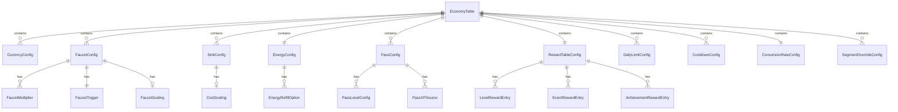

# Economy Vertical — Data Models

> **Owner:** Economy Agent
> **Version:** 1.0
> **Status:** Draft

This document defines every data schema the Economy Agent produces and consumes. The master output artifact is the `EconomyTable` — a single JSON structure that fully describes the game's economy.

See [SharedInterfaces](../00_SharedInterfaces.md) for base types used throughout.

---

## EconomyTable (Master Artifact)

The `EconomyTable` is the Economy Agent's primary output. It is consumed by the game runtime, Monetization Agent, UI Agent, and Analytics Agent.

```typescript
interface EconomyTable {
  version: string;                        // Semantic version of this economy config
  generatedAt: ISO8601;
  generatedBy: 'economy_agent';

  currencies: CurrencyConfig[];           // All currency definitions
  faucets: FaucetConfig[];                // All earning sources
  sinks: SinkConfig[];                    // All spending destinations
  energy: EnergyConfig;                   // Energy / time-gate system
  passes: PassConfig[];                   // Battle pass, season pass
  rewardTables: RewardTableConfig;        // Per-level, per-event reward mappings
  dailyLimits: DailyLimitConfig[];        // Daily caps on repeatable actions
  cooldowns: CooldownConfig[];            // Timer-gated actions
  conversionRates: ConversionRateConfig;  // Premium-to-basic exchange
  segmentOverrides: SegmentOverrideConfig[];  // Per-segment tuning

  // Metadata
  constraints: EconomyConstraints;
  balanceMetrics: ExpectedBalanceMetrics;
}
```

---

## CurrencyConfig

Defines each currency type in the game. Every game has exactly two currencies: one basic and one premium.

```typescript
interface CurrencyConfig {
  type: CurrencyType;                     // 'basic' | 'premium'
  displayName: string;                    // "Coins", "Gems", etc.
  iconAsset: AssetRef;                    // Icon for UI rendering
  startingBalance: number;                // Granted on first install
  maxBalance: number;                     // Hard cap (int32 max for basic, 999999 for premium)
  decimals: 0;                            // Always integer — no fractional currency
  color: string;                          // Hex color for UI display

  // Premium-only fields
  iapBacked?: boolean;                    // true for premium currency
  freeFaucetCap?: {
    dailyMax: number;                     // Max free premium earned per day
    weeklyMax: number;                    // Max free premium earned per week
  };
}
```

**Default instances:**

| Field | Basic ("Coins") | Premium ("Gems") |
|-------|-----------------|-------------------|
| `type` | `'basic'` | `'premium'` |
| `displayName` | "Coins" | "Gems" |
| `startingBalance` | 500 | 10 |
| `maxBalance` | 2,147,483,647 | 999,999 |
| `iapBacked` | — | `true` |
| `freeFaucetCap.dailyMax` | — | 5 |
| `freeFaucetCap.weeklyMax` | — | 25 |

---

## FaucetConfig

Every source of currency inflow. Each faucet is a named, typed entry with amount, frequency, and eligibility rules.

```typescript
interface FaucetConfig {
  id: string;                             // Unique faucet identifier
  source: FaucetSource;                   // From Interfaces.md
  displayName: string;                    // "Level Completion Reward"
  currency: CurrencyType;
  baseAmount: number;                     // Base reward before multipliers
  trigger: FaucetTrigger;                 // What causes this faucet to fire
  frequency: FaucetFrequency;
  scaling?: FaucetScaling;                // How amount changes over progression
  multipliers?: FaucetMultiplier[];       // Active multipliers (events, passes)
  segmentOverride?: Record<string, Partial<FaucetConfig>>;
  enabled: boolean;
}

interface FaucetTrigger {
  event: string;                          // "level_complete", "daily_reset", etc.
  conditions?: Record<string, unknown>;   // e.g., { minStars: 1 } for level complete
}

type FaucetFrequency =
  | { type: 'per_action' }               // Every time the trigger fires
  | { type: 'daily'; maxPerDay: number }  // Capped per calendar day
  | { type: 'one_time' }                 // Achievement-style, once ever
  | { type: 'weekly'; maxPerWeek: number }
  | { type: 'per_event' };               // Once per LiveOps event

interface FaucetScaling {
  type: 'linear' | 'staircase' | 'curve';
  parameter: 'player_level' | 'days_since_install' | 'difficulty';
  values?: number[];                      // Explicit curve values
  formula?: string;                       // e.g., "base * (1 + 0.1 * level)"
}

interface FaucetMultiplier {
  id: string;                             // "double_coins_event", "pass_bonus"
  factor: number;                         // 2.0 = double
  condition: string;                      // "event_active:double_coins", "has_premium_pass"
}
```

**Standard faucets:**

| ID | Source | Currency | Base Amount | Frequency | Scaling |
|----|--------|----------|-------------|-----------|---------|
| `fc_level_complete` | `level_complete` | basic | 25 | per_action | staircase by difficulty tier |
| `fc_daily_login` | `daily_login` | basic | 50 | daily (1) | linear by streak (50, 75, 100, 150, 200, 300, 500) |
| `fc_daily_login_streak` | `daily_login_streak` | premium | 2 | daily (1) | only on day 7 of streak |
| `fc_achievement` | `achievement` | basic | 100-1000 | one_time | per achievement definition |
| `fc_free_gift` | `free_gift` | basic | 25 | daily (1) | none |
| `fc_rewarded_ad` | `rewarded_ad` | basic | 30 | daily (5) | none |
| `fc_event_reward` | `event_reward` | basic | varies | per_event | per event config |
| `fc_challenge` | `challenge_complete` | basic | 75 | daily (1) | none |
| `fc_iap` | `iap_purchase` | premium | varies | per_action | per IAP product |
| `fc_pass_reward` | `pass_reward` | basic + premium | varies | per pass level | per pass tier |

---

## SinkConfig

Every destination where currency leaves the player's wallet.

```typescript
interface SinkConfig {
  id: string;                             // Unique sink identifier
  destination: SinkDestination;           // From Interfaces.md
  displayName: string;                    // "Speed Upgrade Lv.3"
  category: 'progression' | 'cosmetic' | 'convenience';
  currency: CurrencyType;
  baseCost: number;
  costScaling?: CostScaling;
  purchasable: boolean;                   // Can player buy right now
  prerequisites?: string[];               // Other sinks that must be purchased first
  segmentOverride?: Record<string, Partial<SinkConfig>>;
  enabled: boolean;
}

interface CostScaling {
  type: 'fixed' | 'linear' | 'exponential' | 'tiered';
  parameter: 'upgrade_level' | 'times_purchased' | 'player_level';

  // For exponential: cost = baseCost * (multiplier ^ level)
  multiplier?: number;

  // For tiered: explicit cost per tier
  tiers?: { level: number; cost: number }[];
}
```

**Standard sinks:**

| ID | Destination | Category | Currency | Base Cost | Scaling |
|----|-------------|----------|----------|-----------|---------|
| `sk_upgrade` | `upgrade` | progression | basic | 50 | exponential (2.5x per level) |
| `sk_unlock_content` | `unlock` | progression | basic | 200-2000 | tiered per content tier |
| `sk_retry` | `retry` | convenience | basic | 25 | fixed |
| `sk_continue` | `continue` | convenience | premium | 2 | fixed |
| `sk_skin` | `skin_purchase` | cosmetic | basic / premium | 500 / 50 | fixed per item |
| `sk_effect` | `effect_purchase` | cosmetic | basic | 200 | fixed per item |
| `sk_theme` | `theme_purchase` | cosmetic | basic | 1000 | fixed per item |
| `sk_energy_refill` | `energy_refill` | convenience | basic | 50 | fixed |
| `sk_energy_refill_p` | `energy_refill` | convenience | premium | 3 | fixed |
| `sk_speed_up` | `speed_up` | convenience | basic | 20 | fixed |
| `sk_skip_level` | `skip_level` | convenience | premium | 10 | fixed |

---

## EnergyConfig

```typescript
interface EnergyConfig {
  maxEnergy: number;                      // Cap on energy points
  startingEnergy: number;                 // Energy on first install (usually max)
  costPerAction: number;                  // Energy consumed per level / action
  regenRateSeconds: number;               // Seconds to regenerate 1 energy point
  regenCap: number;                       // Regen stops at this value (usually maxEnergy)

  refillOptions: EnergyRefillOption[];    // Ways to refill energy
  overflowAllowed: boolean;               // Can energy exceed max (e.g., from gifts)?
  overflowMax?: number;                   // If overflow allowed, hard cap

  // Daily refill limits to prevent abuse
  dailyRefillLimit: number;               // Max paid refills per day
}

interface EnergyRefillOption {
  id: string;
  paymentType: CurrencyType;
  cost: number;
  refillAmount: number;                   // Points restored (usually maxEnergy - current)
  fullRefillOnly: boolean;                // true = always refills to max
}
```

**Defaults:**

| Parameter | Value | Rationale |
|-----------|-------|-----------|
| `maxEnergy` | 20 | ~4 sessions of 5 levels each |
| `startingEnergy` | 20 | Full energy on first launch |
| `costPerAction` | 1 | Simple mental model |
| `regenRateSeconds` | 360 (6 min) | Full regen in 2 hours |
| `dailyRefillLimit` | 10 | Prevents unlimited play via spending |
| `overflowAllowed` | true | Gifts and events can push above max |
| `overflowMax` | 40 | 2x max cap |

---

## PassConfig

```typescript
interface PassConfig {
  passId: string;
  type: 'battle_pass' | 'season_pass';
  name: string;
  description: string;
  duration: {
    startAt: ISO8601;
    endAt: ISO8601;
    durationDays: number;
  };
  price: Price;                           // Premium currency cost for premium track

  levels: PassLevelConfig[];
  xpSources: PassXPSource[];             // What actions grant pass XP

  // Grace period after pass ends where unclaimed rewards can still be collected
  graceperiodHours: number;
}

interface PassLevelConfig {
  level: number;
  xpRequired: number;                    // Cumulative XP to reach this level
  freeReward: RewardBundle;
  premiumReward: RewardBundle;
}

interface PassXPSource {
  trigger: string;                        // "level_complete", "daily_login", etc.
  xpAmount: number;
  dailyCap?: number;                      // Max XP from this source per day
}
```

**Example Pass XP Sources (Battle Pass):**

| Trigger | XP per Action | Daily Cap |
|---------|--------------|-----------|
| `level_complete` | 10 | 100 |
| `daily_login` | 20 | 20 |
| `daily_challenge` | 30 | 30 |
| `event_milestone` | 50 | none |
| `rewarded_ad` | 5 | 25 |

---

## RewardTableConfig

Maps game actions to reward bundles, parameterized by reward tier.

```typescript
interface RewardTableConfig {
  levelRewards: LevelRewardEntry[];
  eventRewards: EventRewardEntry[];
  challengeRewards: ChallengeRewardEntry[];
  achievementRewards: AchievementRewardEntry[];
}

interface LevelRewardEntry {
  levelRange: { from: number; to: number };  // Inclusive range
  rewardsByTier: Record<RewardTier, RewardBundle>;
  firstClearBonus?: RewardBundle;            // Extra reward on first completion
  starBonuses: {
    oneStar: RewardBundle;
    twoStar: RewardBundle;
    threeStar: RewardBundle;
  };
}

interface EventRewardEntry {
  eventType: string;                     // "seasonal", "challenge", etc.
  milestoneRewards: {
    progressRequired: number;
    reward: RewardBundle;
  }[];
  completionBonus: RewardBundle;
}

interface ChallengeRewardEntry {
  challengeType: 'daily' | 'weekly';
  difficulty: RewardTier;
  reward: RewardBundle;
}

interface AchievementRewardEntry {
  achievementId: string;
  name: string;
  description: string;
  reward: RewardBundle;
  repeatable: boolean;
}
```

**Level Reward Table (base values, basic currency):**

| Level Range | Easy (1-2) | Medium (3-4) | Hard (5-6) | Very Hard (7-8) | Extreme (9-10) |
|-------------|-----------|-------------|-----------|----------------|---------------|
| 1-5 | 10 | 15 | 20 | 30 | 50 |
| 6-10 | 15 | 23 | 30 | 45 | 75 |
| 11-20 | 25 | 38 | 50 | 75 | 125 |
| 21-30 | 40 | 60 | 80 | 120 | 200 |
| 31-50 | 60 | 90 | 120 | 180 | 300 |
| 51-100 | 100 | 150 | 200 | 300 | 500 |

> These values reflect the `basicCurrencyMultiplier` from [SharedInterfaces: RewardTierConfig](../00_SharedInterfaces.md#difficulty--economy-contract).

---

## DailyLimitConfig

```typescript
interface DailyLimitConfig {
  limitId: string;
  action: string;                         // "rewarded_ad", "free_gift_claim", etc.
  maxPerDay: number;
  resetTime: 'midnight_local' | 'midnight_utc' | 'server_reset';
  displayToPlayer: boolean;               // Show "3/5 remaining" in UI
}
```

**Standard daily limits:**

| Limit ID | Action | Max/Day | Reset |
|----------|--------|---------|-------|
| `dl_rewarded_ad` | Rewarded ad watches | 5 | midnight_local |
| `dl_free_gift` | Free gift claims | 1 | midnight_local |
| `dl_energy_refill` | Paid energy refills | 10 | midnight_local |
| `dl_daily_challenge` | Daily challenge attempts | 3 | server_reset |
| `dl_shop_refresh` | Free shop refreshes | 1 | midnight_local |

---

## CooldownConfig

```typescript
interface CooldownConfig {
  cooldownId: string;
  action: string;
  durationSeconds: number;
  skipCost?: Price;                       // Cost to skip the cooldown
  showTimer: boolean;                     // Display countdown to player
}
```

**Standard cooldowns:**

| Cooldown ID | Action | Duration | Skip Cost |
|-------------|--------|----------|-----------|
| `cd_free_gift` | Free gift availability | 14,400s (4h) | 1 premium |
| `cd_shop_refresh` | Shop inventory refresh | 28,800s (8h) | 5 premium |
| `cd_chest_open` | Free chest timer | 21,600s (6h) | 3 premium |

---

## ConversionRateConfig

```typescript
interface ConversionRateConfig {
  premiumToBasicRate: number;             // 1 premium = N basic
  basicToPremiumEnabled: false;           // NEVER allow basic -> premium
  conversionFee: number;                  // 0.0 = no fee, 0.1 = 10% fee
  dailyConversionLimit: number;           // Max premium converted per day
}
```

**Defaults:**

| Parameter | Value | Rationale |
|-----------|-------|-----------|
| `premiumToBasicRate` | 50 | 1 gem = 50 coins |
| `basicToPremiumEnabled` | `false` | Forces IAP for premium |
| `conversionFee` | 0.0 | Clean conversion, no hidden tax |
| `dailyConversionLimit` | 100 | Prevents mass dumping |

---

## SegmentOverrideConfig

Per-segment modifications to the base economy. See [Segmentation](./Segmentation.md) for full details.

```typescript
interface SegmentOverrideConfig {
  segmentId: string;                      // "new", "free", "minnow", etc.
  segmentType: 'spending' | 'lifecycle';
  faucetMultipliers: Record<string, number>;   // faucetId -> multiplier
  sinkCostMultipliers: Record<string, number>; // sinkId -> multiplier
  energyOverrides?: Partial<EnergyConfig>;
  additionalFaucets?: FaucetConfig[];          // Segment-exclusive faucets
  additionalSinks?: SinkConfig[];              // Segment-exclusive sinks
}
```

---

## EconomyConstraints

Embedded in the `EconomyTable` for runtime validation.

```typescript
interface EconomyConstraints {
  sinkCoverageRatio: { min: 0.85; max: 0.95 };
  maxInflationRateWeekly: 0.05;           // 5% max wallet growth per week
  premiumFreeFaucetRatio: 0.15;           // Max 15% of premium from free sources
  maxConsecutivePremiumTransactions: 3;    // Cool-down trigger threshold
  premiumTransactionCooldownMs: 5000;     // 5 second minimum between premium spends
  maxDailySpendBasic: number;             // Segment-dependent soft cap
  maxDailySpendPremium: number;           // Segment-dependent soft cap
}
```

---

## ExpectedBalanceMetrics

Projected healthy ranges for monitoring and anomaly detection.

```typescript
interface ExpectedBalanceMetrics {
  medianWalletByDay: {
    day: number;                          // Days since install
    basicBalance: { p25: number; p50: number; p75: number };
    premiumBalance: { p25: number; p50: number; p75: number };
  }[];
  sinkCoverageByWeek: {
    week: number;
    expectedRatio: number;
    alertThreshold: { low: number; high: number };
  }[];
}
```

---

## Entity Relationship Diagram



---

## Related Documents

- [Spec](./Spec.md) — Economy design and constraints
- [Interfaces](./Interfaces.md) — API contracts that operate on these models
- [BalanceLevers](./BalanceLevers.md) — Which fields are AB-testable
- [Segmentation](./Segmentation.md) — Segment override details
- [SharedInterfaces](../00_SharedInterfaces.md) — Base types (`CurrencyAmount`, `RewardBundle`, `Price`, etc.)
