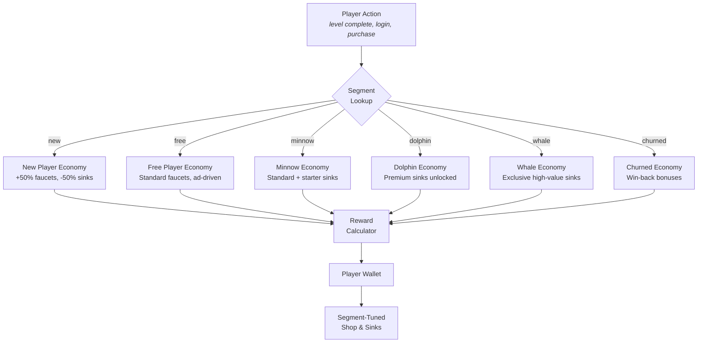
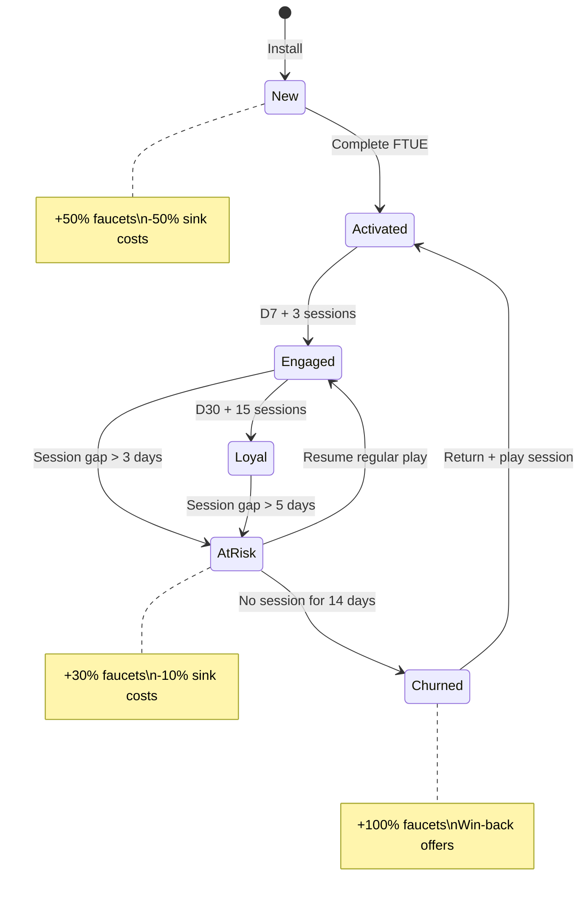

# Economy Vertical — Segmentation

> **Owner:** Economy Agent
> **Version:** 1.0
> **Status:** Draft

This document defines how the economy adapts per player segment. Every faucet, sink, time-gate, and offer can be overridden based on spending behavior and lifecycle stage.

See [Concepts: Segmentation](../../SemanticDictionary/Concepts_Segmentation.md) for foundational segment definitions and [DataModels](./DataModels.md) for the `SegmentOverrideConfig` schema.

---

## Segment-Based Economy Flow



---

## Faucet Adjustments by Segment

How faucet output changes per segment. Multipliers are applied to the base amounts defined in [BalanceLevers](./BalanceLevers.md).

### By Spending Segment

| Faucet | Free | Minnow | Dolphin | Whale |
|--------|------|--------|---------|-------|
| Level completion (basic) | 1.0x | 1.0x | 1.0x | 1.0x |
| Daily login (basic) | 1.0x | 1.0x | 1.0x | 1.0x |
| Rewarded ad (basic) | 1.0x | 0.8x | 0.5x | 0.0x |
| Free gift (basic) | 1.0x | 1.0x | 0.8x | 0.5x |
| Achievement (basic) | 1.0x | 1.0x | 1.0x | 1.0x |
| Daily challenge (basic) | 1.0x | 1.0x | 1.2x | 1.5x |
| Pass bonus multiplier | 1.0x | 1.2x | 1.5x | 2.0x |

**Design rationale:**
- **Free players** get full ad-based faucets (this IS their monetization channel)
- **Minnows** get slightly reduced ad faucets (they're converting to IAP; reduce ad annoyance)
- **Dolphins** get significantly reduced ad/gift faucets (they spend real money; respect that)
- **Whales** get zero ad faucets (ads would insult them) but boosted challenge/pass rewards (reward their engagement)

### By Lifecycle Segment

| Faucet | New (D0-D3) | Activated (D3-D7) | Engaged (D7-D30) | Loyal (D30+) | At-Risk | Churned |
|--------|-------------|-------------------|-------------------|--------------|---------|---------|
| Level completion | 1.5x | 1.2x | 1.0x | 1.0x | 1.3x | 2.0x |
| Daily login | 1.5x | 1.2x | 1.0x | 1.0x | 1.5x | 2.0x |
| Free gift | 2.0x | 1.5x | 1.0x | 1.0x | 1.5x | 2.0x |
| Achievement | 1.0x | 1.0x | 1.0x | 1.0x | 1.0x | 1.0x |
| Rewarded ad | 1.0x | 1.0x | 1.0x | 1.0x | 1.0x | 1.5x |
| Win-back bonus | -- | -- | -- | -- | -- | Active |

**Design rationale:**
- **New players** get generous faucets to build habit and demonstrate value. They should never feel poor in their first 3 days.
- **At-risk players** get boosted faucets to re-engage them before they churn.
- **Churned players** returning get the most generous faucets (win-back bonuses) to rebuild the habit loop.
- **Engaged/loyal players** get standard rates; their engagement is already self-sustaining.

---

## Sink Adjustments by Segment

### By Spending Segment

| Sink Category | Free | Minnow | Dolphin | Whale |
|---------------|------|--------|---------|-------|
| Progression (upgrades, unlocks) | 1.0x cost | 1.0x cost | 1.0x cost | 1.0x cost |
| Cosmetic (basic currency) | 1.0x cost | 1.0x cost | 0.9x cost | 0.8x cost |
| Cosmetic (premium currency) | 1.0x cost | 0.9x cost | 0.85x cost | 0.8x cost |
| Convenience (energy, speed-up) | 1.0x cost | 1.0x cost | 1.0x cost | 1.0x cost |
| **Exclusive sinks available** | Standard catalog | + Starter items | + Premium catalog | + VIP exclusives |

**Design rationale:**
- **Progression sinks** are NEVER discounted by spending; that would be pay-to-win.
- **Cosmetic discounts** for spenders reward their investment and encourage more spending.
- **Exclusive catalogs** expand with spending tier, giving whales aspirational items unavailable to others.

### By Lifecycle Segment

| Sink Category | New | Activated | Engaged | Loyal | At-Risk | Churned |
|---------------|-----|-----------|---------|-------|---------|---------|
| Progression | 0.5x cost | 0.8x cost | 1.0x cost | 1.0x cost | 0.9x cost | 0.7x cost |
| Cosmetic | 0.7x cost | 0.9x cost | 1.0x cost | 1.0x cost | 0.8x cost | 0.7x cost |
| Convenience | 0.5x cost | 0.8x cost | 1.0x cost | 1.0x cost | 0.8x cost | 0.5x cost |
| Energy refill | 0.5x cost | 0.8x cost | 1.0x cost | 1.0x cost | 0.8x cost | 0.5x cost |

**Design rationale:**
- **New players** pay half price for everything to ensure early purchases feel rewarding, not punishing.
- **Churned players returning** also get steep discounts to rebuild engagement quickly.
- **At-risk players** get modest discounts as a friction-reduction measure.

---

## Energy System by Segment

| Parameter | New | Free | Minnow | Dolphin | Whale | At-Risk | Churned |
|-----------|-----|------|--------|---------|-------|---------|---------|
| Max energy | 30 | 20 | 20 | 25 | 30 | 25 | 30 |
| Regen rate (sec/point) | 300 | 360 | 360 | 300 | 240 | 300 | 240 |
| Daily refill limit | 5 | 10 | 10 | 15 | 20 | 10 | 5 |
| Refill cost (basic) | 25 | 50 | 50 | 50 | 50 | 40 | 25 |
| Overflow allowed | Yes | Yes | Yes | Yes | Yes | Yes | Yes |
| Starting energy (on return) | 30 | -- | -- | -- | -- | 20 | 30 |

**Design rationale:**
- **New players** get larger energy pools and faster regen to ensure long first sessions.
- **Whales** get faster regen and higher caps because they're paying customers; don't gate their play.
- **Churned returners** get full energy and fast regen to maximize their re-engagement session.

---

## Segment-Specific Offers

Offers are triggered by segment transitions and economy state. These are joint Economy + Monetization parameters.

### First-Purchase Conversion Offers

| Segment | Offer | Price | Value Ratio | Trigger |
|---------|-------|-------|-------------|---------|
| Free (D3+) | Starter Pack | $0.99 | 10x normal value | Completed FTUE + 0 purchases |
| Free (D7+) | Weekly Pack | $1.99 | 6x normal value | Active D7+ + 0 purchases |
| Free (D14+) | Premium Starter | $4.99 | 8x normal value | Active D14+ + 0 purchases |

### Segment Upgrade Offers

| From Segment | To Segment | Offer | Price | Trigger |
|-------------|-----------|-------|-------|---------|
| Free | Minnow | "First Gems" bundle | $0.99 | Attempted premium purchase + insufficient gems |
| Minnow | Dolphin | "Value Bundle" | $9.99 | 3+ purchases in 30 days |
| Dolphin | Whale | "VIP Pass" monthly sub | $19.99/mo | 5+ purchases in 30 days |

### Win-Back Offers

| Segment | Offer | Delivery | Trigger |
|---------|-------|----------|---------|
| Churned (D14-D30) | "We Miss You" pack: 500 basic + 10 premium | Push notification | 14 days inactive |
| Churned (D30-D60) | "Welcome Back" pack: 1000 basic + 25 premium + energy refill | Push + email | 30 days inactive |
| Churned (D60+) | "Fresh Start" pack: 2000 basic + 50 premium + exclusive skin | Email only | 60 days inactive |

---

## Segment Transition Triggers

What moves a player from one segment to another, and the economy implications.



### Spending Segment Transitions

| Transition | Trigger | Economy Change |
|-----------|---------|----------------|
| Free -> Minnow | First IAP ($0.01+) | Reduce ad faucets 20%, unlock starter cosmetic catalog |
| Minnow -> Dolphin | Total spend > $10 in trailing 30 days | Reduce ad faucets 50%, unlock premium catalog, slight cosmetic discount |
| Dolphin -> Whale | Total spend > $100 in trailing 30 days | Remove ad faucets, unlock VIP exclusives, cosmetic discounts, faster energy |
| Any spender -> Free | No spend in trailing 60 days | Restore standard faucets, remove exclusive sinks (keep purchased items) |

### Lifecycle Segment Transitions

| Transition | Trigger | Economy Change |
|-----------|---------|----------------|
| New -> Activated | FTUE complete OR D3 reached | Reduce faucet bonus from 1.5x to 1.2x, raise sink costs to 0.8x |
| Activated -> Engaged | D7 reached + 3 sessions in past 7 days | Standard economy (1.0x everything) |
| Engaged -> Loyal | D30 reached + 15 sessions in past 30 days | Standard economy + loyalty faucets unlocked |
| Any -> At-Risk | Session frequency drops 50%+ from trailing average | Boost faucets 1.3x, reduce sinks 0.9x |
| At-Risk -> Churned | No session for 14+ consecutive days | Activate win-back offers and bonuses |

---

## Economy Metrics by Segment

How to measure economy health per segment. These feed into the [Analytics](../../SemanticDictionary/MetricsDictionary.md) dashboard.

### Spending Segments

| Metric | Free (Target) | Minnow (Target) | Dolphin (Target) | Whale (Target) |
|--------|--------------|-----------------|-------------------|----------------|
| Sink coverage ratio | 0.85-0.90 | 0.88-0.93 | 0.90-0.95 | 0.90-0.95 |
| Median wallet (basic, D30) | 800-1500 | 1000-2000 | 2000-5000 | 5000-20000 |
| Median wallet (premium, D30) | 5-15 | 20-80 | 50-200 | 200-2000 |
| Time-to-next-purchase | 2-3 sessions | 1-2 sessions | 1-2 sessions | < 1 session |
| Daily earning (basic) | 150-300 | 180-350 | 200-400 | 250-500 |
| Daily spending (basic) | 130-270 | 160-325 | 180-380 | 230-475 |
| Energy depletion events/day | 1-2 | 1-3 | 2-4 | 3-6 |
| Pass attach rate | 2-5% | 10-20% | 25-40% | 50-80% |

### Lifecycle Segments

| Metric | New (Target) | Engaged (Target) | At-Risk (Target) | Churned Return (Target) |
|--------|-------------|-------------------|-------------------|------------------------|
| D1 retention | > 40% | -- | -- | -- |
| D7 retention | > 25% | -- | -- | > 15% (re-retention) |
| Session-to-first-purchase | 3-5 sessions | -- | -- | 1-2 sessions |
| Wallet at FTUE end | 200-500 basic | -- | -- | -- |
| Re-engagement rate | -- | -- | 30-50% | 10-20% |
| Sink engagement D1 | > 80% of players make 1+ purchase | -- | -- | > 60% |

---

## Segment Override Implementation

How overrides are applied at runtime:

```typescript
function getEffectiveFaucetAmount(
  playerId: string,
  faucetId: string,
  baseConfig: FaucetConfig,
  playerContext: PlayerContext
): number {
  const baseAmount = baseConfig.baseAmount;

  // 1. Apply spending segment multiplier
  const spendingOverride = getSegmentOverride(
    playerContext.segments.spending,
    'spending',
    faucetId
  );
  const afterSpending = baseAmount * (spendingOverride?.faucetMultipliers[faucetId] ?? 1.0);

  // 2. Apply lifecycle segment multiplier
  const lifecycleOverride = getSegmentOverride(
    playerContext.segments.lifecycle,
    'lifecycle',
    faucetId
  );
  const afterLifecycle = afterSpending * (lifecycleOverride?.faucetMultipliers[faucetId] ?? 1.0);

  // 3. Apply any active AB test override
  const abOverride = getABTestOverride(playerId, faucetId);
  const finalAmount = afterLifecycle * (abOverride ?? 1.0);

  // 4. Round to integer (currency is always integer)
  return Math.round(finalAmount);
}
```

**Override priority (highest wins):**
1. AB test override (experimental; temporary)
2. Lifecycle segment multiplier (behavioral; dynamic)
3. Spending segment multiplier (monetary; semi-stable)
4. Base value from [EconomyTable](./DataModels.md)

---

## Ethical Considerations

| Principle | Implementation |
|-----------|---------------|
| No exploitation of whales | Spending velocity alerts at 3x segment median; daily caps per segment |
| No punishment for non-spending | Free players always have a viable path; ad faucets cover progression sinks |
| Transparent segment transitions | Players see the result (better offers, discounts) but not the label |
| No pay-to-win via segments | Progression sink costs are NEVER reduced for spenders; only cosmetic/convenience |
| Spending demotion is gentle | When a spender stops buying, exclusive SINKS are removed gradually over 60 days, not instantly |
| Win-back is generous, not manipulative | Churned players get real value, not dark-pattern urgency timers |

---

## Related Documents

- [Spec](./Spec.md) — Economy design and constraints
- [DataModels](./DataModels.md) — `SegmentOverrideConfig` schema
- [BalanceLevers](./BalanceLevers.md) — Per-segment lever overrides
- [AgentResponsibilities](./AgentResponsibilities.md) — Coordination with Analytics for segment assignment
- [Concepts: Segmentation](../../SemanticDictionary/Concepts_Segmentation.md) — Segment definitions
- [Concepts: Faucet & Sink](../../SemanticDictionary/Concepts_Faucet_Sink.md) — Per-segment faucet/sink ratios
