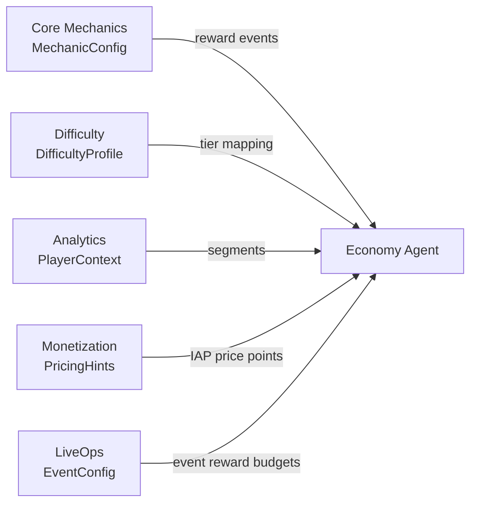
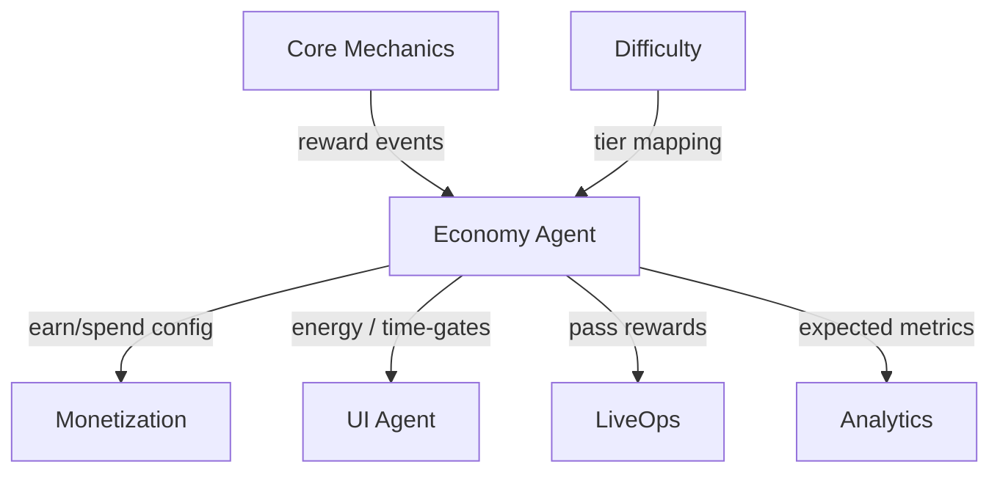
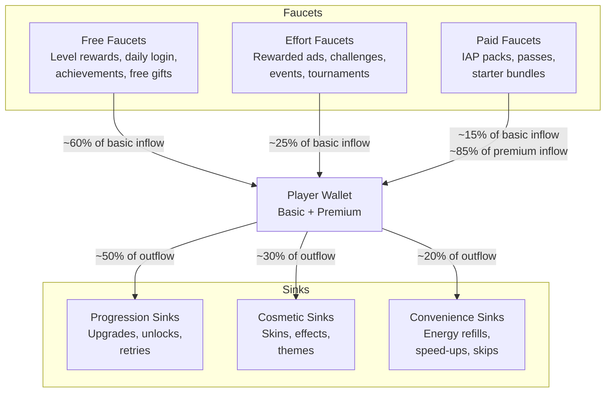

# Economy Vertical — Spec

> **Owner:** Economy Agent
> **Version:** 1.0
> **Status:** Draft

---

## Purpose

Design and balance the in-game economy so that players always have meaningful earning goals, satisfying spending choices, and a sense of forward momentum — while generating sustainable revenue through IAP conversion and ad engagement.

The Economy Agent is the single source of truth for all currency flow in the game. It defines how much players earn, what they can buy, how long they wait, and when the game nudges them toward spending real money.

---

## Scope

| In Scope | Out of Scope |
|----------|-------------|
| Currency definitions (basic + premium) | IAP product catalog (Monetization) |
| Faucet/sink system design | Ad placement logic (Monetization) |
| Reward tables per level, event, action | Level design / content generation (Core Mechanics) |
| Time-gates (energy, cooldowns, daily limits) | Difficulty curve shape (Difficulty) |
| Energy system configuration | UI layout for shop / wallet (UI) |
| Pass system (battle pass, season pass) | Push notification scheduling (LiveOps) |
| Per-segment economy tuning | Player segment assignment (Analytics) |

---

## Inputs



| Input | Source Vertical | Type | Purpose |
|-------|----------------|------|---------|
| `MechanicConfig` | Core Mechanics | `IMechanic['events']` | Identifies all reward-triggering events (level complete, score threshold, etc.) |
| `DifficultyProfile` | Difficulty | `DIFFICULTY_REWARD_MAP` | Maps difficulty scores to reward tiers so harder content pays more |
| `PlayerContext` | Analytics | `PlayerContext` | Provides segment data for per-segment economy tuning |
| `PricingHints` | Monetization | `Price[]` | Informs premium currency sink pricing to stay aligned with IAP tiers |
| `EventConfig` | LiveOps | `EventConfig` | Provides event reward budgets to allocate within the economy |

See [SharedInterfaces](../00_SharedInterfaces.md) for type definitions.

---

## Outputs

The Economy Agent produces a single master artifact:

### EconomyTable

The `EconomyTable` is the complete economy configuration consumed by the game runtime. It contains:

- Currency definitions and starting balances
- All faucet configurations (every way a player earns currency)
- All sink configurations (every way a player spends currency)
- Energy system parameters
- Pass system configuration
- Reward tables keyed by level, event, and action
- Per-segment overrides

See [DataModels](./DataModels.md) for the full schema.

**Consumers:**

| Consumer | What They Read |
|----------|---------------|
| Game Runtime | Faucet amounts, sink costs, energy config |
| Monetization Agent | Sink prices (to align IAP value propositions) |
| UI Agent | Currency display config, shop catalog structure |
| LiveOps Agent | Event reward budgets and constraints |
| Analytics Agent | Expected economy metrics for anomaly detection |
| AB Testing Agent | Tunable parameters for experimentation |

---

## Dependencies



| Dependency | Direction | Contract |
|-----------|-----------|----------|
| Core Mechanics | Inbound | Economy receives `onLevelComplete`, `onCurrencyEarned` events |
| Difficulty | Inbound | Economy reads `DIFFICULTY_REWARD_MAP` and `RewardTierConfig` |
| Monetization | Bidirectional | Economy provides sink costs; Monetization provides IAP price points |
| UI | Outbound | Economy emits currency changes; UI renders wallet and shop |
| LiveOps | Bidirectional | Economy defines event reward budgets; LiveOps defines event structure |
| Analytics | Outbound | Economy emits `currency_earn` / `currency_spend` events |

---

## Constraints

### Economic Health

| Constraint | Value | Rationale |
|-----------|-------|-----------|
| Sink coverage ratio | 0.85 - 0.95 | Players should spend most of what they earn but always have a small surplus |
| Inflation rate | 0% (target) | Median wallet balance should rise slowly, never exponentially |
| Premium currency from free faucets | < 15% of total premium supply | Premium currency must remain scarce to maintain IAP value |
| Time-to-meaningful-purchase | 1-3 sessions | Players should always be within reach of something they want |

### Ethical Guardrails

| Guardrail | Rule |
|-----------|------|
| No pay-to-win in competitive modes | Premium currency cannot buy stat advantages that affect PvP |
| Transparent pricing | All costs shown before purchase confirmation |
| No hidden sinks | Player is never charged without explicit action |
| Spending velocity alerts | Flag accounts spending > 3x their segment median in a 24h window |
| Cool-down on premium purchases | Minimum 5-second delay between consecutive premium transactions |
| No premium-only progression gates | Every progression gate can be passed with basic currency or time |

### Technical

| Constraint | Value |
|-----------|-------|
| Currency amounts | Always positive integers (no fractional currency) |
| Maximum basic currency balance | 2,147,483,647 (int32 max) |
| Maximum premium currency balance | 999,999 |
| Economy table size | < 500 KB JSON |
| Server-side validation | All earn/spend transactions validated server-side |

---

## Success Criteria

| Metric | Target | Measurement |
|--------|--------|-------------|
| Median wallet balance trend | Slowly rising (< 5% weekly growth) | Analytics dashboard |
| Sink coverage ratio | 0.85 - 0.95 | `total_spent / total_earned` per cohort per week |
| IAP conversion rate | 2-5% of DAU | First purchase within 30 days |
| "Nothing to buy" complaint rate | < 5% of app reviews | Sentiment analysis on reviews |
| "Too expensive" complaint rate | < 10% of app reviews | Sentiment analysis on reviews |
| Time-to-first-purchase | Median 2-4 sessions | Analytics funnel |
| Energy system engagement | > 60% of players use energy refill at least once in D1-D7 | Event tracking |
| Pass attach rate | > 8% of D7+ players | Purchase tracking |

---

## Faucet / Sink System Overview

> See [Concepts: Faucet & Sink](../../SemanticDictionary/Concepts_Faucet_Sink.md) for foundational concepts.



### Balance Equation

```
Healthy economy:  Total faucet value = 1.05-1.15 x Total sink value
```

Players accumulate a small surplus so they always feel progress. The surplus is absorbed periodically by new content drops (new sinks) and limited-time offers.

---

## Energy System

The energy system is the primary time-gate. It controls session pacing and creates a natural monetization pressure.

| Parameter | Default | Rationale |
|-----------|---------|-----------|
| Max energy | 20 | ~4 play sessions worth |
| Energy per action | 1 | Each level costs 1 energy |
| Regen rate | 1 per 6 min | Full refill in 2 hours |
| Refill cost (basic) | 50 basic | ~1 session's earnings |
| Refill cost (premium) | 3 premium | Slightly better value than basic |

See [BalanceLevers](./BalanceLevers.md) for the full tunable parameters table.

---

## Pass System

| Parameter | Battle Pass | Season Pass |
|-----------|------------|-------------|
| Duration | 28 days | 90 days |
| Price | 500 premium | 1500 premium |
| Free track levels | 30 | 50 |
| Premium track levels | 30 (parallel) | 50 (parallel) |
| XP per level | Escalating (100, 110, 121, ...) | Escalating (200, 220, 242, ...) |
| Total free-track value | ~2x purchase price (in basic currency equivalent) | ~2.5x purchase price |
| Total premium-track value | ~5x purchase price | ~6x purchase price |

---

## Economy Curves

> See [Concepts: Curve](../../SemanticDictionary/Concepts_Curve.md) for curve theory.

The economy uses two primary curves:

### Earning Curve (Faucet Output Over Levels)

Shape: **Staircase** with gentle ramp within each plateau.

```
Level:   1-5    6-10   11-20  21-30  31-50  51-100
Base:    10     15     25     40     60     100
```

Rewards increase in steps aligned with content unlocks, so new sinks are available when earning jumps.

### Cost Curve (Sink Prices Over Progression)

Shape: **Exponential** with periodic resets at tier boundaries.

```
Upgrade tier:  1      2      3      4      5      6
Cost:          50     120    300    750    1800   4500
Multiplier:    1.0x   2.4x   2.5x   2.5x   2.4x   2.5x
```

---

## Related Documents

- [Interfaces](./Interfaces.md) — API contracts
- [DataModels](./DataModels.md) — Schema definitions
- [AgentResponsibilities](./AgentResponsibilities.md) — Autonomy boundaries
- [BalanceLevers](./BalanceLevers.md) — Tunable parameters
- [Segmentation](./Segmentation.md) — Per-segment economy
- [SharedInterfaces](../00_SharedInterfaces.md) — Cross-vertical types
- [Concepts: Faucet & Sink](../../SemanticDictionary/Concepts_Faucet_Sink.md)
- [Concepts: Curve](../../SemanticDictionary/Concepts_Curve.md)
- [Concepts: Segmentation](../../SemanticDictionary/Concepts_Segmentation.md)
