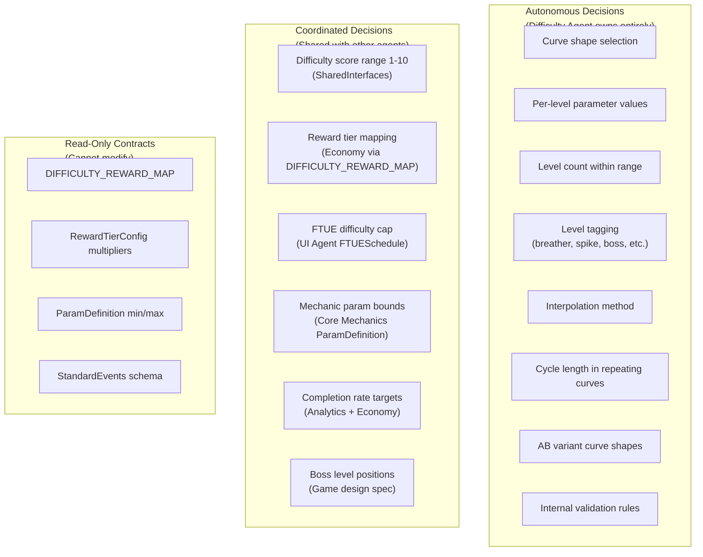
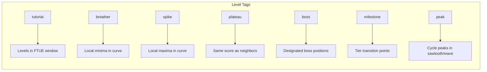
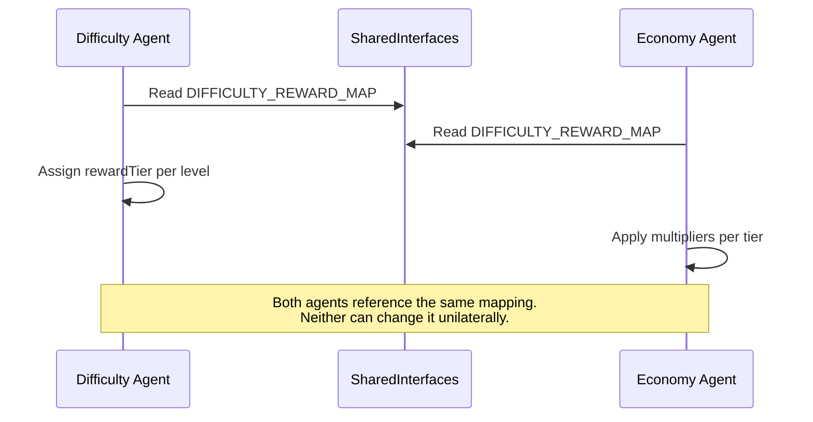
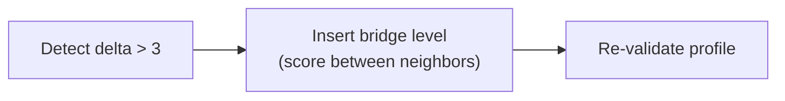
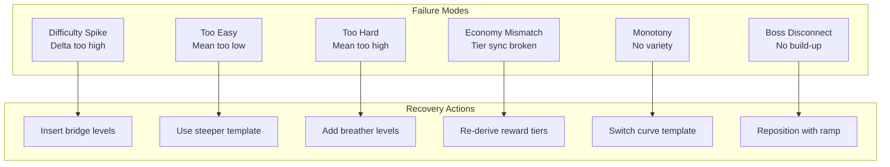
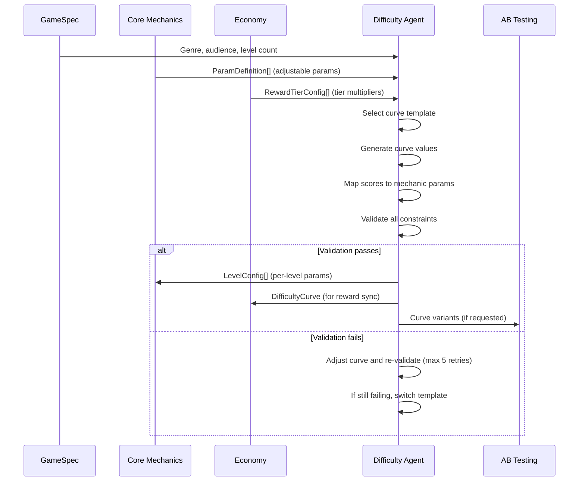

# Difficulty Vertical -- Agent Responsibilities

Defines what the Difficulty Agent decides autonomously, what it coordinates with other agents, quality criteria it must meet, and how it fails.

---

## Decision Boundary Map



---

## Autonomous Decisions

These decisions are fully owned by the Difficulty Agent. No other agent may override them.

### 1. Curve Shape Selection

The agent selects which `CurveTemplate` best fits the game context. See [CurveTemplates.md](./CurveTemplates.md) for the full library.

| Factor | How It Influences Selection |
|--------|---------------------------|
| Genre | Casual games favor gentle curves; action games favor sawtooth or boss rush |
| Mechanic type | Puzzle mechanics pair with staircase; runner mechanics pair with sawtooth |
| Target audience | Casual = lower mean difficulty; hardcore = higher mean, steeper curves |
| Level count | Short games (< 20 levels) need compressed curves; long games allow gradual ramps |
| Session length | Short sessions favor sprint-rest; long sessions favor gentle wave |

**Decision authority:** The agent may select any template from the library or create a custom hybrid. No approval required.

### 2. Per-Level Parameter Values

Given a `DifficultyScore` and `MechanicParamMapping`, the agent computes concrete parameter values for each level.

```typescript
// The agent autonomously decides:
// - Which scale type to use per parameter (linear, exponential, etc.)
// - The exact control point values
// - The difficulty weight per parameter
// - How parameters interact at each difficulty level

// Example: at DifficultyScore 6, the agent decides:
const levelParams = {
  speed: 5.5,       // Linear scale, weight 0.35
  enemyCount: 9,    // Exponential scale, weight 0.40
  timeLimit: 50,    // Inverse linear scale, weight 0.25
};
```

**Constraint:** All values must fall within the mechanic's `ParamDefinition.min` and `ParamDefinition.max`.

### 3. Level Count

The agent determines the exact number of levels to generate, within the bounds of the `GameSpec.targetLevelCount`.

| Input | Agent Decision |
|-------|---------------|
| `targetLevelCount: 30` | May generate 28-32 levels to fit the curve cleanly |
| `targetLevelCount: 50` | May generate 48-52 levels |
| Minimum | Never fewer than 10 levels |

**Rationale:** Some curve shapes divide more cleanly into certain level counts. A sawtooth with cycle length 4 works better at 28 or 32 than at 30.

### 4. Level Tagging

The agent assigns `LevelTag[]` to each level based on its position in the curve:



### 5. Interpolation Method

The agent chooses `step`, `linear`, or `smooth` interpolation based on the game type. Level-based games almost always use `step`.

### 6. Cycle Length

For repeating curves (sawtooth, gentle wave, sprint-rest), the agent decides the cycle length -- how many levels before the pattern repeats.

| Curve Template | Typical Cycle Length | Agent Range |
|---------------|---------------------|-------------|
| Sawtooth | 3-5 levels | 2-8 levels |
| Gentle Wave | 6-10 levels | 4-15 levels |
| Sprint-Rest | 4-6 levels | 3-8 levels |

### 7. AB Variant Curve Shapes

When `generateVariants()` is called, the agent autonomously selects which alternative templates to use and how to configure them. See [Interfaces.md](./Interfaces.md) for the API.

---

## Coordinated Decisions

These decisions involve contracts with other agents. The Difficulty Agent must respect external constraints.

### 1. Difficulty Score Range (SharedInterfaces)

```typescript
type DifficultyScore = number;  // 1-10, integer
```

**Contract:** Defined in [SharedInterfaces](../00_SharedInterfaces.md). The Difficulty Agent cannot use scores outside 1-10. Cannot use fractional scores.

**Coordination point:** If the score range ever needs to change, it must be updated in SharedInterfaces first, then all affected verticals must update.

### 2. Reward Tier Mapping (Economy Agent)

```typescript
const DIFFICULTY_REWARD_MAP: Record<DifficultyScore, RewardTier> = {
  1: 'easy', 2: 'easy',
  3: 'medium', 4: 'medium',
  5: 'hard', 6: 'hard',
  7: 'very_hard', 8: 'very_hard',
  9: 'extreme', 10: 'extreme',
};
```

**Contract:** The Difficulty Agent assigns `rewardTier` to each `LevelConfig` by looking up the level's `difficultyScore` in this map. The Economy Agent owns the `RewardTierConfig` multipliers. Neither agent may unilaterally change the mapping.



### 3. FTUE Difficulty Cap (UI Agent)

The UI Agent provides an `FTUESchedule` that defines which levels are tutorial levels. The Difficulty Agent must ensure these levels have `DifficultyScore <= ftueDifficultyyCap` (default: 3).

| FTUE Window | Max Score | Rationale |
|------------|-----------|-----------|
| Levels 1-3 | 2 | First impression must be easy |
| Levels 4-5 | 3 | Gentle introduction to medium difficulty |
| Levels 6+ | No cap | Post-tutorial, full range available |

### 4. Mechanic Parameter Bounds (Core Mechanics Agent)

The Core Mechanics Agent defines `ParamDefinition[]` with `min` and `max` for each parameter. The Difficulty Agent must not generate values outside these bounds.

```typescript
// Core Mechanics defines:
{ name: 'speed', type: 'float', min: 1.0, max: 10.0, default: 3.0 }

// Difficulty Agent must ensure:
// resolvedParams.speed >= 1.0 && resolvedParams.speed <= 10.0
```

### 5. Completion Rate Targets (Analytics + Economy)

The 70-85% aggregate target is a coordinated decision:

- **Analytics Agent** provides historical completion rate data (if available).
- **Economy Agent** needs completion rates to predict currency flow.
- **Difficulty Agent** uses the target to validate curve shapes.

### 6. Boss Level Positions (Game Design Spec)

Boss positions may be specified in the `GameSpec` or negotiated with the Core Mechanics Agent. The Difficulty Agent places difficulty spikes at these positions.

---

## Quality Criteria

### Hard Constraints (must pass validation)

| Criterion | Rule | Validation |
|-----------|------|------------|
| Score range | All scores 1-10 integer | `score_range` rule |
| Adjacent max | No two adjacent levels at score 10 | `adjacent_max_difficulty` rule |
| Economy sync | `rewardTier === DIFFICULTY_REWARD_MAP[difficultyScore]` | `economy_sync` rule |
| Param bounds | All params within mechanic min/max | `param_bounds` rule |
| FTUE cap | Tutorial levels score <= cap | `ftue_cap` rule |
| Min levels | Profile has >= 10 levels | `minimum_level_count` rule |

### Soft Constraints (should pass, warnings if violated)

| Criterion | Target | Acceptable Range |
|-----------|--------|-----------------|
| Aggregate completion rate | 77.5% | 70-85% |
| Max adjacent delta | <= 3 | <= 6 for boss rush |
| Tier variety | >= 3 tiers per 10-level window | >= 2 tiers |
| Mean difficulty | 4.5-6.5 | 3.0-7.5 |
| Score 10 frequency | <= 10% of levels | <= 15% |
| Score 1 frequency | <= 10% of levels | <= 15% |

### Completion Rate Model

Predicted completion rate per difficulty score:

```
Score:  1    2    3    4    5    6    7    8    9    10
Rate: 0.95 0.92 0.87 0.83 0.78 0.72 0.64 0.57 0.48 0.40
```

Aggregate rate = weighted average across all levels in the profile.

---

## Failure Modes

### 1. Difficulty Spike

**Symptom:** Players hit a sudden difficulty wall. Completion rate drops from 85% to 40% between adjacent levels.

**Cause:** Adjacent delta too high (e.g., score jumps from 3 to 8).

**Detection:** `smooth_transition` validation rule flags deltas > 3.

**Recovery:**


**Prevention:** Constraint validation in the generation pipeline. See [Spec.md](./Spec.md).

### 2. Too Easy (Boredom Spiral)

**Symptom:** Players complete every level on first try. Engagement drops because there is no challenge.

**Cause:** Mean difficulty too low, curve never reaches upper tiers, or cycle valleys too deep.

**Detection:**
- Aggregate completion rate > 85%
- Mean difficulty < 3.0
- No levels at score >= 7

**Recovery:** Re-generate with a steeper curve template or higher score range.

### 3. Too Hard (Frustration Spiral)

**Symptom:** Players fail repeatedly and churn. Completion rate drops below 60%.

**Cause:** Mean difficulty too high, insufficient breather levels, or too many adjacent hard levels.

**Detection:**
- Aggregate completion rate < 70%
- Mean difficulty > 7.5
- More than 3 consecutive levels at score >= 8

**Recovery:** Inject breather levels (score 3-4) between hard sequences. Switch to a sawtooth or gentle wave template.

### 4. Economy Mismatch

**Symptom:** Players feel underpaid for hard levels or overpaid for easy levels. Economy imbalance.

**Cause:** `rewardTier` does not match `DIFFICULTY_REWARD_MAP[difficultyScore]` or the curve's tier distribution does not match the economy's expectations.

**Detection:** `economy_sync` validation rule.

**Recovery:** Re-derive all `rewardTier` values from `DIFFICULTY_REWARD_MAP`. Adjust curve if tier distribution is too skewed.

### 5. Monotony (Stale Progression)

**Symptom:** Players feel progression is boring -- every level feels the same.

**Cause:** Plateau too long (e.g., 8 consecutive levels at the same score), or curve has no variety.

**Detection:** `tier_variety` soft constraint (< 3 tiers in a 10-level window).

**Recovery:** Switch from staircase to sawtooth template, or shorten plateau lengths.

### 6. Boss Level Disconnect

**Symptom:** Boss levels feel arbitrary -- not earned, not anticipated.

**Cause:** Boss spikes placed without proper build-up or cool-down levels.

**Detection:** Boss-tagged levels without preceding ramp (at least 2 levels of increasing difficulty before the boss).

**Recovery:** Re-position boss levels with proper build-up sequence: 2-3 levels of escalating difficulty before the spike, followed by a breather.

---

## Failure Mode Summary



---

## Agent Interaction Protocol

### Generation Flow



### Retry Policy

| Attempt | Action |
|---------|--------|
| 1-3 | Adjust control points within current template |
| 4-5 | Switch to a more forgiving template (e.g., from exponential to sawtooth) |
| 6+ | Flag for human review with detailed violation report |

---

## Related Documents

- [SharedInterfaces](../00_SharedInterfaces.md) -- Read-only contracts this agent must respect
- [Spec](./Spec.md) -- Vertical specification and constraints
- [Interfaces](./Interfaces.md) -- APIs the agent exposes
- [DataModels](./DataModels.md) -- Data schemas the agent produces
- [CurveTemplates](./CurveTemplates.md) -- Template library for curve selection
- [Concepts: Curve](../../SemanticDictionary/Concepts_Curve.md) -- Curve concept and interactions
