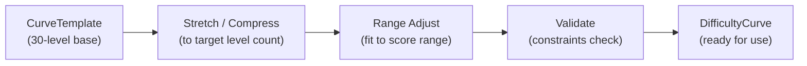
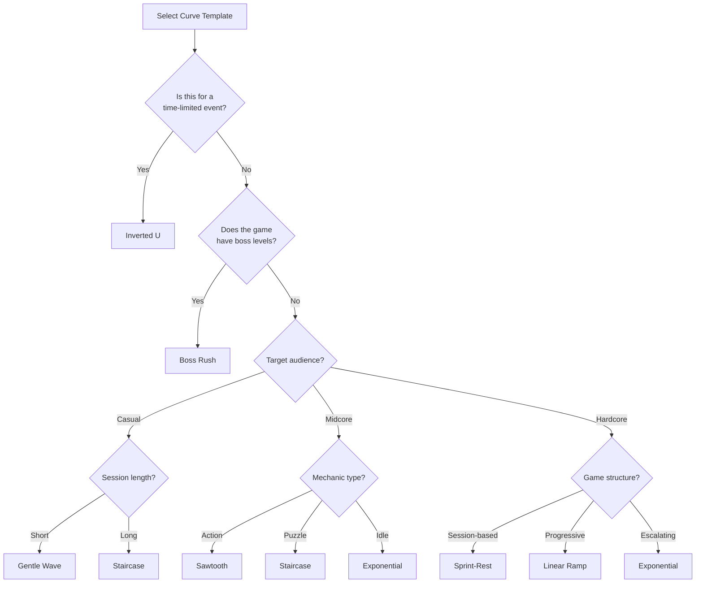

# Difficulty Vertical -- Curve Templates

A library of 8 standard curve templates used by the Difficulty Agent to shape level progression. Each template defines a 30-level base pattern that can be stretched, compressed, and range-adjusted to fit any game. See [Concepts: Curve](../../SemanticDictionary/Concepts_Curve.md) for curve theory.

---

## How Templates Work



1. **Base values** are normalized to 30 levels with scores 1-10.
2. **Stretch/compress** resamples the base to the target level count using the template's interpolation method.
3. **Range adjust** scales values to fit within the desired `DifficultyScore` range (e.g., a casual game might cap at 7).
4. **Validate** checks all constraints from [Spec.md](./Spec.md).

---

## Template 1: Linear Ramp

**Pattern:** Steady, predictable increase from minimum to maximum difficulty.

**Category:** Progressive

```
Level:  1  2  3  4  5  6  7  8  9 10 11 12 13 14 15 16 17 18 19 20 21 22 23 24 25 26 27 28 29 30
Score:  1  1  1  2  2  2  3  3  3  4  4  4  5  5  5  6  6  6  7  7  7  8  8  8  9  9  9 10 10 10
```

```
Sparkline: ▁▁▁▂▂▂▃▃▃▄▄▄▅▅▅▆▆▆▇▇▇███▉▉▉██▊
```

| Attribute | Value |
|-----------|-------|
| Mean difficulty | 5.5 |
| Std deviation | 2.7 |
| Max adjacent delta | 1 |
| Tier distribution | easy: 6, medium: 6, hard: 6, very_hard: 6, extreme: 6 |
| Predicted completion | 73% |

**When to use:**
- Tutorial-heavy games where predictability is valued
- Strategy games with incremental complexity
- Games targeting casual audiences who dislike surprises

**Strengths:**
- Extremely predictable -- players always know what to expect
- Even tier distribution -- economy rewards are balanced
- No frustration spikes -- smoothest possible progression
- Easy to extend -- just continue the line

**Weaknesses:**
- Boring -- no tension/release cycles
- No breather levels -- once past a difficulty, it never comes back
- Late-game fatigue -- last 10 levels are all hard or extreme

**Best mechanic pairings:** Strategy, tower defense, city builder, idle games

---

## Template 2: Sawtooth

**Pattern:** Rise, drop, rise higher. Repeating cycles of tension and relief.

**Category:** Cyclic

```
Level:  1  2  3  4  5  6  7  8  9 10 11 12 13 14 15 16 17 18 19 20 21 22 23 24 25 26 27 28 29 30
Score:  1  2  3  2  3  4  3  4  5  4  5  6  4  5  6  7  5  6  7  8  6  7  8  9  7  8  9 10  8 10
```

```
Sparkline: ▁▂▃▂▃▄▃▄▅▄▅▆▄▅▆▇▅▆▇█▆▇█▉▇█▉███
```

| Attribute | Value |
|-----------|-------|
| Mean difficulty | 5.6 |
| Std deviation | 2.4 |
| Max adjacent delta | 2 |
| Tier distribution | easy: 4, medium: 5, hard: 7, very_hard: 8, extreme: 6 |
| Predicted completion | 74% |

**When to use:**
- Action games needing tension/release cycles
- Any game where player fatigue is a concern
- Mid-length games (20-50 levels) targeting midcore audiences

**Strengths:**
- Built-in breather levels prevent fatigue
- Psychologically satisfying -- relief after challenge
- Naturally creates "peak" moments players remember
- Flexible cycle length (3-5 levels per tooth)

**Weaknesses:**
- Can feel repetitive if cycle length is too short
- Players may learn the pattern and disengage ("I know an easy level is coming")
- Slightly harder to sync with economy tiers (reward oscillation)

**Best mechanic pairings:** Runner, platformer, shoot-em-up, endless runner variants

---

## Template 3: Staircase

**Pattern:** Plateaus of equal difficulty with discrete jumps between tiers.

**Category:** Progressive

```
Level:  1  2  3  4  5  6  7  8  9 10 11 12 13 14 15 16 17 18 19 20 21 22 23 24 25 26 27 28 29 30
Score:  1  1  1  2  2  2  3  3  3  4  4  4  5  5  5  6  6  7  7  7  8  8  8  9  9  9 10 10 10 10
```

```
Sparkline: ▁▁▁▂▂▂▃▃▃▄▄▄▅▅▅▆▆▇▇▇████▉▉▉████
```

| Attribute | Value |
|-----------|-------|
| Mean difficulty | 5.5 |
| Std deviation | 2.8 |
| Max adjacent delta | 1 |
| Tier distribution | easy: 6, medium: 6, hard: 5, very_hard: 6, extreme: 7 |
| Predicted completion | 72% |

**When to use:**
- Games with clear progression milestones (unlock new mechanic per tier)
- Puzzle games where each plateau introduces and masters a concept
- Games synced tightly with economy tiers (easy to map plateaus to reward tiers)

**Strengths:**
- Clear mastery zones -- players practice at a difficulty before advancing
- Perfect economy sync -- each plateau maps to exactly one reward tier
- Psychologically satisfying milestone moments at each jump
- Easy for players to understand their progress

**Weaknesses:**
- Jumps between plateaus can feel abrupt
- Plateaus may feel stale if too long
- No breather levels after a jump -- difficulty never goes back down
- Less dynamic than cyclic curves

**Best mechanic pairings:** Match-3, word games, merge, puzzle, education

---

## Template 4: Exponential

**Pattern:** Slow start, rapidly accelerating difficulty. Most of the challenge is in the final third.

**Category:** Progressive

```
Level:  1  2  3  4  5  6  7  8  9 10 11 12 13 14 15 16 17 18 19 20 21 22 23 24 25 26 27 28 29 30
Score:  1  1  1  1  1  2  2  2  2  3  3  3  3  4  4  4  5  5  6  6  7  7  8  8  8  9  9  9 10 10
```

```
Sparkline: ▁▁▁▁▁▂▂▂▂▃▃▃▃▄▄▄▅▅▆▆▇▇████▉▉▉██
```

| Attribute | Value |
|-----------|-------|
| Mean difficulty | 4.6 |
| Std deviation | 2.9 |
| Max adjacent delta | 1 |
| Tier distribution | easy: 9, medium: 7, hard: 4, very_hard: 6, extreme: 4 |
| Predicted completion | 79% |

**When to use:**
- Games targeting long retention (easy early = high day-1 retention)
- Idle/incremental games where early game is discovery phase
- Games where late-game difficulty is the core monetization driver (pay to progress)

**Strengths:**
- Excellent onboarding -- long easy phase builds comfort
- High early retention -- new players rarely churn from difficulty
- Late-game challenge creates monetization pressure
- Natural-feeling acceleration (matches learning curves)

**Weaknesses:**
- Late-game spike can feel unfair if players aren't prepared
- Early game may bore experienced players
- Economy front-loads low-tier rewards -- can feel unrewarding early
- Harder to AB test because differences concentrate in late levels

**Best mechanic pairings:** Idle, incremental, tycoon, base builder, gacha

---

## Template 5: Boss Rush

**Pattern:** Low base difficulty punctuated by dramatic spikes at boss positions.

**Category:** Specialty

```
Level:  1  2  3  4  5  6  7  8  9 10 11 12 13 14 15 16 17 18 19 20 21 22 23 24 25 26 27 28 29 30
Score:  2  2  3  3  8  3  3  4  4  9  3  4  4  5  9  4  5  5  6 10  5  5  6  6 10  5  6  7  7 10
```

```
Sparkline: ▂▂▃▃█▃▃▄▄▉▃▄▄▅▉▄▅▅▆█▅▅▆▆█▅▆▇▇█
```

| Attribute | Value |
|-----------|-------|
| Mean difficulty | 5.4 |
| Std deviation | 2.4 |
| Max adjacent delta | 5 |
| Tier distribution | easy: 5, medium: 8, hard: 7, very_hard: 1, extreme: 9 |
| Predicted completion | 73% |

**When to use:**
- Games with explicit boss mechanics
- Action games where periodic skill checks create engagement peaks
- Games where extreme rewards need to be gated behind difficulty spikes

**Strengths:**
- Builds anticipation -- players know a boss is coming
- Boss victories are deeply satisfying (huge difficulty drop after)
- Economy sync: extreme rewards at boss levels feel earned
- Great for social sharing ("I beat the boss!")

**Weaknesses:**
- Boss spikes violate smooth transition rule (intentionally -- delta up to 5-6)
- Players may get stuck at boss levels and churn
- Requires dedicated boss mechanic content (more work for Core Mechanics)
- Rest levels between bosses may feel like filler

**Best mechanic pairings:** Action RPG, roguelike, shoot-em-up, dungeon crawler

**Note:** Boss Rush templates set `allowsBossSpikes: true` in the `CurveTemplate` definition, which relaxes the `smooth_transition` constraint at boss positions.

---

## Template 6: Inverted U

**Pattern:** Ramps up to peak difficulty in the middle, then ramps back down. Designed for finite events.

**Category:** Event

```
Level:  1  2  3  4  5  6  7  8  9 10 11 12 13 14 15 16 17 18 19 20 21 22 23 24 25 26 27 28 29 30
Score:  1  2  3  3  4  5  6  6  7  8  8  9  9 10 10 10  9  9  8  8  7  6  6  5  4  3  3  2  2  1
```

```
Sparkline: ▁▂▃▃▄▅▆▆▇██▉▉██▊▉▉██▇▆▆▅▄▃▃▂▂▁
```

| Attribute | Value |
|-----------|-------|
| Mean difficulty | 5.5 |
| Std deviation | 2.9 |
| Max adjacent delta | 1 |
| Tier distribution | easy: 6, medium: 6, hard: 6, very_hard: 6, extreme: 6 |
| Predicted completion | 73% |

**When to use:**
- Time-limited events (seasonal, challenge, tournament)
- Story arcs with climax and resolution
- Training modes that build up then wind down

**Strengths:**
- Accessible entry and exit points -- low barrier to start and finish
- Peak in the middle creates a dramatic climax
- Players who struggle can still complete the event (declining difficulty at end)
- Symmetric structure is satisfying

**Weaknesses:**
- Second half feels like "going backward" to some players
- Economy rewards decrease in second half (lower tiers) -- can feel deflating
- Not suitable for ongoing/infinite level sequences
- Peak may not last long enough for hardcore players

**Best mechanic pairings:** Event-specific mechanics, seasonal content, tournament brackets, story-driven games

---

## Template 7: Gentle Wave

**Pattern:** Slow, gradual oscillation with upward trend. Like sawtooth but smoother and more relaxed.

**Category:** Cyclic

```
Level:  1  2  3  4  5  6  7  8  9 10 11 12 13 14 15 16 17 18 19 20 21 22 23 24 25 26 27 28 29 30
Score:  1  2  2  3  3  2  3  3  4  4  3  4  5  5  4  5  6  6  5  6  7  7  6  7  8  8  7  8  9  9
```

```
Sparkline: ▁▂▂▃▃▂▃▃▄▄▃▄▅▅▄▅▆▆▅▆▇▇▆▇██▇█▉▉
```

| Attribute | Value |
|-----------|-------|
| Mean difficulty | 5.0 |
| Std deviation | 2.1 |
| Max adjacent delta | 1 |
| Tier distribution | easy: 5, medium: 8, hard: 8, very_hard: 7, extreme: 2 |
| Predicted completion | 78% |

**When to use:**
- Casual games targeting relaxation
- Long-play games (100+ levels) where burnout is a risk
- Games targeting older or less experienced audiences
- Games emphasizing "zen" or "flow" states

**Strengths:**
- Lowest frustration of all templates -- very gentle transitions
- High completion rate -- great for retention metrics
- Long-term sustainable -- players can play for months without fatigue
- Works well with economy (gradual tier increase = gradual reward increase)

**Weaknesses:**
- May not reach max difficulty until very late (or never, in short games)
- Low ceiling can bore hardcore players
- Lacks dramatic moments -- no memorable peaks or valleys
- Slow progression may not justify premium monetization

**Best mechanic pairings:** Match-3, merge, word games, farming sim, cozy games

---

## Template 8: Sprint-Rest

**Pattern:** Intense bursts of escalating difficulty followed by recovery periods at low difficulty.

**Category:** Cyclic

```
Level:  1  2  3  4  5  6  7  8  9 10 11 12 13 14 15 16 17 18 19 20 21 22 23 24 25 26 27 28 29 30
Score:  2  4  6  8  2  3  5  7  9  2  3  5  7  9  3  4  6  8 10  3  4  6  8 10  3  5  7  9 10  3
```

```
Sparkline: ▂▄▆█▂▃▅▇▉▂▃▅▇▉▃▄▆██▃▄▆██▃▅▇▉█▃
```

| Attribute | Value |
|-----------|-------|
| Mean difficulty | 5.6 |
| Std deviation | 2.7 |
| Max adjacent delta | 6 |
| Tier distribution | easy: 7, medium: 4, hard: 6, very_hard: 6, extreme: 7 |
| Predicted completion | 73% |

**When to use:**
- Session-oriented games (each sprint = one session)
- Competitive/PvP games with rounds
- Workout/fitness-style games with intervals
- Games targeting players who enjoy burst intensity

**Strengths:**
- Clear session boundaries -- each sprint is a natural stopping point
- Rest levels allow full recovery -- prevents cumulative fatigue
- Intense sprints create memorable peak experiences
- Works well with session-based monetization (reward at end of sprint)

**Weaknesses:**
- High max delta (6) -- transitions into sprints are jarring
- Bimodal difficulty distribution (easy + hard, less medium)
- Rest levels may feel tedious for hardcore players
- Economy sync is complex (reward tiers oscillate rapidly)

**Best mechanic pairings:** Endless runner, rhythm game, PvP arena, roguelike, survival

**Note:** Sprint-Rest templates set `allowsBossSpikes: true` because the sprint entry point intentionally has high delta.

---

## Comparison Table

| Template | Category | Mean | StdDev | Max Delta | Completion | Best For |
|----------|----------|------|--------|-----------|------------|----------|
| Linear Ramp | Progressive | 5.5 | 2.7 | 1 | 73% | Strategy, tutorial-heavy |
| Sawtooth | Cyclic | 5.6 | 2.4 | 2 | 74% | Action, midcore |
| Staircase | Progressive | 5.5 | 2.8 | 1 | 72% | Puzzle, economy-synced |
| Exponential | Progressive | 4.6 | 2.9 | 1 | 79% | Idle, long retention |
| Boss Rush | Specialty | 5.4 | 2.4 | 5 | 73% | Action RPG, boss games |
| Inverted U | Event | 5.5 | 2.9 | 1 | 73% | Events, limited content |
| Gentle Wave | Cyclic | 5.0 | 2.1 | 1 | 78% | Casual, relaxation |
| Sprint-Rest | Cyclic | 5.6 | 2.7 | 6 | 73% | Session-based, PvP |

### Selection Flowchart



---

## Creating Custom Curves from Templates

Templates are starting points. The Difficulty Agent can create custom curves by combining, modifying, or blending templates.

### Method 1: Template Blending

Combine two templates by weighted average:

```typescript
function blendTemplates(
  templateA: CurveTemplate,
  templateB: CurveTemplate,
  weightA: number   // 0.0-1.0, weightB = 1 - weightA
): DifficultyScore[] {
  const weightB = 1 - weightA;
  return templateA.baseValues.map((a, i) =>
    Math.round(a * weightA + templateB.baseValues[i] * weightB)
  ) as DifficultyScore[];
}

// Example: 70% Sawtooth + 30% Linear Ramp = Sawtooth with smoother valleys
const custom = blendTemplates(sawtooth, linearRamp, 0.7);
```

### Method 2: Segment Stitching

Use different templates for different game phases:

```typescript
interface CurveSegment {
  templateId: string;
  startLevel: number;    // Inclusive
  endLevel: number;      // Exclusive
  scoreRange: { min: DifficultyScore; max: DifficultyScore };
}

// Example: Easy opening + sawtooth middle + exponential endgame
const segments: CurveSegment[] = [
  { templateId: 'gentle_wave', startLevel: 0, endLevel: 10, scoreRange: { min: 1, max: 4 } },
  { templateId: 'sawtooth', startLevel: 10, endLevel: 25, scoreRange: { min: 3, max: 8 } },
  { templateId: 'exponential', startLevel: 25, endLevel: 30, scoreRange: { min: 7, max: 10 } },
];
```

**Important:** Segment boundaries must be smoothed to avoid jarring transitions. The agent inserts 1-2 bridge levels at each boundary where the score linearly interpolates between the ending score of one segment and the starting score of the next.

### Method 3: Parameter Perturbation

Add controlled randomness to a template for variety:

```typescript
function perturbTemplate(
  template: CurveTemplate,
  maxPerturbation: number   // Max score change per level (typically 1)
): DifficultyScore[] {
  return template.baseValues.map(score => {
    const delta = Math.round((Math.random() * 2 - 1) * maxPerturbation);
    return Math.max(1, Math.min(10, score + delta)) as DifficultyScore;
  });
}
```

**Constraint:** Perturbed curves must still pass all validation rules. Run `ILevelValidator.validate()` after perturbation.

### Method 4: Audience-Adaptive Scaling

Scale a template's range based on player audience:

| Audience | Score Range | Effect |
|----------|------------|--------|
| Casual | 1-7 | Caps max difficulty, gentler overall |
| Midcore | 1-9 | Full range minus extreme |
| Hardcore | 3-10 | Skips easy, starts at medium |

```typescript
function scaleToAudience(
  template: CurveTemplate,
  audience: 'casual' | 'midcore' | 'hardcore'
): DifficultyScore[] {
  const ranges = {
    casual: { min: 1, max: 7 },
    midcore: { min: 1, max: 9 },
    hardcore: { min: 3, max: 10 },
  };
  const { min, max } = ranges[audience];
  const oldMin = Math.min(...template.baseValues);
  const oldMax = Math.max(...template.baseValues);

  return template.baseValues.map(score => {
    const normalized = (score - oldMin) / (oldMax - oldMin);
    return Math.round(min + normalized * (max - min)) as DifficultyScore;
  });
}
```

---

## Template Data Reference

All 8 templates as raw arrays for programmatic consumption:

```typescript
const CURVE_TEMPLATES: Record<string, DifficultyScore[]> = {
  linear_ramp:  [1,1,1,2,2,2,3,3,3,4,4,4,5,5,5,6,6,6,7,7,7,8,8,8,9,9,9,10,10,10],
  sawtooth:     [1,2,3,2,3,4,3,4,5,4,5,6,4,5,6,7,5,6,7,8,6,7,8,9,7,8,9,10,8,10],
  staircase:    [1,1,1,2,2,2,3,3,3,4,4,4,5,5,5,6,6,7,7,7,8,8,8,9,9,9,10,10,10,10],
  exponential:  [1,1,1,1,1,2,2,2,2,3,3,3,3,4,4,4,5,5,6,6,7,7,8,8,8,9,9,9,10,10],
  boss_rush:    [2,2,3,3,8,3,3,4,4,9,3,4,4,5,9,4,5,5,6,10,5,5,6,6,10,5,6,7,7,10],
  inverted_u:   [1,2,3,3,4,5,6,6,7,8,8,9,9,10,10,10,9,9,8,8,7,6,6,5,4,3,3,2,2,1],
  gentle_wave:  [1,2,2,3,3,2,3,3,4,4,3,4,5,5,4,5,6,6,5,6,7,7,6,7,8,8,7,8,9,9],
  sprint_rest:  [2,4,6,8,2,3,5,7,9,2,3,5,7,9,3,4,6,8,10,3,4,6,8,10,3,5,7,9,10,3],
};
```

---

## Related Documents

- [Spec](./Spec.md) -- Vertical specification and constraints
- [Interfaces](./Interfaces.md) -- `ICurveTemplateSelector`, `IDifficultyCurve` APIs
- [DataModels](./DataModels.md) -- `CurveTemplate`, `DifficultyCurve` schemas
- [AgentResponsibilities](./AgentResponsibilities.md) -- Curve selection is an autonomous decision
- [Concepts: Curve](../../SemanticDictionary/Concepts_Curve.md) -- Curve theory and interactions
- [SharedInterfaces](../00_SharedInterfaces.md) -- `DIFFICULTY_REWARD_MAP`, `DifficultyScore`
